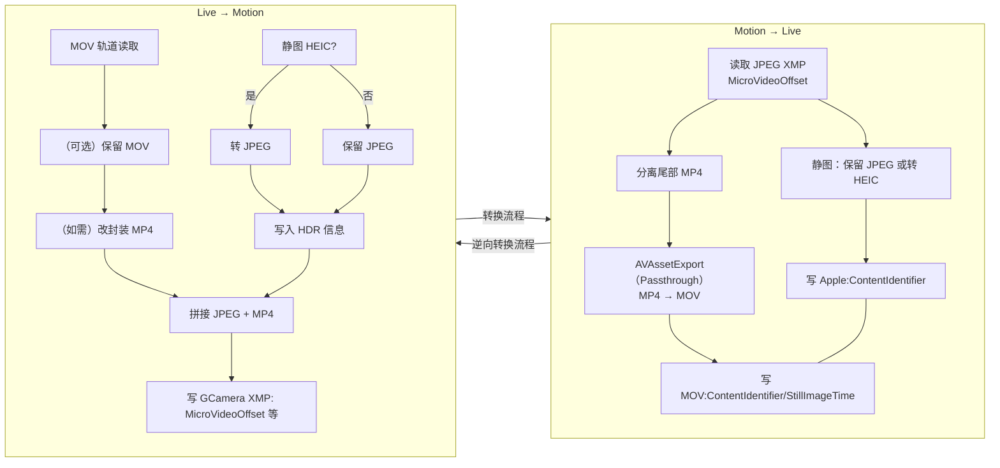

## 概述
本文系统梳理 Google Motion Photo 与 Apple Live Photo 的文件结构、元数据约定与互转路径，给出以“尽可能无损”为目标的两向转换方案，覆盖 HDR GainMap 与深度等 Auxiliary Data 的保留策略与能力边界，并提供可复用的 Swift 包与示例代码。

> 结论先行：转换过程并非无损，当图片中包含其他信息时，对方的数据格式无法承载当前信息，则会丢失。尤其在 UltraHDR(JPEG + GainMap) → HEIC(GainMap) 及 HEIC(Depth) → Motion Photo 两个方向。推荐策略是优先保留原始容器与附加图像数据；当必须跨容器时，采用“元数据与视频无重编码拷贝 + 静图最低限度重编码/抽取 + 显式写入配对/偏移元数据”的组合路径。
{: .prompt-tip }

## 一、格式结构速查
### 1.1 Google Motion Photo（JPEG 容器 + 尾部 MP4）
- 静态图：`JPEG` 主图像
- 可选增益图：`JPEG` HDR GainMap（UltraHDR）
- 动态视频：`MP4` 字节流直接拼接在 JPEG 尾部（同一文件）
- 关键 XMP（命名空间 `GCamera`/`GContainer`，不同机型/版本略异）：

| XMP 键 | 类型 | 说明 |
| --- | --- | --- |
| `GCamera:MotionPhoto` | Integer | `1` 表示动态照片；`0`/缺省表示普通静图 |
| `GCamera:MotionPhotoVersion` | Integer | 动态照片文件格式版本 |
| `GCamera:MicroVideo` | Integer | 早期规范，已废弃。布尔开关，指示是否为动态图片 |
| `GCamera:MicroVideoVersion` | Integer | 早期规范，已废弃。MicroVideo 元数据版本，常见值为 `1` |
| `GCamera:MicroVideoOffset` | Long | 早期规范，已废弃。尾部 MP4 的起始偏移量（字节） |
| `GCamera:MicroVideoPresentationTimestampUs` | Long | 早期规范，已废弃。与静图对齐的视频帧时间戳（微秒，可为 `-1`） |
| `GContainer:Directory` + `Item:Length` | Struct | 描述主图、增益图、视频等语义项及其长度 |

> 规范演进中，`GContainer:Directory` 的 `Item:Length` 可在缺少 `MicroVideoOffset` 时辅助定位视频起始位置。

典型 Motion Photo 的 XMP 段：
```
<x:xmpmeta xmlns:x="adobe:ns:meta/" x:xmptk="Adobe XMP Core 5.1.0-jc003">
  <rdf:RDF xmlns:rdf="http://www.w3.org/1999/02/22-rdf-syntax-ns#">
    <rdf:Description rdf:about=""
        xmlns:hdrgm="http://ns.adobe.com/hdr-gain-map/1.0/"
        xmlns:Container="http://ns.google.com/photos/1.0/container/"
        xmlns:Item="http://ns.google.com/photos/1.0/container/item/"
        xmlns:GCamera="http://ns.google.com/photos/1.0/camera/"
      hdrgm:Version="1.0"
      GCamera:MotionPhoto="1"
      GCamera:MicroVideoVersion="1"
      GCamera:MicroVideo="1"
      GCamera:MicroVideoOffset="9871716"
      GCamera:MicroVideoPresentationTimestampUs="926668">
      <Container:Directory>
        <rdf:Seq>
          <rdf:li rdf:parseType="Resource">
            <Container:Item
              Item:Semantic="Primary"
              Item:Mime="image/jpeg"/>
          </rdf:li>
          <rdf:li rdf:parseType="Resource">
            <Container:Item
              Item:Semantic="GainMap"
              Item:Mime="image/jpeg"
              Item:Length="243988"/>
          </rdf:li>
          <rdf:li rdf:parseType="Resource">
            <Container:Item
              Item:Semantic="MotionPhoto"
              Item:Mime="video/mp4"
              Item:Length="9871716"/>
          </rdf:li>
        </rdf:Seq>
      </Container:Directory>
    </rdf:Description>
  </rdf:RDF>
</x:xmpmeta>
```

示例 HEIC Motion Photo 结构
{: width="972" height="589" .w-50 .normal}

### 1.2 Apple Live Photo（HEIC/JPEG 静图 + 独立 MOV 视频）
- 静态图：`HEIC`（优先）或 `JPEG`
- 动态视频：独立 `MOV`（H.264/HEVC，通常包含音频轨）
- 可选 Auxiliary：HEIC 中可携带 Depth、Segmentation、GainMap 等辅助平面
- 关键配对标识（要求静图与视频一致）：
  - `ContentIdentifier`（HEIC：Apple XMP；MOV：QuickTime Metadata）
  - `StillImageTime`（MOV 静帧时间戳，常设 `0`）

示例 HEIC Live Photo 结构
{: width="972" height="589" .w-50 .normal}

## 二、互转策略与能力边界
### 2.1 Motion Photo → Live Photo（尽量无损）
- 视频：直接**无重编码拷贝**到 `mov`（容器改封装）。
- 静图：保留 `JPEG` 可直接作为 Live Photo 静图（iOS 可识别）；如需 `HEIC`，仅在确有需求时转换。
- HDR GainMap：
  - 若源为 Google UltraHDR（JPEG 内含 GainMap），目前通用工具对“JPEG GainMap → HEIC GainMap”自动迁移支持有限；建议保留 JPEG 静图（牺牲 iOS 上的系统级 HDR 呈现），或使用实验性库迁移（见“高级：HDR 迁移”）。
- 深度/语义分割等 Auxiliary：Motion Photo（JPEG 容器）通常不带 HEIF 风格的 Auxiliary 图像，迁移为 HEIC 时需要新增辅助图像（见“高级：Auxiliary 迁移”）。

### 2.2 Live Photo → Motion Photo（尽量无损）
- 视频：`MOV → MP4` **无重编码拷贝**。
- 静图：若为 `HEIC`，可转换为 `JPEG` 作为 Motion Photo 主图（会丢失 HEIC 的原生 Auxiliary，如 Depth/GainMap）。
- HDR/Depth：Motion Photo（JPEG 容器）缺乏标准化的 HEIF Auxiliary 承载；转换到 JPEG 后，HDR GainMap 与 Depth 通常难以“等价”保存（除非迁移为自定义 XMP/APP 区段，生态支持较弱）。

## 三、封装转换工具 Swift Package：MotionLiveKit（iOS/macOS 通用）
为便于在 App 或工具中复用，这里给出一个 Swift Package 的设计与核心实现示例，统一完成 Live Photo 与 Motion Photo 的互转。元数据读写采用 Exiv2（C++）实现，Swift 通过 C 接口桥接；相册写入使用 Photos.framework。

### 3.1 包结构
```text
MotionLiveKit/
├─ Package.swift
├─ Sources/
│  └─ MotionLiveKit/
│     ├─ MotionLiveKit.swift            # 公共 API（Swift）
│     ├─ LivePhotoConverter.swift       # Live Photo 方向实现
│     ├─ MotionPhotoConverter.swift     # Motion Photo 方向实现
│     ├─ PhotosWriter.swift             # 相册写入（iOS/macOS Photos）
│     ├─ FileIO.swift                   # 沙盒/临时文件与校验
│     ├─ Exiv2Bridge.h                  # C 桥接头（给 Swift 调用）
│     ├─ Exiv2Bridge.cpp                # C++ 实现，调用 Exiv2
│     └─ include/module.modulemap       # 模块映射（如需要）
└─ Externals/
   └─ exiv2/                            # 编译产物或子模块（静态库+头文件）
```

### 3.2 Package.swift（要点）
```swift
// swift-tools-version: 5.9
import PackageDescription

let package = Package(
    name: "MotionLiveKit",
    platforms: [
        .iOS(.v15), .macOS(.v12)
    ],
    products: [
        .library(name: "MotionLiveKit", targets: ["MotionLiveKit"]) 
    ],
    targets: [
        .target(
            name: "MotionLiveKit",
            dependencies: [],
            path: "Sources/MotionLiveKit",
            publicHeadersPath: ".",
            cSettings: [
                .headerSearchPath("."),
                .headerSearchPath("../Externals/exiv2/include")
            ],
            cxxSettings: [
                .headerSearchPath("."),
                .headerSearchPath("../Externals/exiv2/include"),
                .define("EXIV2_ENABLE_XMP")
            ],
            linkerSettings: [
                .linkedLibrary("c++"),
                .linkedLibrary("z"),
                .linkedLibrary("iconv"),
                .linkedLibrary("expat"),
                .linkedLibrary("exiv2")
            ]
        )
    ]
)
```

注意：`linkedLibrary("exiv2")` 要与实际集成方式一致（见 3.6）。

### 3.3 公共 API（Swift）
```swift
public struct MotionLiveKit {
    public enum MLKError: Error {
        case invalidInput
        case metadataReadFailed
        case metadataWriteFailed
        case muxFailed
        case demuxFailed
        case fileIOFailed
        case photoAuthorizationDenied
    }

    public struct LivePhotoPair {
        public let stillURL: URL   // HEIC 或 JPEG
        public let videoURL: URL   // MOV
        public let contentIdentifier: String
        public init(stillURL: URL, videoURL: URL, contentIdentifier: String) {
            self.stillURL = stillURL
            self.videoURL = videoURL
            self.contentIdentifier = contentIdentifier
        }
    }

    public static func motionToLive(motionJPG: URL, preferHEIC: Bool = false, workDir: URL? = nil) async throws -> LivePhotoPair
    public static func liveToMotion(still: URL, videoMOV: URL, outputJPG: URL) async throws -> URL

    // iOS/macOS: 写入系统照片库（需要 Photos 权限）
    #if canImport(Photos)
    @discardableResult
    public static func saveLiveToPhotos(_ pair: LivePhotoPair) async throws -> String
    #endif
}
```

### 3.4 转换流程与代码映射


- 对应 API/模块：
  - 读取/写入图像 XMP：`Exiv2Bridge`（C/C++）
  - MOV 元数据写入：`writeMOVPairing`（AVFoundation）
  - 高层入口：`MotionLiveKit.motionToLive`、`MotionLiveKit.liveToMotion`

### 3.5 关键实现要点
- Motion → Live：
  - 解析 JPEG 中 XMP，读取 `MicroVideoOffset`；分离尾部 MP4 到临时 `motion.mp4`；使用 AVAssetExport 改封装为 `motion.mov`（`passthrough` 无重编码）。
  - 主图：保留 JPEG 直接用作 still；如 `preferHEIC`，使用 `CoreImage + ImageIO` 或集成 `libheif` 转为 HEIC（重编码）。
  - 写入配对元数据：
    - 静图（HEIC/JPEG）写入 `Apple:ContentIdentifier`
    - MOV 写入 `QuickTime:ContentIdentifier` 与 `QuickTime:StillImageTime=0`
  - 以上元数据通过 Exiv2Bridge 实现（详见 3.7）。

- Live → Motion：
  - 若静图为 HEIC，则转为 JPEG（重编码，不可逆）；
  - MOV → MP4 改封装（无重编码）；
  - 计算 JPEG 字节数，拼接 `JPEG + MP4` 输出 `motion_photo.jpg`；
  - 写入 `XMP-GCamera:MotionPhoto=1`、`MicroVideoOffset` 等键。

### 3.6 Exiv2 在 iOS/macOS 的使用方法
Exiv2 是 C++ 库，需编译为静态库并随包分发，或作为子模块集成。

- macOS（x86_64/arm64 通用）：
  - 使用 CMake：`cmake -DCMAKE_BUILD_TYPE=Release -DEXIV2_ENABLE_XMP=ON -DEXIV2_BUILD_SHARED_LIBS=OFF ..`，`make` 后得到 `libexiv2.a` 与头文件。
- iOS（device + simulator）：
  - 使用 CMake 工具链或 Xcode Toolchain，为 `arm64`、`x86_64`（模拟器）各编译一份 `libexiv2.a`；
  - 通过 `lipo -create` 合并为 `libexiv2_universal.a`，或使用 XCFramework：
    - `xcodebuild -create-xcframework -library libexiv2_ios.a -headers include -library libexiv2_sim.a -headers include -output Exiv2.xcframework`
  - 在 SPM 目标 `linkerSettings` 使用 `.linkedFramework("Exiv2")` 或通过 `.binaryTarget` 引入 XCFramework（若采用二进制方式）。

依赖项（常见）：`z`、`iconv`、`expat`。编译参数需与 Exiv2 版本匹配；若需写入 XMP，务必启用 `EXIV2_ENABLE_XMP` 宏。

### 3.7 Exiv2 桥接（C 接口示例）
`Exiv2Bridge.h`
```c
#pragma once
#include <stddef.h>
#ifdef __cplusplus
extern "C" {
#endif

// 读取 JPEG 中的 GCamera MicroVideoOffset；返回 -1 表示失败
long mlk_read_micro_video_offset(const char* jpg_path);

// 为 JPEG/HEIC 写 Apple:ContentIdentifier（返回0成功）
int mlk_write_content_identifier(const char* image_path, const char* uuid_str);

// 为 MOV 写 QuickTime:ContentIdentifier 与 StillImageTime=0（返回0成功）
int mlk_write_mov_pairing(const char* mov_path, const char* uuid_str, double still_time);

// 写入 GCamera XMP（MotionPhoto=1，MicroVideoOffset=off）
int mlk_write_motion_xmp(const char* jpg_path, long offset);

#ifdef __cplusplus
}
#endif
```

`Exiv2Bridge.cpp`（伪代码要点）
```cpp
#include "Exiv2Bridge.h"
#include <exiv2/exiv2.hpp>

long mlk_read_micro_video_offset(const char* jpg_path) {
    try {
        auto image = Exiv2::ImageFactory::open(jpg_path);
        image->readMetadata();
        auto& xmp = image->xmpData();
        auto it = xmp.findKey(Exiv2::XmpKey("Xmp.GCamera.MicroVideoOffset"));
        if (it != xmp.end()) return it->toLong();
    } catch (...) {}
    return -1;
}

int mlk_write_content_identifier(const char* image_path, const char* uuid_str) {
    try {
        auto image = Exiv2::ImageFactory::open(image_path);
        image->readMetadata();
        auto& xmp = image->xmpData();
        xmp["Xmp.apple.ContentIdentifier"] = std::string(uuid_str);
        image->setXmpData(xmp);
        image->writeMetadata();
        return 0;
    } catch (...) { return -1; }
}

int mlk_write_mov_pairing(const char* mov_path, const char* uuid_str, double still_time) {
    // Exiv2 对 MOV/QuickTime 的写支持有限，可选：
    // 1) 使用 Exiv2 QuickTime 支持（若版本具备）。
    // 2) 退回 AVFoundation 写入 metadata（Swift 侧处理）。
    return -1;
}

int mlk_write_motion_xmp(const char* jpg_path, long offset) {
    try {
        auto image = Exiv2::ImageFactory::open(jpg_path);
        image->readMetadata();
        auto& xmp = image->xmpData();
        xmp["Xmp.GCamera.MotionPhoto"] = 1;
        xmp["Xmp.GCamera.MotionPhotoVersion"] = 1;
        xmp["Xmp.GCamera.MicroVideo"] = 1;
        xmp["Xmp.GCamera.MicroVideoVersion"] = 1;
        xmp["Xmp.GCamera.MicroVideoOffset"] = static_cast<int64_t>(offset);
        image->setXmpData(xmp);
        image->writeMetadata();
        return 0;
    } catch (...) { return -1; }
}
```

注：对 MOV 的元数据，推荐在 Swift 侧用 AVFoundation 写入 QuickTime UserData/Metadata（更稳定）。

### 3.8 Swift 侧：配对元数据与无重封装
写 MOV 配对（AVFoundation）：
```swift
import AVFoundation

func writeMOVPairing(movURL: URL, contentID: String, stillTime: Double = 0) throws {
    let asset = AVURLAsset(url: movURL)
    let metadata = [
        AVMutableMetadataItem().apply { item in
            item.keySpace = .quickTimeMetadata
            item.key = AVMetadataKey.quickTimeMetadataKeyContentIdentifier as (NSCopying & NSObjectProtocol)?
            item.value = contentID as (NSCopying & NSObjectProtocol)?
        },
        AVMutableMetadataItem().apply { item in
            item.keySpace = .quickTimeMetadata
            item.key = AVMetadataKey.quickTimeMetadataKeyStillImageTime as (NSCopying & NSObjectProtocol)?
            item.value = stillTime as NSNumber
        }
    ]
    let outURL = movURL.deletingLastPathComponent().appendingPathComponent("tmp_\(UUID().uuidString).mov")
    let exporter = try AVAssetExportSession(asset: asset, presetName: AVAssetExportPresetPassthrough).unwrap()
    exporter.outputURL = outURL
    exporter.outputFileType = .mov
    exporter.metadata = metadata
    let group = DispatchGroup(); group.enter()
    exporter.exportAsynchronously { group.leave() }
    group.wait()
    guard exporter.status == .completed else { throw MotionLiveKit.MLKError.metadataWriteFailed }
    try FileManager.default.replaceItemAt(movURL, withItemAt: outURL)
}

extension Optional {
    func unwrap() throws -> Wrapped { if let v = self { return v }; throw MotionLiveKit.MLKError.invalidInput }
}

extension AVMutableMetadataItem {
    func apply(_ block: (AVMutableMetadataItem) -> Void) -> AVMutableMetadataItem { block(self); return self }
}
```

### 3.9 相册写入与沙盒路径
写入 Live Photo 到系统相册（iOS/macOS Photos）：
```swift
import Photos

public func saveLiveToPhotos(_ pair: MotionLiveKit.LivePhotoPair) async throws -> String {
    let status = await PHPhotoLibrary.requestAuthorization(for: .readWrite)
    guard status == .authorized || status == .limited else { throw MotionLiveKit.MLKError.photoAuthorizationDenied }
    var localIdentifier = ""
    try await PHPhotoLibrary.shared().performChanges {
        let req = PHAssetCreationRequest.forAsset()
        let stillRes = PHAssetResourceCreationOptions()
        let vidRes = PHAssetResourceCreationOptions()
        req.addResource(with: .photo, fileURL: pair.stillURL, options: stillRes)
        req.addResource(with: .pairedVideo, fileURL: pair.videoURL, options: vidRes)
        localIdentifier = req.placeholderForCreatedAsset?.localIdentifier ?? ""
    }
    return localIdentifier
}
```

沙盒持久化目录：
```swift
let documents = FileManager.default.urls(for: .documentDirectory, in: .userDomainMask).first!
// 例如：documents.appendingPathComponent("MotionOutputs")
```

### 3.10 使用示例
Motion Photo → Live Photo：
```swift
let input = URL(fileURLWithPath: "/path/to/input_motion.jpg")
let pair = try await MotionLiveKit.motionToLive(motionJPG: input, preferHEIC: false)
#if canImport(Photos)
let id = try await MotionLiveKit.saveLiveToPhotos(pair)
print("saved: \(id)")
#endif
```

Live Photo → Motion Photo：
```swift
let still = URL(fileURLWithPath: "/path/to/IMG_0001.HEIC")
let mov = URL(fileURLWithPath: "/path/to/IMG_0001.MOV")
let out = FileManager.default.urls(for: .documentDirectory, in: .userDomainMask).first!.appendingPathComponent("motion_photo.jpg")
let jpg = try await MotionLiveKit.liveToMotion(still: still, videoMOV: mov, outputJPG: out)
print("motion photo at: \(jpg.path)")
```

### 3.11 说明与边界
- Exiv2 对 MOV 的写支持因版本而异；推荐 MOV 元数据用 AVFoundation 写入，图像（JPEG/HEIC）用 Exiv2 写入。
- HEIC→JPEG 属于重编码；若要尽可能“无损”，应保留 JPEG/HEIC 的原始容器并仅改封装视频轨道与元数据。
- HDR GainMap/Depth 的迁移需额外工作：上述包提供基础元数据通路，不包含 GainMap/Depth 的跨容器重建。

## 四、高级：HDR GainMap 与 Auxiliary 迁移
### 4.1 UltraHDR（JPEG+GainMap）→ HEIC(GainMap)
- 现状：桌面端通用工具对“读取 JPEG APP 区的 GainMap 并转换为 HEIF Auxiliary:GainMap”支持有限。
- 建议：
  - 若目标是 iOS 端观看，优先使用原生 HEIC（若来源已有）；
  - 若来源仅有 UltraHDR JPEG，需要迁移到 HEIC 的 HDR 呈现，可评估基于 `libultrahdr`/厂商工具的实验性转换，验证显示效果与系统兼容性；
  - 在不可行时，采用 SDR 主图（保真主观观感）+ 保留原文件备份。

### 4.2 HEIC Auxiliary（Depth/Segmentation/Disparity）
- 提取与注入通常需要 HEIF 级别操作（libheif/专用 SDK）。
- 常见辅助类型（示例，不同设备命名可能不同）：
  - Depth: `urn:mpeg:hevc:2015:auxid:depth`
  - Disparity: `urn:mpeg:hevc:2015:auxid:depthmap`
  - Alpha/Segmentation: `urn:mpeg:hevc:2015:auxid:alpha`
- 转到 Motion Photo（JPEG）方向时，很难等价承载这些 Auxiliary；如业务必须，通常转存为**独立旁挂文件**或自定义 XMP 块（生态支持弱）。

## 五、验证与排错
### 5.1 常见问题
- iOS 无法识别 Live Photo：检查两端的 `ContentIdentifier` 是否一致；`StillImageTime` 是否存在且为数值。
- Pixel 无法识别 Motion Photo：确认 `MicroVideoOffset` 是否为拼接前 JPEG 的精确字节数；确保视频放在 JPEG 之后。
- 转 HEIC 后色彩/对比变化：重编码与色彩空间/ICC 配置导致，注意保留源 ICC，并在编码路径选择高质量与高位深。
- HDR 不生效：属于 GainMap 迁移能力缺口或目标系统不支持该承载方式。

## 六、兼容性建议
- 优先选择“容器改封装 + 元数据重写”的最小改动路径。
- 跨生态迁移前，先在目标设备/应用实机验收（照片 App、Google Photos、社交平台）。
- 保留原文件完整备份；在产线中记录每步转换日志、校验哈希。

## 七、结语
Motion Photo 与 Live Photo 的互转，关键在于理解两个生态的文件结构、编码策略与元数据契约。实践中遵循“无重编码优先、精准写元数据、保留原文件”的原则，可在兼容性与画质之间取得平衡；对 HDR GainMap、Depth 等高级特性，则需结合业务需求与工具链能力，保留原始数据并逐步迭代迁移方案。

## 附录：参考资料
- https://developer.android.com/media/platform/motion-photo-format?hl=zh-cn
- https://developer.apple.com/videos/play/wwdc2016/501/