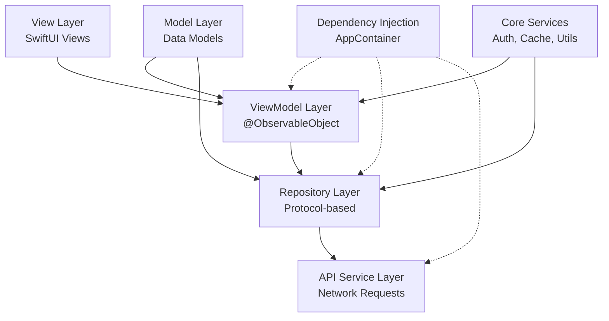
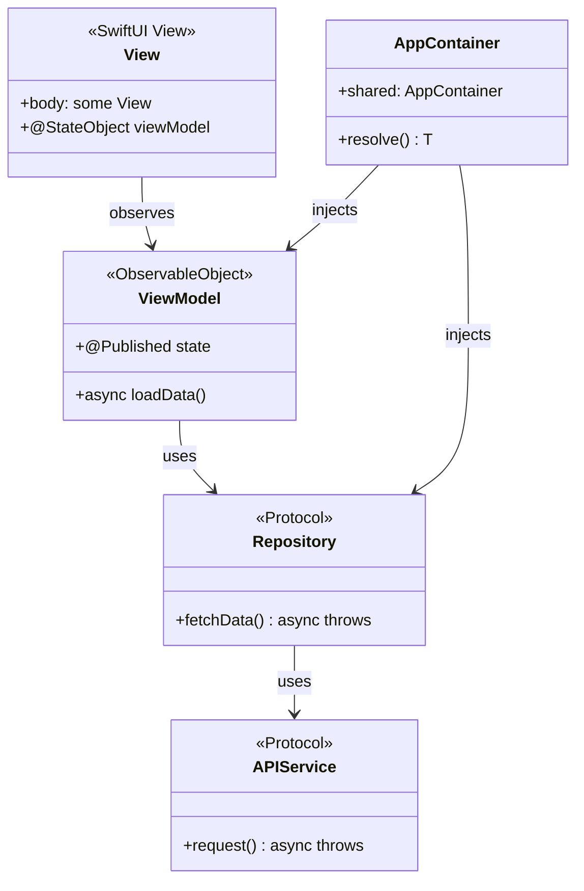
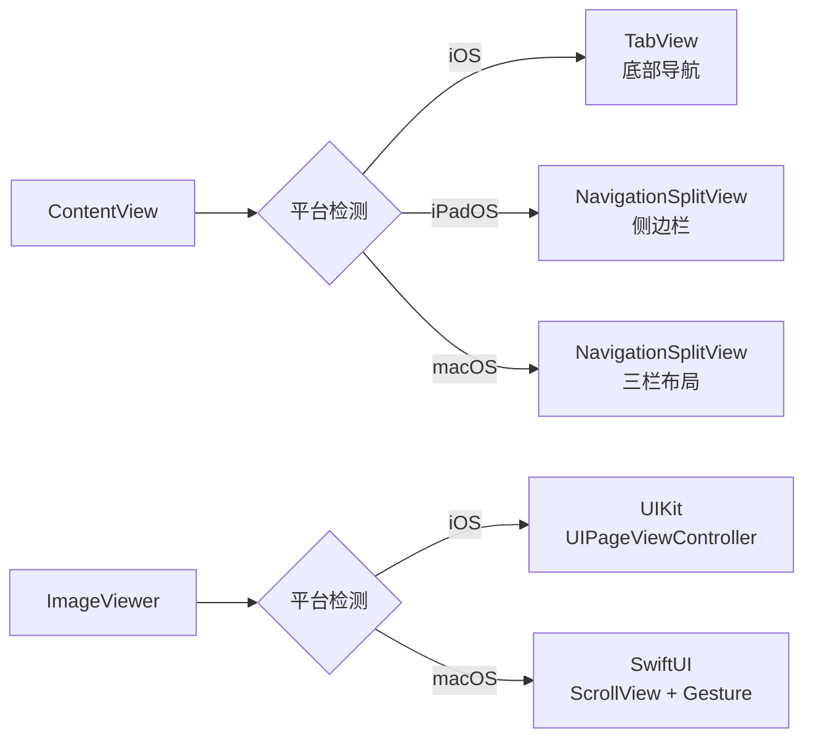
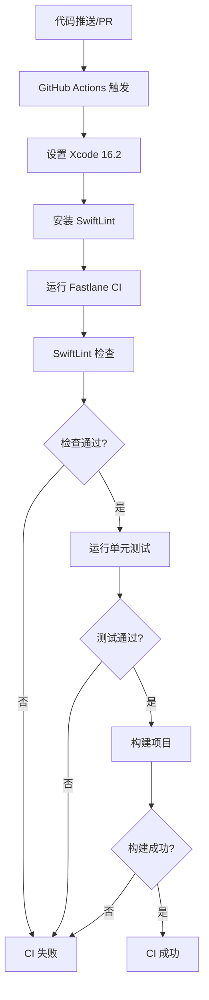
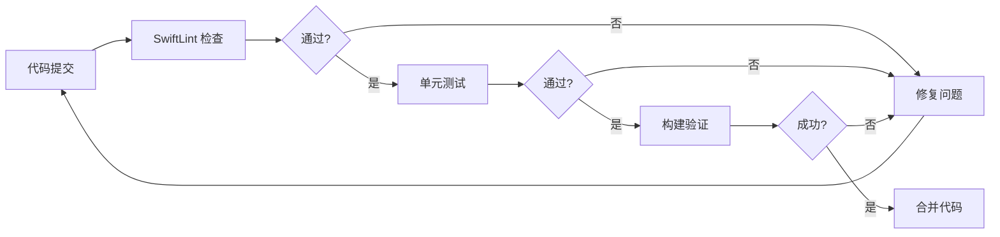

## 关于水木社区

**水木社区**（[www.newsmth.net](https://www.newsmth.net)）是中国最早的 BBS 论坛之一，起源于清华大学，拥有超过 20 年的历史。作为国内知名的技术社区，水木社区聚集了大量技术爱好者、科研人员和行业专家，涵盖了技术讨论、学术交流、生活分享等多个板块。

水木社区以其高质量的技术讨论和活跃的社区氛围而闻名，是许多开发者和技术从业者获取知识、交流经验的重要平台。

> 本文深入探讨基于 SwiftUI 开发的水木社区多端客户端（iOS / iPadOS / macOS）的技术实现，涵盖软件工程架构设计、SwiftUI 最佳实践以及多平台适配策略。本文是基于 [Smth 项目](https://github.com/bitnpc/Smth) 的实际开发经验总结而成。
{: .prompt-tip }

## 项目背景

作为水木社区的长期用户，我经常在移动设备上浏览论坛内容。然而，在使用 App Store 中的现有客户端时，我发现它们存在以下问题：

- **用户体验不佳**：界面设计老旧，交互不够流畅，广告太多
- **功能不完善**：缺少一些常用功能，如浏览历史、字体设置等
- **更新不及时**：很多应用长期不更新，无法适配新的系统特性
- **多平台支持不足**：缺少 macOS 版本，无法在桌面端使用

基于这些痛点，我决定自己开发一个现代化的水木社区客户端，采用最新的 SwiftUI 框架，支持 iOS、iPadOS 和 macOS 三个平台，提供更好的用户体验。

## 项目源码

**项目地址**：[https://github.com/bitnpc/Smth](https://github.com/bitnpc/Smth)

本项目采用 MIT 许可证开源，欢迎 Star 和 Fork。如果你也是水木社区的用户，或者对 SwiftUI 多平台开发感兴趣，欢迎参与贡献。

## 📋 目录

1. [项目概述](#项目概述)
2. [软件工程架构设计](#软件工程架构设计)
3. [SwiftUI 实践与注意事项](#swiftui-实践与注意事项)
4. [多平台适配策略](#多平台适配策略)
5. [代码质量保障与 CI/CD](#代码质量保障与-cicd)
6. [总结与展望](#总结与展望)

---

## 项目概述

**Smth** 是一个基于 SwiftUI 开发的现代化论坛客户端，支持 iOS、iPadOS 和 macOS 三个平台。项目采用 **MVVM** 架构模式，实现了清晰的职责分离和高度可测试的代码结构。

### 核心特性

- ✅ 热门话题浏览（瀑布流 + 分页加载）
- ✅ 版面导航与话题详情
- ✅ 图片查看器（支持多图滑动、缩放）
- ✅ 用户登录与个人中心
- ✅ 收藏管理、消息中心、搜索功能
- ✅ 本地缓存（浏览历史、草稿）

---

## 软件工程架构设计

良好的架构设计是项目成功的基础。Smth 项目采用分层架构模式，从 UI 层到数据层清晰分离，确保代码的可维护性和可扩展性。

### 1. 架构概览

项目采用分层架构模式，各层职责明确：



### 2. MVVM 架构详解

#### 2.1 架构层次

**MVVM (Model-View-ViewModel)** 是项目的核心架构模式，各层职责如下：

| 层次 | 职责 | 示例 |
|------|------|------|
| **View** | UI 展示、用户交互 | `HomeView`, `TopicRowView` |
| **ViewModel** | 业务逻辑、状态管理 | `TopicListViewModel`, `FavoritesViewModel` |
| **Model** | 数据模型 | `Topic`, `Article`, `Board` |
| **Repository** | 数据访问抽象 | `TopicRepository`, `MessageRepository` |
| **Service** | 网络请求、业务服务 | `APIService`, `BrowsingHistoryStore` |

#### 2.2 ViewModel 实现示例

以 `TopicListViewModel` 为例，展示 MVVM 的核心实现：

```swift
// App/Modules/Home/ViewModels/TopicListViewModel.swift
@MainActor
final class TopicListViewModel: ObservableObject {
    @Published private(set) var topics: [Topic] = []
    @Published private(set) var isLoadingPage = false
    @Published private(set) var isRefreshing = false
    @Published private(set) var errorMessage: String?

    private let repository: TopicRepositoryProtocol
    private var paginationState = PaginationState<Topic>()

    init(repository: TopicRepositoryProtocol = AppContainer.shared.resolve(TopicRepositoryProtocol.self)) {
        self.repository = repository
    }

    func loadInitialIfNeeded() async {
        if topics.isEmpty {
            await loadInitialPage()
        }
    }

    func loadNextPageIfNeeded(currentItem item: Topic?) {
        guard let item else { return }
        let thresholdIndex = topics.index(topics.endIndex, offsetBy: -5, limitedBy: topics.startIndex) ?? topics.startIndex
        if topics.firstIndex(where: { $0.id == item.id }) == thresholdIndex {
            Task { await loadNextPage() }
        }
    }

    private func loadPage() async {
        guard let nextPage = paginationState.startLoadingNextPage() else { return }
        do {
            let newItems = try await repository.fetchTopics(in: boardID, page: nextPage, pageSize: pageSize)
            paginationState.completeLoading(with: newItems, pageSize: pageSize)
            topics = paginationState.items
        } catch {
            errorMessage = error.localizedDescription
        }
    }
}
```

**设计要点：**

1. **@MainActor 保证线程安全**：所有 UI 更新都在主线程执行
2. **@Published 属性驱动 UI**：SwiftUI 自动响应状态变化
3. **依赖注入**：通过 `AppContainer` 注入 Repository，便于测试
4. **错误处理**：捕获异常并更新 `errorMessage`，View 层可展示错误信息

#### 2.3 Repository 模式

Repository 层抽象了数据访问逻辑，提供统一的接口。这种设计带来的好处是：

- **可测试性**：可以轻松创建 Mock Repository 进行单元测试
- **可维护性**：数据源变更（如从 API 切换到本地数据库）只需修改 Repository 实现
- **单一职责**：Repository 只负责数据获取，不涉及业务逻辑

```swift
// App/Core/Networking/Repositories/TopicRepository.swift
struct TopicRepository: TopicRepositoryProtocol {
    private let apiService: APIService

    func fetchTopics(in boardID: String, page: Int, pageSize: Int) async throws -> [Topic] {
        let endpoint = APIEndpoint.topicList(boardID: boardID, page: page, pageSize: pageSize).toEndpoint()
        let response: TopicResponse = try await apiService.request(endpoint)
        return response.data.topics
    }
}
```

### 3. 依赖注入（Dependency Injection）

项目使用自定义的依赖注入容器 `AppContainer`，统一管理所有依赖项：

```swift
// App/Core/Dependency/AppContainer.swift
final class AppContainer: DependencyContainer {
    static let shared = AppContainer()

    private lazy var apiService: APIService = DefaultAPIService()
    private lazy var topicRepository: TopicRepositoryProtocol = TopicRepository(apiService: apiService)

    func resolve<T>(_ type: T.Type) -> T {
        if type == TopicRepositoryProtocol.self {
            return topicRepository as! T
        }
        // ... 其他依赖
    }
}
```

**设计优势：**

- **单例模式**：`AppContainer.shared` 确保全局唯一实例
- **延迟初始化**：使用 `lazy var` 按需创建依赖
- **类型安全**：通过泛型 `resolve<T>` 方法获取依赖

### 4. 分页状态管理

项目实现了通用的分页状态管理类 `PaginationState`，用于统一管理列表的分页逻辑：

```swift
// App/Core/Pagination/PaginationState.swift
struct PaginationState<Item: Identifiable & Hashable> {
    private(set) var items: [Item] = []
    private(set) var currentPage: Int = 0
    private(set) var isLoadingPage = false
    private(set) var canLoadMorePages = true

    mutating func startLoadingNextPage() -> Int? {
        guard !isLoadingPage, canLoadMorePages else { return nil }
        isLoadingPage = true
        currentPage += 1
        return currentPage
    }

    mutating func completeLoading(with newItems: [Item], pageSize: Int) {
        items.append(contentsOf: newItems)
        isLoadingPage = false
        canLoadMorePages = !newItems.isEmpty
    }
}
```

**核心特性：**

- **泛型设计**：支持任意 `Identifiable & Hashable` 类型
- **状态封装**：防止外部直接修改状态
- **防重复加载**：通过 `isLoadingPage` 标志避免并发请求

### 5. 架构设计图



---

## SwiftUI 实践与注意事项

SwiftUI 作为 Apple 的现代 UI 框架，采用声明式编程范式，让 UI 开发变得更加简洁高效。本节将分享项目中的 SwiftUI 实践经验和注意事项。

### 1. SwiftUI 核心特性应用

#### 1.1 声明式 UI

SwiftUI 的核心思想是通过描述 UI 的"状态"而非"步骤"来构建界面。这种声明式的方式让代码更加直观：

```swift
// App/Modules/Home/HomeView.swift
var body: some View {
    ScrollView {
        LazyVStack(spacing: AppTheme.compactSpacing) {
            ForEach(viewModel.topics) { topic in
                NavigationLink(value: topic) {
                    TopicRowView(topic: topic)
                }
                .onAppear {
                    viewModel.loadNextPageIfNeeded(currentItem: topic)
                }
            }
        }
    }
}
```

**关键点：**

- **LazyVStack**：延迟加载，提升性能
- **onAppear**：触发分页加载
- **数据驱动**：UI 自动响应 `viewModel.topics` 的变化

#### 1.2 状态管理

SwiftUI 提供了多种状态管理方式，选择合适的属性包装器很重要：

| 属性包装器 | 用途 | 使用场景 |
|-----------|------|----------|
| `@State` | 视图内部状态 | 临时 UI 状态（如选中项） |
| `@StateObject` | 视图拥有的 ObservableObject | ViewModel 生命周期与视图绑定 |
| `@ObservedObject` | 外部传入的 ObservableObject | 共享的 ViewModel |
| `@EnvironmentObject` | 环境对象 | 全局状态（如登录状态） |
| `@Environment` | 环境值 | 系统设置（如颜色方案） |

**最佳实践：**

```swift
// App/Modules/Home/HomeView.swift
struct HomeView: View {
    @EnvironmentObject private var browsingHistory: BrowsingHistoryStore
    @Environment(\.colorScheme) private var colorScheme
    @StateObject private var viewModel = NaviTopicListViewModel()
    @State private var selectedIndex: Int = 0
}
```

- **@StateObject**：用于创建和拥有 ViewModel
- **@EnvironmentObject**：用于共享全局状态
- **@Environment**：用于访问系统环境值

#### 1.3 自定义 ViewModifier

通过 ViewModifier 实现可复用的样式，保持 UI 一致性：

```swift
// App/Core/Utils/AppTheme.swift
extension View {
    func smthScaffoldBackground() -> some View {
        modifier(ScaffoldBackgroundModifier())
    }

    func smthSurfaceBackground(subdued: Bool = false) -> some View {
        modifier(SurfaceBackgroundModifier(subdued: subdued))
    }
}
```

**优势：**

- **代码复用**：统一的应用样式
- **易于维护**：修改样式只需更新 ViewModifier
- **链式调用**：`.smthScaffoldBackground()` 简洁优雅

### 2. SwiftUI 注意事项

#### 2.1 性能优化

**列表性能优化**

❌ **错误做法**：使用 `VStack` 渲染大量数据
```swift
VStack {
    ForEach(items) { item in
        ItemView(item: item)
    }
}
```

✅ **正确做法**：使用 `LazyVStack` 或 `List`
```swift
LazyVStack {
    ForEach(items) { item in
        ItemView(item: item)
    }
}
```

**视图重建优化**

❌ **错误做法**：在 `body` 中创建复杂对象
```swift
var body: some View {
    let expensiveData = computeExpensiveData()
    return Text(expensiveData)
}
```

✅ **正确做法**：使用 `@State` 缓存计算结果
```swift
@State private var expensiveData: String = ""

var body: some View {
    Text(expensiveData)
        .onAppear {
            expensiveData = computeExpensiveData()
        }
}
```

#### 2.2 异步操作

在 SwiftUI 中处理异步操作时，使用 `Task` 和 `async/await`：

```swift
// App/Modules/Home/HomeView.swift
.onAppear {
    Task {
        await navigationViewModel.loadNavigationsIfNeeded()
    }
}
```

**注意事项：**

- ✅ 使用 `Task { }` 在 View 中启动异步任务
- ✅ ViewModel 方法标记为 `async`
- ✅ 使用 `@MainActor` 确保 UI 更新在主线程

#### 2.3 条件编译

SwiftUI 支持使用 `#if os()` 进行平台特定代码：

```swift
// App/Components/ImageViewer.swift
var body: some View {
    #if os(iOS)
    ImageViewerUIKit(images: images, initialIndex: initialIndex, isPresented: $isPresented)
    #else
    ImageViewerSwiftUI(images: images, initialIndex: initialIndex, isPresented: $isPresented)
    #endif
}
```

### 3. 组件化设计

项目将 UI 拆分为可复用组件，每个组件职责单一：

```swift
// App/Modules/Home/TopicRowView.swift
struct TopicRowView: View {
    let topic: Topic
    let isVisited: Bool

    var body: some View {
        VStack(alignment: .leading, spacing: 5) {
            Text(topic.subject)
                .font(.headline)
            // ... 其他 UI 元素
        }
        .background(AppTheme.surfaceBackground(for: colorScheme))
    }
}
```

**设计原则：**

- **单一职责**：每个组件只负责一个功能
- **可复用性**：通过参数配置适应不同场景
- **可访问性**：添加 `.accessibilityLabel` 支持 VoiceOver

---

## 多平台适配策略

多平台支持是现代应用开发的重要需求。Smth 项目通过一套代码支持 iOS、iPadOS 和 macOS 三个平台，在保持代码统一的同时，充分利用各平台的原生特性。

### 1. iOS 与 macOS 的主要区别

| 特性 | iOS | macOS |
|------|-----|-------|
| **导航方式** | TabView 底部导航 | NavigationSplitView 侧边栏 |
| **交互方式** | 触摸手势 | 鼠标 + 键盘 |
| **窗口管理** | 全屏应用 | 多窗口支持 |
| **图片查看** | UIKit (手势流畅) | SwiftUI (鼠标适配) |
| **Sheet 展示** | 底部弹出 | 独立窗口 |
| **工具栏** | 导航栏 | 菜单栏 + 工具栏 |

### 2. 适配实现

#### 2.1 导航结构适配

项目在 `ContentView` 中根据平台选择不同的导航方式：

```swift
// App/ContentView.swift
var body: some View {
    Group {
        #if os(macOS)
        macSidebarLayout
        #else
        if horizontalSizeClass == .compact {
            tabLayout
        } else {
            sidebarLayout
        }
        #endif
    }
}
```

**iOS 实现（TabView）：**

```swift
// App/ContentView.swift
private var tabLayout: some View {
    TabView(selection: $selection) {
        NavigationStack {
            HomeView()
        }
        .tabItem { Label("首页", systemImage: "house") }
        // ... 其他 Tab
    }
}
```

**macOS 实现（NavigationSplitView）：**

```swift
// App/ContentView.swift
#if os(macOS)
private var macSidebarLayout: some View {
    NavigationSplitView(columnVisibility: $columnVisibility) {
        macSidebar.frame(minWidth: 240, idealWidth: 280)
    } content: {
        macContentStack.frame(minWidth: 300, idealWidth: 380)
    } detail: {
        macDetailPlaceholder.frame(minWidth: 500, idealWidth: 600)
    }
}
#endif
```

**设计要点：**

- **三栏布局**：侧边栏 + 内容列表 + 详情视图
- **响应式宽度**：通过 `minWidth/idealWidth/maxWidth` 控制列宽
- **状态同步**：登录状态变化时自动刷新数据

#### 2.2 图片查看器适配

由于 iOS 和 macOS 的交互方式不同，项目为图片查看器实现了两套方案：

**iOS（UIKit 实现）：**

```swift
// App/Components/ImageViewer.swift
#if os(iOS)
private struct ImageViewerUIKit: UIViewControllerRepresentable {
    func makeUIViewController(context: Context) -> ImagePageViewController {
        ImagePageViewController(images: images, initialIndex: initialIndex)
    }
}
#endif
```

**macOS（SwiftUI 实现）：**

```swift
// App/Components/ImageViewer.swift
#if !os(iOS)
private struct ImageViewerSwiftUI: View {
    @State private var currentIndex: Int
    @State private var scale: CGFloat = 1.0

    var body: some View {
        ScrollView([.horizontal, .vertical]) {
            CachedAsyncImage(url: URL(string: images[currentIndex]))
                .scaleEffect(scale)
        }
        .gesture(MagnificationGesture())
    }
}
#endif
```

**差异说明：**

- **iOS**：使用 `UIPageViewController` 实现流畅的滑动切换，手势体验更佳
- **macOS**：使用 SwiftUI 的 `ScrollView` + `MagnificationGesture`，适配鼠标操作

#### 2.3 Sheet 展示适配

**iOS（底部弹出）：**

```swift
// App/Modules/Home/HomeView.swift
#if os(iOS)
.sheet(isPresented: $showProfileView) {
    ProfileView()
        .presentationDetents([.large])
}
#endif
```

**macOS（独立窗口）：**

```swift
// App/Modules/Home/HomeView.swift
#elseif os(macOS)
.sheet(isPresented: $showProfileView) {
    ProfileView()
        .frame(minWidth: 600, minHeight: 500)
}
#endif
```

### 3. 适配策略总结



**核心原则：**

1. **条件编译**：使用 `#if os()` 区分平台代码
2. **统一接口**：保持 ViewModel 和 Repository 层平台无关
3. **平台特性**：充分利用各平台的原生体验
4. **响应式布局**：使用 `horizontalSizeClass` 适配不同尺寸

---

## 代码质量保障与 CI/CD

代码质量是项目长期维护的关键。Smth 项目通过 **SwiftLint** 代码规范检查和 **GitHub Actions CI/CD** 自动化流程，确保代码质量和持续集成。

### 1. SwiftLint 代码规范检查

#### 1.1 配置说明

项目使用 SwiftLint 进行代码规范检查，配置文件为 `swiftlint.yml`：

```yaml
disabled_rules:
  - identifier_name
  - trailing_whitespace

included:
  - App
  - SmthTests

line_length:
  warning: 140
  error: 180

function_body_length:
  warning: 175
  error: 200

cyclomatic_complexity:
  warning: 20
  error: 25
```

**配置要点：**

- **禁用规则**：`identifier_name`（允许更灵活的命名）、`trailing_whitespace`（由编辑器处理）
- **检查范围**：仅检查 `App` 和 `SmthTests` 目录
- **行长度**：警告 140 字符，错误 180 字符
- **复杂度控制**：函数体长度、圈复杂度都有明确限制

#### 1.2 使用方式

**本地检查：**

```bash
swiftlint --config swiftlint.yml
swiftlint --fix --config swiftlint.yml  # 自动修复
```

**Fastlane 集成：**

```ruby
lane :lint do
  sh("swiftlint --config swiftlint.yml")
end
```

### 2. GitHub Actions CI/CD

#### 2.1 CI 工作流配置

项目使用 GitHub Actions 实现持续集成：

```yaml
name: CI

on:
  push:
    branches: [main, master, develop]
  pull_request:

jobs:
  build-and-test:
    runs-on: macos-14
    steps:
      - uses: actions/checkout@v4
      - uses: maxim-lobanov/setup-xcode@v1
        with:
          xcode-version: '16.2'
      - name: Install SwiftLint
        run: brew install swiftlint
      - name: Run Fastlane CI
        run: bundle exec fastlane ci
```

**工作流特点：**

1. **触发条件**：推送到主分支或创建 Pull Request
2. **运行环境**：macOS 14，固定 Xcode 16.2
3. **缓存优化**：缓存 Swift Package Manager 依赖
4. **自动化**：自动安装依赖并运行检查

#### 2.2 CI 流程详解



#### 2.3 Fastlane CI Lane

Fastlane 的 `ci` lane 整合了代码检查和测试：

```ruby
lane :ci do
  lint
  tests
end
```

**执行顺序：**

1. **Lint 检查**：运行 SwiftLint 代码规范检查
2. **单元测试**：执行所有单元测试

### 3. 单元测试实践

#### 3.1 测试架构

项目采用 XCTest 框架进行单元测试，通过依赖注入实现可测试性：

**ViewModel 测试示例：**

```swift
// SmthTests/TopicListViewModelTests.swift
final class TopicListViewModelTests: XCTestCase {
    func testInitialLoadFetchesTopics() async throws {
        let repository = StubTopicRepository(
            hotTopics: { page, size in Self.mockTopics(page: page, pageSize: size) }
        )
        let viewModel = TopicListViewModel(repository: repository)

        await viewModel.loadInitialIfNeeded()

        XCTAssertEqual(viewModel.topics.count, 20)
        XCTAssertFalse(viewModel.isLoadingPage)
    }
}
```

**测试要点：**

- **依赖注入**：使用 `StubTopicRepository` 模拟数据源
- **异步测试**：使用 `async/await` 测试异步操作
- **隔离性**：每个测试独立，不依赖外部状态

#### 3.2 测试覆盖率

项目当前测试覆盖：

| 模块 | 测试文件 | 覆盖内容 |
|------|---------|---------|
| **ViewModel** | `TopicListViewModelTests.swift` | 分页加载、初始加载 |
| **Store** | `BrowsingHistoryStoreTests.swift` | 浏览历史记录、去重 |
| **Settings** | `FontSettingsTests.swift` | 字体设置持久化 |

**待完善：**

- Repository 层测试
- API Service 测试
- UI 组件测试（Snapshot Testing）

### 4. CI/CD 最佳实践

#### 4.1 本地验证

在提交代码前，建议本地运行 CI 流程：

```bash
bundle install
bundle exec fastlane ci
```

#### 4.2 提交前检查清单

- [ ] 运行 `swiftlint` 确保代码规范
- [ ] 运行单元测试确保功能正常
- [ ] 检查是否有编译警告
- [ ] 确保所有测试通过

#### 4.3 CI 失败处理

当 CI 失败时：

1. **查看日志**：GitHub Actions 会显示详细的错误信息
2. **本地复现**：在本地运行相同的命令复现问题
3. **修复问题**：根据错误信息修复代码或配置
4. **重新提交**：修复后重新推送代码

### 5. 持续改进

#### 5.1 代码质量指标



#### 5.2 未来优化方向

1. **代码覆盖率**：集成代码覆盖率报告（如 Codecov）
2. **性能测试**：添加性能基准测试
3. **UI 测试**：使用 XCUITest 进行 UI 自动化测试
4. **自动化发布**：集成 Fastlane 自动化发布流程
5. **安全扫描**：集成依赖安全扫描工具

---

## 总结与展望

### 项目亮点

1. **清晰的架构**：MVVM + Repository 模式，职责分离明确
2. **可测试性**：依赖注入 + Protocol 抽象，便于单元测试
3. **多平台支持**：一套代码，三个平台，原生体验
4. **性能优化**：LazyVStack、分页加载、图片缓存
5. **用户体验**：深色模式、字体设置、浏览历史
6. **代码质量**：SwiftLint + CI/CD 自动化保障

### 技术栈

- **UI 框架**：SwiftUI
- **架构模式**：MVVM + Repository
- **网络库**：Alamofire
- **HTML 解析**：SwiftSoup
- **依赖管理**：Swift Package Manager
- **代码规范**：SwiftLint
- **CI/CD**：GitHub Actions + Fastlane

### 未来改进方向

1. **功能完善**：发帖、评论、点赞等交互功能
2. **性能优化**：进一步优化列表滚动性能
3. **测试覆盖**：增加 UI 测试和集成测试
4. **用户体验**：推送通知、离线阅读等
5. **代码质量**：提升测试覆盖率，集成更多自动化工具

---

## 参考资料

- [SwiftUI 官方文档](https://developer.apple.com/documentation/swiftui)
- [MVVM 架构模式](https://developer.apple.com/documentation/swiftui/managing-model-data-in-your-app)
- [多平台适配指南](https://developer.apple.com/documentation/swiftui/building-apps-for-multiple-platforms)
- [SwiftLint 文档](https://github.com/realm/SwiftLint)
- [GitHub Actions 文档](https://docs.github.com/en/actions)

---


