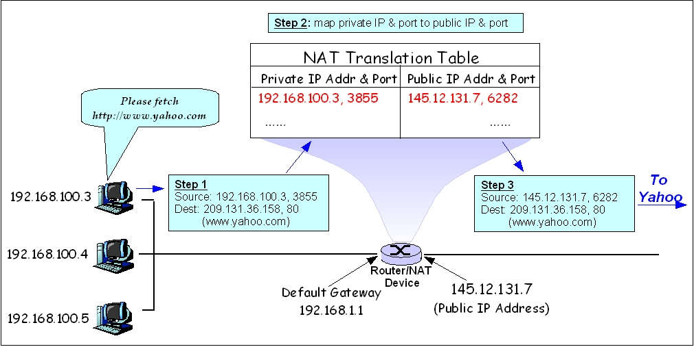

As we know, conventional live video streaming is typically delivered via `RTSP` or `HLS` protocols. The characteristic of this approach is that all traffic must originate from a central server, pass through a `CDN (Content Delivery Network)`, and then be distributed to individual terminals.

This approach works well for large audiences, but the bandwidth cost for the server is also high.

To reduce costs, live audio/video streaming based on P2P technology emerged and has been widely applied in areas such as online chat (WebRTC) and network cameras.

So what exactly is P2P technology? And how is it applied to live video streaming?

## P2P Technology

A peer-to-peer network (commonly abbreviated as P2P), also known as a point-to-point network, is an internet architecture that operates without a central server and relies on user groups (peers) to exchange information. Its role is to reduce the number of nodes in the traditional network transmission path, thereby lowering the risk of data loss. Unlike a centralized network system with a central server, each client in a peer-to-peer network acts as both a node and a server. No single node can directly find another node — it must rely on the user group for information exchange.

Sounds similar to how Git works.

So, as long as you know the other party's IP address, can you connect directly?

On an IPv6 network without `NPTv6 (Network Prefix Translation for IPv6)` configured, if you know the other party's IPv6 address, you can connect directly. IPv6 addresses are typically globally unique, so each device can have a globally reachable IPv6 address on the Internet.

However, on an IPv4 network, direct connections are not possible due to `NAT (Network Address Translation)`.

### NAT and Its Types

NAT technology was introduced to address the shortage of IPv4 addresses. An IPv4 address is a 32-bit binary number, capable of representing 2 to the power of 32 addresses, which is `4294967296`. However, some of these addresses are reserved for special purposes, such as private addresses, broadcast addresses, and multicast addresses, so the actual number of usable IPv4 addresses is smaller. Additionally, the allocation of IPv4 addresses is not uniform — some regions and organizations receive more addresses than others, which further contributes to the shortage.

NAT technology solves the IPv4 address shortage problem by translating the private IP addresses of an internal network into public IP addresses, allowing multiple internal hosts to share a single public IP address to access the internet. Furthermore, NAT can improve network security by hiding internal network IP addresses, preventing direct access to the internal network from external networks.

There are **three types of NAT**:

- **Static NAT** — static one-to-one address translation. Mapping relationships must be configured manually; if the network topology changes, the configuration must be updated, making management and maintenance more difficult. Typically used within enterprise internal networks.

|   Internal IP   |     External IP      |
|-----------------|----------------------|
|  192.168.1.55   |   219.152.168.222    |
|  192.168.1.59   |   219.152.168.223    |
| 192.168.1.155   |   219.152.168.224    |

- **Dynamic NAT (Pooled NAT)** — dynamic address pool translation. When translating the private IP addresses of the internal network, public IP addresses are selected from an address pool, and the mapping has a lease time limit. Internal IP and external IP still maintain a one-to-one mapping; the difference from Static NAT is that the mapping changes dynamically.

- **NAPT (Network Address Port Translation)**: A special type of dynamic NAT that not only maps internal host IP addresses to a public IP address, but also maps internal host port numbers to different port numbers on the public IP address, allowing multiple internal hosts to share a single public IP address to access the external network.

|      Internal IP       |       External IP       |
|------------------------|-------------------------|
|  192.168.1.55:5555     |   219.152.168.222:9200  |
|  192.168.1.59:80       |   219.152.168.223:9201  |
| 192.168.1.155:4456     |   219.152.168.224:9202  |

Home routers typically use NAPT, while large corporate networks with complex internal infrastructure use `Static NAT` and `Dynamic NAT`. The NAT discussed in this article refers to the third type, NAPT.

### Cone NAT and Symmetric NAT

The third type, NAPT, can be further divided into Cone NAT and Symmetric NAT. Cone NAT can be further subdivided into `Full Cone NAT`, `Address Restricted Cone NAT`, and `Port Restricted Cone NAT`. Each type responds to external requests differently.

- **Full Cone NAT**

Once an internal address (`iAddr:iPort`) is mapped to an external address (`eAddr:ePort`), all data packets sent from `iAddr:iPort` are transmitted outward via `eAddr:ePort`. Any external host can send data packets to `eAddr:ePort` to reach the internal host `iAddr:iPort` behind the NAT device.

- **Address Restricted Cone NAT**

Built upon Full Cone NAT but with IP address restrictions. Only external addresses that have previously communicated with the internal address can send messages.

- **Port Restricted Cone NAT**

Built upon Address Restricted Cone NAT with additional port restrictions. Only a specific port from a specific external address can send messages.

- **Symmetric NAT**

The following JavaScript code can be used in the Chrome browser to detect the NAPT type of the current network:

```javascript
// parseCandidate from https://github.com/fippo/sdp
function parseCandidate(line) {
  var parts;
  // Parse both variants.
  if (line.indexOf('a=candidate:') === 0) {
    parts = line.substring(12).split(' ');
  } else {
    parts = line.substring(10).split(' ');
  }

  var candidate = {
    foundation: parts[0],
    component: parts[1],
    protocol: parts[2].toLowerCase(),
    priority: parseInt(parts[3], 10),
    ip: parts[4],
    port: parseInt(parts[5], 10),
    // skip parts[6] == 'typ'
    type: parts[7]
  };

  for (var i = 8; i < parts.length; i += 2) {
    switch (parts[i]) {
      case 'raddr':
        candidate.relatedAddress = parts[i + 1];
        break;
      case 'rport':
        candidate.relatedPort = parseInt(parts[i + 1], 10);
        break;
      case 'tcptype':
        candidate.tcpType = parts[i + 1];
        break;
      default: // Unknown extensions are silently ignored.
        break;
    }
  }
  return candidate;
};

var candidates = {};
var pc = new RTCPeerConnection({iceServers: [
    {urls: 'stun:stun1.l.google.com:19302'},
    {urls: 'stun:stun2.l.google.com:19302'}
]});
pc.createDataChannel("foo");
pc.onicecandidate = function(e) {
  if (e.candidate && e.candidate.candidate.indexOf('srflx') !== -1) {
    var cand = parseCandidate(e.candidate.candidate);
    if (!candidates[cand.relatedPort]) candidates[cand.relatedPort] = [];
    candidates[cand.relatedPort].push(cand.port);
  } else if (!e.candidate) {
    if (Object.keys(candidates).length === 1) {
      var ports = candidates[Object.keys(candidates)[0]];
      console.log(ports.length === 1 ? 'normal nat' : 'symmetric nat');
    }
  }
};
pc.createOffer()
.then(offer => pc.setLocalDescription(offer))
```

When an IP packet passes through a NAT device (such as a router), the NAT rewrites the source IP address and destination IP address, enabling multiple hosts on the same internal network to share a public IP address.

_NAT Diagram_

As shown in the diagram above, a host at `192.168.100.3` sends an HTTP request to port 80 of `209.131.36.158`. When it passes through NAT, the NAT looks up its mapping table to find the external IP address and port corresponding to this host, i.e., `145.12.131.7:6282`. It then replaces the Source field of the IP packet with this address and forwards it to `www.yahoo.com`. When the Yahoo server sends a response, the Dest is `145.12.131.7:6282`, and the NAT forwards it to port `3855` of `192.168.100.3`.

However, if an external host wants to actively access `192.168.100.3`, it obviously cannot reach the internal `192.168.100.3` host. Even if the external host knows our public IP address, when it tries to establish a connection, the NAT device checks and finds no mapping for that address to any LAN address, and the data packet is discarded.

```alert
type: success
description: The generation of NAT translation tables and the rewriting of IP addresses and port numbers in TCP/IP packets incur some overhead.
```

NAT technology is widely used, but it also has some drawbacks:

1. NAT devices must rewrite and modify outgoing and incoming data packets (IP address translation, checksum recalculation), which reduces network data transmission speed.
2. NAT port aging issues can cause connected devices to disconnect unexpectedly. Since NAT devices need to maintain port mapping tables with limited hardware resources, some NAT devices periodically drop certain connections.
3. Some network protocols cannot traverse NAT devices, making direct connections between two devices difficult. This is why NAT traversal (hole punching) technology was developed.

## NAT Hole Punching

NAT hole punching is a technique used to establish direct communication between two devices located on different private networks. NAT hole punching typically uses the UDP protocol, so it is also called UDP hole punching. Here is the basic flow of UDP hole punching:

1. Device A and Device B are both on different private networks and cannot communicate directly.
2. Device A sends a UDP packet to Device B, containing Device A's IP address and port number.
3. Device B receives this packet, records Device A's IP address and port number, and sends a UDP packet back to Device A containing Device B's IP address and port number.
4. Device A receives this packet and records Device B's IP address and port number.
5. Now, both Device A and Device B know each other's IP address and port number, and they can communicate directly via UDP using this information.

```
                            Server S
                        18.181.0.31:5678
                               |
                               |
        +----------------------+----------------------+
        |                                             |
      NAT A                                         NAT B
155.99.25.11:62000                            138.76.29.7:31000
        |                                             |
        |                                             |
     Client A                                      Client B
192.168.0.100:1234                              10.1.1.3:1234
```

So the question is: when Device A sends a UDP packet to Device B, how does Device A know Device B's IP address and port number? This is where a relay server comes in.

This relay server can be a public server or a `STUN server`.

```alert
type: success
description: Can TCP hole punch? UDP hole punching and TCP hole punching work on the same principle — both create mappings on NAT devices to enable direct communication between hosts behind different NATs. However, due to the characteristics of the UDP protocol, UDP hole punching is simpler and more efficient.
```

### STUN

`STUN (Session Traversal Utilities for NAT)` is a protocol used for traversing Network Address Translation (NAT), commonly employed for hole punching in P2P communication. P2P hole punching allows two devices behind NAT to communicate directly without going through an intermediary server.


Google provides [STUN servers](https://webrtc.github.io/samples/src/content/peerconnection/trickle-ice/) that can be tested using the WebRTC demo.

Different types of NAT exist, and not all NATs support hole punching. For example, `Symmetric NAT` mentioned earlier cannot be punched through. The success rate of UDP hole punching is approximately 60%. When hole punching fails, a relay mode based on a `TURN` server is used instead.

### TURN

`Traversal Using Relays around NAT (TURN)` is designed to bypass symmetric NAT restrictions by opening a connection to a TURN server and relaying all information through that server. You create a connection to the `TURN` server and tell all peers to send packets to the server, which then forwards them to you. This obviously introduces some overhead, so it is only used when no other options are available.


This mode of relaying through a `TURN` server is commonly referred to as `relay` mode.

## References

- https://en.wikipedia.org/wiki/Network_address_translation
- https://developer.mozilla.org/en-US/docs/Web/API/WebRTC_API/Protocols
- https://juejin.cn/post/6844904098572009485
- https://webrtchacks.com/symmetric-nat/
- https://www.volcengine.com/docs/6489/72015
