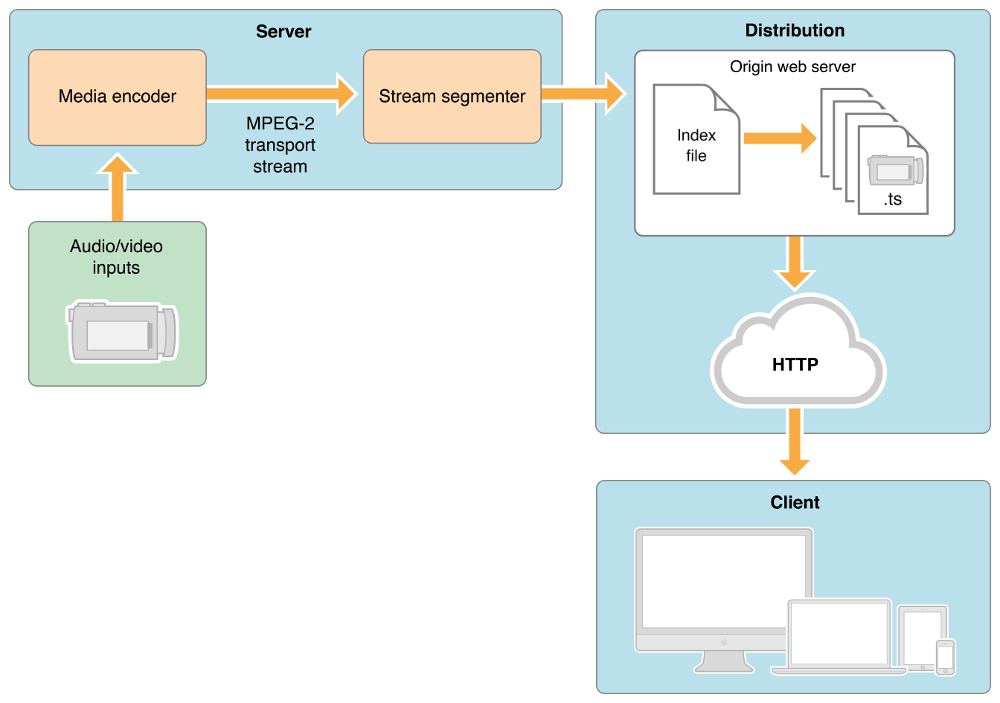
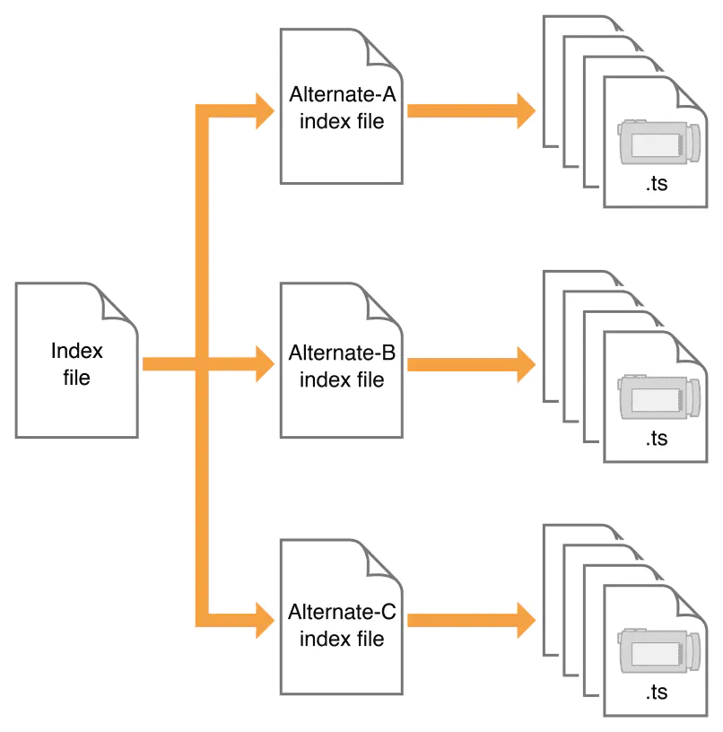
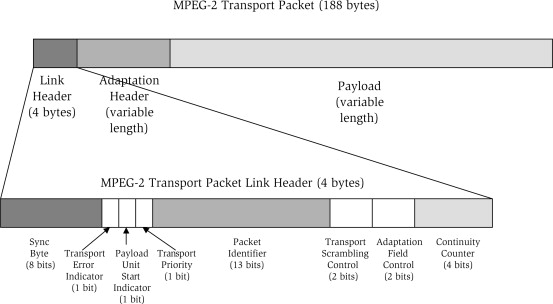
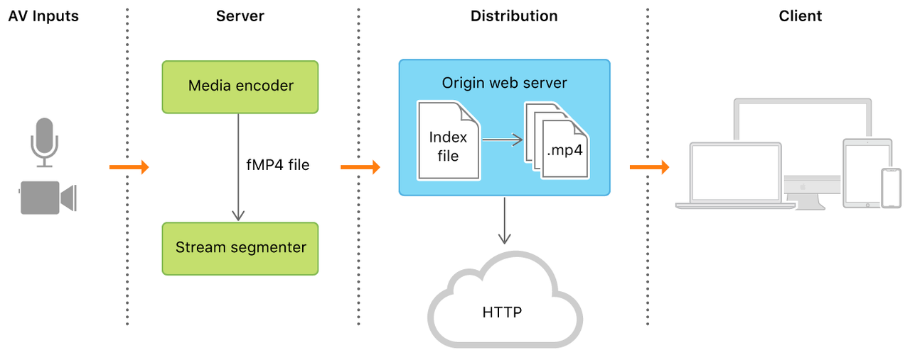
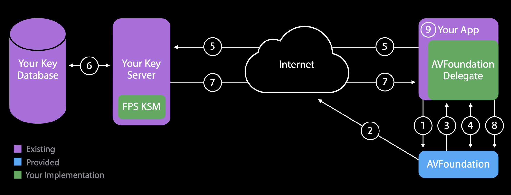
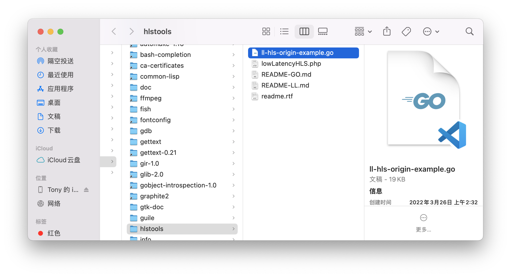
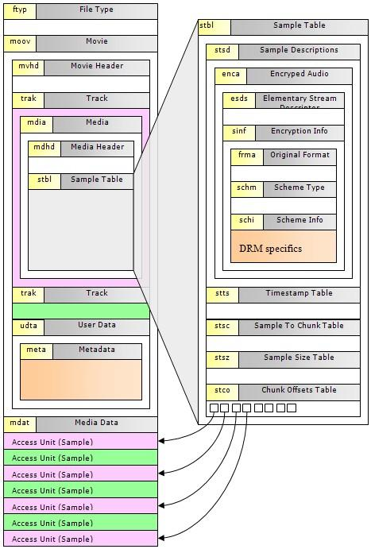

## HLS Protocol
`HLS` stands for `HTTP Live Streaming`, an `HTTP`-based streaming media transport protocol proposed by Apple. It supports both live streaming and on-demand playback, as well as multiple resolutions, dual audio/video tracks, subtitles, and more. Its principle is to split an entire video into multiple small segments, and the complete playback is assembled from these individual fragments.
The `HLS` protocol specifies:

- The video container format is `TS`.
- The video encoding format is `H264`, and the audio encoding formats are `MP3`, `AAC`, or `AC-3`.
- In addition to the `TS` video files themselves, it defines `m3u8` files (text files) used to control playback.

**Advantages:**
1. Bypasses firewall restrictions in certain scenarios
2. Easy server scaling. `RTMP` is a stateful protocol, making it difficult to scale video servers smoothly because it needs to maintain state for each client streaming video. `HLS`, on the other hand, is based on a stateless protocol (`HTTP`). Clients simply download ordinary `TS` files stored on the server in sequence, making load balancing as straightforward as load balancing for a regular `HTTP` file server
3. Adaptive bitrate streaming

**Disadvantages:**
1. High latency in live streaming scenarios (no latency impact for on-demand content)
2. A large number of `TS` segment files can put pressure on server storage and request handling

## Capture Side Workflow
_HLS Live Streaming Workflow_

- AVInputs

Capture audio and video sources

- Server

The server component is responsible for obtaining the media input stream, then encoding it into `MPEG-4` (`H.264` video and `AAC` audio) format, which is then hardware-packaged into an `MPEG-2` transport stream. As shown in the diagram, the transport stream passes through the `stream segmenter`, whose job is to split the `MPEG-2` transport stream into small segments and save them as one or more series of `.ts` media files. This process requires encoding tools such as the `Apple stream segmenter`.

The video is in `fmp4` format (newer) or `ts` format (older), while pure audio is encoded into small audio fragments, typically in `AAC` with `ADTS` headers, `MP3`, or `AC-3` format.

The server side can use either hardware encoding or software encoding. Both function to slice existing media files according to the rules described above and manage them using index files. Software slicing typically uses tools provided by `Apple` or third-party integrated tools.

- Distribution

Provides `HTTP` service, hosting the `m3u8` index files and `ts` segment files created by the `Server`

- Clients
Request `m3u8` resources

## File Format
The `HLS` protocol includes two types of files: index files and `ts/fMP4` files

### Index Files
There are two types:
1. Index file
2. Alternate Index file

_HLS Index_

### ts Files
Each `ts` file consists of several `ts packets`, and each `ts packet` is `188` bytes.
Reason: For compatibility with `ATM (Asynchronous Transfer Mode)` systems

As explained: "This is motivated by the fact that the payload of the ATM Adaptation Layer-1 (AAL-1) cell is 47 bytes. Therefore, four AAL-1 cells can accommodate a single TS packet."

_HLS TS_

### fMP4
_HLS fMP4_
`fMP4` is supported starting from `EXT-X-VERSION 7`.
`fMP4` is a streaming format based on `MPEG-4 Part 12`. It is very similar to `mp4` but has some differences that make `fMP4` better suited for streaming playback.
`fMP4` supports `h.265`, which can significantly save bandwidth. It has gradually become the mainstream video format, especially in the field of video surveillance.

## Playback Modes
1. On-Demand (VOD)
All `index` files and `ts` files are available at the current point in time. The secondary `index` file records the addresses of all `ts` files. This mode allows the client to access the entire content. The example above shows the structure of an `m3u8` file in on-demand mode.

2. Live Streaming
`M3U8` and `ts` files are generated in real time. The index file is constantly changing. During playback, the secondary `index` file needs to be continuously downloaded to obtain the latest generated `ts` files for video playback. If a secondary `index` file does not have the `#EXT-X-ENDLIST` tag at the end, it indicates a live video stream.

## Security
Encryption info: `#EXT-X-KEY:METHOD=AES-128,URI="xx.key",IV=xxx`

FairPlay Streaming

FairPlay Streaming is:
- A secure key delivery mechanism
  Content Key is protected on the network and on the client during playback
- Key delivery is transport agnostic
  Easy to integrate with existing key server infrastructure
- Requires protected HDMI for external output

Workflow
_HLS Fair Play_

## Streaming Demo
Conceptually, HTTP Live Streaming consists of three parts: the server component, the distribution component, and the client software.
In a typical configuration, a hardware encoder takes audio-video input, encodes it as HEVC video and AC-3 audio, and outputs a fragmented MPEG-4 file or an MPEG-2 transport stream. A software stream segmenter then breaks the stream into a series of short media files, which are placed on a web server. The segmenter also creates and maintains an index file containing a list of the media files. The URL of the index file is published on the web server. Client software reads the index, then requests the listed media files in order and displays them without any pauses or gaps between segments.

### Download Tool
Download link: https://developer.apple.com/download/all/?q=HLS

After installation, there is a `go` `example`
_HLS Go Server_
`brew install go`, install `go`, then start the service

```bash
# tony @ tonyMBP in ~/Desktop/hls_server [14:48:18]
$ go run ll-hls-origin-example.go
ll-hls-origin-example.go:43:2: no required module provides package github.com/fsnotify/fsnotify: go.mod file not found in current directory or any parent directory; see 'go help modules'

# tony @ tonyMBP in ~/Desktop/hls_server [14:48:25] C:1
$ go mod init hls_server
go: creating new go.mod: module hls_server
go: to add module requirements and sums:
        go mod tidy

# tony @ tonyMBP in ~/Desktop/hls_server [14:49:23]
$ go build
ll-hls-origin-example.go:43:2: no required module provides package github.com/fsnotify/fsnotify; to add it:
        go get github.com/fsnotify/fsnotify

# tony @ tonyMBP in ~/Desktop/hls_server [14:49:28] C:1
$ go get github.com/fsnotify/fsnotify
go: downloading github.com/fsnotify/fsnotify v1.5.4
go: downloading golang.org/x/sys v0.0.0-20220412211240-33da011f77ad
go: added github.com/fsnotify/fsnotify v1.5.4
go: added golang.org/x/sys v0.0.0-20220412211240-33da011f77ad

# tony @ tonyMBP in ~/Desktop/hls_server [14:49:48]
$ go run ll-hls-origin-example.go
Listening on http://:8443/
```
### Start the mediastreamsegmenter Service
```bash
$ mediastreamsegmenter -w 499 -t 1 224.0.0.50:9121 -s 16 -D -T -f ~/Desktop/hls_server/hls
```

### Stream with ffmpeg
You can use either the built-in system camera to capture audio and video, or specify a local video file.

#### Using Mac Built-in Capture Device

```bash
$ ffmpeg -f avfoundation -list_devices true -i ""

[AVFoundation indev @ 0x7f924d904400] AVFoundation video devices:
[AVFoundation indev @ 0x7f924d904400] [0] FaceTime HD Camera (Built-in)
[AVFoundation indev @ 0x7f924d904400] [1] Capture screen 0
[AVFoundation indev @ 0x7f924d904400] AVFoundation audio devices:
[AVFoundation indev @ 0x7f924d904400] [0] LarkAudioDevice
[AVFoundation indev @ 0x7f924d904400] [1] External Microphone
[AVFoundation indev @ 0x7f924d904400] [2] MacBook Pro Microphone

$ ffmpeg -f avfoundation -framerate 30 -pixel_format uyvy422 -i "0:" -c:v h264 -fflags nobuffer -tune zerolatency -f mpegts udp://192.168.1.5:9121
```

#### Using a Specified File
```bash
$ ffmpeg -re -i "/Users/tony/Downloads/sample.mp4" -c:v h264 -fflags nobuffer -tune zerolatency -f mpegts udp://192.168.1.5:9121
```

## Troubleshooting
1. How to fix inaccurate seeking?
   `mp4` can `seek` to a specified timestamp, while `ts` can only `seek` to a specific file `position`, not directly to a specified time point.
   The `seek`-related code is in the `event_loop` function in `ffplay.c`.
   For `ts`, the specific `seek` operation call chain is: `avformat_seek_file() => av_seek_frame() => seek_frame_internal() => seek_frame_byte()`
   For `mp4`, the specific `seek` operation call chain is: `avformat_seek_file() => av_seek_frame() => seek_frame_internal() => mov_read_seek()`

   The `ts seek` logic: given a file position, directly point the file pointer to that position. When `read_packet()` is subsequently called to read a `ts` packet (188 bytes), since a `seek` was performed, the file pointer is likely not pointing to the header of a `ts packet` (the header starts with a `0x47 byte`). In this case, `mpegts_resync()` needs to be called to resynchronize and find the header, before reading a complete `ts packet`.
   The `mp4` `seek` logic: given a target timestamp for seeking, use the index information of each packet in the `mp4` file to find the packet corresponding to the timestamp. Using the `Sample Table` in the `mp4` file structure (shown below), the `video audio` data packet for any given timestamp can be quickly located.

   Conclusion:
   - For `mp4` files, since an index table exists, the data corresponding to a given timestamp can be quickly found, so `seek` operations complete rapidly.
   - `ts` files have no mapping between timestamps and packet positions. Therefore, for the player, given a `seek` timestamp `ts_seek`, it first estimates a position based on the file bitrate, then retrieves the timestamp `ts_actual` of the data packet at that position. If `ts_actual` < `ts_seek`, it needs to continue reading subsequent data packets; if `ts_actual` > `ts_seek`, it needs to read preceding data packets until the packet corresponding to `ts_seek` is found. Hence, `seek` on `ts` files can be more time-consuming. If the `ts` file contains a `CBR` stream, `ts_actual` and `ts_seek` generally differ little, making `seek` relatively fast. If the `ts` file contains a `VBR` stream, `ts_actual` and `ts_seek` may differ significantly, making `seek` relatively slow.

   _HLS Seek_

2. Compatibility issues with `ts/fMP4` files of different resolutions
   When playing `m3u8` video on Android, a garbled screen issue was encountered. The cause was identified as a change in `ts` resolution.
   The `hevc_mp4toannexb` filter must be added, as the original protocol only supports `h264_mp4toannexb`.
   `H.264/5` bitstreams come in two formats: `Annex-B` and `AVCC`.
   `AVCC` uses length information to separate `NALU`s and is used in container formats like `mp4` and `flv`.
   `Annex-B` uses `start code (0x000001 or 0x00000001)` to separate `NALU`s and is used in `mpegts` streaming media files.
   After adding `hevc_mp4toannexb`, each frame can resolve the video width and height, preventing screen tearing during resolution switching.

References
1. https://developer.apple.com/documentation/http_live_streaming/understanding_the_http_live_streaming_architecture
2. https://en.wikipedia.org/wiki/MPEG_transport_stream
3. http://anddymao.com/2021/08/03/2021-08-03-%E4%B8%80%E7%A7%8D%E4%B8%87%E8%83%BDhls%E5%8D%8F%E8%AE%AE%E8%A7%A3%E6%9E%90%E6%96%B9%E6%B3%95/
