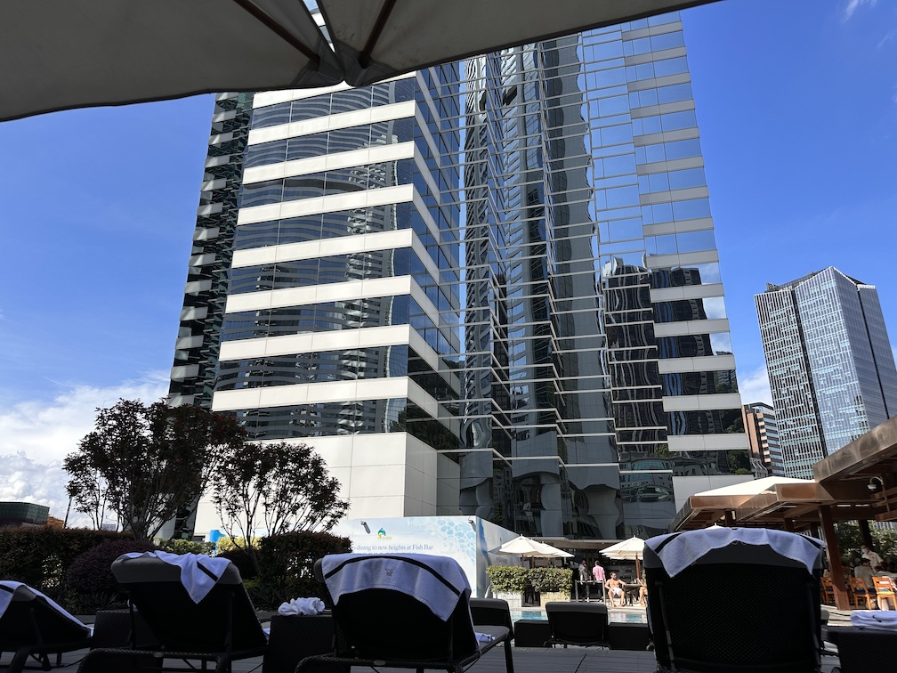
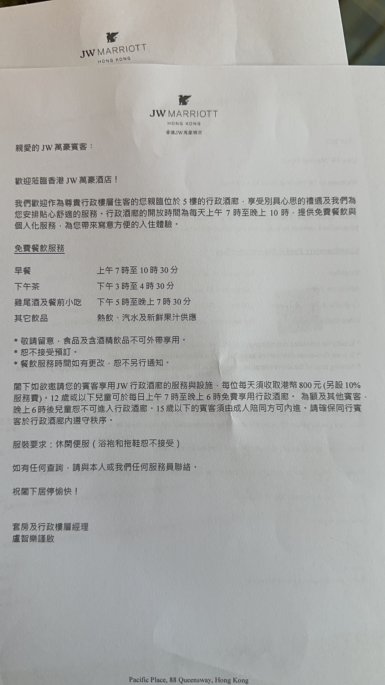
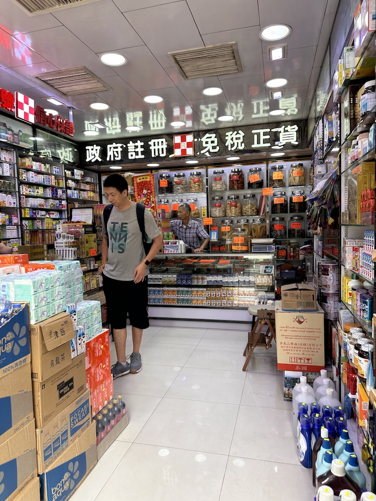
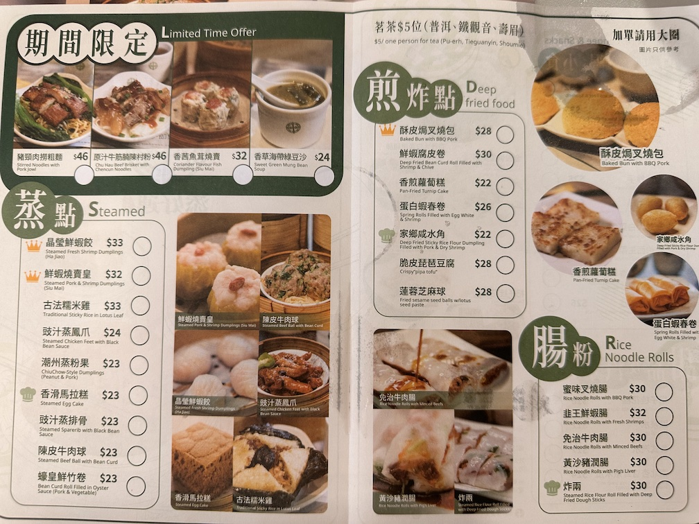

## Foreword

The economy has been very poor in the past two years, and regions everywhere are rolling out stimulus policies. The Hong Kong government, in collaboration with several Hong Kong airlines, launched the "[**World of Winners**](https://wow.hongkongairport.com/lang/sc/tickets)" campaign. At the end of April, I happened to win a round-trip ticket from Beijing to Hong Kong, so a trip to Hong Kong was naturally put on the agenda.

## Exit & Entry Permit for Hong Kong and Macau

This was my first time applying for a Hong Kong and Macau permit. After searching for some information, I found it only takes three steps:

1. Pre-apply on the [**Beijing Public Security Bureau website**](https://zwfw.gaj.beijing.gov.cn/crjfjj/apply/index). You will receive an SMS once the pre-application is successful.
2. After receiving the SMS with the pre-application query password, log in to the Beijing Public Security Bureau website and schedule an on-site appointment.
3. Bring your ID card. If you are not a Beijing resident, you will also need your work residence permit. You can then go to your nearest police station to complete the process.

```alert
type: info
description: You need to wear dark-colored clothing for the on-site appointment, otherwise you will be asked to put on the extremely ugly dark shirt provided by the police station.
```

## Overview of Hong Kong's Geographic Areas

The Hong Kong Special Administrative Region consists of four main areas: Hong Kong Island, Kowloon Peninsula, the New Territories, and the Outlying Islands. Below is an introduction to each major area and its sub-areas:

1. Hong Kong Island: The commercial, political, and cultural center of Hong Kong, including sub-areas such as Central and Western District, Wan Chai District, Eastern District, Southern District, and Yau Tsim Mong District.
2. Kowloon Peninsula: Hong Kong's bustling commercial area, including sub-areas such as Yau Ma Tei, Mong Kok, and Tsim Sha Tsui.
3. New Territories: The northern and eastern parts of Hong Kong, including sub-areas such as Yuen Long, Tuen Mun, Tai Po, Sha Tin, and Kwai Tsing.
4. Outlying Islands: Hong Kong's island archipelago, including sub-areas such as Tai O, Cheung Chau, and Chek Lap Kok.

## Transportation

Since the ticket was won, I only needed to pay the fuel surcharge and taxes. The amount fluctuates based on policy and exchange rates. This time, the additional cost I paid was approximately 616 RMB.
I also looked up flights from Beijing to Hong Kong on June 9. The cheapest was China Eastern Airlines, priced at just over 600 RMB including taxes. So in effect, this trip saved me about 600 RMB on airfare.

Hong Kong has a variety of local public transportation options, including:

1. MTR (Mass Transit Railway): The MTR system covers Hong Kong Island, Kowloon, and the New Territories, and is one of the most convenient means of transportation in Hong Kong. Fares depend on the distance traveled — for example, from Tsim Sha Tsui to Admiralty Station, a one-stop MTR ride, costs about 10 HKD when paying with Alipay.
2. Public Buses: Several bus companies operate across every corner of Hong Kong, making buses one of the most commonly used forms of transport. Fares generally range from 4 to 20 HKD depending on distance. They are the cheapest option from the airport to the city.
3. Trams: Two tram lines operate in the North Point and Western District areas of Hong Kong. Trams are one of the city's oldest forms of transportation, with a fare of 2.6 HKD.
4. Taxis: Hong Kong taxis come in two types — red taxis and green taxis — covering all areas of Hong Kong. The flag-fall fare for red taxis is 24 HKD, while for green taxis it is 20 HKD.

## Payment

I brought my China Merchants Bank (CMB) Hong Kong card and my CMB Global VISA card. Before departure, we also exchanged 1000 HKD at a CMB branch in Beijing just in case.

In practice, I found that many places in Hong Kong accept Alipay and WeChat Pay. When checking into the hotel, I used my VISA card. Some travel guides I had read mentioned Octopus cards, but I didn't get one. At one point I found that the ferry required an Octopus card, so I had to take the MTR instead. Overall, Alipay + credit card is sufficient for the vast majority of payment scenarios.

## Accommodation

We arrived in Hong Kong in the evening on the first day, so booking an upscale hotel didn't seem worthwhile. For the first night, I booked the Hotel Panorama in Hong Kong on Agoda for about 600 RMB. After that, we chose the JW Marriott under Marriott International. The lowest price on the official website was around 2800 RMB without breakfast. On Taobao, I found third-party booking services for about 2700 RMB that also came with Platinum member benefits, including access to the executive lounge.

_JW Marriott swimming pool_

_JW Executive Lounge schedule_

Regarding deposits (called "deposit" or "按金" in Hong Kong), the amount varies depending on the hotel. The refund timeline differs from mainland China — in the mainland, deposits are refunded almost instantly after checkout, but in Hong Kong, it takes an estimated 2 weeks to 1 month to get the deposit back.

## Communication

Search for "overseas data" on Alipay and purchase a plan that suits your needs. For short visits, there's no need to get a local Hong Kong SIM card. The data plan activates automatically upon entering Hong Kong. Note that the plan period is calculated by calendar day, not by hours from activation. For example, if you buy a 2-day plan and activate it at 10 PM on the first day upon arrival in Hong Kong, it will expire after midnight on the second day, not at 10 PM on the third day.

## Attractions

Hong Kong is not a large place, and it has relatively fewer attractions compared to first-tier cities in mainland China. Our schedule was fairly tight, so we skipped Disneyland and the Ocean Park, only stopping by Victoria Harbour for a photo. We then visited some shopping malls near Tsim Sha Tsui and Central, and finally strolled around Goldfish Street and Langham Place near Mong Kok. Overall, the trip was quite relaxed and laid-back. There are many "medicine stores" (药房) on Hong Kong streets — while they are called pharmacies, they essentially function as duty-free convenience stores. Those with an `Rx` marking are authorized by the Hong Kong government, so be sure to check. In the image below, the `Rx` marking is located between "政府注册" (Government Registered) and "免税正货" (Duty-Free Genuine Goods).

_The Rx marking on a pharmacy_

## Food

Before departure, a colleague recommended two restaurants: **Hua Sao Cafe** (华嫂冰室) and **Tang Palace Gathering** (唐宫小聚), with per-person costs of around 70 HKD and 200 HKD respectively. We visited both for breakfast and lunch. For other meals, we followed our usual mainland habit — checking rankings on Dianping (大众点评). We ended up waiting in line for 40 minutes at **Tim Ho Wan** (添好运) for Hong Kong-style dim sum. The prices were similar to those in first-tier mainland cities.

_Tim Ho Wan restaurant menu_

## Personal Shopping & Customs

I used to see a lot of Hong Kong personal shoppers on my WeChat Moments, and I had the impression that customs checks were very strict. But in reality, I didn't experience anything like that. Departing from Beijing, there were two security checks: airport security and customs. On the return trip from Hong Kong, there was only a customs check — a machine scanned my luggage with no body search, and after landing in Beijing there was no security check at all. This left me a bit puzzled — wouldn't smuggling be quite easy? I almost regretted not buying something expensive, haha.

## Conclusion

Let me share my impressions of Hong Kong. It is truly an international metropolis with many foreigners. Hotel staff tend to communicate in English first. The streets in the city center are quite narrow, surrounded by towering skyscrapers, and GPS navigation can be imprecise in such environments — it's easy to get lost when navigating between shopping malls. There are many luxury brands, transportation is convenient, and the infrastructure is well-developed.

However, because Hong Kong urbanized early, some of its facilities feel quite outdated.

Additionally, near the Mong Kok MTR exit, I saw some homeless people and a large number of foreign women spending the night on pedestrian footbridges. Housing prices in Hong Kong are simply too high, so many people at the bottom of society here live a rather difficult life. I have never seen such scenes in Beijing or Shanghai.

Every place has its bright side as well as its dark corners. Hong Kong is no exception.
