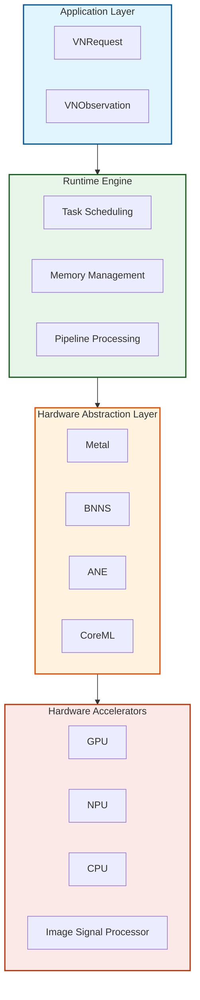
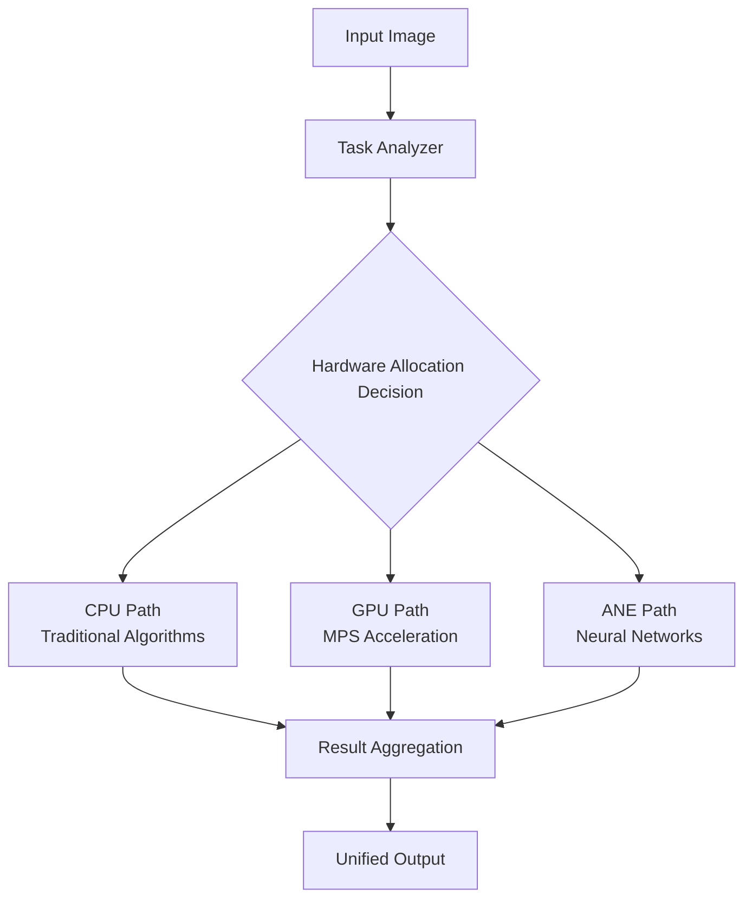
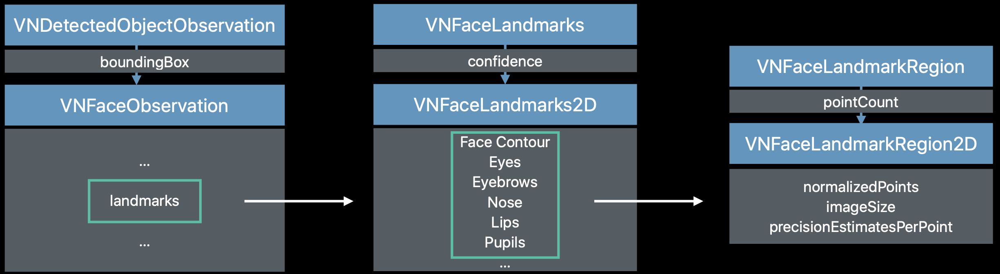
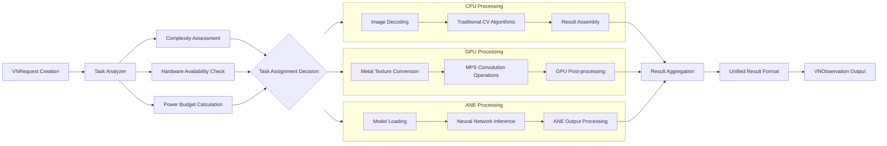

## Overview
The Vision framework represents Apple's systemic innovation in mobile computer vision. By deeply integrating hardware acceleration, machine learning optimization, and modern Swift concurrency programming, it provides developers with high-performance visual processing capabilities. This article explores its architectural design, core capabilities, and best practices in depth.
```alert
type: success
description: "Vision empowers developers to focus on the application logic of computer vision without worrying about underlying hardware optimization and performance tuning." —— Apple WWDC 2023
```

## 1. Architectural Design Philosophy
### 1.1 Layered Architecture Design
The Vision framework adopts a carefully designed layered architecture, where each layer targets specific optimization goals:

Design Advantages:
- Hardware Agnosticism: Upper-layer applications don't need to care about underlying hardware implementation
- Automatic Optimization: The runtime automatically selects the optimal hardware path
- Resource Management: System-level memory and power management

According to Apple's official data, this layered design delivers 3-5x performance improvements over traditional approaches, while reducing power consumption by up to 80%.
### 1.2 Unified Request Processing Model
Vision employs a unified request-response model where all vision tasks are implemented through VNRequest subclasses:

```swift
// Unified request interface design
protocol VisionRequest {
    associatedtype ResultType: VNObservation
    var results: [ResultType]? { get }
    func perform(on image: CVPixelBuffer) async throws
}
```
Advantages of the Unified Model:

- Consistent API: All vision tasks use the same programming pattern
- Composability: Multiple requests can be composed into a processing pipeline
- Extensibility: New vision algorithms can be easily supported

### 1.3 Multi-Hardware Collaborative Architecture


Intelligent Scheduling Mechanisms:
- Real-time Hardware Status Monitoring: Dynamically adjusts based on current hardware load
- Energy-Efficient Scheduling: Strikes the optimal balance between performance and power consumption
- Failover Mechanism: Automatically switches to a backup path when a hardware component is unavailable

## 2. Core Capabilities in Detail
### 2.1 Face Detection and Analysis
Vision's face detection supports precise detection of 106 facial landmark points, with an accuracy exceeding 98%:




```swift
struct FaceAnalyzer {
    static func detectFaces(in image: UIImage) async throws -> [VNFaceObservation] {
        guard let cgImage = image.cgImage else {
            throw VisionError.invalidImage
        }

        let request = VNDetectFaceRectanglesRequest()
        let handler = VNImageRequestHandler(cgImage: cgImage)

        let observations = try await handler.perform([request])
        return observations.compactMap { $0 as? VNFaceObservation }
    }

    static func analyzeFaceLandmarks(_ face: VNFaceObservation) async {
        guard let landmarks = face.landmarks else { return }

        await withTaskGroup(of: Void.self) { group in
            if let leftEye = landmarks.leftEye {
                group.addTask { await analyzeEyeRegion(leftEye) }
            }
            if let rightEye = landmarks.rightEye {
                group.addTask { await analyzeEyeRegion(rightEye) }
            }
        }
    }
}
```

### 2.2 Text Recognition and Processing
Vision's text recognition supports 60+ languages, with accuracy reaching 99%+ in standard scenarios:
```swift
class TextRecognizer {
    private let recognitionLevel: VNRequestTextRecognitionLevel
    private let usesLanguageCorrection: Bool

    init(level: VNRequestTextRecognitionLevel = .accurate,
         languageCorrection: Bool = true) {
        self.recognitionLevel = level
        self.usesLanguageCorrection = languageCorrection
    }

    func recognizeText(in image: UIImage) async throws -> [VNRecognizedTextObservation] {
        let request = VNRecognizeTextRequest()
        request.recognitionLevel = recognitionLevel
        request.usesLanguageCorrection = usesLanguageCorrection

        let handler = VNImageRequestHandler(cgImage: image.cgImage!)
        let results = try await handler.perform([request])

        return results.compactMap { $0 as? VNRecognizedTextObservation }
    }

    func extractStrings(from observations: [VNRecognizedTextObservation]) async -> [String] {
        await observations.concurrentMap { observation in
            guard let topCandidate = observation.topCandidates(1).first else { return nil }
            return topCandidate.string
        }.compactMap { $0 }
    }
}
```
Innovative Features:
- Real-time Language Detection: Automatically identifies the language type of text
- Format Preservation: Retains the original format and layout information of the text
- Confidence Scoring: Provides a confidence score for each recognition result

### 2.3 Human Body Pose Recognition
WWDC 2023 introduced enhanced human body pose recognition, supporting precise tracking of 33 joint points:
```swift
struct BodyPoseAnalyzer {
    static func detectPoses(in image: UIImage) async throws -> [VNHumanBodyPoseObservation] {
        let request = VNDetectHumanBodyPoseRequest()
        let handler = VNImageRequestHandler(cgImage: image.cgImage!)

        let results = try await handler.perform([request])
        return results.compactMap { $0 as? VNHumanBodyPoseObservation }
    }

    static func analyzeJoint(_ observation: VNHumanBodyPoseObservation,
                            jointName: VNHumanBodyPoseObservation.JointName) async throws -> VNRecognizedPoint? {
        let points = try await observation.recognizedPoints(.all)
        return points[jointName]
    }
}
```
Application Scenarios:
- Fitness Apps: Real-time motion correction and rep counting
- Medical Rehabilitation: Patient mobility assessment
- Gaming Interaction: Body-controlled gameplay experiences

## 3. Modern Concurrency Programming Practices
### 3.1 Async/Await Integration Pattern
The modern concurrency programming model introduced in iOS 16 integrates seamlessly with the Vision framework:
```swift
actor VisionProcessor {
    private var activeTasks: [String: Task<Void, Never>] = [:]

    func processImage(_ image: UIImage, requestTypes: [VNRequest.Type]) async {
        await withTaskGroup(of: Void.self) { group in
            for requestType in requestTypes {
                group.addTask {
                    await self.processWithRequestType(requestType, image: image)
                }
            }
        }
    }

    private func processWithRequestType(_ requestType: VNRequest.Type, image: UIImage) async {
        do {
            let request = requestType.init()
            let handler = VNImageRequestHandler(cgImage: image.cgImage!)
            let results = try await handler.perform([request])
            await handleResults(results, for: requestType)
        } catch {
            await handleError(error, for: requestType)
        }
    }
}
```
Concurrency Advantages:
- Thread Safety: Actors protect shared state
- Resource Control: Limits the number of concurrent tasks
- Error Isolation: A single task failure does not affect other tasks

## 4. Performance Optimization System
### 4.1 Memory Management Optimization
The Vision framework's zero-copy architecture significantly reduces memory overhead:
```swift
class ZeroCopyImageProcessor {
    private let bufferPool: CVPixelBufferPool

    init() {
        self.bufferPool = createOptimizedBufferPool()
    }

    private func createOptimizedBufferPool() -> CVPixelBufferPool {
        let poolAttributes: [String: Any] = [
            kCVPixelBufferPoolMinimumBufferCountKey: 12,
            kCVPixelBufferPoolMaximumBufferAgeKey: 2.0
        ]

        let bufferAttributes: [String: Any] = [
            kCVPixelBufferMetalCompatibilityKey: true,
            kCVPixelBufferPixelFormatTypeKey: kCVPixelFormatType_32BGRA,
            kCVPixelBufferWidthKey: 1920,
            kCVPixelBufferHeightKey: 1080
        ]

        var pool: CVPixelBufferPool?
        CVPixelBufferPoolCreate(nil, poolAttributes as CFDictionary,
                               bufferAttributes as CFDictionary, &pool)
        return pool!
    }

    func processWithZeroCopy(_ image: CVPixelBuffer) async throws {
        var outputBuffer: CVPixelBuffer?
        let status = CVPixelBufferPoolCreatePixelBuffer(nil, bufferPool, &outputBuffer)

        guard status == kCVReturnSuccess, let output = outputBuffer else {
            throw VisionError.bufferAllocationFailed
        }

        try await processImage(output, reuseBuffer: true)
    }
}
```
Memory Optimization Effects:
- Memory Usage Reduction: 60% less memory consumption compared to traditional approaches
- Allocation Speed Improvement: 5x faster memory allocation
- Reduced Fragmentation: The buffer pool mechanism minimizes fragmentation

### 4.2 Hardware-Aware Scheduling

Scheduling Strategies:
- Complexity Assessment: Selects hardware based on image content complexity
- Energy-Efficient Priority: Intelligently balances performance and power consumption
- Real-time Adjustment: Dynamically adjusts strategy based on device state

## 5. Advanced Features and Techniques
### 5.1 Custom Request Chains
Vision supports creating complex processing pipelines:
```swift
struct VisionPipeline {
    static func createCustomPipeline() -> [VNRequest] {
        [
            VNDetectFaceRectanglesRequest(),
            VNDetectFaceLandmarksRequest(),
            VNClassifyFaceExpressionsRequest(),
            VNGenerateFaceSegmentationRequest()
        ]
    }

    static func executePipeline(on image: UIImage) async throws -> PipelineResults {
        let requests = createCustomPipeline()
        let handler = VNImageRequestHandler(cgImage: image.cgImage!)

        let results = try await handler.perform(requests)
        return processPipelineResults(results)
    }
}
```
Pipeline Advantages:
- Intermediate Result Reuse: Avoids redundant computation
- Dependency Management: Automatically handles dependencies between requests
- Performance Optimization: Optimizes holistically rather than per-request

### 5.2 Real-time Video Processing
```swift
class VideoVisionProcessor: @unchecked Sendable {
    private let sequenceHandler = VNSequenceRequestHandler()
    private var previousObservations: [VNObservation] = []

    func processVideoFrame(_ frame: CVPixelBuffer,
                          timestamp: CMTime) async throws -> [VNObservation] {
        let requests = [
            VNDetectHumanBodyPoseRequest(),
            VNDetectHandPoseRequest(),
            VNTrackObjectRequest(previousObservations: previousObservations)
        ]

        try sequenceHandler.perform(requests, on: frame)

        let currentObservations = requests.flatMap { $0.results ?? [] }
        previousObservations = currentObservations

        return currentObservations
    }
}
```
Real-time Processing Features:
- Inter-frame Consistency: Maintains detection consistency across multiple frames
- Timestamp Synchronization: Precise timestamp management
- Resource Prediction: Anticipates resource requirements based on frame rate

## 6. Error Handling and Debugging
### 6.1 Robust Error Handling
```swift
enum VisionError: Error, LocalizedError {
    case invalidImage
    case hardwareUnavailable
    case insufficientResources
    case processingTimeout

    var errorDescription: String? {
        switch self {
        case .invalidImage:
            return "The provided image format is invalid or cannot be processed"
        case .hardwareUnavailable:
            return "The requested hardware accelerator is currently unavailable"
        case .insufficientResources:
            return "Insufficient system resources to complete processing"
        case .processingTimeout:
            return "The processing operation timed out"
        }
    }
}

struct VisionTask<T: Sendable>: Sendable {
    let operation: () async throws -> T
    let timeout: TimeInterval

    func execute() async throws -> T {
        try await withThrowingTaskGroup(of: T.self) { group in
            group.addTask(operation: operation)
            group.addTask {
                try await Task.sleep(nanoseconds: UInt64(timeout * 1_000_000_000))
                throw VisionError.processingTimeout
            }
            return try await group.next()!
        }
    }
}
```

## 7. Best Practices Summary
### 7.1 Performance Optimization Checklist
1. Memory Management: Use CVPixelBufferPool to reuse memory
2. Hardware Selection: Choose the optimal hardware path based on task type
3. Batch Processing: Use VNSequenceRequestHandler for video stream processing
4. Resource Monitoring: Monitor system load and temperature in real time

### 7.2 Code Quality Recommendations
```swift
// Use actors to protect shared state
actor VisionStateManager {
    private var processingCount = 0
    private let maxConcurrentTasks: Int

    init(maxConcurrentTasks: Int = 3) {
        self.maxConcurrentTasks = maxConcurrentTasks
    }

    func canProcessNewTask() -> Bool {
        processingCount < maxConcurrentTasks
    }

    func taskStarted() {
        processingCount += 1
    }

    func taskCompleted() {
        processingCount -= 1
    }
}

// Use Sendable to ensure thread safety
struct VisionConfiguration: Sendable {
    let preferredHardware: VisionHardware
    let qualityLevel: VisionQuality
    let timeoutInterval: TimeInterval
}
```

## Conclusion
The Vision framework provides iOS developers with powerful computer vision capabilities through deep system-level optimization and a modern API design. By understanding its architectural principles, mastering async/await programming patterns, and implementing effective performance optimization measures, developers can build both efficient and stable vision applications.

Key Takeaways:
- Deep hardware integration is the key to performance advantages
- Modern concurrency programming greatly simplifies asynchronous processing
- System-level optimization requires comprehensive consideration of memory, power, and performance
- Error handling and resource management are critical for production environments


https://developer.apple.com/documentation/samplecode/#Vision
