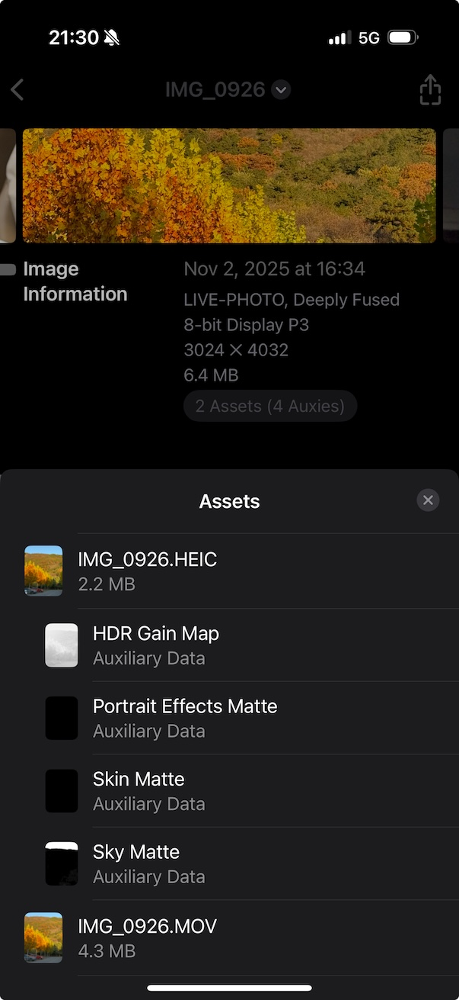

## Overview
This article systematically examines the file structure, metadata conventions, and conversion paths between Google Motion Photo and Apple Live Photo, presenting a two-way conversion scheme aimed at "as lossless as possible," covering retention strategies and capability boundaries for auxiliary data such as HDR GainMap and Depth, along with a reusable Swift package and sample code.
```alert
type: success
description: Bottom line up front: the conversion process is not lossless. When the image contains information that cannot be carried by the destination format, that information will be lost. This is especially true in the UltraHDR (JPEG + GainMap) → HEIC (GainMap) and HEIC (Depth) → Motion Photo directions. The recommended strategy is to prioritize preserving the original container and associated image data. When cross-container conversion is unavoidable, use a combined approach of "metadata and video remuxing without re-encoding + minimal still image re-encoding/extraction + explicit pairing/offset metadata writes."
```

## 1. Format Structure Quick Reference
### 1.1 Google Motion Photo (JPEG Container + Trailing MP4)
- Still image: `JPEG` primary image
- Optional gain map: `JPEG` HDR GainMap (UltraHDR)
- Motion video: `MP4` byte stream appended directly to the tail of the JPEG (same file)
- Key XMP (namespace `GCamera`/`GContainer`, varies slightly by device model/version):

| XMP Key | Type | Description |
| --- | --- | --- |
| `GCamera:MotionPhoto` | Integer | `1` indicates motion photo; `0`/absent indicates normal still image |
| `GCamera:MotionPhotoVersion` | Integer | Motion photo file format version |
| `GCamera:MicroVideo` | Integer | Early specification, deprecated. Boolean flag indicating motion picture |
| `GCamera:MicroVideoVersion` | Integer | Early specification, deprecated. MicroVideo metadata version, common value `1` |
| `GCamera:MicroVideoOffset` | Long | Early specification, deprecated. Byte offset of the trailing MP4 |
| `GCamera:MicroVideoPresentationTimestampUs` | Long | Early specification, deprecated. Video frame timestamp aligned with still image (microseconds, can be `-1`) |
| `GContainer:Directory` + `Item:Length` | Struct | Describes semantic items (primary image, gain map, video, etc.) and their lengths |

> As the specification evolved, `GContainer:Directory` with `Item:Length` can help locate the video start position when `MicroVideoOffset` is absent.

Typical Motion Photo XMP segment:
```
<x:xmpmeta xmlns:x="adobe:ns:meta/" x:xmptk="Adobe XMP Core 5.1.0-jc003">
  <rdf:RDF xmlns:rdf="http://www.w3.org/1999/02/22-rdf-syntax-ns#">
    <rdf:Description rdf:about=""
        xmlns:hdrgm="http://ns.adobe.com/hdr-gain-map/1.0/"
        xmlns:Container="http://ns.google.com/photos/1.0/container/"
        xmlns:Item="http://ns.google.com/photos/1.0/container/item/"
        xmlns:GCamera="http://ns.google.com/photos/1.0/camera/"
      hdrgm:Version="1.0"
      GCamera:MotionPhoto="1"
      GCamera:MicroVideoVersion="1"
      GCamera:MicroVideo="1"
      GCamera:MicroVideoOffset="9871716"
      GCamera:MicroVideoPresentationTimestampUs="926668">
      <Container:Directory>
        <rdf:Seq>
          <rdf:li rdf:parseType="Resource">
            <Container:Item
              Item:Semantic="Primary"
              Item:Mime="image/jpeg"/>
          </rdf:li>
          <rdf:li rdf:parseType="Resource">
            <Container:Item
              Item:Semantic="GainMap"
              Item:Mime="image/jpeg"
              Item:Length="243988"/>
          </rdf:li>
          <rdf:li rdf:parseType="Resource">
            <Container:Item
              Item:Semantic="MotionPhoto"
              Item:Mime="video/mp4"
              Item:Length="9871716"/>
          </rdf:li>
        </rdf:Seq>
      </Container:Directory>
    </rdf:Description>
  </rdf:RDF>
</x:xmpmeta>
```

Example HEIC Motion Photo structure


### 1.2 Apple Live Photo (HEIC/JPEG Still + Separate MOV Video)
- Still image: `HEIC` (preferred) or `JPEG`
- Motion video: Separate `MOV` (H.264/HEVC, typically includes audio track)
- Optional Auxiliary: HEIC can carry auxiliary planes such as Depth, Segmentation, GainMap, etc.
- Key pairing identifiers (must match between still and video):
  - `ContentIdentifier` (HEIC: Apple XMP; MOV: QuickTime Metadata)
  - `StillImageTime` (MOV still frame timestamp, typically set to `0`)

Example HEIC Live Photo structure


## 2. Conversion Strategies and Capability Boundaries
### 2.1 Motion Photo → Live Photo
- Video: Directly **remux without re-encoding** to `mov` (container re-wrap).
- Still image: Retaining `JPEG` can directly serve as the Live Photo still (iOS recognizes it); convert to `HEIC` only when truly needed.
- HDR GainMap:
  - If the source is Google UltraHDR (JPEG with embedded GainMap), current general-purpose tools have limited support for automated "JPEG GainMap → HEIC GainMap" migration; it is recommended to keep the JPEG still (sacrificing system-level HDR rendering on iOS), or use experimental libraries for migration (see "Advanced: HDR Migration").
- Auxiliary data (Depth/Semantic Segmentation, etc.): Motion Photo (JPEG container) typically does not carry HEIF-style auxiliary images; migrating to HEIC requires adding auxiliary images (see "Advanced: Auxiliary Migration").

### 2.2 Live Photo → Motion Photo
- Video: `MOV → MP4` **remux without re-encoding**.
- Still image: If `HEIC`, can convert to `JPEG` as the Motion Photo primary image (will lose HEIC-native Auxiliary data such as Depth/GainMap).
- HDR/Depth: Motion Photo (JPEG container) lacks standardized HEIF auxiliary data carriage; after converting to JPEG, HDR GainMap and Depth are typically difficult to preserve "equivalently" (unless migrated to custom XMP/APP segments, which have weak ecosystem support).

## 3. Encapsulation Conversion Tool Swift Package: MotionLiveKit (iOS/macOS)
To facilitate reuse in apps or tools, here we present the design and core implementation of a Swift Package that unifies bidirectional conversion between Live Photo and Motion Photo. Metadata reading/writing uses Exiv2 (C++), bridged to Swift via a C interface; photo library writing uses Photos.framework.

### 3.1 Package Structure
```text
MotionLiveKit/
├─ Package.swift
├─ Sources/
│  └─ MotionLiveKit/
│     ├─ MotionLiveKit.swift            # Public API (Swift)
│     ├─ LivePhotoConverter.swift       # Live Photo direction implementation
│     ├─ MotionPhotoConverter.swift     # Motion Photo direction implementation
│     ├─ PhotosWriter.swift             # Photo library write (iOS/macOS Photos)
│     ├─ FileIO.swift                   # Sandbox/temp files and validation
│     ├─ Exiv2Bridge.h                  # C bridge header (for Swift)
│     ├─ Exiv2Bridge.cpp                # C++ implementation, calls Exiv2
│     └─ include/module.modulemap       # Module map (if needed)
└─ Externals/
   └─ exiv2/                            # Build artifacts or submodules (static lib + headers)
```

### 3.2 Package.swift (Key Points)
```swift
// swift-tools-version: 5.9
import PackageDescription

let package = Package(
    name: "MotionLiveKit",
    platforms: [
        .iOS(.v15), .macOS(.v12)
    ],
    products: [
        .library(name: "MotionLiveKit", targets: ["MotionLiveKit"])
    ],
    targets: [
        .target(
            name: "MotionLiveKit",
            dependencies: [],
            path: "Sources/MotionLiveKit",
            publicHeadersPath: ".",
            cSettings: [
                .headerSearchPath("."),
                .headerSearchPath("../Externals/exiv2/include")
            ],
            cxxSettings: [
                .headerSearchPath("."),
                .headerSearchPath("../Externals/exiv2/include"),
                .define("EXIV2_ENABLE_XMP")
            ],
            linkerSettings: [
                .linkedLibrary("c++"),
                .linkedLibrary("z"),
                .linkedLibrary("iconv"),
                .linkedLibrary("expat"),
                .linkedLibrary("exiv2")
            ]
        )
    ]
)
```

Note: `linkedLibrary("exiv2")` must match the actual integration method (see 3.6).

### 3.3 Public API (Swift)
```swift
public struct MotionLiveKit {
    public enum MLKError: Error {
        case invalidInput
        case metadataReadFailed
        case metadataWriteFailed
        case muxFailed
        case demuxFailed
        case fileIOFailed
        case photoAuthorizationDenied
    }

    public struct LivePhotoPair {
        public let stillURL: URL   // HEIC or JPEG
        public let videoURL: URL   // MOV
        public let contentIdentifier: String
        public init(stillURL: URL, videoURL: URL, contentIdentifier: String) {
            self.stillURL = stillURL
            self.videoURL = videoURL
            self.contentIdentifier = contentIdentifier
        }
    }

    public static func motionToLive(motionJPG: URL, preferHEIC: Bool = false, workDir: URL? = nil) async throws -> LivePhotoPair
    public static func liveToMotion(still: URL, videoMOV: URL, outputJPG: URL) async throws -> URL

    // iOS/macOS: Save to system photo library (requires Photos permission)
    #if canImport(Photos)
    @discardableResult
    public static func saveLiveToPhotos(_ pair: LivePhotoPair) async throws -> String
    #endif
}
```

### 3.4 Conversion Flow and Code Mapping
```mermaid
flowchart LR
    subgraph M[Motion → Live]
        A[Read JPEG XMP\nMicroVideoOffset] --> B[Extract trailing MP4]
        B --> C[AVAssetExport (Passthrough)\nMP4 → MOV]
        A --> D[Still: keep JPEG or convert to HEIC]
        D --> E[Write Apple:ContentIdentifier]
        C --> F[Write MOV:ContentIdentifier/StillImageTime]
        E --- F
    end

    M -->|Reverse conversion flow| L
    L -->|Conversion flow| M

    subgraph L[Live → Motion]
        G[Still HEIC?] -->|Yes| H[Convert to JPEG]
        G -->|No| I[Keep JPEG]
        J[Read MOV tracks] --> K[(Optional) keep MOV]
        K --> L1[Remux to MP4 if needed]
        H --> M1[Write HDR info]
        I --> M1
        L1 --> N[Concatenate JPEG + MP4]
        M1 --> N
        N --> O[Write GCamera XMP: MicroVideoOffset etc.]
    end
```

- Corresponding API/modules:
  - Reading/writing image XMP: `Exiv2Bridge` (C/C++)
  - MOV metadata writing: `writeMOVPairing` (AVFoundation)
  - High-level entry points: `MotionLiveKit.motionToLive`, `MotionLiveKit.liveToMotion`

### 3.5 Key Implementation Details
- Motion → Live:
  - Parse JPEG XMP, read `MicroVideoOffset`; extract trailing MP4 to temporary `motion.mp4`; use AVAssetExport to re-wrap as `motion.mov` (`passthrough` without re-encoding).
  - Still image: keep JPEG directly as the still; if `preferHEIC`, convert to HEIC using `CoreImage + ImageIO` or integrate `libheif` (re-encoding).
  - Write pairing metadata:
    - Write `Apple:ContentIdentifier` to still image (HEIC/JPEG)
    - Write `QuickTime:ContentIdentifier` and `QuickTime:StillImageTime=0` to MOV
  - The above metadata is implemented via Exiv2Bridge (see 3.7).

- Live → Motion:
  - If still is HEIC, convert to JPEG (re-encoding, irreversible);
  - MOV → MP4 re-wrap (without re-encoding);
  - Calculate JPEG byte size, concatenate `JPEG + MP4` to output `motion_photo.jpg`;
  - Write `XMP-GCamera:MotionPhoto=1`, `MicroVideoOffset`, and other keys.

### 3.6 Using Exiv2 on iOS/macOS
Exiv2 is a C++ library. It must be compiled as a static library and distributed with the package, or integrated as a submodule.

- macOS (x86_64/arm64 universal):
  - Use CMake: `cmake -DCMAKE_BUILD_TYPE=Release -DEXIV2_ENABLE_XMP=ON -DEXIV2_BUILD_SHARED_LIBS=OFF ..`, run `make` to obtain `libexiv2.a` and headers.
- iOS (device + simulator):
  - Use a CMake toolchain or Xcode Toolchain to compile one `libexiv2.a` each for `arm64` and `x86_64` (simulator);
  - Merge with `lipo -create` to produce `libexiv2_universal.a`, or use XCFramework:
    - `xcodebuild -create-xcframework -library libexiv2_ios.a -headers include -library libexiv2_sim.a -headers include -output Exiv2.xcframework`
  - In the SPM target `linkerSettings`, use `.linkedFramework("Exiv2")` or introduce the XCFramework via `.binaryTarget` (if using the binary approach).

Dependencies (common): `z`, `iconv`, `expat`. Build flags must match the Exiv2 version; ensure `EXIV2_ENABLE_XMP` is enabled if XMP writing is needed.

### 3.7 Exiv2 Bridge (C Interface Example)
`Exiv2Bridge.h`
```c
#pragma once
#include <stddef.h>
#ifdef __cplusplus
extern "C" {
#endif

// Read GCamera MicroVideoOffset from JPEG; returns -1 on failure
long mlk_read_micro_video_offset(const char* jpg_path);

// Write Apple:ContentIdentifier to JPEG/HEIC (returns 0 on success)
int mlk_write_content_identifier(const char* image_path, const char* uuid_str);

// Write QuickTime:ContentIdentifier and StillImageTime=0 to MOV (returns 0 on success)
int mlk_write_mov_pairing(const char* mov_path, const char* uuid_str, double still_time);

// Write GCamera XMP (MotionPhoto=1, MicroVideoOffset=off)
int mlk_write_motion_xmp(const char* jpg_path, long offset);

#ifdef __cplusplus
}
#endif
```

`Exiv2Bridge.cpp` (Pseudocode Highlights)
```cpp
#include "Exiv2Bridge.h"
#include <exiv2/exiv2.hpp>

long mlk_read_micro_video_offset(const char* jpg_path) {
    try {
        auto image = Exiv2::ImageFactory::open(jpg_path);
        image->readMetadata();
        auto& xmp = image->xmpData();
        auto it = xmp.findKey(Exiv2::XmpKey("Xmp.GCamera.MicroVideoOffset"));
        if (it != xmp.end()) return it->toLong();
    } catch (...) {}
    return -1;
}

int mlk_write_content_identifier(const char* image_path, const char* uuid_str) {
    try {
        auto image = Exiv2::ImageFactory::open(image_path);
        image->readMetadata();
        auto& xmp = image->xmpData();
        xmp["Xmp.apple.ContentIdentifier"] = std::string(uuid_str);
        image->setXmpData(xmp);
        image->writeMetadata();
        return 0;
    } catch (...) { return -1; }
}

int mlk_write_mov_pairing(const char* mov_path, const char* uuid_str, double still_time) {
    // Exiv2 has limited write support for MOV/QuickTime; options:
    // 1) Use Exiv2 QuickTime support (if the version has it).
    // 2) Fall back to AVFoundation for metadata writing (handled on the Swift side).
    return -1;
}

int mlk_write_motion_xmp(const char* jpg_path, long offset) {
    try {
        auto image = Exiv2::ImageFactory::open(jpg_path);
        image->readMetadata();
        auto& xmp = image->xmpData();
        xmp["Xmp.GCamera.MotionPhoto"] = 1;
        xmp["Xmp.GCamera.MotionPhotoVersion"] = 1;
        xmp["Xmp.GCamera.MicroVideo"] = 1;
        xmp["Xmp.GCamera.MicroVideoVersion"] = 1;
        xmp["Xmp.GCamera.MicroVideoOffset"] = static_cast<int64_t>(offset);
        image->setXmpData(xmp);
        image->writeMetadata();
        return 0;
    } catch (...) { return -1; }
}
```

Note: For MOV metadata, it is recommended to use AVFoundation on the Swift side to write QuickTime UserData/Metadata (more reliable).

### 3.8 Swift Side: Pairing Metadata and Re-wrap Without Re-encoding
Writing MOV pairing (AVFoundation):
```swift
import AVFoundation

func writeMOVPairing(movURL: URL, contentID: String, stillTime: Double = 0) throws {
    let asset = AVURLAsset(url: movURL)
    let metadata = [
        AVMutableMetadataItem().apply { item in
            item.keySpace = .quickTimeMetadata
            item.key = AVMetadataKey.quickTimeMetadataKeyContentIdentifier as (NSCopying & NSObjectProtocol)?
            item.value = contentID as (NSCopying & NSObjectProtocol)?
        },
        AVMutableMetadataItem().apply { item in
            item.keySpace = .quickTimeMetadata
            item.key = AVMetadataKey.quickTimeMetadataKeyStillImageTime as (NSCopying & NSObjectProtocol)?
            item.value = stillTime as NSNumber
        }
    ]
    let outURL = movURL.deletingLastPathComponent().appendingPathComponent("tmp_\(UUID().uuidString).mov")
    let exporter = try AVAssetExportSession(asset: asset, presetName: AVAssetExportPresetPassthrough).unwrap()
    exporter.outputURL = outURL
    exporter.outputFileType = .mov
    exporter.metadata = metadata
    let group = DispatchGroup(); group.enter()
    exporter.exportAsynchronously { group.leave() }
    group.wait()
    guard exporter.status == .completed else { throw MotionLiveKit.MLKError.metadataWriteFailed }
    try FileManager.default.replaceItemAt(movURL, withItemAt: outURL)
}

extension Optional {
    func unwrap() throws -> Wrapped { if let v = self { return v }; throw MotionLiveKit.MLKError.invalidInput }
}

extension AVMutableMetadataItem {
    func apply(_ block: (AVMutableMetadataItem) -> Void) -> AVMutableMetadataItem { block(self); return self }
}
```

### 3.9 Photo Library Write and Sandbox Paths
Writing Live Photo to the system photo library (iOS/macOS Photos):
```swift
import Photos

public func saveLiveToPhotos(_ pair: MotionLiveKit.LivePhotoPair) async throws -> String {
    let status = await PHPhotoLibrary.requestAuthorization(for: .readWrite)
    guard status == .authorized || status == .limited else { throw MotionLiveKit.MLKError.photoAuthorizationDenied }
    var localIdentifier = ""
    try await PHPhotoLibrary.shared().performChanges {
        let req = PHAssetCreationRequest.forAsset()
        let stillRes = PHAssetResourceCreationOptions()
        let vidRes = PHAssetResourceCreationOptions()
        req.addResource(with: .photo, fileURL: pair.stillURL, options: stillRes)
        req.addResource(with: .pairedVideo, fileURL: pair.videoURL, options: vidRes)
        localIdentifier = req.placeholderForCreatedAsset?.localIdentifier ?? ""
    }
    return localIdentifier
}
```

Sandbox persistent directory:
```swift
let documents = FileManager.default.urls(for: .documentDirectory, in: .userDomainMask).first!
// For example: documents.appendingPathComponent("MotionOutputs")
```

### 3.10 Usage Examples
Motion Photo → Live Photo:
```swift
let input = URL(fileURLWithPath: "/path/to/input_motion.jpg")
let pair = try await MotionLiveKit.motionToLive(motionJPG: input, preferHEIC: false)
#if canImport(Photos)
let id = try await MotionLiveKit.saveLiveToPhotos(pair)
print("saved: \(id)")
#endif
```

Live Photo → Motion Photo:
```swift
let still = URL(fileURLWithPath: "/path/to/IMG_0001.HEIC")
let mov = URL(fileURLWithPath: "/path/to/IMG_0001.MOV")
let out = FileManager.default.urls(for: .documentDirectory, in: .userDomainMask).first!.appendingPathComponent("motion_photo.jpg")
let jpg = try await MotionLiveKit.liveToMotion(still: still, videoMOV: mov, outputJPG: out)
print("motion photo at: \(jpg.path)")
```

### 3.11 Notes and Boundaries
- Exiv2's write support for MOV varies by version; it is recommended to write MOV metadata using AVFoundation, and image (JPEG/HEIC) metadata using Exiv2.
- HEIC→JPEG conversion involves re-encoding; to be as "lossless" as possible, retain the original JPEG/HEIC container and only re-wrap the video track and metadata.
- HDR GainMap/Depth migration requires additional work: the package above provides a basic metadata path, but does not include cross-container reconstruction of GainMap/Depth.

## 4. Advanced: HDR GainMap and Auxiliary Migration
### 4.1 UltraHDR (JPEG+GainMap) → HEIC(GainMap)
- Current status: General-purpose desktop tools have limited support for "reading GainMap from the JPEG APP segment and converting it to HEIF Auxiliary:GainMap."
- Recommendations:
  - If the target is iOS viewing, prefer native HEIC (if the source already has it);
  - If the source is only UltraHDR JPEG and needs to be migrated to HEIC for HDR rendering, evaluate experimental conversion based on `libultrahdr`/vendor tools, verifying visual quality and system compatibility;
  - When not feasible, use an SDR primary image (preserving subjective fidelity) plus keep a backup of the original file.

### 4.2 HEIC Auxiliary (Depth/Segmentation/Disparity)
- Extraction and injection typically require HEIF-level operations (libheif/proprietary SDKs).
- Common auxiliary types (examples, naming may vary by device):
  - Depth: `urn:mpeg:hevc:2015:auxid:depth`
  - Disparity: `urn:mpeg:hevc:2015:auxid:depthmap`
  - Alpha/Segmentation: `urn:mpeg:hevc:2015:auxid:alpha`
- When converting to Motion Photo (JPEG), it is difficult to equivalently carry these auxiliary data planes; if required by the workflow, they are typically stored as **separate sidecar files** or custom XMP blocks (ecosystem support is weak).

## 5. Verification and Troubleshooting
### 5.1 Common Issues
- iOS cannot recognize Live Photo: check if `ContentIdentifier` matches on both ends; check if `StillImageTime` exists and is a numeric value.
- Pixel cannot recognize Motion Photo: confirm that `MicroVideoOffset` is the exact byte size of the JPEG before concatenation; ensure the video is placed after the JPEG.
- Color/contrast changes after HEIC conversion: caused by re-encoding and color space/ICC configuration; pay attention to preserving the source ICC profile and choose high-quality and high-bit-depth encoding paths.
- HDR not working: this is a GainMap migration capability gap, or the target system does not support that carriage method.

## 6. Compatibility Recommendations
- Prioritize the minimal-change path of "container re-wrap + metadata rewrite."
- Before cross-ecosystem migration, verify on the target device/app (Photos app, Google Photos, social platforms).
- Keep a complete backup of the original file; log every conversion step and verify checksums in production.

## 7. Conclusion
The key to converting between Motion Photo and Live Photo lies in understanding the file structures, encoding strategies, and metadata contracts of the two ecosystems. By following the principle of "prioritize no re-encoding, write metadata precisely, keep original files," a balance between compatibility and image quality can be achieved. For advanced features such as HDR GainMap and Depth, business requirements and toolchain capabilities must be weighed together, preserving raw data and iterating on migration solutions progressively.

## Appendix: References
- https://developer.android.com/media/platform/motion-photo-format
- https://developer.apple.com/videos/play/wwdc2016/501/
