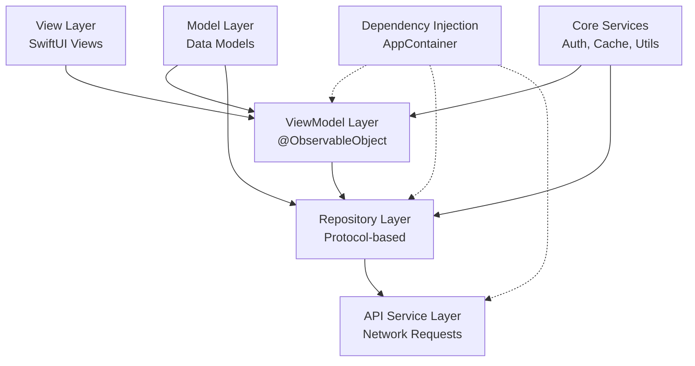
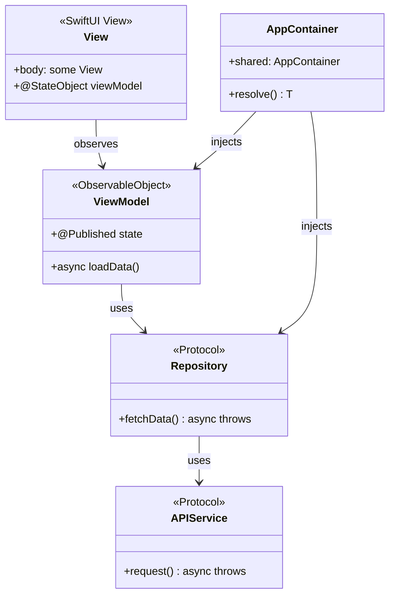
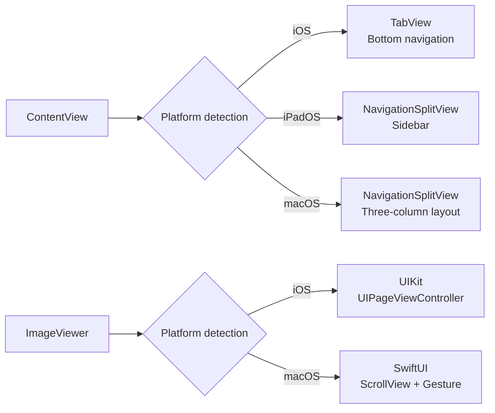
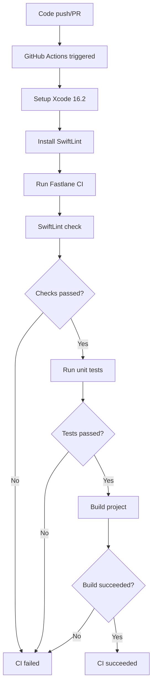
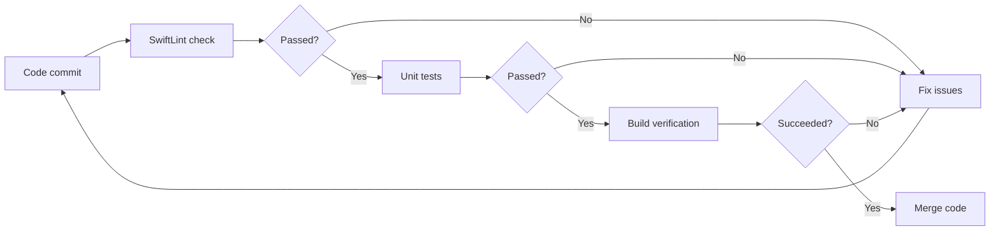

## About SMTH BBS

**SMTH BBS** ([www.newsmth.net](https://www.newsmth.net)) is one of the earliest BBS forums in China, originating from Tsinghua University with over 20 years of history. As a renowned tech community, it brings together a large number of technology enthusiasts, researchers, and industry experts, covering discussions on technology, academia, lifestyle, and more.

SMTH BBS is well known for its high-quality technical discussions and vibrant community atmosphere, making it an important platform for developers and tech professionals to gain knowledge and exchange experience.

```alert
type: success
description: This article delves into the technical implementation of a multi-platform SMTH BBS client (iOS / iPadOS / macOS) built with SwiftUI, covering software engineering architecture design, SwiftUI best practices, and multi-platform adaptation strategies. It is based on practical development experience from the [Smth project](https://github.com/bitnpc/Smth).
```

## Project Background

As a long-time user of SMTH BBS, I frequently browse forum content on mobile devices. However, when using existing clients from the App Store, I found several issues:

- **Poor user experience**: Outdated interface design, sluggish interactions, and too many ads
- **Incomplete features**: Missing common features such as browsing history and font settings
- **Infrequent updates**: Many apps are rarely updated and fail to support new system features
- **Lack of multi-platform support**: No macOS version available for desktop use

Based on these pain points, I decided to develop a modern SMTH BBS client from scratch, using the latest SwiftUI framework, supporting iOS, iPadOS, and macOS platforms, and delivering a better user experience.

## Project Source Code

**Project URL**: [https://github.com/bitnpc/Smth](https://github.com/bitnpc/Smth)

This project is open source under the MIT license. Stars and forks are welcome. If you are also a SMTH BBS user or interested in SwiftUI multi-platform development, feel free to contribute.

## Table of Contents

1. [Project Overview](#project-overview)
2. [Software Engineering Architecture](#software-engineering-architecture)
3. [SwiftUI Practices and Considerations](#swiftui-practices-and-considerations)
4. [Multi-Platform Adaptation Strategy](#multi-platform-adaptation-strategy)
5. [Code Quality Assurance and CI/CD](#code-quality-assurance-and-cicd)
6. [Summary and Outlook](#summary-and-outlook)

---

## Project Overview

**Smth** is a modern forum client built with SwiftUI, supporting iOS, iPadOS, and macOS. The project adopts the **MVVM** architecture pattern, achieving clear separation of concerns and a highly testable code structure.

### Core Features

- Hot topic browsing (waterfall layout + paginated loading)
- Board navigation and topic details
- Image viewer (supports multi-image swiping and zooming)
- User login and personal profile
- Favorites management, message center, search functionality
- Local caching (browsing history, drafts)

---

## Software Engineering Architecture

Good architecture design is the foundation of a successful project. The Smth project adopts a layered architecture pattern, with clear separation from the UI layer to the data layer, ensuring code maintainability and extensibility.

### 1. Architecture Overview

The project adopts a layered architecture where each layer has clear responsibilities:



### 2. MVVM Architecture Breakdown

#### 2.1 Architecture Layers

**MVVM (Model-View-ViewModel)** is the core architecture pattern of the project, with each layer having the following responsibilities:

| Layer | Responsibility | Example |
|-------|---------------|---------|
| **View** | UI rendering, user interaction | `HomeView`, `TopicRowView` |
| **ViewModel** | Business logic, state management | `TopicListViewModel`, `FavoritesViewModel` |
| **Model** | Data models | `Topic`, `Article`, `Board` |
| **Repository** | Data access abstraction | `TopicRepository`, `MessageRepository` |
| **Service** | Network requests, business services | `APIService`, `BrowsingHistoryStore` |

#### 2.2 ViewModel Implementation Example

Using `TopicListViewModel` as an example, here is the core MVVM implementation:

```swift
// App/Modules/Home/ViewModels/TopicListViewModel.swift
@MainActor
final class TopicListViewModel: ObservableObject {
    @Published private(set) var topics: [Topic] = []
    @Published private(set) var isLoadingPage = false
    @Published private(set) var isRefreshing = false
    @Published private(set) var errorMessage: String?

    private let repository: TopicRepositoryProtocol
    private var paginationState = PaginationState<Topic>()

    init(repository: TopicRepositoryProtocol = AppContainer.shared.resolve(TopicRepositoryProtocol.self)) {
        self.repository = repository
    }

    func loadInitialIfNeeded() async {
        if topics.isEmpty {
            await loadInitialPage()
        }
    }

    func loadNextPageIfNeeded(currentItem item: Topic?) {
        guard let item else { return }
        let thresholdIndex = topics.index(topics.endIndex, offsetBy: -5, limitedBy: topics.startIndex) ?? topics.startIndex
        if topics.firstIndex(where: { $0.id == item.id }) == thresholdIndex {
            Task { await loadNextPage() }
        }
    }

    private func loadPage() async {
        guard let nextPage = paginationState.startLoadingNextPage() else { return }
        do {
            let newItems = try await repository.fetchTopics(in: boardID, page: nextPage, pageSize: pageSize)
            paginationState.completeLoading(with: newItems, pageSize: pageSize)
            topics = paginationState.items
        } catch {
            errorMessage = error.localizedDescription
        }
    }
}
```

**Design highlights:**

1. **@MainActor guarantees thread safety**: All UI updates execute on the main thread
2. **@Published properties drive the UI**: SwiftUI automatically responds to state changes
3. **Dependency injection**: Repositories are injected via `AppContainer`, making testing easier
4. **Error handling**: Exceptions are caught and `errorMessage` is updated for the View layer to display

#### 2.3 Repository Pattern

The Repository layer abstracts data access logic and provides a unified interface. The benefits of this design include:

- **Testability**: Easily create Mock Repositories for unit testing
- **Maintainability**: Changing data sources (e.g., switching from API to a local database) only requires modifying the Repository implementation
- **Single responsibility**: Repositories are solely responsible for data fetching, not business logic

```swift
// App/Core/Networking/Repositories/TopicRepository.swift
struct TopicRepository: TopicRepositoryProtocol {
    private let apiService: APIService

    func fetchTopics(in boardID: String, page: Int, pageSize: Int) async throws -> [Topic] {
        let endpoint = APIEndpoint.topicList(boardID: boardID, page: page, pageSize: pageSize).toEndpoint()
        let response: TopicResponse = try await apiService.request(endpoint)
        return response.data.topics
    }
}
```

### 3. Dependency Injection

The project uses a custom dependency injection container `AppContainer` to manage all dependencies in a unified manner:

```swift
// App/Core/Dependency/AppContainer.swift
final class AppContainer: DependencyContainer {
    static let shared = AppContainer()

    private lazy var apiService: APIService = DefaultAPIService()
    private lazy var topicRepository: TopicRepositoryProtocol = TopicRepository(apiService: apiService)

    func resolve<T>(_ type: T.Type) -> T {
        if type == TopicRepositoryProtocol.self {
            return topicRepository as! T
        }
        // ... other dependencies
    }
}
```

**Design advantages:**

- **Singleton pattern**: `AppContainer.shared` ensures a single global instance
- **Lazy initialization**: Uses `lazy var` to create dependencies on demand
- **Type safety**: Dependencies are retrieved via the generic `resolve<T>` method

### 4. Pagination State Management

The project implements a generic pagination state management class `PaginationState` to unify list pagination logic:

```swift
// App/Core/Pagination/PaginationState.swift
struct PaginationState<Item: Identifiable & Hashable> {
    private(set) var items: [Item] = []
    private(set) var currentPage: Int = 0
    private(set) var isLoadingPage = false
    private(set) var canLoadMorePages = true

    mutating func startLoadingNextPage() -> Int? {
        guard !isLoadingPage, canLoadMorePages else { return nil }
        isLoadingPage = true
        currentPage += 1
        return currentPage
    }

    mutating func completeLoading(with newItems: [Item], pageSize: Int) {
        items.append(contentsOf: newItems)
        isLoadingPage = false
        canLoadMorePages = !newItems.isEmpty
    }
}
```

**Core features:**

- **Generic design**: Supports any `Identifiable & Hashable` type
- **Encapsulated state**: Prevents external direct state modification
- **Duplicate load prevention**: Uses `isLoadingPage` flag to prevent concurrent requests

### 5. Architecture Design Diagram



---

## SwiftUI Practices and Considerations

SwiftUI, as Apple's modern UI framework, adopts a declarative programming paradigm that makes UI development more concise and efficient. This section shares practical experiences and considerations from the project.

### 1. Core SwiftUI Features

#### 1.1 Declarative UI

The core idea of SwiftUI is to describe the "state" of the UI rather than the "steps" to build it. This declarative approach makes code more intuitive:

```swift
// App/Modules/Home/HomeView.swift
var body: some View {
    ScrollView {
        LazyVStack(spacing: AppTheme.compactSpacing) {
            ForEach(viewModel.topics) { topic in
                NavigationLink(value: topic) {
                    TopicRowView(topic: topic)
                }
                .onAppear {
                    viewModel.loadNextPageIfNeeded(currentItem: topic)
                }
            }
        }
    }
}
```

**Key points:**

- **LazyVStack**: Lazy loading for better performance
- **onAppear**: Triggers pagination loading
- **Data-driven**: UI automatically responds to changes in `viewModel.topics`

#### 1.2 State Management

SwiftUI provides multiple state management approaches. Choosing the right property wrapper is important:

| Property Wrapper | Purpose | Use Case |
|-----------------|---------|----------|
| `@State` | View-internal state | Temporary UI state (e.g., selected item) |
| `@StateObject` | View-owned ObservableObject | ViewModel lifecycle tied to view |
| `@ObservedObject` | Externally passed ObservableObject | Shared ViewModel |
| `@EnvironmentObject` | Environment object | Global state (e.g., login status) |
| `@Environment` | Environment values | System settings (e.g., color scheme) |

**Best practices:**

```swift
// App/Modules/Home/HomeView.swift
struct HomeView: View {
    @EnvironmentObject private var browsingHistory: BrowsingHistoryStore
    @Environment(\.colorScheme) private var colorScheme
    @StateObject private var viewModel = NaviTopicListViewModel()
    @State private var selectedIndex: Int = 0
}
```

- **@StateObject**: Used to create and own a ViewModel
- **@EnvironmentObject**: Used to share global state
- **@Environment**: Used to access system environment values

#### 1.3 Custom ViewModifier

Reusable styles are implemented through ViewModifiers to maintain UI consistency:

```swift
// App/Core/Utils/AppTheme.swift
extension View {
    func smthScaffoldBackground() -> some View {
        modifier(ScaffoldBackgroundModifier())
    }

    func smthSurfaceBackground(subdued: Bool = false) -> some View {
        modifier(SurfaceBackgroundModifier(subdued: subdued))
    }
}
```

**Advantages:**

- **Code reuse**: Unified application styles
- **Easy to maintain**: Style changes only require updating the ViewModifier
- **Chainable calls**: `.smthScaffoldBackground()` is concise and elegant

### 2. SwiftUI Considerations

#### 2.1 Performance Optimization

**List performance optimization**

❌ **Incorrect**: Using `VStack` to render large amounts of data
```swift
VStack {
    ForEach(items) { item in
        ItemView(item: item)
    }
}
```

✅ **Correct**: Using `LazyVStack` or `List`
```swift
LazyVStack {
    ForEach(items) { item in
        ItemView(item: item)
    }
}
```

**View reconstruction optimization**

❌ **Incorrect**: Creating complex objects in `body`
```swift
var body: some View {
    let expensiveData = computeExpensiveData()
    return Text(expensiveData)
}
```

✅ **Correct**: Using `@State` to cache computed results
```swift
@State private var expensiveData: String = ""

var body: some View {
    Text(expensiveData)
        .onAppear {
            expensiveData = computeExpensiveData()
        }
}
```

#### 2.2 Async Operations

When handling asynchronous operations in SwiftUI, use `Task` and `async/await`:

```swift
// App/Modules/Home/HomeView.swift
.onAppear {
    Task {
        await navigationViewModel.loadNavigationsIfNeeded()
    }
}
```

**Considerations:**

- Use `Task { }` to start async tasks in Views
- ViewModel methods should be marked as `async`
- Use `@MainActor` to ensure UI updates happen on the main thread

#### 2.3 Conditional Compilation

SwiftUI supports platform-specific code using `#if os()`:

```swift
// App/Components/ImageViewer.swift
var body: some View {
    #if os(iOS)
    ImageViewerUIKit(images: images, initialIndex: initialIndex, isPresented: $isPresented)
    #else
    ImageViewerSwiftUI(images: images, initialIndex: initialIndex, isPresented: $isPresented)
    #endif
}
```

### 3. Component-Based Design

The project breaks the UI into reusable components, each with a single responsibility:

```swift
// App/Modules/Home/TopicRowView.swift
struct TopicRowView: View {
    let topic: Topic
    let isVisited: Bool

    var body: some View {
        VStack(alignment: .leading, spacing: 5) {
            Text(topic.subject)
                .font(.headline)
            // ... other UI elements
        }
        .background(AppTheme.surfaceBackground(for: colorScheme))
    }
}
```

**Design principles:**

- **Single responsibility**: Each component handles one function
- **Reusability**: Parameter configuration adapts to different scenarios
- **Accessibility**: `.accessibilityLabel` added for VoiceOver support

---

## Multi-Platform Adaptation Strategy

Multi-platform support is an important requirement for modern application development. The Smth project supports iOS, iPadOS, and macOS platforms with a single codebase, maintaining code uniformity while fully leveraging each platform's native features.

### 1. Key Differences Between iOS and macOS

| Feature | iOS | macOS |
|---------|-----|-------|
| **Navigation** | TabView bottom navigation | NavigationSplitView sidebar |
| **Interaction** | Touch gestures | Mouse + keyboard |
| **Window management** | Full-screen app | Multi-window support |
| **Image viewer** | UIKit (smooth gestures) | SwiftUI (mouse adapted) |
| **Sheet presentation** | Bottom sheet | Standalone window |
| **Toolbar** | Navigation bar | Menu bar + toolbar |

### 2. Adaptation Implementation

#### 2.1 Navigation Structure Adaptation

The project selects different navigation approaches based on the platform in `ContentView`:

```swift
// App/ContentView.swift
var body: some View {
    Group {
        #if os(macOS)
        macSidebarLayout
        #else
        if horizontalSizeClass == .compact {
            tabLayout
        } else {
            sidebarLayout
        }
        #endif
    }
}
```

**iOS implementation (TabView):**

```swift
// App/ContentView.swift
private var tabLayout: some View {
    TabView(selection: $selection) {
        NavigationStack {
            HomeView()
        }
        .tabItem { Label("Home", systemImage: "house") }
        // ... other tabs
    }
}
```

**macOS implementation (NavigationSplitView):**

```swift
// App/ContentView.swift
#if os(macOS)
private var macSidebarLayout: some View {
    NavigationSplitView(columnVisibility: $columnVisibility) {
        macSidebar.frame(minWidth: 240, idealWidth: 280)
    } content: {
        macContentStack.frame(minWidth: 300, idealWidth: 380)
    } detail: {
        macDetailPlaceholder.frame(minWidth: 500, idealWidth: 600)
    }
}
#endif
```

**Design highlights:**

- **Three-column layout**: Sidebar + content list + detail view
- **Responsive widths**: Column widths controlled via `minWidth/idealWidth/maxWidth`
- **State synchronization**: Data automatically refreshes when login state changes

#### 2.2 Image Viewer Adaptation

Since iOS and macOS have different interaction patterns, the project implements two versions of the image viewer:

**iOS (UIKit implementation):**

```swift
// App/Components/ImageViewer.swift
#if os(iOS)
private struct ImageViewerUIKit: UIViewControllerRepresentable {
    func makeUIViewController(context: Context) -> ImagePageViewController {
        ImagePageViewController(images: images, initialIndex: initialIndex)
    }
}
#endif
```

**macOS (SwiftUI implementation):**

```swift
// App/Components/ImageViewer.swift
#if !os(iOS)
private struct ImageViewerSwiftUI: View {
    @State private var currentIndex: Int
    @State private var scale: CGFloat = 1.0

    var body: some View {
        ScrollView([.horizontal, .vertical]) {
            CachedAsyncImage(url: URL(string: images[currentIndex]))
                .scaleEffect(scale)
        }
        .gesture(MagnificationGesture())
    }
}
#endif
```

**Differences explained:**

- **iOS**: Uses `UIPageViewController` for smooth swipe transitions with better gesture experience
- **macOS**: Uses SwiftUI's `ScrollView` + `MagnificationGesture`, adapted for mouse interaction

#### 2.3 Sheet Presentation Adaptation

**iOS (bottom sheet):**

```swift
// App/Modules/Home/HomeView.swift
#if os(iOS)
.sheet(isPresented: $showProfileView) {
    ProfileView()
        .presentationDetents([.large])
}
#endif
```

**macOS (standalone window):**

```swift
// App/Modules/Home/HomeView.swift
#elseif os(macOS)
.sheet(isPresented: $showProfileView) {
    ProfileView()
        .frame(minWidth: 600, minHeight: 500)
}
#endif
```

### 3. Adaptation Strategy Summary



**Core principles:**

1. **Conditional compilation**: Use `#if os()` to differentiate platform code
2. **Unified interface**: Keep ViewModel and Repository layers platform-agnostic
3. **Platform characteristics**: Fully leverage each platform's native experience
4. **Responsive layout**: Use `horizontalSizeClass` to adapt to different screen sizes

---

## Code Quality Assurance and CI/CD

Code quality is key to long-term project maintenance. The Smth project uses **SwiftLint** for code style checks and **GitHub Actions CI/CD** automation to ensure code quality and continuous integration.

### 1. SwiftLint Code Style Checks

#### 1.1 Configuration

The project uses SwiftLint for code style checks, configured in `swiftlint.yml`:

```yaml
disabled_rules:
  - identifier_name
  - trailing_whitespace

included:
  - App
  - SmthTests

line_length:
  warning: 140
  error: 180

function_body_length:
  warning: 175
  error: 200

cyclomatic_complexity:
  warning: 20
  error: 25
```

**Configuration highlights:**

- **Disabled rules**: `identifier_name` (allows more flexible naming), `trailing_whitespace` (handled by the editor)
- **Scope**: Only checks `App` and `SmthTests` directories
- **Line length**: Warning at 140 characters, error at 180 characters
- **Complexity control**: Function body length and cyclomatic complexity have clear limits

#### 1.2 Usage

**Local checks:**

```bash
swiftlint --config swiftlint.yml
swiftlint --fix --config swiftlint.yml  # Auto-fix
```

**Fastlane integration:**

```ruby
lane :lint do
  sh("swiftlint --config swiftlint.yml")
end
```

### 2. GitHub Actions CI/CD

#### 2.1 CI Workflow Configuration

The project uses GitHub Actions for continuous integration:

```yaml
name: CI

on:
  push:
    branches: [main, master, develop]
  pull_request:

jobs:
  build-and-test:
    runs-on: macos-14
    steps:
      - uses: actions/checkout@v4
      - uses: maxim-lobanov/setup-xcode@v1
        with:
          xcode-version: '16.2'
      - name: Install SwiftLint
        run: brew install swiftlint
      - name: Run Fastlane CI
        run: bundle exec fastlane ci
```

**Workflow features:**

1. **Trigger conditions**: Push to main branches or create a Pull Request
2. **Runtime environment**: macOS 14, fixed Xcode 16.2
3. **Cache optimization**: Caches Swift Package Manager dependencies
4. **Automation**: Automatically installs dependencies and runs checks

#### 2.2 CI Flow Details



#### 2.3 Fastlane CI Lane

Fastlane's `ci` lane integrates code checks and testing:

```ruby
lane :ci do
  lint
  tests
end
```

**Execution order:**

1. **Lint check**: Runs SwiftLint code style checks
2. **Unit tests**: Executes all unit tests

### 3. Unit Testing Practices

#### 3.1 Test Architecture

The project uses the XCTest framework for unit testing, with testability achieved through dependency injection:

**ViewModel test example:**

```swift
// SmthTests/TopicListViewModelTests.swift
final class TopicListViewModelTests: XCTestCase {
    func testInitialLoadFetchesTopics() async throws {
        let repository = StubTopicRepository(
            hotTopics: { page, size in Self.mockTopics(page: page, pageSize: size) }
        )
        let viewModel = TopicListViewModel(repository: repository)

        await viewModel.loadInitialIfNeeded()

        XCTAssertEqual(viewModel.topics.count, 20)
        XCTAssertFalse(viewModel.isLoadingPage)
    }
}
```

**Testing highlights:**

- **Dependency injection**: Uses `StubTopicRepository` to mock the data source
- **Async testing**: Uses `async/await` to test asynchronous operations
- **Isolation**: Each test is independent and relies on no external state

#### 3.2 Test Coverage

Current test coverage in the project:

| Module | Test File | Coverage |
|--------|-----------|----------|
| **ViewModel** | `TopicListViewModelTests.swift` | Pagination loading, initial load |
| **Store** | `BrowsingHistoryStoreTests.swift` | Browsing history, deduplication |
| **Settings** | `FontSettingsTests.swift` | Font settings persistence |

**Areas to improve:**

- Repository layer tests
- API Service tests
- UI component tests (Snapshot Testing)

### 4. CI/CD Best Practices

#### 4.1 Local Verification

Before committing code, it is recommended to run the CI flow locally:

```bash
bundle install
bundle exec fastlane ci
```

#### 4.2 Pre-Commit Checklist

- [ ] Run `swiftlint` to ensure code style compliance
- [ ] Run unit tests to ensure functionality
- [ ] Check for compiler warnings
- [ ] Ensure all tests pass

#### 4.3 CI Failure Handling

When CI fails:

1. **Check the logs**: GitHub Actions displays detailed error information
2. **Reproduce locally**: Run the same commands locally to reproduce the issue
3. **Fix the issue**: Correct the code or configuration based on the error message
4. **Re-push**: Push the code again after fixing

### 5. Continuous Improvement

#### 5.1 Code Quality Metrics



#### 5.2 Future Optimization Directions

1. **Code coverage**: Integrate code coverage reporting (e.g., Codecov)
2. **Performance testing**: Add performance benchmarks
3. **UI testing**: Use XCUITest for UI automation testing
4. **Automated releases**: Integrate Fastlane automated release pipeline
5. **Security scanning**: Integrate dependency security scanning tools

---

## Summary and Outlook

### Project Highlights

1. **Clean architecture**: MVVM + Repository pattern with clear separation of concerns
2. **Testability**: Dependency injection + Protocol abstraction for easy unit testing
3. **Multi-platform support**: One codebase, three platforms, native experience
4. **Performance optimization**: LazyVStack, pagination loading, image caching
5. **User experience**: Dark mode, font settings, browsing history
6. **Code quality**: SwiftLint + CI/CD automation

### Tech Stack

- **UI framework**: SwiftUI
- **Architecture pattern**: MVVM + Repository
- **Networking library**: Alamofire
- **HTML parsing**: SwiftSoup
- **Dependency management**: Swift Package Manager
- **Code style**: SwiftLint
- **CI/CD**: GitHub Actions + Fastlane

### Future Improvements

1. **Feature completion**: Posting, commenting, liking and other interactive features
2. **Performance optimization**: Further optimize list scrolling performance
3. **Test coverage**: Add UI tests and integration tests
4. **User experience**: Push notifications, offline reading, etc.
5. **Code quality**: Improve test coverage, integrate more automation tools

---

## References

- [SwiftUI Official Documentation](https://developer.apple.com/documentation/swiftui)
- [MVVM Architecture Pattern](https://developer.apple.com/documentation/swiftui/managing-model-data-in-your-app)
- [Multi-Platform Adaptation Guide](https://developer.apple.com/documentation/swiftui/building-apps-for-multiple-platforms)
- [SwiftLint Documentation](https://github.com/realm/SwiftLint)
- [GitHub Actions Documentation](https://docs.github.com/en/actions)

---

