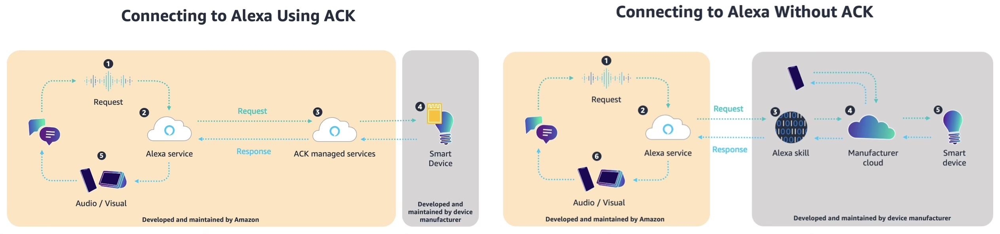
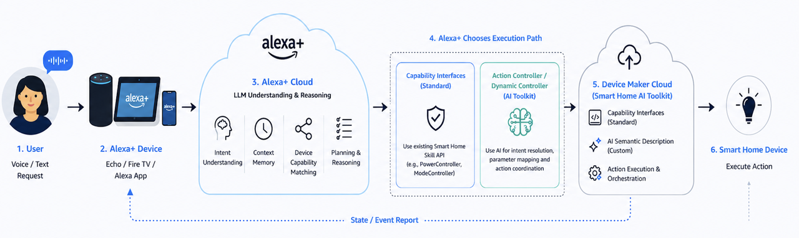

## Introduction: The Alexa device-onboarding landscape

Alexa is Amazon's voice-assistant ecosystem. Since launching with the Echo in 2014, it has long existed as a "voice-command engine" — the user speaks a fixed wake word and intent, and Alexa identifies the intent through a pre-trained NLU (natural-language understanding) model and routes it to the corresponding Skill. In February 2025, Amazon announced the next-generation **Alexa+** platform, releasing a Preview at the July 2026 Partner Summit. Its core shift can be summarized as:

> From "voice-command engine" to "AI Agent platform"

This plays out across three layers:

1. **Runtime upgrade**: The traditional NLU + intent-routing engine is augmented or replaced by an LLM. Previously, a trained semantic-understanding model (non-LLM) performed predefined intent recognition; now an LLM performs dynamic intent recognition, extending the range of understood utterances without retraining and redeploying a model.
2. **Capability exposure upgrade**: Device capabilities are no longer limited to predefined Capability Interfaces (e.g. PowerController / ModeController); device-specific features can be freely declared through an AI semantic-description layer.
3. **Ecosystem expansion**: Through the MCP (Model Context Protocol), third-party providers can offer tools to Alexa+, and Alexa+ can in turn invoke external Agent capabilities.

From a device-onboarding perspective, the Alexa platform offers integration options across two orthogonal layers:

- **Hardware / firmware layer**: ACK (Alexa Connect Kit), Amazon's fully-managed device-connectivity solution — no self-built cloud required.
- **Software / capability layer**: Add-ons, where the manufacturer declares device capabilities for Alexa to recognize and control. Alexa+ adds the Smart Home AI Toolkit here and introduces two new paths: Category SDK and MCP Toolkit.

This article follows the main line "onboarding options → declare capabilities → generate control UI → interaction & sync → publish" to lay out the full device-onboarding flow on the Alexa platform, calling out which parts are new in Alexa+.

## 1. Onboarding options at a glance

### 1.1 Hardware layer: ACK (Alexa Connect Kit)

ACK is Amazon's fully-managed device-onboarding solution: no self-built cloud, no Skill development needed to get a device onto Alexa. ACK comes in three hardware forms:

| Form                   | Architecture                                                        | Best for                                                 |
| ---------------------- | ------------------------------------------------------------------- | -------------------------------------------------------- |
| **ACK Module**         | Two chips: ACK Module (Amazon firmware, Wi-Fi + certs, UART) + HMCU | Vendors with an existing MCU (coffee makers, microwaves) |
| **ACK SDK**            | Single chip: the vendor SoC runs ACK SDK source                     | BoM-conscious light/socket OEMs                          |
| **ACK SDK for Matter** | Single chip running Matter over Wi-Fi                               | Vendors also pursuing Matter certification               |



Amazon's role in ACK is comprehensive:

- Provides the full device-side SDK; the vendor implements only device-level callbacks (e.g. "energize relay / drive motor")
- Manages the Wi-Fi stack, security certificates, and OTA client
- Hosts the cloud (device registration, OTA, metrics, provisioning)
- One-time per-device fee; no self-built cloud required

ACK is part of Alexa's traditional device-onboarding story, not within the Alexa+ for Builders Add-on scope, but it is the most hands-off hardware path and is commonly paired with the software-layer Smart Home Add-on.

### 1.2 Software / capability layer: three Add-on paths

Alexa+ for Builders currently offers three Add-on integration paths, all in Preview:

| Path                      | Positioning                                            | Audience             | Delivery time                                |
| ------------------------- | ------------------------------------------------------ | -------------------- | -------------------------------------------- |
| **Smart Home AI Toolkit** | Device-specific capabilities → AI semantic description | Device manufacturers | hours                                        |
| **Category SDK**          | Six lifestyle-service categories → SPI/MCP contracts   | Service providers    | weeks                                        |
| **MCP Toolkit**           | Generic MCP service access → tool invocation           | Any provider         | Existing MCP Server needs only minor changes |

> Note: the official blog calls the Smart Home AI Toolkit the _AI-powered smart home developer toolkit_; the developer docs use both interchangeably. This article sticks with "Smart Home AI Toolkit" for brevity.

The shared trait across all three paths is an **AI-first integration paradigm** — developers onboard via **natural-language description, uploading spec documents**, or exposing a standard **MCP Server**, rather than hand-writing interface code.

Section 2 follows the Smart Home AI Toolkit as the main thread for capability declaration; Category SDK and MCP Toolkit are expanded in Section 6.

## 2. Declaring device capabilities

Whichever software-layer path you take, the first step is declaring to Alexa "what capabilities this device has." This is done via `Discover.Response`.

### 2.1 Declaration structure: Discover.Response

When Alexa looks for a device, it sends a Discovery request to the vendor's skill endpoint (e.g. an AWS Lambda). The vendor returns a `Discover.Response` declaring the device's capabilities and parameters in `endpoints[].capabilities[]`. Example, a camera (excerpt):

```json
{
  "endpointId": "camera-001",
  "friendlyName": "Living Room Camera",
  "displayCategories": ["CAMERA"],
  "capabilities": [
    {
      "type": "AlexaInterface",
      "interface": "Alexa.PowerController",
      "version": "3",
      "properties": {
        "supported": [{ "name": "powerState" }],
        "retrievable": true,
        "proactivelyReported": true
      }
    },
    {
      "type": "AlexaInterface",
      "interface": "Alexa.CameraStreamController",
      "version": "3",
      "cameraStreamConfigurations": [
        {
          "protocols": ["RTSP"],
          "resolutions": [{ "width": 1920, "height": 1080 }],
          "authorizationType": "BASIC",
          "videoCodec": "H264"
        }
      ]
    },
    {
      "type": "AlexaInterface",
      "interface": "Alexa.RangeController",
      "version": "3",
      "instance": "Camera.Pan",
      "capabilityResources": {
        "friendlyNames": [{ "@type": "text", "value": { "text": "Pan", "locale": "en-US" } }]
      },
      "properties": {
        "supported": [{ "name": "rangeValue" }],
        "retrievable": true,
        "proactivelyReported": true
      },
      "configuration": {
        "supportedRange": { "minimumValue": -200, "maximumValue": 200, "precision": 1 }
      }
    }
  ]
}
```

The `capabilities[]` fields that shape the control UI:

| Field                            | What the vendor configures                                                                  |
| -------------------------------- | ------------------------------------------------------------------------------------------- |
| `displayCategories`              | Device category (drives page skeleton layout)                                               |
| `interface`                      | Which capability protocol the device supports (drives control type, see 2.2)                |
| `instance`                       | Discriminator for multiple instances of the same interface (yields independent controls)    |
| `properties.supported`           | Which property names this interface reports (the control's data source)                     |
| `properties.retrievable`         | Whether Alexa may send ReportState to query current values (affects initial value, see 4.1) |
| `properties.proactivelyReported` | Whether property changes send a ChangeReport (affects live refresh, see 4.1)                |
| `configuration`                  | Capability parameters, e.g. `supportedRange` (min/max/precision), `presets`                 |
| `capabilityResources`            | Control resources, including icon name and i18n                                             |
| `cameraStreamConfigurations`     | Video stream parameters (protocol/resolution/codec/auth)                                    |
| `nonControllable: true`          | Read-only flag → the control only displays, no operation                                    |

### 2.2 Standard capabilities: Capability Interfaces

The `interface` field determines the control type. Alexa Smart Home predefines a set of Capability Interfaces, each mapping to a set of protocol directives and a UI control:

| interface                      | Directive set                    | Inferred control                    |
| ------------------------------ | -------------------------------- | ----------------------------------- |
| `Alexa.PowerController`        | TurnOn / TurnOff                 | Switch                              |
| `Alexa.BrightnessController`   | SetBrightness / AdjustBrightness | Brightness slider                   |
| `Alexa.RangeController`        | SetRangeValue / AdjustRangeValue | Numeric slider                      |
| `Alexa.ModeController`         | SetMode / AdjustMode             | Mode selector                       |
| `Alexa.ToggleController`       | TurnOn / TurnOff                 | Switch (with instance name)         |
| `Alexa.LockController`         | Lock / Unlock                    | Lock control (unlock requires auth) |
| `Alexa.CameraStreamController` | InitializeCameraStreams          | Video player                        |
| `Alexa.MotionSensor`           | Reports detectionState only      | Detection badge                     |
| `Alexa.EndpointHealth`         | Reports connectivity only        | Online/offline indicator            |

The control type is decided by `interface` (a black box; the mapping algorithm is not public); the control's parameters (range/step/name/presets) are set via `configuration` / `capabilityResources` (vendor-configurable). The same `interface` may be declared multiple times, distinguished by `instance`, each generating an **independent control**.

The limitation of standard interfaces: device-specific features (a washer's 30 cycle modes, a camera's night-vision / human-tracking) can't be expressed through predefined interfaces. Under the traditional approach, vendors could only shoehorn these into `ModeController` or `RangeController` as a fallback, losing semantic information.

### 2.3 Custom capabilities (new in Alexa+): Smart Home AI Toolkit

The Smart Home AI Toolkit is Alexa+'s most important addition for the smart home, specifically solving the "custom features that standard interfaces can't cover" problem. It overlays an **AI semantic-description layer** on top of standard capabilities:

```plaintext
Traditional: device → Capability Interfaces (standard only) → Alexa NLU (predefined Skill Interaction Model)
New:         device → Capability Interfaces + AI semantic layer → Alexa+ LLM (NL matching + parameter reasoning)
```

#### Two new controller types

The toolkit introduces two new controller types, carrying "previously unexposable" custom capabilities:

| Controller                                         | Purpose                                          | Examples                                                 |
| -------------------------------------------------- | ------------------------------------------------ | -------------------------------------------------------- |
| **Action Controller** (`Alexa.ActionController`)   | Trigger a named action or scene                  | "Start bedtime mode", "Rinse filter", "Begin deep clean" |
| **Dynamic Controller** (`Alexa.DynamicController`) | Expose a device's dynamic parameter combinations | Washer mode (wash + temp + spin), AC vent angle          |

The key innovation: the **semantic space of these two controllers is not predefined**. The vendor freely declares semantics, parameter aliases, and natural-language labels in the capability description, and Alexa+'s LLM handles natural-language matching and parameter reasoning at runtime.



Example — a smart washer declares a device-specific capability:

```json
{
  "type": "AlexaInterface",
  "interface": "Alexa.ActionController",
  "capabilityResources": {
    "friendlyNames": [{ "type": "asset", "value": { "assetId": "Alexa.Setting.WashCycle" } }]
  },
  "semantics": {
    "deviceActions": {
      "name": "cold_water_enzyme",
      "description": "A cold-water wash cycle that activates enzyme-based stain removal, suitable for delicate fabrics that require cold washing",
      "parameters": {
        "temperature": "cold",
        "enzyme_activation": true,
        "spin_speed": "medium"
      },
      "keywords": ["cold wash", "enzyme", "stain removal", "gentle clean", "delicate"]
    }
  },
  "version": "3"
}
```

Note the `semantics` block — the vendor describes the action's meaning in natural language via `description` and `keywords`, and at runtime Alexa+'s LLM matches a user utterance (e.g. "give it a gentle cold wash") to this action and reasons out the parameters. This is the core expression of an LLM runtime replacing the traditional NLU-trained model.

#### Two ways to declare

The Smart Home AI Toolkit offers two ways to generate semantic capability descriptions inside the Alexa Developer Console:

| Method                   | Description                                                                                                                                                    | Best for                                  |
| ------------------------ | -------------------------------------------------------------------------------------------------------------------------------------------------------------- | ----------------------------------------- |
| **Chat & Build**         | Describe the device's features in natural language (e.g. "pet feeder, can add food, rinse, show level"), and the Agent auto-generates the semantic description | First-time onboarding / rapid prototyping |
| **Upload Specification** | Upload a PDF device spec; the LLM auto-extracts capabilities and fills gaps                                                                                    | Vendors with mature product specs         |

Both produce the same artifact: a **semantic capability description file** (structured JSON/YAML) defining the semantics, parameters, natural-language aliases, and UI hints of device-specific capabilities. This file mounts directly onto an existing Smart Home Add-on and is invoked by Alexa+, **peer** to standard capabilities inside the `capabilities` array (custom interface names look like `Alexa.Custom.AnyCompany.SampleController`).

#### Details worth noting

- **No extra certification**: AI Toolkit-generated capabilities reuse the existing WWA (Works with Alexa) certification scope; new features don't trigger recertification
- **Incremental overlay**: nothing is rebuilt — the vendor retains full control over standard Capability Interfaces; the AI semantic description is purely an additional mounted layer
- **All in-Portal**: everything happens inside the Alexa Developer Console, no local CLI or SDK install
- **First partner brands**: Bosch, Delta, Ecovacs, Eufy, Govee, iRobot, Moen Flo, PetSafe, Pila Energy, SONOFF, TP-Link Tapo, Twinkly, Whirlpool, Yale Home — covering white goods, cleaning, security, and lighting

## 3. Automatic generation of the device control UI

Once capabilities are declared, the device control page in the Alexa App is **generated automatically** — no vendor UI code needed. This is the Alexa Smart Home Catalog Service; the new Smart Home AI Toolkit controllers generate UI the same way.

### Core principle

```plaintext
Vendor declares capabilities (Discover.Response)
   → Alexa maintains a "capability → UI control" mapping table
   → Auto-generates the device control page
```

Three points:

1. The vendor declares capabilities; Alexa maintains the capability→UI mapping table and auto-generates the page
2. The page has no business logic: the UI only "displays state + translates operations into directives"; real execution lives in the vendor's cloud function (e.g. Lambda)
3. State is kept consistent across 3 channels: pull initial value on page open → write new value on user action → proactive push on device change

### Assembly rules

After the renderer reads the endpoint declaration:

```plaintext
capabilities array
   → iterate each interface
   → each interface (with instance) generates one control
   → displayCategories decides page skeleton (category icon / control page format)
   → all controls compose into one page
```

Camera example, assembly result:

```plaintext
Alexa (base)              → no visible control
EndpointHealth            → online/offline indicator
CameraStreamController    → video player
PowerController          → switch
MotionSensor              → detection badge
RangeController(Pan)      → horizontal slider (-200~200)
RangeController(Tilt)     → vertical slider (-50~50)
Custom: NightVision       → AI-generated switch
Custom: HumanTracking     → AI-generated button
```

Resulting UI structure:

```plaintext
┌─────────────────────────────────────────┐
│  ● Online          Living Room Cam  ⚙️  │  ← EndpointHealth + friendlyName
├─────────────────────────────────────────┤
│         ┌─────────────────┐             │
│         │  Stream (RTSP)   │             │  ← CameraStreamController
│         │  1080p / H.264   │             │
│         └─────────────────┘             │
├──────────────────┬──────────────────────┤
│  ◉ Power         │  ⚠ Motion: clear     │  ← PowerController + MotionSensor
├──────────────────┴──────────────────────┤
│  Pan  ◄━━━━━━━━━●━━━━━━━━━► -200~200    │  ← RangeController(Camera.Pan)
│  Tilt ◄━━━━●━━━━━━━━━━━━━━► -50~50      │  ← RangeController(Camera.Tilt)
├─────────────────────────────────────────┤
│  🌙 Night Vision [ON/OFF]  👤 Tracking [Start] │  ← Custom (AI Toolkit-generated)
└─────────────────────────────────────────┘
```

Custom-capability UI is likewise generated by the AI Toolkit's Generate UI feature; the vendor can add/remove/edit UI elements conversationally, and the artifact is peer to standard capabilities.

## 4. Interaction & state sync

Once a control is generated, its interaction behavior is defined by the interface protocol — **no vendor UI logic needed**. Handlers all live in the vendor Lambda; the UI only "renders property values + translates operations into protocol directives." Interaction logic splits into two parts: **state sync** and **event interaction**.

### 4.1 State sync: 3 channels

The sync mechanism between the UI and device state:

1. **Read** (pull initial value on page open): the Alexa App sends `ReportState` → the vendor Lambda returns a `StateReport` (within 8s, properties tagged with namespace + instance) → each control initializes
2. **Write** (set new value on user action): the App sends a directive like `SetRangeValue` (header includes instance) → Lambda invokes the device → returns `Alexa.Response` (context contains the new value) → control updates
3. **Push** (proactive report on device change): device state changes (physical operation / control from another client) → Lambda sends a `ChangeReport` (within 3s, only changed properties) → App pushes → control refreshes

Timing:

```plaintext
① Read · opening the control page (ReportState → StateReport)
App ──ReportState──> Cloud ──> Lambda ──StateReport(within 8s)──> Cloud ──> App
                                                              (controls initialize)

② Write · user action (Directive → Response)
App ──SetRangeValue(instance)──> Cloud ──> Lambda ──> device executes
App <──Response + new state──── Cloud <──Alexa.Response── Lambda
(slider updates to new value)

③ Push · device state change (ChangeReport, may occur anytime)
Device ──state change──> Lambda ──ChangeReport(within 3s)──> Cloud ──push──> App
                                                              (control refreshes live)
```

`properties.retrievable` determines whether an initial value can be pulled (read channel); `properties.proactivelyReported` determines whether live refresh works (push channel) — both flags are set at capability-declaration time.

### 4.2 Event interaction: 3 cases

Events on a control fall into three categories by where they're handled:

| Event domain      | Handling location                     | Examples                                        |
| ----------------- | ------------------------------------- | ----------------------------------------------- |
| **App domain**    | App local                             | Page navigation, tab switching, expand/collapse |
| **Device domain** | Lambda + protocol                     | Motion detected, switch/PTZ state change        |
| **Mixed domain**  | App local confirm → protocol → Lambda | Unlock auth, privacy-mask confirm               |

- **App-domain events (purely local)**: page navigation (home → settings), tab switching, expand/collapse, animations, cache reads — the App's own navigation/UI logic, not through the protocol layer, unrelated to device capabilities.
- **Device-domain events (via protocol)**: device state changes (physical operation / other-client control) → the device side sends a `ChangeReport` → UI refreshes.
- **Mixed-domain events (local confirm first, then protocol)**: operations requiring safety confirmation. The canonical example, a smart-lock unlock:

```plaintext
User says "unlock the front door"
    → App layer: require a 4-digit voice code (local auth, "confirmation for the human")
    → pass → send Alexa.LockController.Unlock directive
    → Lambda layer: verify token permissions (server-side auth, "the real check")
        pass → execute → Alexa.Response + state snapshot
        deny → Alexa.ErrorResponse → UI error
```

Auth is **two-tier**: the App layer does interaction confirmation; the Lambda layer does server-side verification. The camera case is analogous: a second confirmation before privacy mask; PTZ operations are rejected while privacy mode is on.

## 5. Publishing

Once capability declaration and control-UI generation are complete, the device enters the publishing flow:

1. **Listing review**: Amazon reviews the device capabilities, semantic descriptions, and UI to ensure they meet the Alexa UX guidelines
2. **Publish parameters**: AI Toolkit's Chat & Build / Upload Specification, alongside the capability description, also generates the publish parameters, NLU matching corpus, App control-UI config, and i18n copy needed for listing
3. **Certification**: standard capabilities must pass WWA (Works with Alexa) certification; AI Toolkit-added custom capabilities reuse the existing WWA scope, no recertification
4. **Go live**: after approval, the device is listed in the Alexa App and users can discover and control it

## 6. The other paths, expanded

### 6.1 Category SDK

The Category SDK is a standardized onboarding framework for lifestyle-service categories, supporting six categories:

| Category                | Description                      | Path         |
| ----------------------- | -------------------------------- | ------------ |
| Food ordering           | Order food                       | Action (SPI) |
| Home services           | Home services                    | Action (SPI) |
| Local booking           | Book local services & activities | Action (SPI) |
| Restaurant reservations | Book a restaurant                | Action (SPI) |
| Ride booking            | Book rides                       | **MCP only** |
| Ticketing               | Buy event tickets                | Action (SPI) |

The Category SDK offers two sub-paths:

- **Category Action Add-on**: connects vendor APIs via SPI (Service Provider Interface) contracts — low latency, strong resilience, suited to partners with established APIs
- **Category MCP Add-on**: connects the vendor's MCP server via the standard MCP protocol — suited to partners who already have an MCP server or prefer that standard

Note that Ride booking can only go through MCP, not SPI. The developer workflow is: implement/deploy (Alexa AI CLI + AWS) → test (web simulator + E2E device testing) → launch (certification → publish → monitor).

### 6.2 MCP Toolkit

The MCP Toolkit lets any provider connect an existing MCP server to Alexa+, so customers can use those capabilities through voice and visual interactions.

**Architecture**: the vendor deploys an MCP server (exposing tools/resources/prompts) + an Alexa+ MCP Add-on (a bridge between the MCP server and Alexa+, handling protocol translation and capability registration) + an add-on registry (indexing tools; Alexa+ AI reasoning decides when to invoke them) + an Orchestrator (coordinating the experience).

**Transport**: Streamable HTTP (no stdio / WebSocket). It follows the 2025-11-25 MCP spec and supports the MCP Apps extension (rendering interactive UIs inline in the conversation view — maps, multi-step flows, dashboards).

**Onboarding**: via the add-on Agent Skill (agentic onboarding) or the Alexa AI CLI; Alexa+ inspects the MCP server, proposes an integration path, and delivers a simulator-ready package. Tool changes require redeploying with `alexa-ai deploy`.

**Auth: two-tier OAuth 2.0**:

| Tier   | Grant type                  | Purpose                                                                                                                                         | User involved? |
| ------ | --------------------------- | ----------------------------------------------------------------------------------------------------------------------------------------------- | -------------- |
| Tier 1 | `client_credentials`        | Service-level M2M auth, for private MCP servers' registration/health checks, tool discovery (`initialize`, `tools/list`), non-user data queries | No             |
| Tier 2 | `authorization_code` + PKCE | User-level auth & consent, for executing user-specific tools and accessing user resources                                                       | Yes            |

- Tier 1 tokens are short-lived (recommended ≤ 3600s), **no refresh_token** is issued — request a new token on expiry; scope is `mcp:service`
- Tier 2 scope is `mcp:tools` / `mcp:resources`
- Dynamic Client Registration (DCR), OpenID Connect (OIDC), and Step-Up Authorization are not supported
- If auth attributes change server-side, the MCP Add-on must be redeployed (Alexa+ caches values until then)

The MCP Toolkit is currently available in the United States only.

## Conclusion

The core chain of Alexa device onboarding is "declare capabilities → generate control UI → interaction & state sync → publish." The traditional Smart Home mechanisms (Discover.Response, Capability Interfaces, StateReport/ChangeReport) handle standard-capability onboarding, while Alexa+'s Smart Home AI Toolkit extends capability exposure from predefined interfaces to arbitrary custom features via the AI semantic-description layer — Alexa+'s most important increment.

On top of this, the Category SDK extends the same AI Agent framework to lifestyle-service categories, and the MCP Toolkit plugs into the broader AI Agent ecosystem via an open protocol. All three share an AI-first trait: developers replace hand-written interface code with natural language and documents, and the LLM handles intent understanding and parameter reasoning at runtime.

## Appendix A: glossary

| Term                           | Full name / note                                                                                                 |
| ------------------------------ | ---------------------------------------------------------------------------------------------------------------- |
| **ASK**                        | Alexa Skills Kit, Alexa skill development toolkit                                                                |
| **AVS**                        | Alexa Voice Service, service for embedding Alexa into third-party hardware                                       |
| **ACK**                        | Alexa Connect Kit, fully-managed device-onboarding solution with no Skill, no cloud                              |
| **Smart Home Add-on**          | formerly Smart Home Skill, device onboarding via Capability Interfaces                                           |
| **Smart Home AI Toolkit**      | Alexa+ addition, AI-semantic capability exposure (Preview); officially _AI-powered smart home developer toolkit_ |
| **Action Controller**          | Smart Home AI Toolkit's new controller, triggers named actions                                                   |
| **Dynamic Controller**         | Smart Home AI Toolkit's new controller, exposes dynamic parameter combinations                                   |
| **Category SDK**               | Standardized onboarding framework for six categories (Preview)                                                   |
| **MCP**                        | Model Context Protocol, open standard for AI models to interact with external tools                              |
| **MCP Toolkit**                | Alexa+'s generic service-access toolkit based on MCP                                                             |
| **Capability Interfaces**      | Alexa Smart Home's standard capability interface system                                                          |
| **WWA**                        | Works with Alexa, device-control certification                                                                   |
| **SPI**                        | Service Provider Interface, the Category SDK's contract interface                                                |
| **Discover.Response**          | Capability declaration structure returned during device discovery                                                |
| **StateReport / ChangeReport** | The two state-reporting messages: full query / incremental push                                                  |

## Appendix B: Official documentation index

Official Amazon docs referenced in this article, listed in the order the topics appear, for deeper reading per section:

| Document                                       | Link                                                                                               |
| ---------------------------------------------- | -------------------------------------------------------------------------------------------------- |
| Alexa Developer Portal                         | <https://developer.amazon.com/en-US/alexa>                                                         |
| ASK entry point                                | <https://developer.amazon.com/en-US/alexa/alexa-skills-kit>                                        |
| Smart Home development options                 | <https://developer.amazon.com/en-US/docs/alexa/smarthome/development-options.html>                 |
| Capability Interfaces complete index           | <https://developer.amazon.com/en-US/docs/alexa/device-apis/alexa-interface.html>                   |
| ACK overview                                   | <https://developer.amazon.com/en-US/docs/alexa/ack/>                                               |
| Alexa+ for Builders home                       | <https://developer.amazon.com/en-US/docs/alexaplus/add-ons/>                                       |
| Alexa+ MCP Toolkit overview                    | <https://developer.amazon.com/en-US/docs/alexaplus/add-ons/mcp-toolkit-overview.html>              |
| Alexa+ MCP authentication (two-tier OAuth 2.0) | <https://developer.amazon.com/en-US/docs/alexaplus/add-ons/mcp-toolkit-authentication.html>        |
| Category SDK overview                          | <https://developer.amazon.com/en-US/docs/alexaplus/add-ons/overview-category-sdk.html>             |
| 2026 Partner Summit blog post                  | <https://developer.amazon.com/zh/alexaplus/blogs/2026/07/alexa-plus-new-ways-to-build-experiences> |
| AI-native SDKs for Alexa+ (2025.2)             | <https://developer.amazon.com/en-US/blogs/alexa/alexa-skills-kit/2025/02/new-alexa-announce-blog>  |
| Alexa+ official announcement                   | <https://www.aboutamazon.com/news/devices/new-alexa-tech-generative-artificial-intelligence>       |
