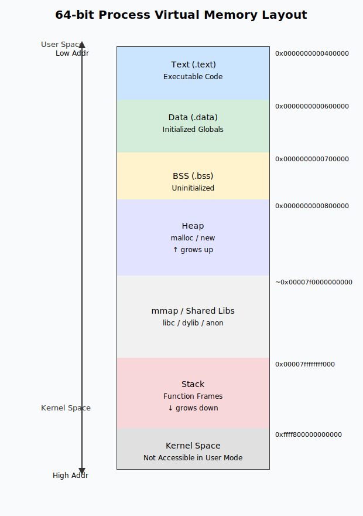
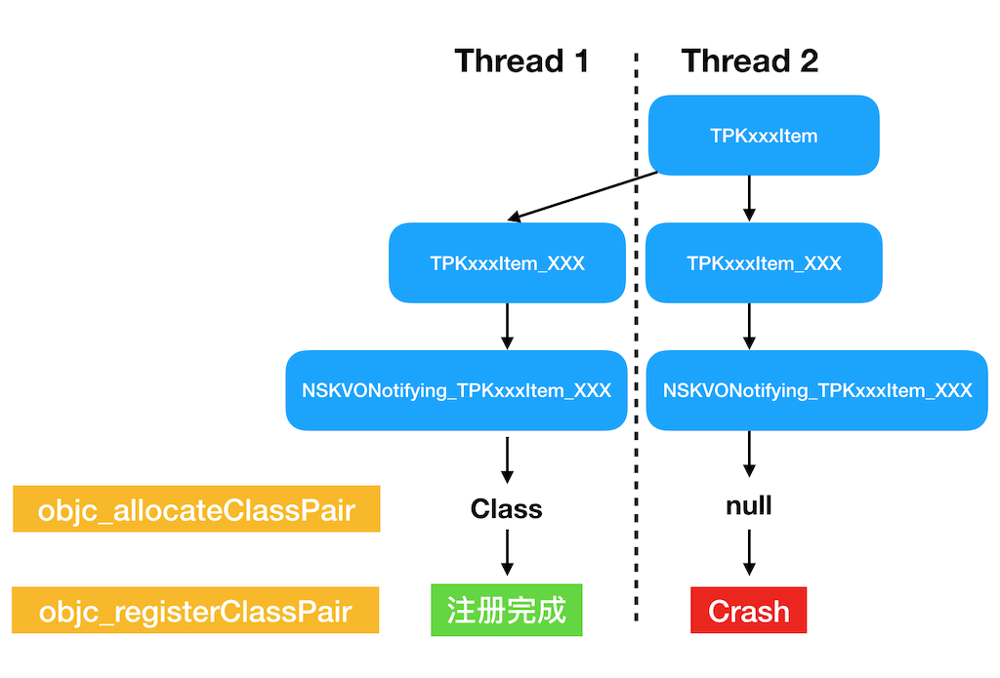

## 概要

Crash とは、アプリ使用中に時折発生する「強制終了」であり、ユーザー体験と継続利用率に直接的な影響を与えます。Crash 率はアプリ品質を測る重要な指標の一つです。

```alert
type: success
description: 一般的に、主要なアプリでは Crash 率を 0.05% 未満（10,000 回の起動あたり 5 回以下）に抑えています。
```

本稿では、iOS エコシステムを中心に、システム原理と実践経験を組み合わせて、Crash について体系的に整理します：

- **本質**：異常制御フロー（ECF）のメカニズム
- **原因**：発生頻度順に並べた一般的な原因
- **伝達フロー**：低レイヤエラーと高水準言語エラーの2つの異なる経路
- **調査方法**：特定、再現、デバッグツールの使用
- **実践ケース**：KVO と動的クラス作成の競合問題
- **管理体制**：監視、予防、品質保証

これにより、開発者が安定した Crash 品質保証プロセスを構築する手助けをします。

## 一、Crash の本質

### 1.1 異常制御フロー（ECF）

Crash の本質は、オペレーティングシステムが異常状況に対して行う**異常制御フロー（Exception Control Flow, ECF）**です。CPU、カーネル、または実行時環境が回復不能な異常を検出すると、制御フローが異常ハンドラにジャンプし、最終的にプロセスが終了する可能性があります。

ECF はハードウェア、カーネル、アプリケーション層で発生します：

- **ハードウェア層**：ハードウェアがイベント（例：周辺機器の割り込み）を検出し、CPU に通知
- **カーネル層**：カーネルのスケジューリング、コンテキストスイッチ、またはシグナル配送
- **アプリケーション層**：実行時環境やアプリケーションロジックが能動的に例外をスロー、シグナルを送信

モバイルアプリの Crash は主にカーネル層とアプリケーション層に関連するため、以下ではこの2つの層の処理メカニズムに焦点を当てます。

### 1.2 オペレーティングシステムの異常分類

オペレーティングシステムは異常を4つに分類します：割り込み（interrupt）、トラップ（trap）、フォールト（fault）、アボート（abort）。この分類は『Computer Systems: A Programmer's Perspective』第8章に基づいています。一部の資料では割り込みは異常に含まれないとしていますが、「プログラムが本来のロジック通りに実行されない」という観点から、広義の異常の一部と見なすことができます。

| カテゴリ   | 原因                         | 非同期/同期 | 戻り動作                   |
| ---------- | ---------------------------- | ----------- | -------------------------- |
| 割り込み   | I/O デバイスからの信号       | 非同期      | 常に次の命令に戻る         |
| トラップ   | 意図的な異常                 | 同期        | 常に次の命令に戻る         |
| フォールト | 回復可能な可能性があるエラー | 同期        | 現在の命令に戻る可能性あり |
| アボート   | 回復不能なエラー             | 同期        | 戻らない                   |

日常の開発で最も一般的に Crash を引き起こすのは **fault**、すなわち回復可能な可能性があるエラーです。フォールトが修復できない場合（例：セグメンテーション違反による不正なメモリアクセス）、システムはプロセスにシグナルを送信するか、直接終了させ、Crash として現れます。一般的な `EXC_BAD_ACCESS`、`SIGSEGV` はこれに該当します。

### 1.3 アプリケーション層の例外保護

各実行時環境は独自の例外体系を持っています。Java の JVM は `Throwable -> Error / Exception` の抽象階層で例外を管理し、ほとんどの Android Crash は JVM にキャッチされ、Java のスタック情報に変換されます。

iOS の実行時環境（Objective-C Runtime / Swift Runtime）にも例外保護メカニズムがあります。例えば：

- `unrecognized selector sent to instance`：オブジェクトに未知のメッセージを送信すると発生
- `objc_exception_throw`：Objective-C がスローする `NSException`
- Swift 層の `fatalError`、`preconditionFailure` は `SIGABRT` をトリガー

これらの保護措置により、例外が直接カーネル層に落ちるのを防げますが、例外が処理されなかったり致命的エラーに発展した場合、最終的には Crash として現れます。

## 二、Crash の一般的な原因

アプリで Crash が発生する原因は多岐にわたります。実際の発生頻度が高い順に、主に以下の4つに分類できます：

### 2.1 不正なメモリアクセス（最も一般的）

これは iOS 開発で最も一般的な Crash タイプで、通常 `EXC_BAD_ACCESS` や `SIGSEGV` として現れます。主なものは以下の通りです：

- **ダングリングポインタ**：解放済みのオブジェクトを使用、またはオブジェクト解放後にポインタが `nil` に設定されていない
- **範囲外アクセス**：配列、文字列などのコンテナへの範囲外アクセス
- **マルチスレッド競合**：マルチスレッド下での同一メモリへの競合書き込みによるメモリ破損
- **書き込み保護メモリ**：読み取り専用メモリ領域（例：文字列リテラル）の変更を試行

アプリケーション層では、メモリレイアウト図を通じて一般的な問題を理解できます：



低アドレスから高アドレスへ：コードセクション（`.text`）→ 初期化済みデータ（`.data`）→ 未初期化データ（`.bss`）→ ヒープ（`heap`）→ スタック（`stack`）

```alert
type: info
description: **メモリレイアウトの説明**：ほとんどのアーキテクチャでは、スタックは通常高アドレス領域に位置し、低アドレス方向に成長します。ヒープはスタックの下方に位置し、高アドレス方向に成長します。アーキテクチャによってメモリレイアウトは若干異なる場合があります。
```

プロセス実行時の一般的な Crash シナリオは以下の通りです：

- 解放済みオブジェクトの使用（ダングリングポインタ）
- マルチスレッド下での同一メモリへの競合書き込み
- 配列や構造体への範囲外アクセス

### 2.2 言語実行時保護メカニズムの発動

iOS の実行時環境（Objective-C Runtime / Swift Runtime）は例外保護メカニズムを提供しており、異常な状況を検出すると能動的に例外をスローするか Crash をトリガーします：

- **未認識メッセージ**：Objective-C Runtime が `unrecognized selector sent to instance` をキャッチ
- **コンテナの範囲外アクセス / `nil` の挿入**：Foundation と Swift のコンテナが能動的に例外をスローするか `fatalError` を呼び出す
- **型アサーションの失敗**：Swift の `as!` または `try!` 失敗時に `SIGABRT` をトリガー
- **強制アンラップ `nil`**：Swift の `!` による強制アンラップで `nil` に遭遇すると `SIGABRT` をトリガー

C のような低水準言語はこれらの保護を提供しておらず、範囲外アクセスは未定義メモリを直接読み書きすることが多いです。

```alert
type: info
description: **言語保護の差異**：C 言語は実行時保護を提供しないため、範囲外アクセスは即座に Crash せず、未定義動作を引き起こし、データ破損やセキュリティ脆弱性の原因となります。一方、Objective-C/Swift の実行時保護メカニズムは異常を検出すると能動的に例外をスローするため、Crash は発生しますが、より早期に問題を発見できます。
```

以下のコードは、配列の範囲外アクセスにおける C 言語と Objective-C の異なる動作を比較しています：

```objc
int main () {
    // C 言語：範囲外アクセスは Crash しないが、動作は未定義
    char str[6] = {'b','i','t','n','p','c'};
    char c = str[6];                    // Crash しないが、未定義メモリを読み取る
    printf("%c\n", c);                  // 出力される文字は不明

    // Objective-C：範囲外アクセスは Crash する
    NSArray *array = @[@"b", @"i", @"t", @"n", @"p", @"c"];
    id obj = array[6];                  // Crash: index 6 beyond bounds [0 .. 5]
    NSLog(@"%@\n", obj);
}
```

### 2.3 オペレーティングシステムのポリシー制限

iOS システムは、リソース管理やセキュリティポリシーなどの要因に基づいてアプリを能動的に終了させることがあります：

```alert
type: info
description: **システム保護メカニズム**：これらのポリシーは、iOS システムがユーザー体験とデバイスのセキュリティを保護するための重要な手段です。開発者はこれらのメカニズムを理解し、開発時にリソース使用とパフォーマンス最適化に注意して、システム保護をトリガーしないようにする必要があります。
```

- **WatchDog**：システムがメインスレッドとアプリ起動時間を監視し、UI メインスレッドの遅延がしきい値を超えるか、コールドスタートがタイムアウトすると WatchDog によって強制終了されます
- **メモリプレッシャー**：`didReceiveMemoryWarning` を受信してもリソースを解放しない場合、またはバックグラウンドアプリのメモリ使用量が基準を超えると、システムがプロセスを強制終了します
- **熱量と消費電力**：CPU/GPU の長時間にわたる高負荷により、システムが周波数を低下させたり、フォアグラウンドアプリを強制終了することがあります（比較的稀）
- **コード署名 / 証明書の問題**：エンタープライズ証明書の期限切れ、署名の無効化、脱獄環境での署名検証失敗などにより、起動段階でシステムがアプリを終了します

### 2.4 CPU がコードを実行できない（比較的稀）

この種の Crash は通常、低レベルのハードウェアまたは命令レベルのエラーによって引き起こされ、実際の開発では比較的稀です：

- **不正な算術演算**：0 による除算、浮動小数点オーバーフローなどが `SIGFPE` をトリガー
- **無効な命令**：実行時に未定義またはアーキテクチャがサポートしない命令を実行し、`SIGILL` をトリガー。異なるアーキテクチャのバイナリの混在や誤った関数ポインタでよく見られます

## 三、Crash のキャプチャと伝達フロー

iOS における Crash の伝達には、エラーの発生源によって2つの主要な経路があります：

**経路一：低レベルエラー**（例：ダングリングポインタ、不正なメモリアクセス）

- ハードウェア/カーネルが異常を検出 → Mach 例外 → Unix Signal
- この種のエラーはシステムの低レベルで直接キャプチャされ、言語実行時を経由しません

**経路二：高水準言語エラー**（例：配列の範囲外アクセス、unrecognized selector）

- Objective-C/Swift Runtime が検出 → NSException → 未キャプチャ時に `abort()` を呼び出す → SIGABRT
- この種のエラーは言語実行時が能動的にスローし、例外ハンドラが設定されていない場合、最終的に `abort()` を通じてシグナルをトリガーします

```alert
type: success
description: **重要な理解**：この2つの経路の違いを理解することは非常に重要です。経路一のエラーは NSException ではキャプチャできず、シグナルハンドラを登録する必要があります。経路二のエラーは NSException ハンドラを通じてより詳細なエラー情報（例外名、理由など）を取得できますが、処理しない場合、最終的にはシグナルもトリガーされます。
```

2つの経路の違いをよりよく理解するために、以下に一般的な Crash シナリオを挙げます：

**ケース一：純粋なシグナルクラッシュ（NSException なし）**

この種の Crash はシステムの低レベルで直接トリガーされ、言語実行時を経由しないため、対応する NSException はなく、シグナルでのみキャプチャできます：

- **ダングリングポインタアクセス** → `SIGSEGV`
- **スタックオーバーフロー** → `SIGTRAP`
- **メモリ制限** → `SIGKILL`

**ケース二：NSException がトリガーするシグナル**

この種の Crash は言語実行時が検出して NSException をスローし、キャプチャされない場合にシグナルをトリガーします。NSException 層を通じて具体的なエラー情報を取得する必要があります：

- **配列の範囲外アクセス** → `NSRangeException` → `SIGABRT`
- **メッセージ転送失敗** → `NSInvalidArgumentException` → `SIGABRT`
- **Swift のオプショナル値の強制アンラップ nil** → `NSException` → `SIGABRT`

```alert
type: success
description: **キャプチャ戦略**：この2つの経路の違いを把握することで、適切な層でハンドラを登録して情報を収集できます。通常、複数の層（Mach 例外、Unix Signal、NSException）で同時にハンドラを登録し、完全なコンテキストを補完する必要があります。最後に、キャプチャした CrashLog をシンボリケートして、読み取り可能なスタック情報に変換します。
```

### 3.1 Mach 例外

Mach 例外は最も低レベルなカーネルレベルの例外で、`EXC_BAD_ACCESS` などが該当します。例外発生時、例外ハンドラによって Mach メッセージに変換され、thread、task、host の各ポートに順次配送されます。

これらのポートを監視することで、Mach 層の例外をキャプチャできます。以下に `PLCrashReporter` を例として（主要なコードのみを記載）、完全な実装は [PLCrashMachExceptionServer](https://github.com/plausiblelabs/plcrashreporter/blob/master/Source/PLCrashMachExceptionServer.m) を参照してください：

```objc
// Mach 例外サーバーコンテキストの初期化
// 1. サーバーポートの作成
mach_port_allocate(mach_task_self(), MACH_PORT_RIGHT_RECEIVE, &_serverContext->server_port);

// 2. 通知ポートの作成
mach_port_allocate(mach_task_self(), MACH_PORT_RIGHT_RECEIVE, &_serverContext->notify_port);
mach_port_insert_right(mach_task_self(), _serverContext->notify_port,
                       _serverContext->notify_port, MACH_MSG_TYPE_MAKE_SEND);

// 3. ポートセットの作成
mach_port_allocate(mach_task_self(), MACH_PORT_RIGHT_PORT_SET, &_serverContext->port_set);

// 4. サーバーポートと通知ポートをポートセットに追加
mach_port_move_member(mach_task_self(), _serverContext->server_port, _serverContext->port_set);
mach_port_move_member(mach_task_self(), _serverContext->notify_port, _serverContext->port_set);

// 5. 例外処理スレッドの作成
pthread_create(&thr, &attr, &exception_server_thread, _serverContext);
```

PLCrashReporter、KSCrash などのオープンソースソリューションは、低レベルで Mach 例外ポートを登録し、例外を先に横取りしてスタックを永続化した後、システムに伝達を継続させ、デフォルトの動作を壊さないようにしています。

```alert
type: info
description: **重要な注意事項**：
- Mach 例外は対応するハンドラを登録しても、元の伝達フローに影響を与えません。Mach 例外は引き続き Unix 層に伝達され、`Unix Signal` に変換されます
- Mach 例外ハンドラがプロセスを直接終了した場合、対応する Unix シグナルは発生しない可能性があります
- 1つの Mach 例外は通常、1つ以上の `Unix Signal` に対応します
```

#### 一般的な exception_type

| Exception タイプ      | 説明                | 備考                                                                                                                                                                                |
| --------------------- | ------------------- | ----------------------------------------------------------------------------------------------------------------------------------------------------------------------------------- |
| `EXC_BAD_ACCESS`      | Bad Memory Access   | 誤ったメモリアドレス。アクセスしたアドレスが存在しないか、現在のプロセスに権限がない場合に発生。経路一（低レベルエラー）でよく見られます                                            |
| `EXC_CRASH`           | Abnormal Exit       | 通常、後続の `UNIX Signal` は `SIGABRT` で、プロセスの異常終了を示します。経路二（高水準言語エラー）でよく見られ、NSException が未キャプチャで `abort()` が呼ばれた場合に発生します |
| `EXC_BAD_INSTRUCTION` | Illegal Instruction | 不正または未定義の命令やオペランド。経路一（低レベルエラー）でよく見られます                                                                                                        |

### 3.2 Unix Signal

Unix Signal は Unix システムの非同期通知メカニズムです。低レベルエラー（経路一）の場合、Mach 例外は host 層で `ux_exception` によって対応する `Unix Signal` に変換され、`threadsignal` を通じてエラーの発生したスレッドに配送されます（例：`SIGSEGV`、`SIGBUS`）。高水準言語エラー（経路二）の場合、NSException がキャプチャされないと `abort()` が呼び出され、直接 `SIGABRT` がトリガーされます。

Unix 層では `signal` / `sigaction` を使用してシグナル処理コールバックを登録し、重要な情報をファイルに書き込んだりサーバーにアップロードしたりできます。以下のコードでは、受信した `SIGBUS` を一律に `signalHandler` で処理します：

```c
void signalHandler(int sig) {
    printf("signal %d received.\n", sig);
    // ここでスタック情報の保存、ログの書き込みなどを行えます
    exit(1);
}

int main() {
    signal(SIGBUS, signalHandler);
    char *str = "bitnpc";  // 文字列リテラルは読み取り専用セグメントに配置
    str[0] = 'H';          // 読み取り専用メモリの変更を試行、SIGBUS をトリガー
    return 0;
}
```

#### 一般的な Unix シグナル

以下の表に一般的な `Unix Signal` を示します。macOS システムでは `man signal` と入力して全ての Signal リストを確認できます。[こちら](https://github.com/torvalds/linux/blob/master/include/linux/signal.h)でも参照可能です。

| Unix Signal | 説明                                                                                                                                                                           |
| ----------- | ------------------------------------------------------------------------------------------------------------------------------------------------------------------------------ |
| `SIGSEGV`   | 無効なメモリアドレスにアクセス。アドレスは存在するが、現在のプロセスにアクセス権限がない。ハードウェア層のエラーに該当                                                         |
| `SIGABRT`   | プログラムの異常終了。通常は C 関数 `abort()` によってトリガーされるほか、実行時アサーションの失敗、Swift の `fatalError` などでもトリガーされる。ソフトウェア層のエラーに該当 |
| `SIGBUS`    | 無効なメモリアドレスにアクセス。`SIGSEGV` との違いは、`SIGBUS` はメモリアドレス自体が存在しないことを示す。ハードウェア層のエラーに該当                                        |
| `SIGTRAP`   | Debugger 関連                                                                                                                                                                  |
| `SIGILL`    | 不正、未知、または権限のない命令の実行を試行                                                                                                                                   |

### 3.3 NSException

`NSException` は Objective-C 実行時がスローする例外オブジェクトで、通常は言語実行時保護メカニズム（配列の範囲外アクセス、unrecognized selector など）によってトリガーされます。`NSSetUncaughtExceptionHandler` で処理関数を登録することで、クラッシュ前に例外名、理由、コールスタックを取得して永続化できます。一般的な方法は、ハンドラ内で情報を sandbox ファイルに書き込み、次回起動時に報告することで、クラッシュ現場での複雑なロジック実行を避けることです。

```alert
type: warning
description: **警告**：例外ハンドラが設定されていない場合、またはハンドラがプログラムの継続実行を阻止しなかった場合、未キャプチャの NSException はプログラムが `abort()` を呼び出す原因となり、`SIGABRT` シグナルがトリガーされます。そのため、ハンドラ内で重要な情報を必ず保存し、クラッシュ現場で時間のかかる処理を実行しないようにしてください。
```

以下のコードは基本的な使い方を示しています：

```objc
void exceptionHandler(NSException *exception) {
    // 例外情報の取得
    NSString *name = [exception name];                          // 例外名
    NSString *reason = [exception reason];                      // 例外の原因
    NSArray *stackArray = [exception callStackSymbols];         // 例外のスタック情報

    // 例外情報の永続化（ファイルへの書き込みまたはサーバーへのアップロード）
    NSLog(@"Exception: %@, Reason: %@", name, reason);
    NSLog(@"Stack: %@", stackArray);

    // 注意：ここで時間のかかる処理を実行しないでください。Crash ログの完全性に影響を与える可能性があります
}

int main(int argc, char * argv[]) {
    // 未キャプチャ例外ハンドラの登録
    NSSetUncaughtExceptionHandler(&exceptionHandler);

    // 例外トリガーの例
    NSArray *array = @[@"b", @"i", @"t", @"n", @"p", @"c"];
    id obj = array[6];  // NSRangeException をトリガー
    return 0;
}
```

### 3.4 Crash Log のシンボリケーション

Crash をキャプチャして得られるデータは、すべて対応する仮想メモリアドレスです。この仮想メモリアドレスを読み取り可能なスタック情報に変換する必要があります。シンボリケーションの本質は、マッピングファイル内でメモリアドレスに対応する関数のメソッド名を見つけることです。

一般的なシンボリケーション方法は以下の通りです：

- **Xcode Organizer / Devices パネル**：自動シンボリケーション。ローカルデバッグに適しています
- **symbolicatecrash スクリプト**：オフラインシンボリケーション。バッチ処理に適しています
- **atos / atosl**：アドレスからシンボルを特定。自社プラットフォームに適しています

```alert
type: success
description: **シンボリケーションのベストプラクティス**：プロジェクトコードのシンボルファイルは `dSYM` に保存され、ビルド後に速やかにアーカイブし、バージョン番号と関連付ける必要があります。システムライブラリのシンボルは iOS ファームウェアまたはサードパーティのイメージから取得できます。エンタープライズチームは通常、CI にシンボルファイルのアップロードを統合し、Crash プラットフォーム（Firebase Crashlytics、Tencent Bugly、Sentry、自社プラットフォームなど）で自動解析を行えるようにします。
```

## 四、Crash の調査アプローチ

通常、デバッグ中に発生する Crash は簡単に解決できます。しかし、アプリのリリース後には、ローカルでは遭遇したことのない、再現が困難な Crash が発生することがあります。CrashLog から直接問題を特定できない場合も多く、体系的な調査方法が必要です。

```alert
type: info
description: **調査の原則**：本番環境の Crash 調査には忍耐と体系的なアプローチが必要です。早急に結論を出さず、十分な情報を収集し、複数の再現手段を試し、必要に応じてデバッグツールを使用して特定を支援します。
```

### 4.1 特定フェーズ

- **手がかりの収集**：システムバージョン、アプリバージョン、ユーザーの操作パス、スタック、スレッド情報、デバイスモデル、バッテリー残量、ネットワーク環境などを確認
- **シナリオの再現**：埋め込みポイントや操作リプレイログ（Logan、Matrix など）を組み合わせてトリガーパスを特定
- **迅速な比較**：前のバージョンとの差分を比較し、最近マージされたモジュールと実験スイッチに注目

### 4.2 再現の試行

- **ローカル再現**：ブレークポイントによるバックトレース、スイッチ制御でクラッシュパスを正確にヒット
- **ヒット率の向上**：Xcode の `Diagnostics` で `Malloc Scribble`、`NSZombie`、`Thread Sanitizer`、`Address Sanitizer` などを有効化
- **マルチスレッドシナリオ**：スクリプトを作成して複数のスレッドで問題を同時発火させ、再現確率を向上

### 4.3 一般的なメモリデバッグツール

#### Malloc Scribble

解放済みオブジェクトに `0x55` を書き込むことで、ダングリングポインタの呼び出しを確実にクラッシュさせるという原理です。

```alert
type: info
description: **使用制限**：Malloc Scribble はローカルの `debug` モードでのみ有効です。内部テスト用ビルドでこの機能を実現するには、システムライブラリの `free` 関数をフックする必要があります。
```

以下のコードを例にします（説明のため、ARC を無効にしています）：

```objc
UIView *view = [UIView new];
[view release];
[view setNeedsLayout];  // 解放済みオブジェクトにメッセージを送信
```

明らかに、この時点で `view` が指すオブジェクトは解放されていますが、`view` ポインタは `nil` に設定されていません。そのため、解放済みのオブジェクトにメッセージを送信していることになります。しかし、コンパイルして実行しても、Crash は発生しません。

`Malloc Scribble` を有効にすると、デバッグパネルから3行目で Crash が発生したことがはっきりと確認できます。

#### Zombie Object

解放済みのオブジェクトをゾンビオブジェクトとしてマークします。Xcode の実装方法は、runtime メソッド `object_setClass` を使用して、解放された view の isa を `_NSZombie_UIView` に上書きします。

上記の `Memory Management` ツールに加えて、Xcode は `Runtime Sanitization` のツール（実際には LLVM コンパイラが提供する機能）も提供しています。例えば、競合アクセスを監視できる `Thread Sanitizer` は、開発者が潜在的な問題を発見するのに役立ちます。

```alert
type: success
description: **デバッグツールの推奨**：開発段階で Xcode の診断ツールを最大限に活用することで、問題が本番環境に出る前にほとんどのメモリおよびスレッド安全性の問題を発見できます。重要なバージョンのリリース前には、これらのツールを使用して全面的なチェックを行うことをお勧めします。
```

## 五、ケース分析：KVO と動的クラス作成の競合

これは実際の本番環境での Crash ケースであり、マルチスレッド環境下での動的クラス作成と KVO メカニズムの競合問題を示しています。

```alert
type: warning
description: **ケース背景**：これは典型的なスレッド安全性の問題です。マルチスレッド環境で動的にクラスを作成する際、適切な同期メカニズムがないと Crash が発生しやすくなります。このような問題は本番環境では再現が難しく、スタック情報の詳細な分析が必要です。
```

以下は実際の CrashLog です。読みやすくするため、関連のない部分は省略しています。

```
Incident Identifier: 61590478-FA94-496E-9208-D2016678D6D0
CrashReporter Key:   TODO
Hardware Model:      iPhone7,2
Process:         imeituan [10672]
Path:            /var/containers/Bundle/Application/2140260F-0484-4CED-AC09-DEC9B620A63A/imeituan.app/imeituan
Identifier:      com.meituan.imeituan
Version:         9.1.0 (3123)
Code Type:       ARM-64
Parent Process:  ??? [1]

Date/Time:       2018-11-12 08:44:34 +0000
OS Version:      iPhone OS 10.1.1 (14B100)
Report Version:  104

Exception Type:  SIGSEGV
Exception Codes: SEGV_ACCERR at 0x20
Crashed Thread:  22

Thread 22 Crashed:
0   libobjc.A.dylib                     objc_registerClassPair + 32
1   Foundation                          _NSKVONotifyingCreateInfoWithOriginalClass + 136
2   Foundation                          _NSKeyValueContainerClassGetNotifyingInfo + 80
3   Foundation                          -[NSKeyValueUnnestedProperty _isaForAutonotifying] + 84
4   Foundation                          -[NSKeyValueUnnestedProperty isaForAutonotifying] + 100
5   Foundation                          -[NSObject(NSKeyValueObserverRegistration) _addObserver:forProperty:options:context:] + 436
6   Foundation                          -[NSObject(NSKeyValueObserverRegistration) addObserver:forKeyPath:options:context:] + 124
7   imeituan                            -[NSObject(RACSelectorSignal) racSignal_addObserver:forKeyPath:options:context:] (NSObject+RACSelectorSignal.m:63)
8   imeituan                            -[RACKVOTrampoline initWithTarget:observer:keyPath:options:block:] (RACKVOTrampoline.m:50)
9   imeituan                            -[NSObject(RACKVOWrapper) rac_observeKeyPath:options:observer:block:] (NSObject+RACKVOWrapper.m:115)
10  imeituan                            __84-[NSObject(RACPropertySubscribing) rac_valuesAndChangesForKeyPath:options:observer:]_block_invoke.41 (NSObject+RACPropertySubscribing.m:0)
......
49  imeituan                            -[TPKxxxItem initWithText:jumpUrlString:] (TPKPOIDetailLookMoreCell.m:60)
50  imeituan                            -[TPKxxxViewModel itemsWithModel:] (TPKxxxViewModel.m:102)
51  imeituan                            __51-[TPKxxxViewModel setupViewModel]_block_invoke (TPKxxxViewModel.m:43)
......
```

### 5.1 問題分析

まず、スタック情報を検索してみましょう。ここで検索可能なスタックは 0-6 行目です。例えば `objc_registerClassPair` を検索すると、これは runtime がクラスを作成する際に呼び出すメソッドです。しかし、この情報だけでは問題を特定するには不十分です。

スタックの4行目から、KVO が同名クラスを作成して Crash するという記事が見つかりました。しかし、本プロジェクトはコンポーネント化されており、各 pod に異なるプレフィックスがあるため、異なるバイナリパッケージに複数のシンボルが共存するという問題はありません。

次に、再現できるかどうかを確認します。`TPKxxxViewModel` に対応するページを見つけましたが、Crash は発生しませんでした。Crash のスレッドがバックグラウンドスレッドであることを考慮すると、マルチスレッドでの `TPKxxxItem` 作成が原因である可能性が高いと推測できます。そこで、テストコードを書いて再現を試みます。なお、このコードの実行タイミングは、実際に item が作成されるタイミングと一致させる必要があります。

```objc
// マルチスレッドでオブジェクトを同時作成し、問題の再現を試行
for (int i = 0; i < 5; i++) {
    dispatch_async(dispatch_get_global_queue(DISPATCH_PRIORITY_DEFAULT, 0), ^{
        TPKxxxItem *item = [[TPKxxxItem alloc] initWithText:@"bit" jumpUrlString:@"npc"];
    });
}
```

幸運にも、再現に成功しました。Crash の位置はプロジェクト内の基本ライブラリでした。その基本ライブラリの変更ログを確認すると、いくつかの swizzle 操作が追加されていました。そのクラスには KVO に似たメカニズムのステップがあり、その過程で新しいクラスが作成されます。しかし、その後さらに KVO によるクラスの監視操作が行われていました。つまり、問題は「KVO が同名クラスのサブクラスを作成しようとすると Crash する」というものに収束し、先に収集した資料と一致しました。

### 5.2 KVO メカニズムの解析

では、なぜ KVO が同名クラスのサブクラスを作成しようとすると Crash するのでしょうか？KVO は主に以下の処理を行っていることが分かっています：

1. `objc_allocateClassPair` と `objc_registerClassPair` メソッドを使用して、動的に新しいクラス `NSKVONotifying_xxx` を作成する。このクラスは元のクラスのサブクラスです
2. 元のオブジェクトの `isa` ポインタを新しく作成された `NSKVONotifying_xxx` クラスに変更する
3. 新しいクラスをグローバルなクラステーブルに追加する
4. 新しいクラスの setter メソッドをオーバーライドし、setter 内で `willChangeValueForKey:` と `didChangeValueForKey:` を呼び出す

ステップ1で、同名の新しいクラスを2つ作成しようとするとどうなるでしょうか？テストコードで検証してみましょう：

```objc
- (void)applicationDidFinishLaunching:(NSNotification *)aNotification {
    // 1回目の同名クラス作成：成功
    Class testClass1 = objc_allocateClassPair([NSObject class], "bitnpc_crash_test", 0);
    objc_registerClassPair(testClass1);

    // 2回目の同名クラス作成：objc_allocateClassPair は nil を返す
    Class testClass2 = objc_allocateClassPair([NSObject class], "bitnpc_crash_test", 0);
    objc_registerClassPair(testClass2);  // EXC_BAD_ACCESS: nil が渡されてクラッシュ
}
```

`objc_allocateClassPair` はクラス作成時に、返される class が `nil` になります。続いて、`objc_registerClassPair` で新しいクラスを登録する際、渡されたパラメータが `nil` であるため、crash が発生します。

さらに `objc-runtime` のソースコード（objc4-723 バージョン）を確認すると、`getClass(name)` が返すクラスが空でない場合、直接 `nil` を返し、新しいメモリ空間を割り当てないことが分かります：

```objc
/***********************************************************************
* objc_allocateClassPair
* fixme
* Locking: acquires runtimeLock
**********************************************************************/
Class objc_allocateClassPair(Class superclass, const char *name,
                             size_t extraBytes)
{
    Class cls, meta;

    rwlock_writer_t lock(runtimeLock);

    // Fail if the class name is in use.
    // Fail if the superclass isn't kosher.
    if (getClass(name)  ||  !verifySuperclass(superclass, true/*rootOK*/)) {
        return nil;  // クラス名が既に存在するため、nil を返す
    }

    // Allocate new classes.
    cls  = alloc_class_for_subclass(superclass, extraBytes);
    meta = alloc_class_for_subclass(superclass, extraBytes);

    // fixme mangle the name if it looks swift-y?
    objc_initializeClassPair_internal(superclass, name, cls, meta);

    return cls;
}
```

### 5.3 問題の根本原因と解決策

ここまで来れば、原因は明確です。以下のフローチャートで表現できます：



プロジェクト内の基本ライブラリが2つの `TPKxxxItem_XXX` を作成しており、これを仮に中間クラスと呼びます。KVO がこれら2つの中間クラスを使用してサブクラスを作成しようとした際、メモリ空間が割り当てられなかったため、`objc_registerClassPair` の実行時に Crash が発生しました。

```alert
type: success
description: **解決策**：中間クラスの作成時に `self.class` をロックし、1つの中間クラスのみが生成されるようにします。`dispatch_once` または `@synchronized` のいずれでもスレッドセーフを実現できますが、パフォーマンス面では `dispatch_once` の使用をお勧めします。
```

```objc
// dispatch_once またはロックを使用してスレッドセーフを確保
static NSMutableDictionary *classCache = nil;
static dispatch_once_t onceToken;
dispatch_once(&onceToken, ^{
    classCache = [NSMutableDictionary dictionary];
});

@synchronized(self.class) {
    NSString *className = NSStringFromClass(self.class);
    Class cachedClass = classCache[className];
    if (!cachedClass) {
        // 中間クラスの作成
        cachedClass = objc_allocateClassPair([self class], "TPKxxxItem_XXX", 0);
        if (cachedClass) {
            objc_registerClassPair(cachedClass);
            classCache[className] = cachedClass;
        }
    }
    return cachedClass;
}
```

```alert
type: info
description: **注意事項**：`TPKxxxItem_XXX` の生成自体は Crash しませんでした。その理由は、マルチスレッドで同名クラスを作成する際、`objc_allocateClassPair` が必ずしも `nil` を返すとは限らないためで、これは低レベルコンテナの実装に関係します。該当フレームワークは内部で判定を行い、`objc_allocateClassPair` が `nil` を返した場合に register 操作を実行しないようにしています。しかし、KVO にはそのような判定が明らかにありません。
```

```alert
type: success
description: **経験のまとめ**：実行時に動的にクラスやメソッドを生成する際は、スレッドセーフと名前の衝突に注意し、必要に応じてロックやシリアルキューを使用して、マルチスレッド下での重複登録を避けてください。これは iOS 開発でよくある落とし穴の一つです。
```

## 六、Crash の監視と管理体制

```alert
type: success
description: **管理の原則**：Crash 管理は継続的なプロセスであり、監視、分析、修正、予防のクローズドループ体制を構築する必要があります。重要なのは、問題がユーザーに影響を与える前に発見し解決することです。
```

- **主要指標**：コールドスタート Crash 率、アクティブユーザー Crash 率（DAU に占めるクラッシュユーザーの割合）、シナリオ別 Crash 率（ページ/機能ごと）に注目し、カクつきや OOM 統計も合わせて確認
- **収集戦略**：クライアントが次回起動時に Crash ログ、スレッドスタック、デバイス情報、最近の操作を報告し、サーバー側で集計して指標を算出
- **管理クローズドループ**：ビルド情報やグレイリリースバッチと組み合わせて、Crash をバケット分類（初回発生、回帰、コアパス）し、SLA とアラートしきい値を設定
- **ツールチェーン**：一般的なソリューションとしては Crashlytics、Bugly、Sentry、PLCrashReporter ベースの自社報告システムなどがあり、Xcode Organizer や App Store Connect の `Metrics`/`Analytics` と組み合わせてクロス検証
- **予防メカニズム**：内部テスト用ビルドで ASan、TSan、Malloc Guard、Zombie などのデバッグツールを有効化。静的チェック（Clang Static Analyzer、Infer）やユニットテストで主要モジュールをカバー。リリース後は Feature Flag を使用して迅速なダウングレードを実施

## 七、まとめ

本稿では、オペレーティングシステムの異常制御メカニズムに基づき、Crash の本質、一般的な原因、伝達フロー、キャプチャ階層、シンボリケーション方法を整理し、調査アプローチと実際のケースを示しました。

```alert
type: success
description: **品質保証体系**：Crash 率を継続的に低減するには、開発期に事前保護を徹底し、リリース期に監視と回帰テストを充実させ、運用期に指標の追跡と迅速な損切りを実現する、トップダウンの品質クローズドループを形成する必要があります。これはシステムエンジニアリングであり、チームの協力と継続的な改善が必要です。
```

### 重要ポイントの振り返り

1. **Crash の本質**：異常制御フロー（ECF）。ハードウェア層からアプリケーション層までのマルチレイヤー例外処理メカニズム
2. **一般的な原因**（頻度順）：不正なメモリアクセス（最も一般的）→ 言語実行時保護メカニズム → オペレーティングシステムのポリシー制限 → CPU がコードを実行できない（比較的稀）
3. **伝達フロー**：2つの主要な経路
   - 経路一（低レベルエラー）：Mach 例外 → Unix Signal
   - 経路二（高水準言語エラー）：NSException → `abort()` → SIGABRT
   - 完全な情報をキャプチャするには、複数の層でハンドラを登録する必要がある
4. **調査アプローチ**：手がかりの収集 → シナリオの再現 → 再現の試行 → 問題の特定 → 修正と検証
5. **ベストプラクティス**：スレッドセーフ、命名規則、監視体系、ツールチェーン構築
