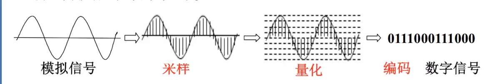
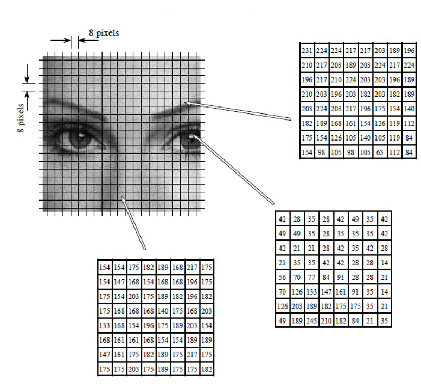
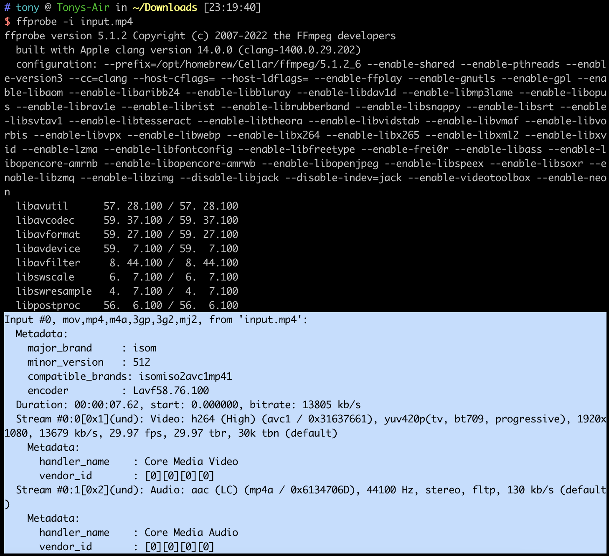

音と映像は人間が世界を知覚するための2つの基本的な方法であり、その本質は異なる物理現象に基づいています。

### 音と映像の本質

**音**は物体の振動によって生じる機械波です。物体が振動すると、周囲の空気分子もそれに伴って振動し、疎密が交互に現れる縦波を形成します。この機械波は媒質（空気、水など）を通じて伝播し、耳の中の鼓膜で受信され、聴覚神経を通じて私たちが知覚する音へと変換されます。

音の特性は2つの核心パラメータによって決まります：

- **周波数**：音の高さを決める（単位 Hz）、人間の耳が聴き取れる範囲は約 20Hz ~ 20kHz
- **振幅**：音量の大きさを決める（単位 dB）

**映像**は光を通じて伝達される視覚情報です。光は電磁波であり、物体の表面に照射されて反射し、目やカメラに入射すると、私たちは映像を知覚できます。

映像の特性は2つの核心パラメータによって決まります：

- **色**：光の波長（周波数）によって決まり、可視光の波長範囲は約 380nm ~ 780nm
- **明るさ**：光の強度によって決まる

### アナログからデジタルへ

自然界の音や光は連続的なアナログ信号です。デジタル処理により、これらの連続信号を離散的なデジタル形式に変換することで、保存、伝送、処理が容易になります。

デジタル化された音は**オーディオ**と呼ばれ、デジタル化された画像の連続は**ビデオ**と呼ばれ、総称して**音声・映像**（AV）と呼ばれます。

収録側では、オーディオは**マイク**によって音波を電気信号に変換し、ビデオは**CMOSイメージセンサ**によって光信号を電気信号に変換し、さらにADC（アナログデジタル変換器）を経てデジタル信号として保存されます。

### オーディオのデジタル化

1. サンプリング。連続的なアナログオーディオ信号が一定の時間間隔でサンプリングされ、一連の離散的なサンプル値が得られます。サンプリング周波数は1秒間のサンプリング回数を決定し、通常ヘルツ（Hz）で表されます。オーディオの一般的なサンプリングレートは 44.1kHz です。

2. 量子化。デジタル値でオーディオの振幅を表現します。量子化ビット深度は、アナログ信号を2進デジタル信号に変換する際のビット数です。量子化深度が高いほど、サンプリングされたデジタル信号の精度が高まります。例えば、量子化深度が 16 bit の場合、サンプリングされたデジタル信号の振幅には `2^16 = 65536` の段階があります。オーディオの量子化深度は一般的に 8 bit、16 bit、20bit、24bit、32bit などがあります。

3. 符号化（エンコーディング）。量子化されたデジタル信号を圧縮符号化し、データ量を削減します。符号化には可逆圧縮（FLAC など）と非可逆圧縮（AAC、MP3 など）があります。一般的な符号化形式には `AAC`、`MP3`、`G.711`、`Opus` などがあります。`Opus` はフリーでオープンソースであり、低ビットレートの音声から高ビットレートの音楽まで全シーンをカバーし、符号化品質が高く、ノイズフロアが低いため、ストリーミングメディアで徐々に採用されています。



上の図では、横軸が時間を表し、1秒間の縦線の本数がサンプリングレートに、縦線の高さが信号の振幅に、信号振幅の最小単位の逆数が量子化深度にそれぞれ対応します。

#### オーディオデジタル化の三要素

| サンプリング周波数（sample rate）                                                                                                                                                                                                                                                                                                  | 量子化ビット数（bit depth）                                                                                      | チャンネル数（Number of Channels）                                                                                                                                                                                                                                                                                                |
| ---------------------------------------------------------------------------------------------------------------------------------------------------------------------------------------------------------------------------------------------------------------------------------------------------------------------------------- | ---------------------------------------------------------------------------------------------------------------- | --------------------------------------------------------------------------------------------------------------------------------------------------------------------------------------------------------------------------------------------------------------------------------------------------------------------------------- |
| 1秒間に音声振幅の標本を抽出する回数                                                                                                                                                                                                                                                                                                | 各サンプル点を何ビットの2進数で表現するか                                                                        | 音声チャンネルの数                                                                                                                                                                                                                                                                                                                |
| サンプリングレートが高いほど音質が向上し、データ量も増加                                                                                                                                                                                                                                                                           | 量子化ビット数が多いほど音質が良くなり、データ量も増加                                                           | ステレオはモノラルよりも表現力が豊かだが、データ量は2倍になる                                                                                                                                                                                                                                                                     |
| 一般的なサンプリングレート：<br> _ 8,000 Hz - 電話で使用されるサンプリングレート <br> _ 11,025 Hz - AMラジオ放送で使用されるサンプリングレート <br> _ 22,050 Hz - ラジオ放送で使用されるサンプリングレート <br> _ 32,000 Hz - miniDV で使用されるサンプリングレート <br> \* 44,100 Hz - オーディオCDで使用されるサンプリングレート | _ 8 bit、振幅を 2^8 段階に分割 <br> _ 16 bit、合計 65536 段階、CD品質に到達 <br> \* 32 bit、合計 4294967296 段階 | _ モノラルは単に1つのスピーカーから音が出るという意味ではなく、通常は2つのスピーカーから同一チャンネルの音が出力される <br> _ ステレオは2つのスピーカーがそれぞれ異なる音を出力し（通常左右のチャンネルで役割分担）、空間的な効果をより感じられる <br> \* モノラル・ステレオ以外にも、5.1、7.1 など、より多チャンネルの方式がある |

### ビデオのデジタル化

1. サンプリング（Sampling）：ビデオ信号は連続的なアナログ画像で構成されています。サンプリング段階では、画像が一定間隔でサンプリングされ、連続画像が離散的なピクセルに変換されます。1秒間のサンプル数がビデオのフレームレートに対応します。

2. 量子化（Quantization）：各ピクセルについて、画像の明るさと色がデジタル値に量子化されます。これは通常、輝度の量子化と色度の量子化に分けられます。

3. 色空間変換（Optional）：場合によっては、ビデオ信号を異なる色空間間で変換する必要があります。例えば、`RGB（Red, Green, Blue）` から `YUV（Luma, Chroma）` への変換です。これは通常、画像情報をより効率的に表現・伝送するためです。`RGB` 色空間には人間の目では識別できない色値が多く含まれており、また人間の目は色（色度）よりも明るさ（輝度）に対する感度がはるかに高いためです。`Y（Luma）`は輝度を、`U` と `V（Chroma）`は色を表します。色情報を `U` と `V` 成分に分離することで、色情報をより効率的に圧縮でき、保存や伝送に適したものになります。

4. 符号化（Encoding）：最後に、符号化段階でビデオコーデックを使用してデータを圧縮します。ビデオ符号化の核心的な考え方は、**空間的冗長性**（フレーム内の隣接ピクセル間の類似性）と**時間的冗長性**（隣接フレーム間の類似性）を除去することです。一般的な符号化形式には、`AVC(H.264)`、`HEVC(H.265)`、`VP9`、`AV1` があります。H.264 は現在もっとも互換性の広い形式であり、H.265 と AV1 は同等の画質で約 30%〜50% のビットレートを削減できます。



上の図は H.264 符号化の模式図で、各画像は 8×8 ピクセルのサイズに分割されて符号化されます。

#### 色空間

色空間（Color space）とは、色を組織化する方法です。色モデル（Color model）は、一連の数値で色を記述する抽象的な数学モデルです（例えばRGBは3つの値、CMYKは4つの値を使用）。「色空間」は固定された色モデルと写像関数の組み合わせを持つため、 informal な場面では、この言葉は色モデルを指すこともあります。一般的な色モデルには `RGB`、`YUV(YCbCr)`、`HSV`、`HSL`、`CMYK` などがあります。以下では `YUV` 色モデルを重点的に説明します。

`YUV` は色を表現するモデルです。しかし、私たちが普段 `YUV` と呼んでいるものは、実際には `YCbCr` を指しており、`Y` は輝度成分、`Cb` は青色度成分、`Cr` は赤色度成分で、標準的な `YUV` の派生版です。本稿では `YUV` で `YCbCr` を指すものとします。

`YUV` フォーマットはデータサイズによって3つの形式に分類されます：`YUV 420`、`YUV 422`、`YUV 444`。人間の目は `Y` に対する感度が `U` や `V` よりもはるかに高いため、複数の `Y` 成分で1組のUVを共有することができ、これにより容量を大幅に節約しつつ、品質の低下を抑えられます。

- `YUV 420`：4つの `Y` 成分が1組の `UV` 成分を共有
- `YUV 422`：2つの `Y` 成分が1組の `UV` 成分を共有
- `YUV 444`：共有なし、1つの `Y` 成分が1組の `UV` 成分を使用

これら3つのタイプの下で、`YUV` の並び・格納順序に従って、さらに多くのフォーマットに細分化できます。`YUV` の並び方によって、さらに3つの大きなカテゴリに分類されます：`Planar`、`Semi-Planar`、`Packed`。

- Planar：YUV の3成分を分けて格納
- Semi-Planar：Y 成分は単独で格納、UV 成分は交互に格納
- Packed：YUV の3成分すべてを交互に格納

#### コンテナフォーマット（Byte Stream Format）

`H.264` 符号化には2つの `Byte Stream Format`、`AnnexB` と `AVCC` があります。

```
AnnexB format:
([start code] NALU) | ( [start code] NALU) |
AVCC format:
([extradata]) | ([length] NALU) | ([length] NALU) |
```

In annexb, [start code] may be 0x000001 or 0x00000001.
In avcc, the bytes of [length] depends on NALULengthSizeMinusOne in avcc extradata, the value of [length] depends on the size of following NALU and in both annexb and avcc format, the NALUs are no different.

```alert
type: info
description: `Annex B` は主にネットワークストリーミング（rtmp、rtp 形式）で使用され、`AVCC` は主にファイル保存（mp4 形式）で使用される
```

`H.265` 符号化は `H.264` とは異なり、その `Byte Stream Format` には `H.265 Annex B` と `H.265 Parameter Sets` が含まれます。

### FFmpeg を使用したビデオファイル情報の確認

ffmpeg が提供する ffprobe ツールを使用して、ビデオファイルの情報を確認できます。

下図のハイライト部分から、このビデオファイルは mp4 ファイルで、長さ 7.62 秒、ビットレート 13805 kb/s、2つの `Stream` を含んでいることがわかります。

Video は `H.264` で符号化され、色空間は `yuv420`、解像度は `1080P(1920*1080)`、フレームレートは `29.97` です。

Audio は `aac` で符号化され、サンプリングレートは `44.1kHz`、ステレオです。

```alert
type: info
description: 1080p はビデオ解像度の標準であり、ビデオの垂直解像度が1080ピクセルであることを意味します。具体的には、1080p ビデオの解像度は1920x1080で、1920は水平ピクセル数、1080は垂直ピクセル数です。アルファベットの「p」は「プログレッシブスキャン（progressive scan）」を意味します。これは、ビデオの各フレームが画像全体のすべての行のピクセルを走査して作成されることを意味し、奇数行と偶数行のピクセルを交互に走査する「インターレーススキャン（interlaced scan）」とは異なります。プログレッシブスキャンは、動きのある画像のディテールと鮮明さをよりよく保持できるため、よりクリアな画像を提供します。
```



### 考察

#### 1. ハイライト部分の上にある長い情報は何ですか？

その情報は mp4 ファイルの **metadata（メタデータ）** であり、mp4 コンテナの `moov` box に格納されています。よく見られるフィールドは次のとおりです：

- `major_brand`：ファイルの主要ブランド識別子（例：`isom`、`mp42`）、ファイルが準拠する mp4 仕様バージョンを示す
- `minor_version`：副バージョン番号
- `compatible_brands`：互換性のあるブランドのリスト。このファイルがどのデコーダ/プレーヤーで正しく解析可能かを示す
- `encoder`：ファイルを符号化したソフトウェア（例：`Lavf58.29.100` は FFmpeg の libavformat ライブラリを示す）
- `creation_time`、`duration` などの時間情報

これらのメタデータは、プレーヤーがデコード前にファイル構造を迅速に把握し、適切なデマルチプレックス（demux）およびデコード戦略を選択するのに役立ちます。

#### 2. YUV420 色空間とは何ですか？

前述の通り、YUV フォーマットの分類を紹介しました。ここで YUV420 の意味をさらに説明します：

"420" の数字は、4ピクセルのサンプリングにおける Y、Cb、Cr 各成分のサンプリング比率を示しています。具体的には：

- 各行の4ピクセルはそれぞれ独立した Y（輝度）値を持つ
- 2×2 のピクセルブロックごとに1組の Cb と Cr 値を共有する
- つまり、色度は水平方向と垂直方向の両方で 2:1 のダウンサンプリングが行われる

データ量の比較：

- YUV444：1ピクセルあたり3バイト（Y+U+V 各1バイト）、合計 `width × height × 3`
- YUV420：1ピクセルあたり平均1.5バイト（Y が1バイト、U と V が各0.25バイト）、合計 `width × height × 1.5`

YUV420 は YUV444 と比較して 50% の保存容量を節約できますが、人間の目は色度の変化に敏感ではないため、画質の低下はほとんど気になりません。これが、ほとんどのビデオコーデック（H.264、H.265、VP9 など）がデフォルトで YUV420 フォーマットを使用する理由です。

#### 3. なぜフレームレートが整数ではないのですか？

サンプルのフレームレートは 30 fps ではなく 29.97 fps ですが、これは **NTSC カラーテレビ方式の歴史的経緯**に起因します。

1950年代、アメリカの白黒テレビ標準は 30 fps（60Hz の交流電源周波数に基づく）でした。カラー信号が導入された際、既存の白黒テレビ信号との互換性を保つため、エンジニアは既存の帯域幅の中で輝度情報と色度情報を同時に伝送する必要がありました。色副搬送波と音声搬送波の間の干渉（ビート干渉）を避けるため、フレームレートを 30 fps から 0.1% 僅かに低下させました：

$$30 \times \frac{1000}{1001} = 29.97\text{ fps}$$

この 1000/1001 の比率は今日まで受け継がれています。同様に、24fps の映画は NTSC 方式では 23.976 fps に、60fps は 59.94 fps になります。

デジタルビデオでは、フレームレートは正確さを保証するために通常分数で表現されます。例えば、浮動小数点数の `29.97` ではなく `30000/1001` と表します。FFmpeg の `time_base` や `r_frame_rate` フィールドは、このような分数形式を使用して浮動小数点の精度問題を回避しています。

---

参考資料

- [火山引擎 - 音视频基础概念](https://www.volcengine.com/docs/6489/72015)
- [维基百科 - 色彩空间](https://zh.wikipedia.org/zh-cn/%E8%89%B2%E5%BD%A9%E7%A9%BA%E9%96%93)
- [知乎 - YUV 格式详解](https://zhuanlan.zhihu.com/p/384455058)
