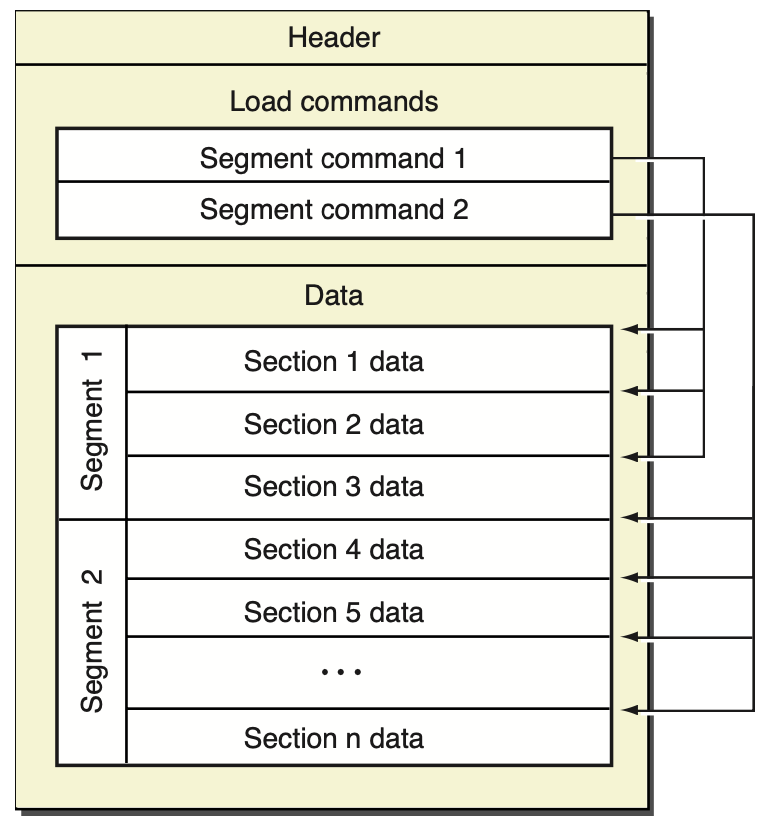
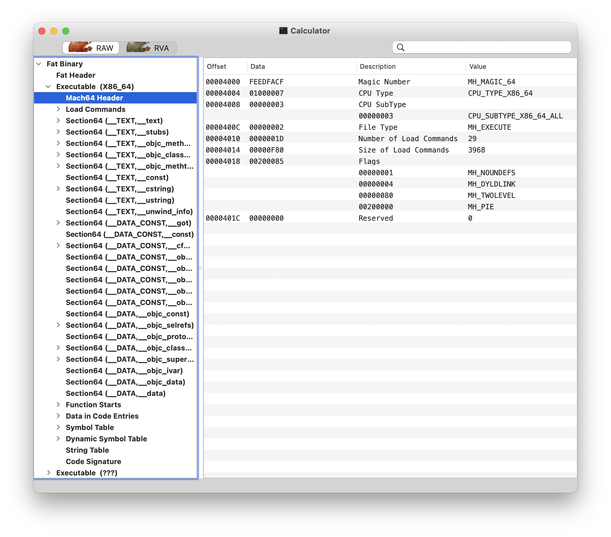

## プロセス

Appの本質は実行可能プログラムであり、コンピュータコードとデータの集合体です。オペレーティングシステムの観点から見ると、Appの本質は**プロセス**です。プロセスとは、コンピュータ上で実行中のプログラムのインスタンスです。オペレーティングシステムにおいて、プロセスはリソース割り当てとスケジューリング実行の基本単位です。各プロセスは独自のメモリ空間、レジスタセット、ファイルハンドル、ネットワーク接続などのリソースを持ち、独立して実行・管理されます。

プロセスはオペレーティングシステムにおける最も基本的なリソース割り当てとスケジューリングの単位です。オペレーティングシステムはプロセス制御ブロック `PCB（Process Control Block）` を通じてプロセスを管理します。`PCB` にはプロセスの状態、プロセスID、プロセス優先度、メモリ使用状況、ファイルハンドルなどの情報が含まれます。オペレーティングシステムが別のプロセスに切り替える必要がある場合、現在のプロセスのコンテキストを保存し、別のプロセスのコンテキストをロードすることで、プロセス間の切り替えを実現します。

`macOS` では、`PCB` は `proc` と呼ばれます。[proc 構造体](https://opensource.apple.com/source/xnu/xnu-7195.81.3/bsd/sys/proc_internal.h.auto.html)は `macOS` カーネルにおいて非常に重要なデータ構造であり、カーネル内でのプロセスの状態や情報を記述します。

```c
struct proc {
    LIST_ENTRY(proc) p_list;                /* List of all processes. */

    void *          XNU_PTRAUTH_SIGNED_PTR("proc.task") task;       /* corresponding task (static)*/
    struct  proc *  XNU_PTRAUTH_SIGNED_PTR("proc.p_pptr") p_pptr;   /* Pointer to parent process.(LL) */
    pid_t           p_ppid;                 /* process's parent pid number */
    pid_t           p_original_ppid;        /* process's original parent pid number, doesn't change if reparented */
    pid_t           p_pgrpid;               /* process group id of the process (LL)*/
    uid_t           p_uid;
    gid_t           p_gid;
    uid_t           p_ruid;
    gid_t           p_rgid;
    uid_t           p_svuid;
    gid_t           p_svgid;
    uint64_t        p_uniqueid;             /* process unique ID - incremented on fork/spawn/vfork, remains same across exec. */
    uint64_t        p_puniqueid;            /* parent's unique ID - set on fork/spawn/vfork, doesn't change if reparented. */

    lck_mtx_t       p_mlock;                /* mutex lock for proc */
    pid_t           p_pid;                  /* Process identifier. (static)*/
    char            p_stat;                 /* S* process status. (PL)*/
    char            p_shutdownstate;
    char            p_kdebug;               /* P_KDEBUG eq (CC)*/
    char            p_btrace;               /* P_BTRACE eq (CC)*/
    /* 以下、その他のフィールドは省略 */
};
```

`proc` には多数のフィールドとポインタが含まれており、プロセスの状態（`p_stat`）、プロセスID（`p_pid`）、プロセス名（`p_comm`）、プロセス優先度（`p_priority`）、プロセスのメモリ使用状況（`p_vmspace`）、ファイル記述子テーブル（`p_fd`）、スレッドリスト（`p_threadlist`）など、プロセスのさまざまな属性やリソース使用状況を記述します。

## Mach-Oファイル

Appがメモリにロードされてプロセスになる前、macOS上の実行可能ファイルは `Mach-O` ファイルです。`Mach-O` ファイルには実行可能コード、データ、シンボルテーブル、動的リンク情報など複数の部分が含まれており、`macOS` におけるアプリケーションとライブラリファイルの基本フォーマットです。

`Mach-O` ファイルのフォーマットは、ファイルヘッダ（`Header`）、ロードコマンド（`Load commands`）、データ領域（`Raw segment data`）の3つの部分に分けられます。


_Mach-O file_

複数のCPUアーキテクチャを含む `Mach-O` ファイルは `Fat Binary` と呼ばれます。`file` コマンドで `Mach-O` ファイルのCPUアーキテクチャを確認できます。

```bash
$ file /System/Applications/Calculator.app/Contents/MacOS/Calculator
/System/Applications/Calculator.app/Contents/MacOS/Calculator: Mach-O universal binary with 2 architectures: [x86_64:Mach-O 64-bit executable x86_64] [arm64e:Mach-O 64-bit executable arm64e]
/System/Applications/Calculator.app/Contents/MacOS/Calculator (for architecture x86_64):	Mach-O 64-bit executable x86_64
/System/Applications/Calculator.app/Contents/MacOS/Calculator (for architecture arm64e):	Mach-O 64-bit executable arm64e
```

`Fat Binary` に対応する `fat_header` のオペレーティングシステムにおけるデータ構造定義は [**fat_header**](https://opensource.apple.com/source/xnu/xnu-7195.81.3/EXTERNAL_HEADERS/mach-o/fat.h.auto.html) です。

```c
struct fat_header {
	uint32_t	magic;		/* FAT_MAGIC */
	uint32_t	nfat_arch;	/* number of structs that follow */
};
// Fat Binary は複数の fat_arch からなる Mach-O ファイルを含む
struct fat_arch {
	cpu_type_t	cputype;	/* cpu specifier (int) */
	cpu_subtype_t	cpusubtype;	/* machine specifier (int) */
	uint32_t	offset;		/* file offset to this object file */
	uint32_t	size;		/* size of this object file */
	uint32_t	align;		/* alignment as a power of 2 */
};
```

このように、macOSシステムの電卓アプリの `Mach-O` ファイルは、`x86_64` と `arm64e` の2種類のCPUアーキテクチャを含む `Fat Binary` であることがわかります。

```alert
type: success
description: iOS 11.0 以降、iOS は `armv7`、`armv7s` などのアーキテクチャをサポートしなくなり、`arm64` アーキテクチャのみをサポートしています。そのため、`iOS 11.0` 以降のみをサポートするプロジェクトのビルド成果物である `Fat Binary` は、`arm64` アーキテクチャの `Mach-O` ファイルのみとなります。これが `Xcode 14.0` で `bitcode` が廃止された理由でもあり、`bitcode` 中間成果物にコンパイルする必要がなくなり、また `bitcode` のトランスコードが AppStore のサーバリソースを消費するためです。
```

### ファイルヘッダ（header）

`Mach-O` のファイルヘッダには、ファイルタイプ、CPUタイプ、ロードコマンド数などの情報が含まれます。`Mach-O` ファイルは、実行可能ファイル、動的リンクライブラリ、フレームワークなど、複数のファイルタイプをサポートしています。CPUタイプは、実行可能ファイルが対応するCPUアーキテクチャ（`x86`、`x86_64`、`armv7`、`arm64` など）を指定します。ロードコマンド数は、ファイルに含まれるロードコマンドの数を指定します。

`otool` コマンドは `macOS` や `iOS` などのオペレーティングシステム上で、実行可能ファイル、動的ライブラリ、フレームワークなどのバイナリファイルの情報を表示するためのツールです。バイナリファイルのヘッダ情報、セクションテーブル、シンボルテーブル、動的リンク情報などを確認できます。

```bash
$ otool -h /System/Applications/Calculator.app/Contents/MacOS/Calculator
/System/Applications/Calculator.app/Contents/MacOS/Calculator:
Mach header
      magic  cputype cpusubtype  caps    filetype ncmds sizeofcmds      flags
 0xfeedfacf 16777228          2  0x80           2    29       4208 0x00200085
```

`otool` コマンドの他に、`MachOView` ツールを使用してグラフィカルな画面で `Mach-O` ファイルを確認することもできます。

```bash
brew install machoview
```


_MachOView_

`Fat Binary` では、各アーキテクチャに [**mach_header**](https://opensource.apple.com/source/xnu/xnu-7195.81.3/EXTERNAL_HEADERS/mach-o/loader.h.auto.html) と呼ばれる `header` ファイルヘッダがあります。64ビットアーキテクチャの `mach_header` には予約フィールドが1つ追加されます。

```c
/*
 * The 32-bit mach header appears at the very beginning of the object file for
 * 32-bit architectures.
 */
struct mach_header {
	uint32_t	magic;		/* mach magic number identifier */
	cpu_type_t	cputype;	/* cpu specifier */
	cpu_subtype_t	cpusubtype;	/* machine specifier */
	uint32_t	filetype;	/* type of file */
	uint32_t	ncmds;		/* number of load commands */
	uint32_t	sizeofcmds;	/* the size of all the load commands */
	uint32_t	flags;		/* flags */
};
/* Constant for the magic field of the mach_header (32-bit architectures) */
#define	MH_MAGIC	0xfeedface	/* the mach magic number */
#define MH_CIGAM	0xcefaedfe	/* NXSwapInt(MH_MAGIC) */
/*
 * The 64-bit mach header appears at the very beginning of object files for
 * 64-bit architectures.
 */
struct mach_header_64 {
	uint32_t	magic;		/* mach magic number identifier */
	cpu_type_t	cputype;	/* cpu specifier */
	cpu_subtype_t	cpusubtype;	/* machine specifier */
	uint32_t	filetype;	/* type of file */
	uint32_t	ncmds;		/* number of load commands */
	uint32_t	sizeofcmds;	/* the size of all the load commands */
	uint32_t	flags;		/* flags */
	uint32_t	reserved;	/* reserved */
};
/* Constant for the magic field of the mach_header_64 (64-bit architectures) */
#define MH_MAGIC_64 0xfeedfacf /* the 64-bit mach magic number */
#define MH_CIGAM_64 0xcffaedfe /* NXSwapInt(MH_MAGIC_64) */
```

## ロードコマンド（Load commands）

`Mach-O` ファイルのロードコマンド（`Load Command`）は、実行可能ファイルの各セグメントの属性や位置などの情報を記述し、オペレーティングシステムはこれらの情報に基づいて実行可能ファイルをメモリにロードします。各 `Load Command` は特定のセグメントまたは領域を記述します。一般的な `Load Command` は次のとおりです。

- `LC_SEGMENT` および `LC_SEGMENT_64`：実行可能コードとデータのセグメント情報を記述します。
- `LC_SYMTAB` および `LC_DYSYMTAB`：シンボルテーブルと動的シンボルテーブルの情報を記述します。
- `LC_LOAD_DYLIB` および `LC_LOAD_WEAK_DYLIB`：動的リンクライブラリの情報を記述します。
- `LC_MAIN`：プログラムのエントリポイントの情報を記述します。

[load_command](https://opensource.apple.com/source/xnu/xnu-7195.81.3/EXTERNAL_HEADERS/mach-o/loader.h.auto.html)

```c
struct load_command {
	uint32_t cmd;		/* type of load command */
	uint32_t cmdsize;	/* total size of command in bytes */
};
```

## データ領域（Raw segment data）

`Mach-O` ファイルのデータ領域には複数のセグメント（`Segment`）が含まれ、各セグメントには異なるタイプのデータが格納されます。一般的なセグメントには `__TEXT`、`__DATA`、`__LINKEDIT` などがあります。`__TEXT` セグメントにはコードと読み取り専用データが含まれ、`__DATA` セグメントにはグローバル変数や静的変数などのデータが含まれ、`__LINKEDIT` セグメントにはシンボルテーブルや再配置情報などが含まれます。

[segment](https://opensource.apple.com/source/xnu/xnu-7195.81.3/EXTERNAL_HEADERS/mach-o/loader.h.auto.html)

```c
struct segment_command_64 { /* for 64-bit architectures */
	uint32_t	cmd;		/* LC_SEGMENT_64 */
	uint32_t	cmdsize;	/* includes sizeof section_64 structs */
	char		segname[16];	/* segment name */
	uint64_t	vmaddr;		/* memory address of this segment */
	uint64_t	vmsize;		/* memory size of this segment */
	uint64_t	fileoff;	/* file offset of this segment */
	uint64_t	filesize;	/* amount to map from the file */
	int32_t		maxprot;	/* maximum VM protection */
	int32_t		initprot;	/* initial VM protection */
	uint32_t	nsects;		/* number of sections in segment */
	uint32_t	flags;		/* flags */
};
```

`Mach-O` ファイルでは、各 `Segment` が1つ以上の `section` を含み、各 `section` は関連するデータやコードのグループを含みます。例えば、実行可能ファイルでは、一般的な `Segment` として `__TEXT`、`__DATA`、`__LINKEDIT` などがあり、各 `Segment` は複数の `section` を含みます。例えば `__TEXT` は `__text`、`__cstring`、`__stubs` などの複数の `section` を含みます。

`Section` は `Mach-O` ファイル内のサブユニットであり、`Segment` 内のサブセグメントとして、関連するデータやコードのグループを含みます。各 `Section` には名前とタイプがあり、例えば `__text`、`__data`、`__cstring` などがあります。`Mach-O` ファイルにおいて、`Section` の名前とタイプは通常、コンパイラとリンカに関連しており、異なるコンパイラやリンカは異なる名前とタイプを使用する場合があります。

```c
struct section_64 { /* for 64-bit architectures */
	char		sectname[16];	/* name of this section */
	char		segname[16];	/* segment this section goes in */
	uint64_t	addr;		/* memory address of this section */
	uint64_t	size;		/* size in bytes of this section */
	uint32_t	offset;		/* file offset of this section */
	uint32_t	align;		/* section alignment (power of 2) */
	uint32_t	reloff;		/* file offset of relocation entries */
	uint32_t	nreloc;		/* number of relocation entries */
	uint32_t	flags;		/* flags (section type and attributes)*/
	uint32_t	reserved1;	/* reserved (for offset or index) */
	uint32_t	reserved2;	/* reserved (for count or sizeof) */
	uint32_t	reserved3;	/* reserved */
};
```

参考資料

1. [Mach-O Programming Topics](https://developer.apple.com/library/archive/documentation/DeveloperTools/Conceptual/MachOTopics/0-Introduction/introduction.html)
2. [osx-abi-macho-file-format-reference](https://github.com/aidansteele/osx-abi-macho-file-format-reference/blob/master/Mach-O_File_Format.pdf)
3. [深入剖析Macho](http://satanwoo.github.io/2017/06/13/Macho-1/)
4. [ChatGPT](https://chat.openai.com/)
