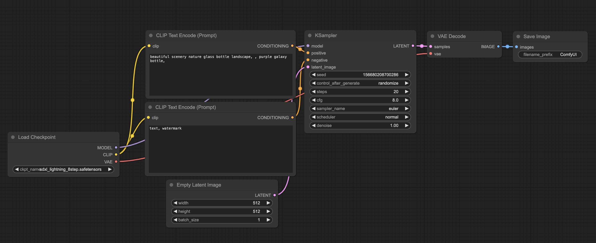

`ComfyUI` は、強力でモジュール化された `Stable Diffusion` のグラフィカルユーザーインターフェース（GUI）およびバックエンドツールです。グラフ、ノード、フローチャートベースのインターフェースを提供し、複雑な Stable Diffusion ワークフローを設計および実行できます。以下の特徴と機能があります:

1. ノード/グラフ/フローチャートインターフェース：コードを記述せずに複雑な Stable Diffusion ワークフローを実験・作成できます。
2. 包括的なサポート：`ComfyUI` は SD1.x、SD2.x、SDXL、Stable Video Diffusion、Stable Cascade をサポートしています。
3. 非同期キューシステム：最適化されたキューシステムにより、ワークフローの変更部分のみが再実行されます。
4. 低 VRAM サポート：`--lowvram` オプションを使用すると、3GB 未満の VRAM の GPU でも実行可能です（VRAM が低い GPU では自動的に有効化されます）。
5. オフライン動作：`ComfyUI` は完全にオフラインで動作し、いかなるコンテンツもダウンロードしません。
6. モデルサポート：`ckpt`、`safetensors`、`diffusers` モデル/チェックポイント、およびスタンドアロンの `VAE` と `CLIP` モデルを読み込むことができます。
7. ワークフローの保存/読み込み：ワークフローを JSON ファイルとして保存し、生成された PNG ファイルから完全なワークフロー（シードを含む）を読み込むことができます。

`ComfyUI` を使用すると、簡単に画像を生成できます。

本機の環境:
- 16インチ MacBook Pro（Apple Silicon M1 Pro）
- 16GB unified memory
- 512GB SSD
- macOS Sonoma 14.4 (23E214)

## Python 環境
macOS には標準で python3 がインストールされています。コマンド実行時に手動で置き換える手間を省くため、以下の設定を行います。
```bash
$ vim ~/.zshrc
// 以下の3行を追加
export PATH="/Users/tony/Library/Python/3.9/bin:$PATH"
alias python='python3'
alias pip='pip3'
$ source ~/.zshrc
```

## torch
```bash
$ pip install --pre torch torchvision torchaudio --extra-index-url https://download.pytorch.org/whl/nightly/cpu
```

## コードリポジトリとモデル
コードリポジトリ：[https://github.com/comfyanonymous/ComfyUI.git](https://github.com/comfyanonymous/ComfyUI.git)

モデルは **models/checkpoints** ディレクトリに配置します。

`ComfyUI` ディレクトリに移動し、依存関係をインストールします。

```bash
$ pip install -r requirements.txt
```

インストール時に以下のエラーが発生します。
```
/Users/tony/Library/Python/3.9/lib/python/site-packages/urllib3/__init__.py:35:
NotOpenSSLWarning: urllib3 v2 only supports OpenSSL 1.1.1+,
currently the 'ssl' module is compiled with 'LibreSSL 2.8.3'.
See: https://github.com/urllib3/urllib3/issues/3020
```

これは openssl のコンパイルバージョンに問題があることを示しています。LibreSSL をダウングレードする必要があります。
```bash
$ openssl version
LibreSSL 3.3.6
$ pip install urllib3==1.26.6
```

## 実行
```bash
$ python main.py --force-fp16
Total VRAM 16384 MB, total RAM 16384 MB
Forcing FP16.
Set vram state to: SHARED
Device: mps
VAE dtype: torch.float32
Using sub quadratic optimization for cross attention, if you have memory or speed issues try using: --use-split-cross-attention
Starting server

To see the GUI go to: http://127.0.0.1:8188
```

```alert
type: warning
description: macOS Ventura では正常に画像を生成できます。macOS Sonoma 14.4 (23E214) では GPU アクセラレーションが無効になり、ベタ塗りの画像が生成される場合があります。回避策として -cpu パラメータを追加してください。ただし、画像生成が遅くなることに注意してください。
```

参考文献
1. [comfyanonymous/ComfyUI](https://github.com/comfyanonymous/ComfyUI.git)
2. [Accelerated PyTorch training on Mac](https://developer.apple.com/metal/pytorch/)
3. [ImportError: urllib3 v2.0 only supports OpenSSL 1.1.1+, currently the 'ssl' module is compiled with LibreSSL 2.8.3](https://stackoverflow.com/questions/76187256/importerror-urllib3-v2-0-only-supports-openssl-1-1-1-currently-the-ssl-modu)
4. [ComfyUI outputs Rothko-esque solid color images](https://github.com/comfyanonymous/ComfyUI/issues/2992)
