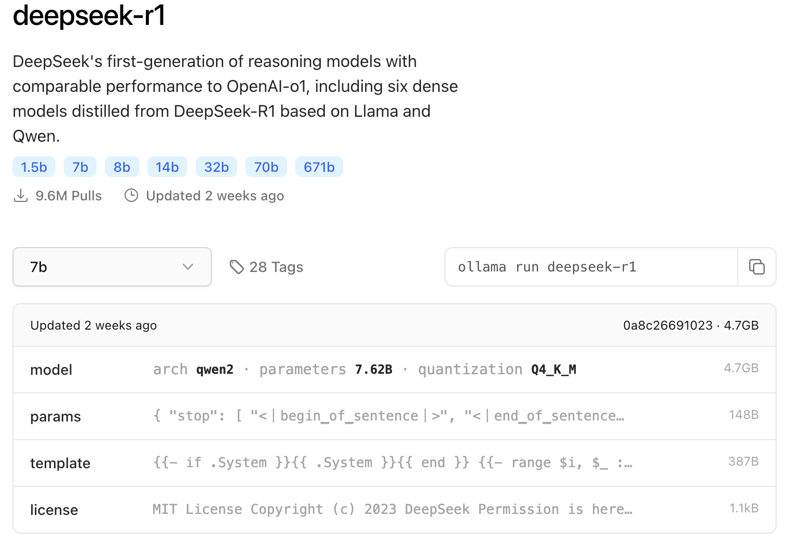
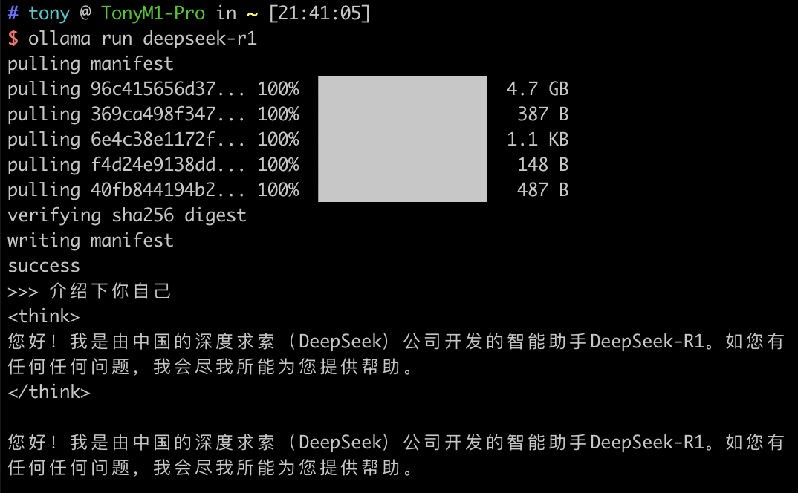
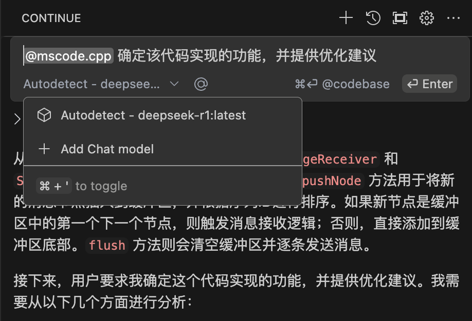
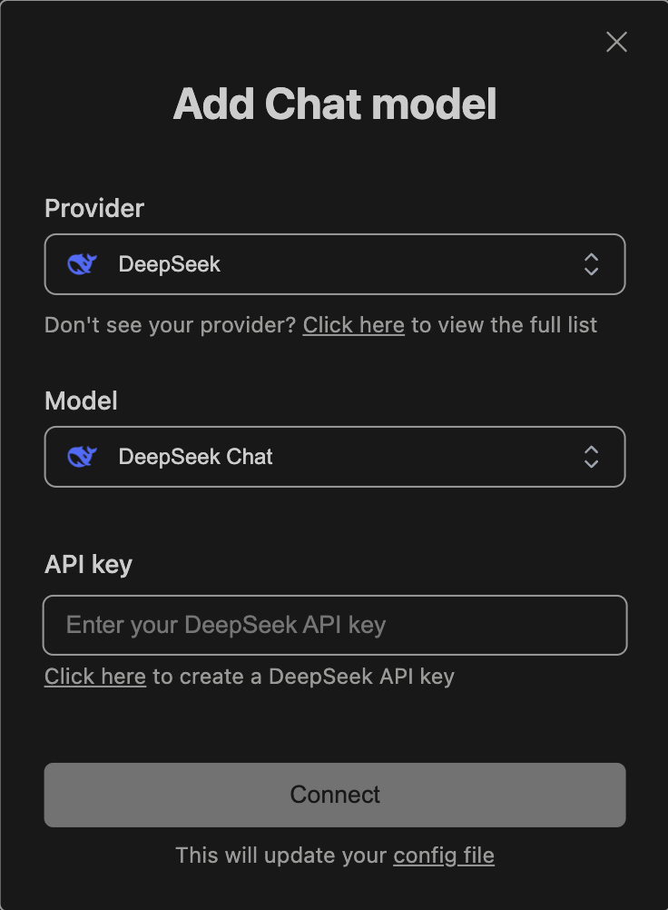

## Ollama と DeepSeek とは？
Ollama
Ollama は、AI モデルをローカルにデプロイおよび管理するためのツールです。開発者はクラウドサービスに依存することなく、ローカル環境でさまざまな AI モデルを実行できます。Ollama はシンプルなコマンドラインインターフェースを提供し、モデルのデプロイと管理を非常に容易にします。

DeepSeek
DeepSeek は、AI ベースのコード補完ツールであり、コンテキストに応じてインテリジェントなコード提案を提供します。DeepSeek は複数のプログラミング言語をサポートしており、API を通じて VSCode、IntelliJ IDEA などのさまざまな開発環境に統合できます。


## macOS で Ollama を使って DeepSeek をデプロイする
まず、macOS に Ollama をインストールする必要があります。Ollama は Homebrew を使ってインストールできます。

```bash
brew install ollama
```

Deepseek モデルのダウンロード
ollama の [deepseek library](https://ollama.com/library/deepseek-r1) にアクセスします。
モデルを選択し、対応するコマンドを実行します。ここでは 7b のデフォルトバージョンを使用します。


```bash
ollama run deepseek-r1
```
実行に成功すると、対話ができるようになります。



## VSCode に DeepSeek を統合する

### ローカルモデルの統合
以下のコマンドを実行して、ローカルモデルのサーバーを起動します。
```bash
ollama serve
```
VSCode の拡張機能マーケットプレイスで Continue を検索し、インストール後にローカルの Deepseek モデルに接続します。




### オンラインモデルの統合
[DeepSeek オープンプラットフォーム](https://platform.deepseek.com/api_keys) で API キーを申請し、VSCode に該当するキーを追加します。


