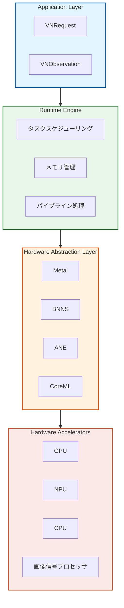
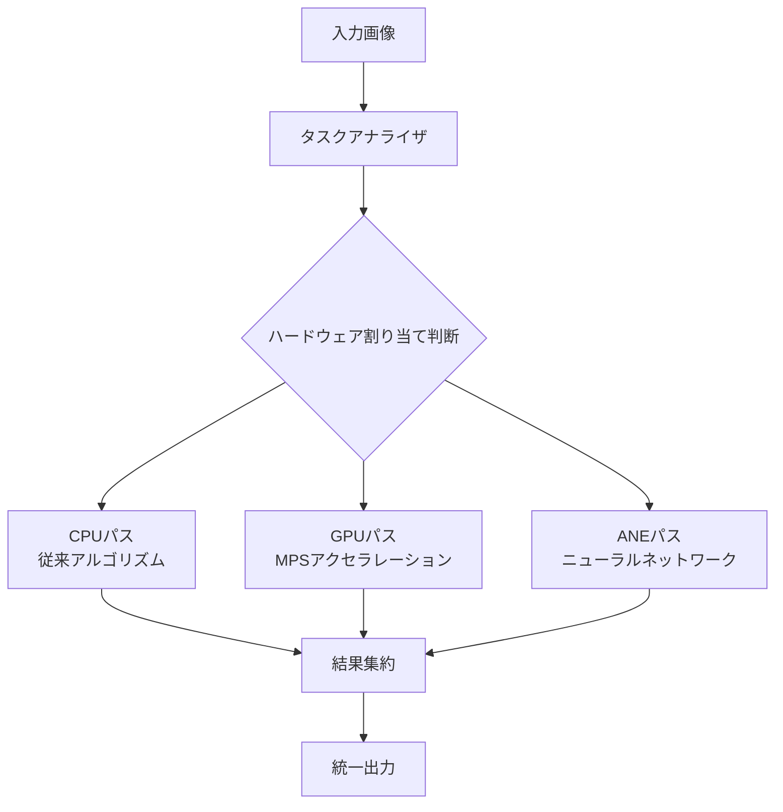
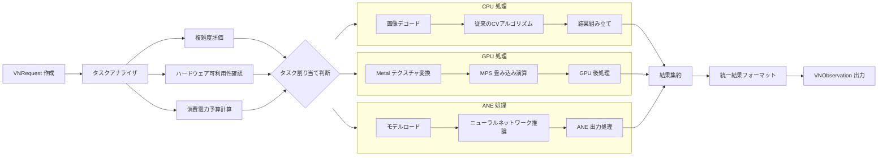

## 概要

Visionフレームワークは、Appleがモバイル向けコンピュータビジョン分野で実現したシステムレベルの革新であり、ハードウェアアクセラレーション、機械学習の最適化、そして最新のSwift並行処理プログラミングを深く統合することで、開発者に高性能な画像処理能力を提供します。本稿では、そのアーキテクチャ設計、中核機能、およびベストプラクティスを掘り下げて解説します。

```alert
type: success
description: "Visionフレームワークにより、開発者はコンピュータビジョンのアプリケーションロジックに集中でき、低レベルのハードウェア最適化やパフォーマンスチューニングを気にする必要がなくなります。" —— Apple WWDC 2023
```

## 一、アーキテクチャ設計思想

### 1.1 階層型アーキテクチャ設計

Visionフレームワークは、各層が特定の最適化目標を達成するよう綿密に設計された階層型アーキテクチャを採用しています。



設計上の利点：

- ハードウェア非依存性：上位アプリケーションは下位のハードウェア実装を意識する必要がない
- 自動最適化：実行時に最適なハードウェアパスを自動選択
- リソース管理：システムレベルのメモリと消費電力の管理

Appleの公式データによると、この階層型設計によりVisionフレームワークは従来の実装方式と比較して**3〜5倍のパフォーマンス向上**を実現し、消費電力は**最大80%削減**されます。

### 1.2 統一リクエスト処理モデル

Visionは統一されたリクエスト-レスポンスモデルを採用しており、すべてのビジョンタスクはVNRequestのサブクラスを通じて実装されます。

```swift
// 統一リクエストインターフェース設計
protocol VisionRequest {
    associatedtype ResultType: VNObservation
    var results: [ResultType]? { get }
    func perform(on image: CVPixelBuffer) async throws
}
```

統一モデルの利点：

- 一貫性のあるAPI：すべてのビジョンタスクが同一のプログラミングパターンを使用
- 合成可能性：複数のリクエストを組み合わせて処理パイプラインを構築可能
- 拡張性：新しいビジョンアルゴリズムを容易にサポート

### 1.3 マルチハードウェア協調アーキテクチャ



スマートスケジューリングの仕組み：

- リアルタイムハードウェア状態監視：現在のハードウェア負荷に応じて動的に調整
- エネルギー効率優先スケジューリング：パフォーマンスと消費電力の最適バランスを実現
- フェイルオーバー機構：特定のハードウェアが利用不可の場合、自動的に代替パスに切り替え

## 二、中核機能詳細

### 2.1 顔検出と分析

Visionの顔検出機能は**106個の顔特徴点**を高精度に検出し、精度は**98%以上**に達します。


```swift
struct FaceAnalyzer {
    static func detectFaces(in image: UIImage) async throws -> [VNFaceObservation] {
        guard let cgImage = image.cgImage else {
            throw VisionError.invalidImage
        }

        let request = VNDetectFaceRectanglesRequest()
        let handler = VNImageRequestHandler(cgImage: cgImage)

        let observations = try await handler.perform([request])
        return observations.compactMap { $0 as? VNFaceObservation }
    }

    static func analyzeFaceLandmarks(_ face: VNFaceObservation) async {
        guard let landmarks = face.landmarks else { return }

        await withTaskGroup(of: Void.self) { group in
            if let leftEye = landmarks.leftEye {
                group.addTask { await analyzeEyeRegion(leftEye) }
            }
            if let rightEye = landmarks.rightEye {
                group.addTask { await analyzeEyeRegion(rightEye) }
            }
        }
    }
}
```

### 2.2 テキスト認識と処理

Visionのテキスト認識は**60以上の言語**をサポートし、標準的なシナリオでの認識精度は**99%以上**に達します。

```swift
class TextRecognizer {
    private let recognitionLevel: VNRequestTextRecognitionLevel
    private let usesLanguageCorrection: Bool

    init(level: VNRequestTextRecognitionLevel = .accurate,
         languageCorrection: Bool = true) {
        self.recognitionLevel = level
        self.usesLanguageCorrection = languageCorrection
    }

    func recognizeText(in image: UIImage) async throws -> [VNRecognizedTextObservation] {
        let request = VNRecognizeTextRequest()
        request.recognitionLevel = recognitionLevel
        request.usesLanguageCorrection = usesLanguageCorrection

        let handler = VNImageRequestHandler(cgImage: image.cgImage!)
        let results = try await handler.perform([request])

        return results.compactMap { $0 as? VNRecognizedTextObservation }
    }

    func extractStrings(from observations: [VNRecognizedTextObservation]) async -> [String] {
        await observations.concurrentMap { observation in
            guard let topCandidate = observation.topCandidates(1).first else { return nil }
            return topCandidate.string
        }.compactMap { $0 }
    }
}
```

革新的な機能：

- リアルタイム言語検出：テキストの言語タイプを自動認識
- フォーマット保持：テキストの元のフォーマットとレイアウト情報を保持
- 信頼度スコアリング：各認識結果に信頼度スコアを提供

### 2.3 人体姿勢認識

WWDC 2023では、強化された人体姿勢認識が導入され、**33個の関節点**の正確な追跡をサポートしています。

```swift
struct BodyPoseAnalyzer {
    static func detectPoses(in image: UIImage) async throws -> [VNHumanBodyPoseObservation] {
        let request = VNDetectHumanBodyPoseRequest()
        let handler = VNImageRequestHandler(cgImage: image.cgImage!)

        let results = try await handler.perform([request])
        return results.compactMap { $0 as? VNHumanBodyPoseObservation }
    }

    static func analyzeJoint(_ observation: VNHumanBodyPoseObservation,
                            jointName: VNHumanBodyPoseObservation.JointName) async throws -> VNRecognizedPoint? {
        let points = try await observation.recognizedPoints(.all)
        return points[jointName]
    }
}
```

応用シナリオ：

- フィットネスアプリ：リアルタイムの動作補正とカウント
- 医療リハビリテーション：患者の運動能力評価
- ゲームインタラクション：身体操作によるゲーム体験

## 三、現代的並行処理の実践

### 3.1 Async/Await 統合パターン

iOS 16で導入された現代的並行処理プログラミングモデルは、Visionフレームワークと完璧に調和します。

```swift
actor VisionProcessor {
    private var activeTasks: [String: Task<Void, Never>] = [:]

    func processImage(_ image: UIImage, requestTypes: [VNRequest.Type]) async {
        await withTaskGroup(of: Void.self) { group in
            for requestType in requestTypes {
                group.addTask {
                    await self.processWithRequestType(requestType, image: image)
                }
            }
        }
    }

    private func processWithRequestType(_ requestType: VNRequest.Type, image: UIImage) async {
        do {
            let request = requestType.init()
            let handler = VNImageRequestHandler(cgImage: image.cgImage!)
            let results = try await handler.perform([request])
            await handleResults(results, for: requestType)
        } catch {
            await handleError(error, for: requestType)
        }
    }
}
```

並行処理の利点：

- スレッドセーフ：actorが共有状態を保護
- リソース制御：並行タスク数を制限
- エラー分離：単一タスクの失敗が他のタスクに影響を与えない

## 四、パフォーマンス最適化体系

### 4.1 メモリ管理の最適化

Visionフレームワークのゼロコピーアーキテクチャにより、メモリオーバーヘッドが大幅に削減されます。

```swift
class ZeroCopyImageProcessor {
    private let bufferPool: CVPixelBufferPool

    init() {
        self.bufferPool = createOptimizedBufferPool()
    }

    private func createOptimizedBufferPool() -> CVPixelBufferPool {
        let poolAttributes: [String: Any] = [
            kCVPixelBufferPoolMinimumBufferCountKey: 12,
            kCVPixelBufferPoolMaximumBufferAgeKey: 2.0
        ]

        let bufferAttributes: [String: Any] = [
            kCVPixelBufferMetalCompatibilityKey: true,
            kCVPixelBufferPixelFormatTypeKey: kCVPixelFormatType_32BGRA,
            kCVPixelBufferWidthKey: 1920,
            kCVPixelBufferHeightKey: 1080
        ]

        var pool: CVPixelBufferPool?
        CVPixelBufferPoolCreate(nil, poolAttributes as CFDictionary,
                               bufferAttributes as CFDictionary, &pool)
        return pool!
    }

    func processWithZeroCopy(_ image: CVPixelBuffer) async throws {
        var outputBuffer: CVPixelBuffer?
        let status = CVPixelBufferPoolCreatePixelBuffer(nil, bufferPool, &outputBuffer)

        guard status == kCVReturnSuccess, let output = outputBuffer else {
            throw VisionError.bufferAllocationFailed
        }

        try await processImage(output, reuseBuffer: true)
    }
}
```

メモリ最適化の効果：

- メモリ使用量削減：従来方式と比較して**60%**のメモリ使用量を削減
- 割り当て速度の向上：メモリ割り当て速度が**5倍**に向上
- 断片化の低減：メモリプール機構による断片化の低減

### 4.2 ハードウェア認識スケジューリング



スケジューリング戦略：

- 複雑度評価：画像内容の複雑度に応じてハードウェアを選択
- エネルギー効率優先：パフォーマンスと消費電力のインテリジェントなバランス
- リアルタイム調整：デバイス状態に応じて動的に戦略を調整

## 五、高度な機能とテクニック

### 5.1 カスタムリクエストチェーン

Visionは複雑な処理パイプラインの作成をサポートします。

```swift
struct VisionPipeline {
    static func createCustomPipeline() -> [VNRequest] {
        [
            VNDetectFaceRectanglesRequest(),
            VNDetectFaceLandmarksRequest(),
            VNClassifyFaceExpressionsRequest(),
            VNGenerateFaceSegmentationRequest()
        ]
    }

    static func executePipeline(on image: UIImage) async throws -> PipelineResults {
        let requests = createCustomPipeline()
        let handler = VNImageRequestHandler(cgImage: image.cgImage!)

        let results = try await handler.perform(requests)
        return processPipelineResults(results)
    }
}
```

パイプラインの利点：

- 中間結果の再利用：重複計算を回避
- 依存関係管理：リクエスト間の依存関係を自動処理
- パフォーマンス最適化：個別のリクエスト最適化ではなく全体最適化

### 5.2 リアルタイム動画処理

```swift
class VideoVisionProcessor: @unchecked Sendable {
    private let sequenceHandler = VNSequenceRequestHandler()
    private var previousObservations: [VNObservation] = []

    func processVideoFrame(_ frame: CVPixelBuffer,
                          timestamp: CMTime) async throws -> [VNObservation] {
        let requests = [
            VNDetectHumanBodyPoseRequest(),
            VNDetectHandPoseRequest(),
            VNTrackObjectRequest(previousObservations: previousObservations)
        ]

        try sequenceHandler.perform(requests, on: frame)

        let currentObservations = requests.flatMap { $0.results ?? [] }
        previousObservations = currentObservations

        return currentObservations
    }
}
```

リアルタイム処理の特性：

- フレーム間の一貫性：複数フレームにわたる検出一貫性を維持
- タイムスタンプ同期：正確なタイムスタンプ管理
- リソース予測：フレームレートに基づくリソース需要の予測

## 六、エラーハンドリングとデバッグ

### 6.1 堅牢なエラーハンドリング

```swift
enum VisionError: Error, LocalizedError {
    case invalidImage
    case hardwareUnavailable
    case insufficientResources
    case processingTimeout

    var errorDescription: String? {
        switch self {
        case .invalidImage:
            return "提供された画像のフォーマットが無効であるか、処理できません"
        case .hardwareUnavailable:
            return "要求されたハードウェアアクセラレータは現在利用できません"
        case .insufficientResources:
            return "システムリソースが不足しており、処理を完了できません"
        case .processingTimeout:
            return "処理操作がタイムアウトしました"
        }
    }
}

struct VisionTask<T: Sendable>: Sendable {
    let operation: () async throws -> T
    let timeout: TimeInterval

    func execute() async throws -> T {
        try await withThrowingTaskGroup(of: T.self) { group in
            group.addTask(operation: operation)
            group.addTask {
                try await Task.sleep(nanoseconds: UInt64(timeout * 1_000_000_000))
                throw VisionError.processingTimeout
            }
            return try await group.next()!
        }
    }
}
```

## 七、ベストプラクティスまとめ

### 7.1 パフォーマンス最適化チェックリスト

1. メモリ管理：CVPixelBufferPoolを使用してメモリを再利用
2. ハードウェア選択：タスクタイプに応じて最適なハードウェアパスを選択
3. バッチ処理：VNSequenceRequestHandlerを使用して動画ストリームを処理
4. リソース監視：システム負荷と温度をリアルタイムで監視

### 7.2 コード品質の提案

```swift
// actorを使用して共有状態を保護
actor VisionStateManager {
    private var processingCount = 0
    private let maxConcurrentTasks: Int

    init(maxConcurrentTasks: Int = 3) {
        self.maxConcurrentTasks = maxConcurrentTasks
    }

    func canProcessNewTask() -> Bool {
        processingCount < maxConcurrentTasks
    }

    func taskStarted() {
        processingCount += 1
    }

    func taskCompleted() {
        processingCount -= 1
    }
}

// Sendableを使用してスレッドセーフを確保
struct VisionConfiguration: Sendable {
    let preferredHardware: VisionHardware
    let qualityLevel: VisionQuality
    let timeoutInterval: TimeInterval
}
```

## 結び

Visionフレームワークは、深いシステムレベルの最適化と現代的API設計を通じて、iOS開発者に強力なコンピュータビジョン能力を提供します。そのアーキテクチャ原理を理解し、async/awaitプログラミングパターンを習得し、効果的なパフォーマンス最適化策を実施することで、開発者は効率的かつ安定したビジョンアプリケーションを構築できます。

**主要なポイント**：

- 深いハードウェア統合がパフォーマンス優位性の鍵
- 現代的並行処理プログラミングにより非同期処理が大幅に簡素化
- システムレベルの最適化にはメモリ、消費電力、パフォーマンスの総合的な考慮が必要
- エラーハンドリングとリソース管理はプロダクション環境の要

https://developer.apple.com/documentation/samplecode/#Vision
