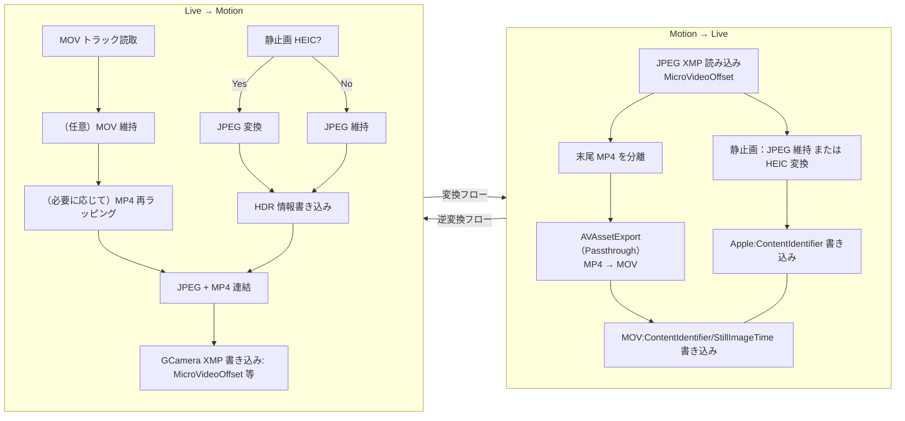

## 概要
本稿では Google Motion Photo と Apple Live Photo のファイル構造、メタデータ仕様、相互変換の手法を体系的に整理し、「可能な限りロスレス」を目指した双方向変換方法を解説します。HDR GainMap や深度情報などの Auxiliary Data の保持戦略と能力限界についても取り上げ、再利用可能な Swift パッケージとサンプルコードを提供します。

```alert
type: success
description: 結論を先に述べます。変換処理はロスレスではありません。画像に他の情報が含まれている場合、相手側のデータ形式がその情報を保持できず、欠落が生じます。特に UltraHDR（JPEG + GainMap）→ HEIC（GainMap）および HEIC（Depth）→ Motion Photo の方向で顕著です。推奨戦略は、元のコンテナと付加画像データを優先的に保持し、コンテナをまたぐ必要がある場合は「メタデータと動画を無再エンコードでコピー + 静止画を最小限の再エンコード/抽出 + ペアリング/オフセットメタデータの明示的書き込み」の組み合わせパスを採用することです。
```

## 一、形式構造クイックリファレンス
### 1.1 Google Motion Photo（JPEG コンテナ + 末尾 MP4）
- 静止画：`JPEG` 主画像
- オプションのゲインマップ：`JPEG` HDR GainMap（UltraHDR）
- 動画：`MP4` バイトストリームを JPEG 末尾に直接連結（同一ファイル内）
- 主要 XMP（名前空間 `GCamera`/`GContainer`、機種/バージョンにより若干異なる）：

| XMP キー | 型 | 説明 |
| --- | --- | --- |
| `GCamera:MotionPhoto` | Integer | `1` は Motion Photo、`0`/未指定は通常静止画 |
| `GCamera:MotionPhotoVersion` | Integer | Motion Photo ファイル形式のバージョン |
| `GCamera:MicroVideo` | Integer | 初期仕様、非推奨。Motion Photo かどうかのブーリアンスイッチ |
| `GCamera:MicroVideoVersion` | Integer | 初期仕様、非推奨。MicroVideo メタデータバージョン、一般的な値は `1` |
| `GCamera:MicroVideoOffset` | Long | 初期仕様、非推奨。末尾 MP4 の開始オフセット（バイト） |
| `GCamera:MicroVideoPresentationTimestampUs` | Long | 初期仕様、非推奨。静止画に合わせた動画フレームのタイムスタンプ（マイクロ秒、`-1` の場合あり） |
| `GContainer:Directory` + `Item:Length` | Struct | 主画像、ゲインマップ、動画などのセマンティック項目とその長さを記述 |

> 仕様の改訂に伴い、`GContainer:Directory` の `Item:Length` は `MicroVideoOffset` がない場合に動画の開始位置を特定する補助として利用できます。

一般的な Motion Photo の XMP セクション：
```
<x:xmpmeta xmlns:x="adobe:ns:meta/" x:xmptk="Adobe XMP Core 5.1.0-jc003">
  <rdf:RDF xmlns:rdf="http://www.w3.org/1999/02/22-rdf-syntax-ns#">
    <rdf:Description rdf:about=""
        xmlns:hdrgm="http://ns.adobe.com/hdr-gain-map/1.0/"
        xmlns:Container="http://ns.google.com/photos/1.0/container/"
        xmlns:Item="http://ns.google.com/photos/1.0/container/item/"
        xmlns:GCamera="http://ns.google.com/photos/1.0/camera/"
      hdrgm:Version="1.0"
      GCamera:MotionPhoto="1"
      GCamera:MicroVideoVersion="1"
      GCamera:MicroVideo="1"
      GCamera:MicroVideoOffset="9871716"
      GCamera:MicroVideoPresentationTimestampUs="926668">
      <Container:Directory>
        <rdf:Seq>
          <rdf:li rdf:parseType="Resource">
            <Container:Item
              Item:Semantic="Primary"
              Item:Mime="image/jpeg"/>
          </rdf:li>
          <rdf:li rdf:parseType="Resource">
            <Container:Item
              Item:Semantic="GainMap"
              Item:Mime="image/jpeg"
              Item:Length="243988"/>
          </rdf:li>
          <rdf:li rdf:parseType="Resource">
            <Container:Item
              Item:Semantic="MotionPhoto"
              Item:Mime="video/mp4"
              Item:Length="9871716"/>
          </rdf:li>
        </rdf:Seq>
      </Container:Directory>
    </rdf:Description>
  </rdf:RDF>
</x:xmpmeta>
```

HEIC Motion Photo の構造例


### 1.2 Apple Live Photo（HEIC/JPEG 静止画 + 独立 MOV 動画）
- 静止画：`HEIC`（優先）または `JPEG`
- 動画：独立した `MOV`（H.264/HEVC、通常は音声トラックを含む）
- オプションの Auxiliary：HEIC に Depth、Segmentation、GainMap などの補助プレーンを保持可能
- 主要なペアリング識別子（静止画と動画で一致が必要）：
  - `ContentIdentifier`（HEIC：Apple XMP、MOV：QuickTime Metadata）
  - `StillImageTime`（MOV の静止フレームタイムスタンプ、通常 `0`）

HEIC Live Photo の構造例


## 二、相互変換の戦略と能力限界
### 2.1 Motion Photo → Live Photo
- 動画：直接**無再エンコードでコピー**して `mov`（コンテナ再ラッピング）。
- 静止画：`JPEG` をそのまま Live Photo 静止画として使用可能（iOS で認識可）。`HEIC` が必要な場合のみ変換する。
- HDR GainMap：
  - ソースが Google UltraHDR（JPEG 内蔵 GainMap）の場合、現在の汎用ツールでは「JPEG GainMap → HEIC GainMap」の自動移行サポートは限定的。JPEG 静止画を保持（iOS 上のシステムレベル HDR 表示は犠牲になる）するか、実験的ライブラリを使用した移行を推奨（「応用編：HDR 移行」参照）。
- Depth/セマンティックセグメンテーションなどの Auxiliary：Motion Photo（JPEG コンテナ）は通常 HEIF スタイルの Auxiliary 画像を持たないため、HEIC 移行時には新たな Auxiliary 画像の追加が必要（「応用編：Auxiliary 移行」参照）。

### 2.2 Live Photo → Motion Photo
- 動画：`MOV → MP4` **無再エンコードでコピー**。
- 静止画：`HEIC` の場合は `JPEG` に変換して Motion Photo の主画像とする（HEIC 本来の Auxiliary（Depth/GainMap など）は失われる）。
- HDR/Depth：Motion Photo（JPEG コンテナ）には標準化された HEIF Auxiliary の格納手段がない。JPEG 変換後、HDR GainMap と Depth を「等価に」保存することは通常困難（カスタム XMP/APP セグメントに移行する場合もエコシステムのサポートは限定的）。

## 三、カプセル化変換ツール Swift Package：MotionLiveKit（iOS/macOS 対応）
アプリやツールで再利用しやすいよう、Live Photo と Motion Photo の相互変換を統一的に行う Swift Package の設計と主要実装例を示します。メタデータの読み書きは Exiv2（C++）で実装し、Swift は C インターフェースを介してブリッジします。写真ライブラリへの書き込みには Photos.framework を使用します。

### 3.1 パッケージ構造
```text
MotionLiveKit/
├─ Package.swift
├─ Sources/
│  └─ MotionLiveKit/
│     ├─ MotionLiveKit.swift            # 公開 API（Swift）
│     ├─ LivePhotoConverter.swift       # Live Photo 方向の実装
│     ├─ MotionPhotoConverter.swift     # Motion Photo 方向の実装
│     ├─ PhotosWriter.swift             # 写真ライブラリ書き込み（iOS/macOS Photos）
│     ├─ FileIO.swift                   # サンドボックス/一時ファイルと検証
│     ├─ Exiv2Bridge.h                  # C ブリッジヘッダ（Swift 呼び出し用）
│     ├─ Exiv2Bridge.cpp                # C++ 実装、Exiv2 呼び出し
│     └─ include/module.modulemap       # モジュールマップ（必要に応じて）
└─ Externals/
   └─ exiv2/                            # ビルド成果物またはサブモジュール（静的ライブラリ＋ヘッダ）
```

### 3.2 Package.swift（要点）
```swift
// swift-tools-version: 5.9
import PackageDescription

let package = Package(
    name: "MotionLiveKit",
    platforms: [
        .iOS(.v15), .macOS(.v12)
    ],
    products: [
        .library(name: "MotionLiveKit", targets: ["MotionLiveKit"])
    ],
    targets: [
        .target(
            name: "MotionLiveKit",
            dependencies: [],
            path: "Sources/MotionLiveKit",
            publicHeadersPath: ".",
            cSettings: [
                .headerSearchPath("."),
                .headerSearchPath("../Externals/exiv2/include")
            ],
            cxxSettings: [
                .headerSearchPath("."),
                .headerSearchPath("../Externals/exiv2/include"),
                .define("EXIV2_ENABLE_XMP")
            ],
            linkerSettings: [
                .linkedLibrary("c++"),
                .linkedLibrary("z"),
                .linkedLibrary("iconv"),
                .linkedLibrary("expat"),
                .linkedLibrary("exiv2")
            ]
        )
    ]
)
```

注意：`linkedLibrary("exiv2")` は実際の統合方式と一致させる必要があります（3.6 参照）。

### 3.3 公開 API（Swift）
```swift
public struct MotionLiveKit {
    public enum MLKError: Error {
        case invalidInput
        case metadataReadFailed
        case metadataWriteFailed
        case muxFailed
        case demuxFailed
        case fileIOFailed
        case photoAuthorizationDenied
    }

    public struct LivePhotoPair {
        public let stillURL: URL   // HEIC または JPEG
        public let videoURL: URL   // MOV
        public let contentIdentifier: String
        public init(stillURL: URL, videoURL: URL, contentIdentifier: String) {
            self.stillURL = stillURL
            self.videoURL = videoURL
            self.contentIdentifier = contentIdentifier
        }
    }

    public static func motionToLive(motionJPG: URL, preferHEIC: Bool = false, workDir: URL? = nil) async throws -> LivePhotoPair
    public static func liveToMotion(still: URL, videoMOV: URL, outputJPG: URL) async throws -> URL

    // iOS/macOS: システム写真ライブラリに保存（Photos 権限が必要）
    #if canImport(Photos)
    @discardableResult
    public static func saveLiveToPhotos(_ pair: LivePhotoPair) async throws -> String
    #endif
}
```

### 3.4 変換フローとコードマッピング


- 対応 API/モジュール：
  - 画像 XMP 読み書き：`Exiv2Bridge`（C/C++）
  - MOV メタデータ書き込み：`writeMOVPairing`（AVFoundation）
  - 上位エントリ：`MotionLiveKit.motionToLive`、`MotionLiveKit.liveToMotion`

### 3.5 主要実装のポイント
- Motion → Live：
  - JPEG 内の XMP を解析し `MicroVideoOffset` を取得。末尾 MP4 を一時ファイル `motion.mp4` に分離。`AVAssetExport` を使用して `motion.mov` に再ラッピング（`passthrough`、無再エンコード）。
  - 主画像：JPEG をそのまま still として使用。`preferHEIC` の場合は `CoreImage + ImageIO` または `libheif` を統合して HEIC に変換（再エンコード）。
  - ペアリングメタデータの書き込み：
    - 静止画（HEIC/JPEG）に `Apple:ContentIdentifier` を書き込み
    - MOV に `QuickTime:ContentIdentifier` と `QuickTime:StillImageTime=0` を書き込み
  - 上記メタデータは Exiv2Bridge で実装（3.7 参照）。

- Live → Motion：
  - 静止画が HEIC の場合は JPEG に変換（再エンコード、不可逆）。
  - MOV → MP4 再ラッピング（無再エンコード）。
  - JPEG のバイト数を計算し、`JPEG + MP4` を連結して `motion_photo.jpg` を出力。
  - `XMP-GCamera:MotionPhoto=1`、`MicroVideoOffset` などのキーを書き込み。

### 3.6 iOS/macOS での Exiv2 の使用方法
Exiv2 は C++ ライブラリであり、静的ライブラリにコンパイルしてパッケージに同梱するか、サブモジュールとして統合する必要があります。

- macOS（x86_64/arm64 ユニバーサル）：
  - CMake を使用：`cmake -DCMAKE_BUILD_TYPE=Release -DEXIV2_ENABLE_XMP=ON -DEXIV2_BUILD_SHARED_LIBS=OFF ..`、`make` 後に `libexiv2.a` とヘッダファイルを取得。
- iOS（デバイス + シミュレータ）：
  - CMake ツールチェーンまたは Xcode Toolchain を使用し、`arm64`、`x86_64`（シミュレータ）それぞれに `libexiv2.a` をコンパイル。
  - `lipo -create` で `libexiv2_universal.a` に統合、または XCFramework を使用：
    - `xcodebuild -create-xcframework -library libexiv2_ios.a -headers include -library libexiv2_sim.a -headers include -output Exiv2.xcframework`
  - SPM ターゲットの `linkerSettings` で `.linkedFramework("Exiv2")` を使用するか、`.binaryTarget` で XCFramework を導入（バイナリ方式の場合）。

依存関係（一般的）：`z`、`iconv`、`expat`。コンパイルオプションは Exiv2 のバージョンと一致させる必要があります。XMP 書き込みが必要な場合は、必ず `EXIV2_ENABLE_XMP` マクロを有効にしてください。

### 3.7 Exiv2 ブリッジ（C インターフェース例）
`Exiv2Bridge.h`
```c
#pragma once
#include <stddef.h>
#ifdef __cplusplus
extern "C" {
#endif

// JPEG 内の GCamera MicroVideoOffset を読み込む。失敗時は -1 を返す
long mlk_read_micro_video_offset(const char* jpg_path);

// JPEG/HEIC に Apple:ContentIdentifier を書き込む（成功時 0 を返す）
int mlk_write_content_identifier(const char* image_path, const char* uuid_str);

// MOV に QuickTime:ContentIdentifier と StillImageTime=0 を書き込む（成功時 0 を返す）
int mlk_write_mov_pairing(const char* mov_path, const char* uuid_str, double still_time);

// GCamera XMP（MotionPhoto=1、MicroVideoOffset=off）を書き込む
int mlk_write_motion_xmp(const char* jpg_path, long offset);

#ifdef __cplusplus
}
#endif
```

`Exiv2Bridge.cpp`（疑似コードの要点）
```cpp
#include "Exiv2Bridge.h"
#include <exiv2/exiv2.hpp>

long mlk_read_micro_video_offset(const char* jpg_path) {
    try {
        auto image = Exiv2::ImageFactory::open(jpg_path);
        image->readMetadata();
        auto& xmp = image->xmpData();
        auto it = xmp.findKey(Exiv2::XmpKey("Xmp.GCamera.MicroVideoOffset"));
        if (it != xmp.end()) return it->toLong();
    } catch (...) {}
    return -1;
}

int mlk_write_content_identifier(const char* image_path, const char* uuid_str) {
    try {
        auto image = Exiv2::ImageFactory::open(image_path);
        image->readMetadata();
        auto& xmp = image->xmpData();
        xmp["Xmp.apple.ContentIdentifier"] = std::string(uuid_str);
        image->setXmpData(xmp);
        image->writeMetadata();
        return 0;
    } catch (...) { return -1; }
}

int mlk_write_mov_pairing(const char* mov_path, const char* uuid_str, double still_time) {
    // Exiv2 の MOV/QuickTime 書き込みサポートは限定的。代替案：
    // 1) Exiv2 の QuickTime サポートを使用（該当バージョンの場合）。
    // 2) AVFoundation によるメタデータ書き込みにフォールバック（Swift 側で処理）。
    return -1;
}

int mlk_write_motion_xmp(const char* jpg_path, long offset) {
    try {
        auto image = Exiv2::ImageFactory::open(jpg_path);
        image->readMetadata();
        auto& xmp = image->xmpData();
        xmp["Xmp.GCamera.MotionPhoto"] = 1;
        xmp["Xmp.GCamera.MotionPhotoVersion"] = 1;
        xmp["Xmp.GCamera.MicroVideo"] = 1;
        xmp["Xmp.GCamera.MicroVideoVersion"] = 1;
        xmp["Xmp.GCamera.MicroVideoOffset"] = static_cast<int64_t>(offset);
        image->setXmpData(xmp);
        image->writeMetadata();
        return 0;
    } catch (...) { return -1; }
}
```

注：MOV のメタデータについては、Swift 側で AVFoundation を使って QuickTime UserData/Metadata を書き込むことを推奨します（より安定しています）。

### 3.8 Swift 側：ペアリングメタデータと無再エンコード
MOV ペアリングの書き込み（AVFoundation）：
```swift
import AVFoundation

func writeMOVPairing(movURL: URL, contentID: String, stillTime: Double = 0) throws {
    let asset = AVURLAsset(url: movURL)
    let metadata = [
        AVMutableMetadataItem().apply { item in
            item.keySpace = .quickTimeMetadata
            item.key = AVMetadataKey.quickTimeMetadataKeyContentIdentifier as (NSCopying & NSObjectProtocol)?
            item.value = contentID as (NSCopying & NSObjectProtocol)?
        },
        AVMutableMetadataItem().apply { item in
            item.keySpace = .quickTimeMetadata
            item.key = AVMetadataKey.quickTimeMetadataKeyStillImageTime as (NSCopying & NSObjectProtocol)?
            item.value = stillTime as NSNumber
        }
    ]
    let outURL = movURL.deletingLastPathComponent().appendingPathComponent("tmp_\(UUID().uuidString).mov")
    let exporter = try AVAssetExportSession(asset: asset, presetName: AVAssetExportPresetPassthrough).unwrap()
    exporter.outputURL = outURL
    exporter.outputFileType = .mov
    exporter.metadata = metadata
    let group = DispatchGroup(); group.enter()
    exporter.exportAsynchronously { group.leave() }
    group.wait()
    guard exporter.status == .completed else { throw MotionLiveKit.MLKError.metadataWriteFailed }
    try FileManager.default.replaceItemAt(movURL, withItemAt: outURL)
}

extension Optional {
    func unwrap() throws -> Wrapped { if let v = self { return v }; throw MotionLiveKit.MLKError.invalidInput }
}

extension AVMutableMetadataItem {
    func apply(_ block: (AVMutableMetadataItem) -> Void) -> AVMutableMetadataItem { block(self); return self }
}
```

### 3.9 写真ライブラリ書き込みとサンドボックスパス
Live Photo をシステム写真ライブラリに保存（iOS/macOS Photos）：
```swift
import Photos

public func saveLiveToPhotos(_ pair: MotionLiveKit.LivePhotoPair) async throws -> String {
    let status = await PHPhotoLibrary.requestAuthorization(for: .readWrite)
    guard status == .authorized || status == .limited else { throw MotionLiveKit.MLKError.photoAuthorizationDenied }
    var localIdentifier = ""
    try await PHPhotoLibrary.shared().performChanges {
        let req = PHAssetCreationRequest.forAsset()
        let stillRes = PHAssetResourceCreationOptions()
        let vidRes = PHAssetResourceCreationOptions()
        req.addResource(with: .photo, fileURL: pair.stillURL, options: stillRes)
        req.addResource(with: .pairedVideo, fileURL: pair.videoURL, options: vidRes)
        localIdentifier = req.placeholderForCreatedAsset?.localIdentifier ?? ""
    }
    return localIdentifier
}
```

サンドボックス永続化ディレクトリ：
```swift
let documents = FileManager.default.urls(for: .documentDirectory, in: .userDomainMask).first!
// 例：documents.appendingPathComponent("MotionOutputs")
```

### 3.10 使用例
Motion Photo → Live Photo：
```swift
let input = URL(fileURLWithPath: "/path/to/input_motion.jpg")
let pair = try await MotionLiveKit.motionToLive(motionJPG: input, preferHEIC: false)
#if canImport(Photos)
let id = try await MotionLiveKit.saveLiveToPhotos(pair)
print("saved: \(id)")
#endif
```

Live Photo → Motion Photo：
```swift
let still = URL(fileURLWithPath: "/path/to/IMG_0001.HEIC")
let mov = URL(fileURLWithPath: "/path/to/IMG_0001.MOV")
let out = FileManager.default.urls(for: .documentDirectory, in: .userDomainMask).first!.appendingPathComponent("motion_photo.jpg")
let jpg = try await MotionLiveKit.liveToMotion(still: still, videoMOV: mov, outputJPG: out)
print("motion photo at: \(jpg.path)")
```

### 3.11 補足と制約
- Exiv2 の MOV 書き込みサポートはバージョンによって異なります。MOV メタデータは AVFoundation で書き込み、画像（JPEG/HEIC）は Exiv2 で書き込むことを推奨します。
- HEIC→JPEG は再エンコードです。「ロスレス」を目指すなら、JPEG/HEIC の元コンテナを保持し、動画トラックとメタデータのみを再ラッピングすべきです。
- HDR GainMap/Depth の移行には追加の作業が必要です。上記パッケージは基本的なメタデータのパスを提供しますが、GainMap/Depth のコンテナ間再構築は含みません。

## 四、応用編：HDR GainMap と Auxiliary の移行
### 4.1 UltraHDR（JPEG+GainMap）→ HEIC（GainMap）
- 現状：デスクトップ向け汎用ツールでは「JPEG の APP 領域にある GainMap を読み取り、HEIF Auxiliary:GainMap に変換する」サポートは限定的です。
- 推奨：
  - iOS 端末での視聴が目的の場合、ネイティブ HEIC（元からある場合）を優先使用。
  - ソースが UltraHDR JPEG のみで、HEIC への HDR 移行が必要な場合、`libultrahdr`/ベンダーツールに基づく実験的な変換を評価し、表示品質とシステム互換性を検証。
  - 実現不可能な場合は、SDR 主画像（主観的画質を優先）+ 元ファイルのバックアップ保存を採用。

### 4.2 HEIC Auxiliary（Depth/Segmentation/Disparity）
- 抽出と注入には通常、HEIF レベルの操作（libheif/専用 SDK）が必要です。
- 一般的な補助タイプ（例。デバイスによって命名が異なる場合あり）：
  - Depth：`urn:mpeg:hevc:2015:auxid:depth`
  - Disparity：`urn:mpeg:hevc:2015:auxid:depthmap`
  - Alpha/Segmentation：`urn:mpeg:hevc:2015:auxid:alpha`
- Motion Photo（JPEG）方向に変換する場合、これらの Auxiliary を等価に保持することは困難です。業務上必須の場合は、通常**独立したサイドカーファイル**やカスタム XMP ブロックに保存します（エコシステムのサポートは弱いです）。

## 五、検証とトラブルシューティング
### 5.1 よくある問題
- iOS が Live Photo を認識しない：両端の `ContentIdentifier` が一致しているか確認。`StillImageTime` が存在し、数値であるか確認。
- Pixel が Motion Photo を認識しない：`MicroVideoOffset` が結合前の JPEG の正確なバイト数であることを確認。動画が JPEG の後ろに配置されていることを確認。
- HEIC 変換後の色味/コントラストの変化：再エンコードと色空間/ICC プロファイルの設定が原因。ソースの ICC を保持し、エンコードパスでは高品質かつ高ビット深度を選択すること。
- HDR が機能しない：GainMap の移行能力の限界、またはターゲットシステムがその格納方式をサポートしていない可能性。

## 六、互換性に関する推奨事項
- 「コンテナ再ラッピング + メタデータ書き換え」の最小変更パスを優先する。
- エコシステム間の移行前に、ターゲットデバイス/アプリで実機検証を行う（写真アプリ、Google Photos、SNS プラットフォーム）。
- 元ファイルの完全なバックアップを保持する。実運用では各変換ステップのログとチェックサムを記録する。

## 七、おわりに
Motion Photo と Live Photo の相互変換において重要なのは、2 つのエコシステムのファイル構造、エンコード戦略、メタデータ契約を理解することです。実践では「無再エンコードを優先、メタデータを正確に書き込み、元ファイルを保持する」という原則に従うことで、互換性と画質のバランスを取ることができます。HDR GainMap や Depth などの高度な機能については、ビジネス要件とツールチェインの能力に応じて、元データを保持しつつ段階的に移行方法を改善していく必要があります。

## 付録：参考資料
- https://developer.android.com/media/platform/motion-photo-format?hl=zh-cn
- https://developer.apple.com/videos/play/wwdc2016/501/
