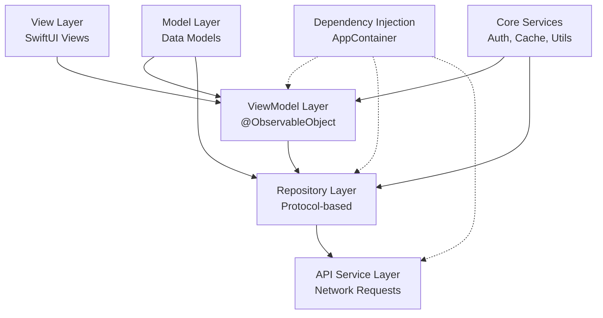
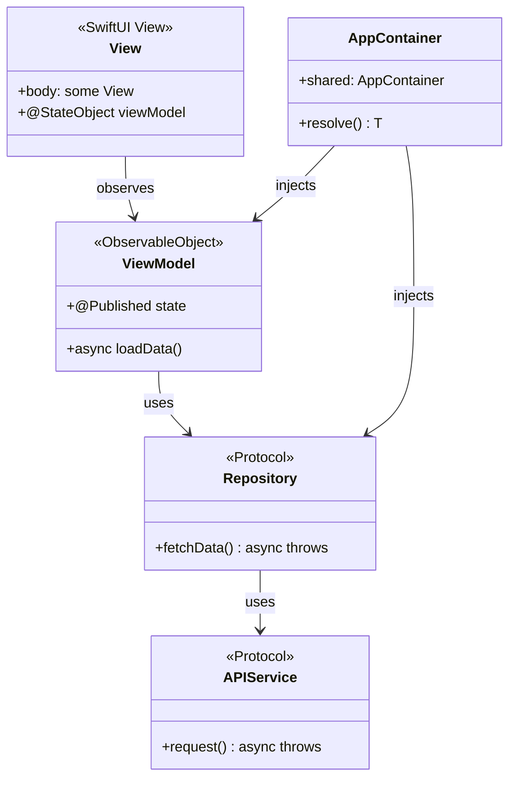
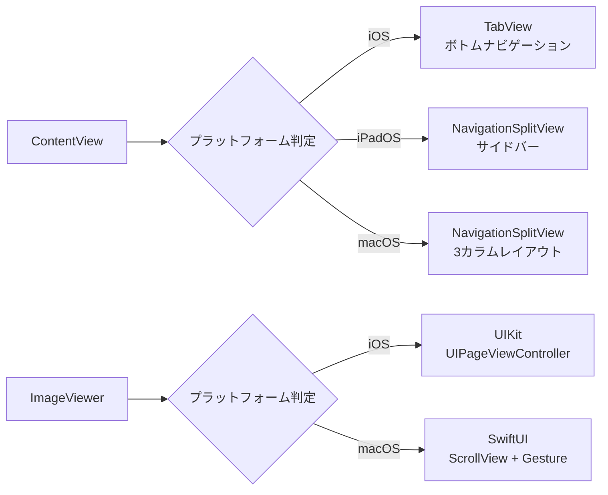
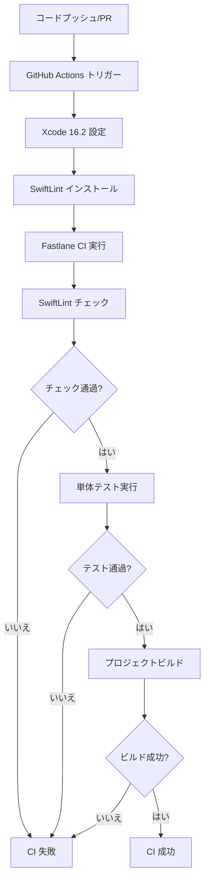
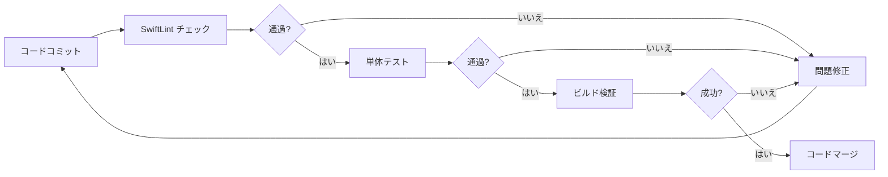

## 水木社区について

**水木社区**（[www.newsmth.net](https://www.newsmth.net)）は、清華大学に起源を持つ中国最古のBBSフォーラムの一つであり、20年以上の歴史があります。国内有数のテクノロジーコミュニティとして、水木社区には多くの技術愛好家、研究者、業界専門家が集まり、技術討論、学術交流、生活共有など多岐にわたる分野をカバーしています。

水木社区は、質の高い技術討論と活発なコミュニティ環境で知られ、多くの開発者や技術従事者が知識を得て経験を交換する重要なプラットフォームとなっています。

```alert
type: success
description: 本記事では、SwiftUI をベースに開発された水木社区マルチクライアント（iOS / iPadOS / macOS）の技術実装について、ソフトウェアエンジニアリングのアーキテクチャ設計、SwiftUI のベストプラクティス、マルチプラットフォーム適応戦略を詳しく解説します。本記事は [Smth プロジェクト](https://github.com/bitnpc/Smth) の実際の開発経験に基づいています。
```

## プロジェクト背景

水木社区の長年のユーザーとして、私はモバイル端末でフォーラムのコンテンツをよく閲覧しています。しかし、App Store の既存クライアントを使用する中で、以下の問題点を発見しました。

- **ユーザー体験の悪さ**：インターフェースデザインが古く、インタラクションがスムーズでなく、広告が多い
- **機能の不十分さ**：よく使う機能（閲覧履歴やフォント設定など）が不足している
- **アップデートの遅れ**：多くのアプリが長期間更新されず、新しいシステム機能に対応していない
- **マルチプラットフォーム対応の不足**：macOS 版がなく、デスクトップで使用できない

これらの課題を踏まえ、最新の SwiftUI フレームワークを使用して、iOS、iPadOS、macOS の3つのプラットフォームをサポートし、より良いユーザー体験を提供するモダンな水木社区クライアントを自ら開発することにしました。

## プロジェクトソースコード

**プロジェクトアドレス**：[https://github.com/bitnpc/Smth](https://github.com/bitnpc/Smth)

本プロジェクトは MIT ライセンスでオープンソース公開されています。Star や Fork を歓迎します。水木社区のユーザーである方や、SwiftUI のマルチプラットフォーム開発に興味のある方は、ぜひコントリビューションにご参加ください。

## 📋 目次

1. [プロジェクト概要](#プロジェクト概要)
2. [ソフトウェアエンジニアリングアーキテクチャ設計](#ソフトウェアエンジニアリングアーキテクチャ設計)
3. [SwiftUI の実践と注意点](#swiftui-の実践と注意点)
4. [マルチプラットフォーム適応戦略](#マルチプラットフォーム適応戦略)
5. [コード品質保証と CI/CD](#コード品質保証と-cicd)
6. [まとめと展望](#まとめと展望)

---

## プロジェクト概要

**Smth** は、SwiftUI をベースに開発されたモダンなフォーラムクライアントで、iOS、iPadOS、macOS の3つのプラットフォームをサポートしています。プロジェクトは **MVVM** アーキテクチャパターンを採用し、明確な責務分離とテスト容易性の高いコード構造を実現しています。

### コア機能

- ✅ 人気トピックの閲覧（ウォーターフロースタイル + ページネーション読み込み）
- ✅ 板ナビゲーションとトピック詳細
- ✅ 画像ビューア（複数画像のスライド、ズーム対応）
- ✅ ユーザーログインとマイページ
- ✅ お気に入り管理、メッセージセンター、検索機能
- ✅ ローカルキャッシュ（閲覧履歴、下書き）

---

## ソフトウェアエンジニアリングアーキテクチャ設計

優れたアーキテクチャ設計はプロジェクト成功の基盤です。Smth プロジェクトは階層化アーキテクチャパターンを採用し、UI 層からデータ層まで明確に分離することで、コードの保守性と拡張性を確保しています。

### 1. アーキテクチャ概要

プロジェクトは階層化アーキテクチャパターンを採用し、各層の責務は明確になっています。



### 2. MVVM アーキテクチャ詳細

#### 2.1 アーキテクチャ階層

**MVVM (Model-View-ViewModel)** はプロジェクトのコアアーキテクチャパターンであり、各層の責務は以下の通りです。

| 階層           | 責務                                     | 例                                         |
| -------------- | ---------------------------------------- | ------------------------------------------ |
| **View**       | UI 表示、ユーザーインタラクション        | `HomeView`, `TopicRowView`                 |
| **ViewModel**  | ビジネスロジック、状態管理               | `TopicListViewModel`, `FavoritesViewModel` |
| **Model**      | データモデル                             | `Topic`, `Article`, `Board`                |
| **Repository** | データアクセス抽象化                     | `TopicRepository`, `MessageRepository`     |
| **Service**    | ネットワークリクエスト、ビジネスサービス | `APIService`, `BrowsingHistoryStore`       |

#### 2.2 ViewModel 実装例

`TopicListViewModel` を例に、MVVM のコア実装を示します。

```swift
// App/Modules/Home/ViewModels/TopicListViewModel.swift
@MainActor
final class TopicListViewModel: ObservableObject {
    @Published private(set) var topics: [Topic] = []
    @Published private(set) var isLoadingPage = false
    @Published private(set) var isRefreshing = false
    @Published private(set) var errorMessage: String?

    private let repository: TopicRepositoryProtocol
    private var paginationState = PaginationState<Topic>()

    init(repository: TopicRepositoryProtocol = AppContainer.shared.resolve(TopicRepositoryProtocol.self)) {
        self.repository = repository
    }

    func loadInitialIfNeeded() async {
        if topics.isEmpty {
            await loadInitialPage()
        }
    }

    func loadNextPageIfNeeded(currentItem item: Topic?) {
        guard let item else { return }
        let thresholdIndex = topics.index(topics.endIndex, offsetBy: -5, limitedBy: topics.startIndex) ?? topics.startIndex
        if topics.firstIndex(where: { $0.id == item.id }) == thresholdIndex {
            Task { await loadNextPage() }
        }
    }

    private func loadPage() async {
        guard let nextPage = paginationState.startLoadingNextPage() else { return }
        do {
            let newItems = try await repository.fetchTopics(in: boardID, page: nextPage, pageSize: pageSize)
            paginationState.completeLoading(with: newItems, pageSize: pageSize)
            topics = paginationState.items
        } catch {
            errorMessage = error.localizedDescription
        }
    }
}
```

**設計のポイント：**

1. **@MainActor によるスレッドセーフ保証**：すべての UI 更新はメインスレッドで実行
2. **@Published プロパティによる UI 駆動**：SwiftUI が状態変化に自動応答
3. **依存性注入**：`AppContainer` 経由で Repository を注入し、テストを容易に
4. **エラーハンドリング**：例外をキャッチして `errorMessage` を更新、View 層でエラー情報を表示可能

#### 2.3 Repository パターン

Repository 層はデータアクセスロジックを抽象化し、統一されたインターフェースを提供します。この設計の利点は次の通りです。

- **テスト容易性**：Mock Repository を簡単に作成して単体テストが可能
- **保守性**：データソースの変更（API からローカルデータベースへの切り替えなど）は Repository の実装のみ修正
- **単一責任**：Repository はデータ取得のみを担当し、ビジネスロジックは関与しない

```swift
// App/Core/Networking/Repositories/TopicRepository.swift
struct TopicRepository: TopicRepositoryProtocol {
    private let apiService: APIService

    func fetchTopics(in boardID: String, page: Int, pageSize: Int) async throws -> [Topic] {
        let endpoint = APIEndpoint.topicList(boardID: boardID, page: page, pageSize: pageSize).toEndpoint()
        let response: TopicResponse = try await apiService.request(endpoint)
        return response.data.topics
    }
}
```

### 3. 依存性注入（Dependency Injection）

プロジェクトではカスタムの依存性注入コンテナ `AppContainer` を使用し、すべての依存関係を一元管理しています。

```swift
// App/Core/Dependency/AppContainer.swift
final class AppContainer: DependencyContainer {
    static let shared = AppContainer()

    private lazy var apiService: APIService = DefaultAPIService()
    private lazy var topicRepository: TopicRepositoryProtocol = TopicRepository(apiService: apiService)

    func resolve<T>(_ type: T.Type) -> T {
        if type == TopicRepositoryProtocol.self {
            return topicRepository as! T
        }
        // ... その他の依存
    }
}
```

**設計の利点：**

- **シングルトンパターン**：`AppContainer.shared` でグローバルに一意のインスタンスを保証
- **遅延初期化**：`lazy var` を使用して必要なときに依存関係を作成
- **型安全性**：ジェネリックメソッド `resolve<T>` で依存関係を取得

### 4. ページネーション状態管理

プロジェクトでは汎用的なページネーション状態管理クラス `PaginationState` を実装し、リストのページネーションロジックを統一管理しています。

```swift
// App/Core/Pagination/PaginationState.swift
struct PaginationState<Item: Identifiable & Hashable> {
    private(set) var items: [Item] = []
    private(set) var currentPage: Int = 0
    private(set) var isLoadingPage = false
    private(set) var canLoadMorePages = true

    mutating func startLoadingNextPage() -> Int? {
        guard !isLoadingPage, canLoadMorePages else { return nil }
        isLoadingPage = true
        currentPage += 1
        return currentPage
    }

    mutating func completeLoading(with newItems: [Item], pageSize: Int) {
        items.append(contentsOf: newItems)
        isLoadingPage = false
        canLoadMorePages = !newItems.isEmpty
    }
}
```

**コア機能：**

- **ジェネリック設計**：任意の `Identifiable & Hashable` 型に対応
- **状態のカプセル化**：外部からの直接的な状態変更を防止
- **重複読み込み防止**：`isLoadingPage` フラグで同時リクエストを防止

### 5. アーキテクチャ設計図



---

## SwiftUI の実践と注意点

SwiftUI は Apple のモダンな UI フレームワークであり、宣言的プログラミングパラダイムを採用することで、UI 開発をよりシンプルかつ効率的にします。このセクションでは、プロジェクトにおける SwiftUI の実践経験と注意点を紹介します。

### 1. SwiftUI のコア機能活用

#### 1.1 宣言的 UI

SwiftUI の核となる考え方は、UI の「状態」を記述することで「手順」ではなくインターフェースを構築することです。この宣言的なアプローチにより、コードがより直感的になります。

```swift
// App/Modules/Home/HomeView.swift
var body: some View {
    ScrollView {
        LazyVStack(spacing: AppTheme.compactSpacing) {
            ForEach(viewModel.topics) { topic in
                NavigationLink(value: topic) {
                    TopicRowView(topic: topic)
                }
                .onAppear {
                    viewModel.loadNextPageIfNeeded(currentItem: topic)
                }
            }
        }
    }
}
```

**重要なポイント：**

- **LazyVStack**：遅延読み込みでパフォーマンス向上
- **onAppear**：ページネーション読み込みのトリガー
- **データ駆動**：UI が `viewModel.topics` の変化に自動応答

#### 1.2 状態管理

SwiftUI は複数の状態管理方法を提供しており、適切なプロパティラッパーを選択することが重要です。

| プロパティラッパー   | 用途                              | 使用シーン                                   |
| -------------------- | --------------------------------- | -------------------------------------------- |
| `@State`             | ビュー内部の状態                  | 一時的な UI 状態（選択項目など）             |
| `@StateObject`       | ビューが所有する ObservableObject | ViewModel のライフサイクルをビューにバインド |
| `@ObservedObject`    | 外部から渡された ObservableObject | 共有の ViewModel                             |
| `@EnvironmentObject` | 環境オブジェクト                  | グローバル状態（ログイン状態など）           |
| `@Environment`       | 環境値                            | システム設定（カラースキームなど）           |

**ベストプラクティス：**

```swift
// App/Modules/Home/HomeView.swift
struct HomeView: View {
    @EnvironmentObject private var browsingHistory: BrowsingHistoryStore
    @Environment(\.colorScheme) private var colorScheme
    @StateObject private var viewModel = NaviTopicListViewModel()
    @State private var selectedIndex: Int = 0
}
```

- **@StateObject**：ViewModel の作成と所有に使用
- **@EnvironmentObject**：グローバル状態の共有に使用
- **@Environment**：システム環境値へのアクセスに使用

#### 1.3 カスタム ViewModifier

ViewModifier により再利用可能なスタイルを実装し、UI の一貫性を保ちます。

```swift
// App/Core/Utils/AppTheme.swift
extension View {
    func smthScaffoldBackground() -> some View {
        modifier(ScaffoldBackgroundModifier())
    }

    func smthSurfaceBackground(subdued: Bool = false) -> some View {
        modifier(SurfaceBackgroundModifier(subdued: subdued))
    }
}
```

**利点：**

- **コードの再利用**：統一されたアプリケーションスタイル
- **保守が容易**：スタイルの変更は ViewModifier のみ更新すればよい
- **チェーン呼び出し**：`.smthScaffoldBackground()` の簡潔でエレガントな記述

### 2. SwiftUI の注意点

#### 2.1 パフォーマンス最適化

**リストのパフォーマンス最適化**

❌ **悪い例**：大量データのレンダリングに `VStack` を使用

```swift
VStack {
    ForEach(items) { item in
        ItemView(item: item)
    }
}
```

✅ **良い例**：`LazyVStack` または `List` を使用

```swift
LazyVStack {
    ForEach(items) { item in
        ItemView(item: item)
    }
}
```

**ビュー再構築の最適化**

❌ **悪い例**：`body` 内で複雑なオブジェクトを作成

```swift
var body: some View {
    let expensiveData = computeExpensiveData()
    return Text(expensiveData)
}
```

✅ **良い例**：`@State` で計算結果をキャッシュ

```swift
@State private var expensiveData: String = ""

var body: some View {
    Text(expensiveData)
        .onAppear {
            expensiveData = computeExpensiveData()
        }
}
```

#### 2.2 非同期操作

SwiftUI で非同期操作を処理する際は、`Task` と `async/await` を使用します。

```swift
// App/Modules/Home/HomeView.swift
.onAppear {
    Task {
        await navigationViewModel.loadNavigationsIfNeeded()
    }
}
```

**注意点：**

- ✅ View 内で `Task { }` を使用して非同期タスクを開始
- ✅ ViewModel のメソッドは `async` としてマーク
- ✅ `@MainActor` を使用して UI 更新がメインスレッドで行われることを保証

#### 2.3 条件付きコンパイル

SwiftUI は `#if os()` を使用したプラットフォーム固有のコードに対応しています。

```swift
// App/Components/ImageViewer.swift
var body: some View {
    #if os(iOS)
    ImageViewerUIKit(images: images, initialIndex: initialIndex, isPresented: $isPresented)
    #else
    ImageViewerSwiftUI(images: images, initialIndex: initialIndex, isPresented: $isPresented)
    #endif
}
```

### 3. コンポーネント化設計

プロジェクトでは UI を再利用可能なコンポーネントに分割し、各コンポーネントは単一の責務を持ちます。

```swift
// App/Modules/Home/TopicRowView.swift
struct TopicRowView: View {
    let topic: Topic
    let isVisited: Bool

    var body: some View {
        VStack(alignment: .leading, spacing: 5) {
            Text(topic.subject)
                .font(.headline)
            // ... その他の UI 要素
        }
        .background(AppTheme.surfaceBackground(for: colorScheme))
    }
}
```

**設計原則：**

- **単一責任**：各コンポーネントは一つの機能のみを担当
- **再利用性**：パラメータ設定で異なるシーンに対応
- **アクセシビリティ**：`.accessibilityLabel` を追加して VoiceOver をサポート

---

## マルチプラットフォーム適応戦略

マルチプラットフォーム対応はモダンなアプリ開発における重要な要件です。Smth プロジェクトは単一のコードベースで iOS、iPadOS、macOS の3つのプラットフォームをサポートし、コードの統一性を保ちながら各プラットフォームのネイティブ機能を最大限に活用しています。

### 1. iOS と macOS の主な違い

| 機能                   | iOS                             | macOS                          |
| ---------------------- | ------------------------------- | ------------------------------ |
| **ナビゲーション方式** | TabView ボトムナビゲーション    | NavigationSplitView サイドバー |
| **操作方式**           | タッチジェスチャー              | マウス + キーボード            |
| **ウィンドウ管理**     | フルスクリーンアプリ            | マルチウィンドウ対応           |
| **画像表示**           | UIKit（ジェスチャーがスムーズ） | SwiftUI（マウス対応）          |
| **Sheet 表示**         | 下部からポップアップ            | 独立ウィンドウ                 |
| **ツールバー**         | ナビゲーションバー              | メニューバー + ツールバー      |

### 2. 適応の実装

#### 2.1 ナビゲーション構造の適応

プロジェクトでは `ContentView` でプラットフォームに応じて異なるナビゲーション方式を選択しています。

```swift
// App/ContentView.swift
var body: some View {
    Group {
        #if os(macOS)
        macSidebarLayout
        #else
        if horizontalSizeClass == .compact {
            tabLayout
        } else {
            sidebarLayout
        }
        #endif
    }
}
```

**iOS 実装（TabView）：**

```swift
// App/ContentView.swift
private var tabLayout: some View {
    TabView(selection: $selection) {
        NavigationStack {
            HomeView()
        }
        .tabItem { Label("ホーム", systemImage: "house") }
        // ... その他の Tab
    }
}
```

**macOS 実装（NavigationSplitView）：**

```swift
// App/ContentView.swift
#if os(macOS)
private var macSidebarLayout: some View {
    NavigationSplitView(columnVisibility: $columnVisibility) {
        macSidebar.frame(minWidth: 240, idealWidth: 280)
    } content: {
        macContentStack.frame(minWidth: 300, idealWidth: 380)
    } detail: {
        macDetailPlaceholder.frame(minWidth: 500, idealWidth: 600)
    }
}
#endif
```

**設計のポイント：**

- **3カラムレイアウト**：サイドバー + コンテンツリスト + 詳細ビュー
- **レスポンシブ幅**：`minWidth/idealWidth/maxWidth` でカラム幅を制御
- **状態同期**：ログイン状態の変更時に自動的にデータをリフレッシュ

#### 2.2 画像ビューアの適応

iOS と macOS では操作方式が異なるため、プロジェクトは画像ビューアに2つの方式を実装しています。

**iOS（UIKit 実装）：**

```swift
// App/Components/ImageViewer.swift
#if os(iOS)
private struct ImageViewerUIKit: UIViewControllerRepresentable {
    func makeUIViewController(context: Context) -> ImagePageViewController {
        ImagePageViewController(images: images, initialIndex: initialIndex)
    }
}
#endif
```

**macOS（SwiftUI 実装）：**

```swift
// App/Components/ImageViewer.swift
#if !os(iOS)
private struct ImageViewerSwiftUI: View {
    @State private var currentIndex: Int
    @State private var scale: CGFloat = 1.0

    var body: some View {
        ScrollView([.horizontal, .vertical]) {
            CachedAsyncImage(url: URL(string: images[currentIndex]))
                .scaleEffect(scale)
        }
        .gesture(MagnificationGesture())
    }
}
#endif
```

**差異の説明：**

- **iOS**：`UIPageViewController` を使用してスムーズなスワイプ切り替えを実現、ジェスチャー操作の体験が優れている
- **macOS**：SwiftUI の `ScrollView` + `MagnificationGesture` を使用し、マウス操作に対応

#### 2.3 Sheet 表示の適応

**iOS（下部からポップアップ）：**

```swift
// App/Modules/Home/HomeView.swift
#if os(iOS)
.sheet(isPresented: $showProfileView) {
    ProfileView()
        .presentationDetents([.large])
}
#endif
```

**macOS（独立ウィンドウ）：**

```swift
// App/Modules/Home/HomeView.swift
#elseif os(macOS)
.sheet(isPresented: $showProfileView) {
    ProfileView()
        .frame(minWidth: 600, minHeight: 500)
}
#endif
```

### 3. 適応戦略のまとめ



**コア原則：**

1. **条件付きコンパイル**：`#if os()` でプラットフォーム別のコードを分岐
2. **統一インターフェース**：ViewModel と Repository 層はプラットフォームに依存しない
3. **プラットフォーム特性**：各プラットフォームのネイティブ体験を最大限活用
4. **レスポンシブレイアウト**：`horizontalSizeClass` を使用して異なるサイズに対応

---

## コード品質保証と CI/CD

コード品質はプロジェクトの長期的な保守における鍵です。Smth プロジェクトでは **SwiftLint** によるコード規約チェックと **GitHub Actions CI/CD** 自動化フローにより、コード品質と継続的インテグレーションを確保しています。

### 1. SwiftLint コード規約チェック

#### 1.1 設定説明

プロジェクトでは SwiftLint を使用したコード規約チェックを採用し、設定ファイルは `swiftlint.yml` です。

```yaml
disabled_rules:
  - identifier_name
  - trailing_whitespace

included:
  - App
  - SmthTests

line_length:
  warning: 140
  error: 180

function_body_length:
  warning: 175
  error: 200

cyclomatic_complexity:
  warning: 20
  error: 25
```

**設定のポイント：**

- **無効化ルール**：`identifier_name`（より柔軟な命名を許可）、`trailing_whitespace`（エディタが処理）
- **チェック範囲**：`App` と `SmthTests` ディレクトリのみ
- **行の長さ**：警告 140 文字、エラー 180 文字
- **複雑度管理**：関数本体の長さ、循環的複雑度に明確な制限

#### 1.2 使用方法

**ローカルチェック：**

```bash
swiftlint --config swiftlint.yml
swiftlint --fix --config swiftlint.yml  # 自動修正
```

**Fastlane 統合：**

```ruby
lane :lint do
  sh("swiftlint --config swiftlint.yml")
end
```

### 2. GitHub Actions CI/CD

#### 2.1 CI ワークフロー設定

プロジェクトは GitHub Actions を使用した継続的インテグレーションを実装しています。

```yaml
name: CI

on:
  push:
    branches: [main, master, develop]
  pull_request:

jobs:
  build-and-test:
    runs-on: macos-14
    steps:
      - uses: actions/checkout@v4
      - uses: maxim-lobanov/setup-xcode@v1
        with:
          xcode-version: '16.2'
      - name: Install SwiftLint
        run: brew install swiftlint
      - name: Run Fastlane CI
        run: bundle exec fastlane ci
```

**ワークフローの特徴：**

1. **トリガー条件**：メインブランチへのプッシュ、または Pull Request の作成
2. **実行環境**：macOS 14、Xcode 16.2 固定
3. **キャッシュ最適化**：Swift Package Manager の依存関係をキャッシュ
4. **自動化**：依存関係の自動インストールとチェックの実行

#### 2.2 CI フロー詳細



#### 2.3 Fastlane CI Lane

Fastlane の `ci` lane はコードチェックとテストを統合しています。

```ruby
lane :ci do
  lint
  tests
end
```

**実行順序：**

1. **Lint チェック**：SwiftLint コード規約チェックを実行
2. **単体テスト**：すべての単体テストを実行

### 3. 単体テストの実践

#### 3.1 テストアーキテクチャ

プロジェクトは XCTest フレームワークを使用した単体テストを採用し、依存性注入によりテスト容易性を実現しています。

**ViewModel テスト例：**

```swift
// SmthTests/TopicListViewModelTests.swift
final class TopicListViewModelTests: XCTestCase {
    func testInitialLoadFetchesTopics() async throws {
        let repository = StubTopicRepository(
            hotTopics: { page, size in Self.mockTopics(page: page, pageSize: size) }
        )
        let viewModel = TopicListViewModel(repository: repository)

        await viewModel.loadInitialIfNeeded()

        XCTAssertEqual(viewModel.topics.count, 20)
        XCTAssertFalse(viewModel.isLoadingPage)
    }
}
```

**テストのポイント：**

- **依存性注入**：`StubTopicRepository` を使用してデータソースをモック
- **非同期テスト**：`async/await` を使用した非同期操作のテスト
- **独立性**：各テストは独立しており、外部状態に依存しない

#### 3.2 テストカバレッジ

プロジェクトの現在のテストカバレッジ：

| モジュール    | テストファイル                    | カバー内容                             |
| ------------- | --------------------------------- | -------------------------------------- |
| **ViewModel** | `TopicListViewModelTests.swift`   | ページネーション読み込み、初期読み込み |
| **Store**     | `BrowsingHistoryStoreTests.swift` | 閲覧履歴記録、重複排除                 |
| **Settings**  | `FontSettingsTests.swift`         | フォント設定の永続化                   |

**今後の改善点：**

- Repository 層のテスト
- API Service のテスト
- UI コンポーネントのテスト（Snapshot Testing）

### 4. CI/CD ベストプラクティス

#### 4.1 ローカル検証

コードをコミットする前に、ローカルで CI フローを実行することを推奨します。

```bash
bundle install
bundle exec fastlane ci
```

#### 4.2 コミット前チェックリスト

- [ ] `swiftlint` を実行しコード規約を確認
- [ ] 単体テストを実行し機能が正常であることを確認
- [ ] コンパイル警告がないか確認
- [ ] すべてのテストが通過していることを確認

#### 4.3 CI 失敗時の対処

CI が失敗した場合：

1. **ログを確認**：GitHub Actions が詳細なエラー情報を表示
2. **ローカルで再現**：ローカルで同じコマンドを実行して問題を再現
3. **問題を修正**：エラー情報に基づきコードまたは設定を修正
4. **再プッシュ**：修正後にコードを再度プッシュ

### 5. 継続的改善

#### 5.1 コード品質指標



#### 5.2 今後の最適化方向

1. **コードカバレッジ**：コードカバレッジレポートの統合（Codecov など）
2. **パフォーマンステスト**：パフォーマンスベンチマークテストの追加
3. **UI テスト**：XCUITest を使用した UI 自動化テスト
4. **自動リリース**：Fastlane 自動リリースフローの統合
5. **セキュリティスキャン**：依存関係セキュリティスキャンツールの統合

---

## まとめと展望

### プロジェクトのハイライト

1. **明確なアーキテクチャ**：MVVM + Repository パターン、責務の明確な分離
2. **テスト容易性**：依存性注入 + Protocol 抽象化、単体テストが容易
3. **マルチプラットフォーム対応**：単一コードベース、3つのプラットフォーム、ネイティブ体験
4. **パフォーマンス最適化**：LazyVStack、ページネーション読み込み、画像キャッシュ
5. **ユーザー体験**：ダークモード、フォント設定、閲覧履歴
6. **コード品質**：SwiftLint + CI/CD 自動化による品質保証

### 技術スタック

- **UI フレームワーク**：SwiftUI
- **アーキテクチャパターン**：MVVM + Repository
- **ネットワークライブラリ**：Alamofire
- **HTML パース**：SwiftSoup
- **依存関係管理**：Swift Package Manager
- **コード規約**：SwiftLint
- **CI/CD**：GitHub Actions + Fastlane

### 今後の改善方向

1. **機能拡充**：投稿、コメント、いいねなどのインタラクション機能
2. **パフォーマンス最適化**：リストスクロールパフォーマンスのさらなる改善
3. **テストカバレッジ**：UI テストと統合テストの追加
4. **ユーザー体験**：プッシュ通知、オフライン読み取りなど
5. **コード品質**：テストカバレッジの向上、より多くの自動化ツールの統合

---

## 参考資料

- [SwiftUI 公式ドキュメント](https://developer.apple.com/documentation/swiftui)
- [MVVM アーキテクチャパターン](https://developer.apple.com/documentation/swiftui/managing-model-data-in-your-app)
- [マルチプラットフォーム適応ガイド](https://developer.apple.com/documentation/swiftui/building-apps-for-multiple-platforms)
- [SwiftLint ドキュメント](https://github.com/realm/SwiftLint)
- [GitHub Actions ドキュメント](https://docs.github.com/en/actions)

---
