Dynamic Workflow の本質は **AI 駆動の分割統治法** である — Claude が「分解 → 並列求解 → 検証 → 統合」のオーケストレーションスクリプトを動的に生成し、独立したランタイムがそれを実行することで、単一 Agent ループのコンテキスト、並列性、検証のボトルネックを突破する。

## 一、背景

2026年5月28日、Anthropic は Dynamic Workflow 機能を発表した：

> Claude dynamically writes orchestration scripts, fans work out across tens to hundreds of parallel subagents, and verifies its own results before presenting them.

なぜ注目すべきか？Anthropic が公開した代表的事例 — **Bun プロジェクトの Zig から Rust への書き換え**：

- コード規模：約75万行
- 所要期間：11日間
- テスト合格率：99.8%

これは Claude Code の**自律的計画**と**大規模複雑プロジェクト**における工学的能力がさらに一歩進んだことを示している。

## 二、技術原理

### 2.1 Claude Code のオリジナルアーキテクチャ：Agent Loop

論文「Dive into Claude Code: The Design Space of AI Agent Systems」によれば、Claude Code のコアは**リアクティブな while-loop** である：

> The core of the system is a simple while-loop that calls the model, runs tools, and repeats.

実行フロー：コンテキスト組立 → モデル呼出 → ツールルーティング → 権限チェック → 実行 → 圧縮 → ループ。

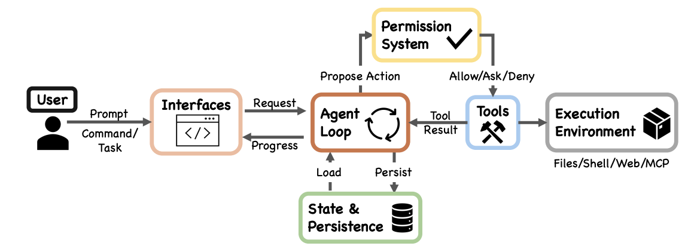

**主要な特徴：**

- **統一性**：CLI、IDE、Agent SDK のいずれも同一の `queryLoop()` 関数で動作する
- **既存のサブ Agent 機能**：サブ Agent は Agent Tool を通じて呼び出され、本質的には「分離されたコンテキストを持つ queryLoop() インスタンスで、親 Agent には要約のみを返す」
- **関心の分離**：コアループは簡潔に保たれ、権限や実行環境などの複雑性は周辺モジュールにカプセル化されている

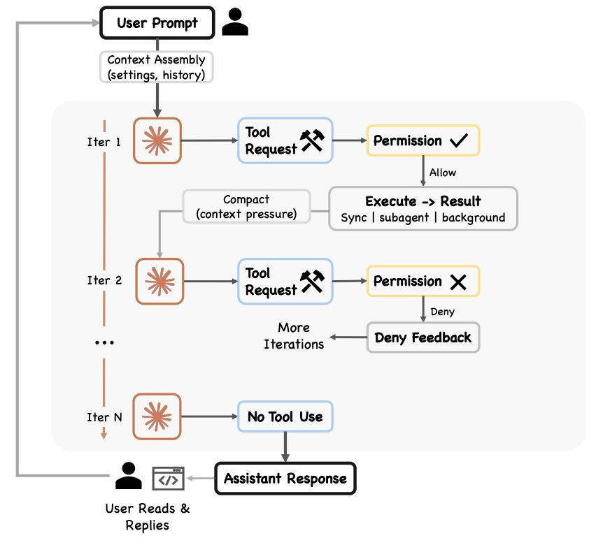

### 2.2 単一 Agent ループの問題点

Claude Code は既にサブ Agent 機能を備えていたが、従来のモードでは**オーケストレーションの意思決定は依然として Main Agent がターンごとに推論して行っていた**。Claude が単一のコンテキストウィンドウ内で複雑なタスクに長時間取り組むほど、以下の失敗モードが発生しやすくなる：

- **Agentic 惰性（Agentic laziness）**：特に複雑なマルチパートタスクを完了する前に停止し、部分的な進捗で作業完了を宣言する。例えば、セキュリティレビューで50項目中20項目しか処理しない。
- **自己選好バイアス（Self-preferential bias）**：自身の結果や発見を過大評価する傾向。特に検証や判断を求められた場合に顕著。
- **目標ドリフト（Goal drift）**：複数ターンの対話（特に圧縮後）において、元の目標への忠実度が徐々に失われる。各要約ステップは損失を伴い、エッジケースの要件や「X をするな」といった制約が失われる可能性がある。

### 2.3 Dynamic Workflow のアーキテクチャ

Dynamic Workflow は、オーケストレーションの意思決定を独立したスクリプトに外在化することで、これら3つの問題を構造的に解決する — 各サブエージェントは独立したコンテキストを持ち（惰性と目標ドリフトを解決）、独立した検証エージェントが相互にレビューする（自己選好バイアスを解決）。

**中核的アイデア**：Agent Loop 自体は変えず、「オーケストレーションの意思決定」を Claude の推論から独立したスクリプトランタイムに外在化する。

公式ドキュメントの重要な定義：

> A dynamic workflow is a JavaScript script that orchestrates subagents at scale. Claude writes the script for the task you describe, and a runtime executes it in the background while your session stays responsive.

> With subagents and skills, Claude is the orchestrator. A workflow script holds the loop, the branching, and the intermediate results itself, so Claude's context holds only the final answer.

### 2.4 Workflow Runtime

```
┌──────────────────────────────────────────────────────────┐
│               Claude Code Session                         │
│                                                           │
│  ┌─────────────────────────────────────────────────┐     │
│  │       Main Agent (queryLoop)                     │     │
│  │                                                  │     │
│  │  ユーザー入力 → 推論 → ツール呼出 → 観察 → ループ│     │
│  │                  │                               │     │
│  │       ┌──────────┴──────────┐                    │     │
│  │       ▼                     ▼                    │     │
│  │ [通常ツール呼出]       [Workflow Tool]            │     │
│  │ Read/Edit/Bash/       JS オーケストレーション    │     │
│  │ Agent Tool...         スクリプト生成 → Runtime   │     │
│  └───────┬──────────────────────┬───────────────────┘     │
│          │                      │                          │
│          ▼                      ▼                          │
│  ┌──────────────┐   ┌─────────────────────────────┐      │
│  │ Subagent     │   │  Workflow Runtime            │      │
│  │ (queryLoop)  │   │  (独立分離環境)              │      │
│  │              │   │                              │      │
│  │ - 分離コン   │   │  JSスクリプトが保持:        │      │
│  │   テキスト   │   │  - ループ/分岐ロジック       │      │
│  │ - 要約を返す │   │  - 中間結果(スクリプト変数)  │      │
│  │ - Claudeが   │   │  - phase()による段階分け     │      │
│  │   次ステップ │   │                              │      │
│  │   を決定     │   │  サブエージェントを一括 dispatch:│   │
│  │              │   │  ┌──┐┌──┐┌──┐...×N         │      │
│  └──────────────┘   │  │A ││B ││C │              │      │
│                      │  └┬─┘└┬─┘└┬─┘              │      │
│                      │   ▼   ▼   ▼                │      │
│                      │  各々が queryLoop() を実行   │      │
│                      │  (分離コンテキスト、結果返却)│      │
│                      │          │                  │      │
│                      │          ▼                  │      │
│                      │  スクリプト継続:検証/集約/反復│     │
│                      └──────────┬─────────────────┘      │
│                                 │                         │
│                                 ▼                         │
│                   最終結果を Main Agent に返却             │
└──────────────────────────────────────────────────────────┘
```

**キーポイント：**

- Agent Loop（queryLoop）は置き換えられていない — 各サブエージェントの基盤は依然として queryLoop インスタンスである
- 新規追加されたのは **Workflow Runtime**：独立したスクリプト実行環境
- オーケストレーションの意思決定が「Claude の推論」から「スクリプトコード」に移行
- 中間結果はスクリプト変数に保持され、**どの Agent のコンテキストウィンドウにも入らない**
- メインセッションはワークフロー実行中も応答可能な状態を維持

### 2.5 並列モデルとアルゴリズム思考

**並列モデル：シングルプロセス、非同期並列**

Claude Code は Node.js/TypeScript アプリケーションであり、非同期並列（async/await）に自然に適合する。並列上限は `min(16, cpu cores - 2)` で、API 呼出制限、メモリ使用量、CPU 集中的なコンテキスト組立など複数の要因によって制約される。公式の「isolated environment」は**論理的隔離**（独立したコンテキスト/変数スコープ）を指し、最も可能性の高いモデルは**シングルプロセス、非同期並列スケジューリング**で、容量16の async task pool に類似する。

**アルゴリズム思考：分割統治 + DAG**

Dynamic Workflow のオーケストレーションモデルの本質は **DAG（有向非巡回グラフ）実行** であり、依存関係と結果伝達をサポートし、中核思想は分割統治法である。

| アルゴリズム概念 | 適用性 | 説明 |
|-----------------|--------|------|
| 分割統治法 | ✅ 完全適用 | 大タスクを独立したサブタスクに分割し、並列求解、結果を統合 |
| メモ化/キャッシュ | 🟡 部分的に備える | スクリプト変数が自然な「メモ」に；再開時は完了済み agent がキャッシュ結果を返し再実行しない |
| トポロジカルソート | 🟡 スクリプトで実装可能 | 共通依存を先に計算し、その後独立タスクを並列処理 |
| 動的計画法 | ❌ 状態遷移は不適用 | しかし「解決済み部分問題のキャッシュ」の考え方はスクリプト変数によって自然に備わる |

共通依存がある場合の正しいアプローチは、スクリプト内で明示的に共通ステップを抽出すること：

```javascript
// 共通の部分問題を先に解く
const sdkAnalysis = await agent("SDK の公開インターフェース定義と制約を分析する")

// その後、独立した部分問題を並列で解き、共通結果を渡す
const results = await pipeline(
  plugins,
  plugin => agent(`以下の制約に基づいて ${plugin} をレビュー: ${sdkAnalysis}`)
)
```

これは DAG における依存関係処理（トポロジカルソート）である。

**適用前提**：Dynamic Workflow は**サブタスク間が相互に独立**しているシナリオ（純粋な分割統治）に最適。共通依存が存在する場合は、AI がスクリプト生成時に認識して明示的にオーケストレーションする必要がある。強い順序依存や共有可変状態が存在する場合、分割統治戦略自体が適用できない。

### 2.6 他のオーケストレーション方式との本質的違い

Claude Code の公式ドキュメントは、オーケストレーション能力を4つのレベルに分類し、「誰が計画を保持するか」で区別している：

| 次元 | 従来の Subagent | Skills | Agent Teams | Dynamic Workflow |
|------|----------------|--------|-------------|------------------|
| 本質 | Claude が派遣するワーカー | Claude が従う行動パターン | 人手で事前定義された役割組織 | ランタイムで実行される JS スクリプト |
| オーケストレーター | Main Agent（Claude の推論） | Claude（Skill の指導下） | 人手のコード | JS スクリプト（AI 生成） |
| 意思決定方式 | Claude がターン毎に次ステップを決定 | Claude が Skill テンプレートに従い決定 | 事前定義されたフローを固定実行 | スクリプトがループと分岐を保持 |
| 中間結果 | Claude のコンテキストに入る | Claude のコンテキストに入る | 各 Agent のコンテキスト | スクリプト変数（コンテキスト不使用） |
| 規模 | 毎ターン数個 | 毎ターン数個 | 固定の役割数 | 数十〜数百個/回 |
| 構造のライフサイクル | 毎ターン再決定 | セッション内有効 | デプロイ前に固定 | タスク毎に動的生成後破棄 |
| 適用規模 | 小タスクの委任 | 10-20 ステップの構造化タスク | 中程度の複雑さの固定フロー | 大規模並列（500+ファイル） |
| 類推 | 一人が臨時の助っ人を呼ぶ | 一人が SOP に従って作業 | 固定組織図 | プロジェクト制の臨時チーム |

## 三、動作モード
```alert
type: success
description: 動作モードの本質は、Dynamic Workflow 実行時に対応する DAG のトポロジー構造である。
```

以下は、Claude がワークフロー構築時によく使用するいくつかのモードである。

### 3.1 分類して実行（Classify-and-act）

**中核的考え方**：まず「何であるか」を判断し、それから「何をすべきか」を決定する。

分類器 Agent を使用してタスクタイプを判断し、異なる処理ロジック、Agent、またはモデルにルーティングする。フローの最後に分類器を使用して出力形式を決定することもできる。

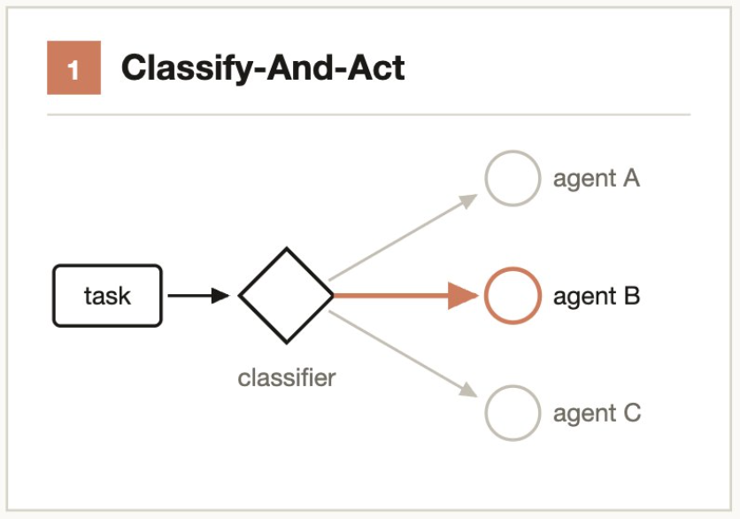

```
典型的なシナリオ：
- サポートチケット → 分類 Agent が深刻度を判断 → 「自動修正」または「人手にエスカレーション」にルーティング
- コード変更 → 分類 Agent が複雑度を評価 → Sonnet（単純）または Opus（複雑）にルーティング
```

### 3.2 ファンアウトして統合（Fan-out-and-synthesize）

**中核的考え方**：分解 → 並列求解 → バリア待機 → 結果の統合。

タスクを複数の独立したサブステップに分割し、各ステップに独立した Agent を割り当てる。統合ステップ（synthesize）はバリア（barrier）であり、すべてのファンアウト Agent が完了するのを待ってから、構造化出力を最終結果に統合する。

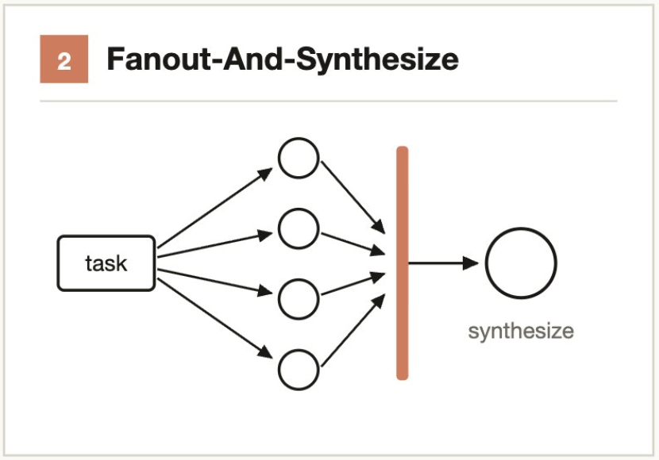

**適用タイミング**：サブステップの数が多い場合、または各ステップがクリーンなコンテキストウィンドウを必要とし交差汚染を避ける場合。

```
典型的なシナリオ：
- 50 の API エンドポイントを監査 → エンドポイント毎に 1 Agent → 集約して監査レポートを生成
- 20 モジュールのパフォーマンス分析 → 並列プロファイリング → 総合して最適化優先順位を決定
```

### 3.3 敵対的検証（Adversarial verification）

**中核的考え方**：「懐疑論者」にすべての発見を覆そうと試みさせる。

各出力 Agent の結果に対して独立した検証 Agent を実行し、その検証 Agent は**反駁を試みる**よう指示される（確認ではない）。多数決で結論の成否を決定する。

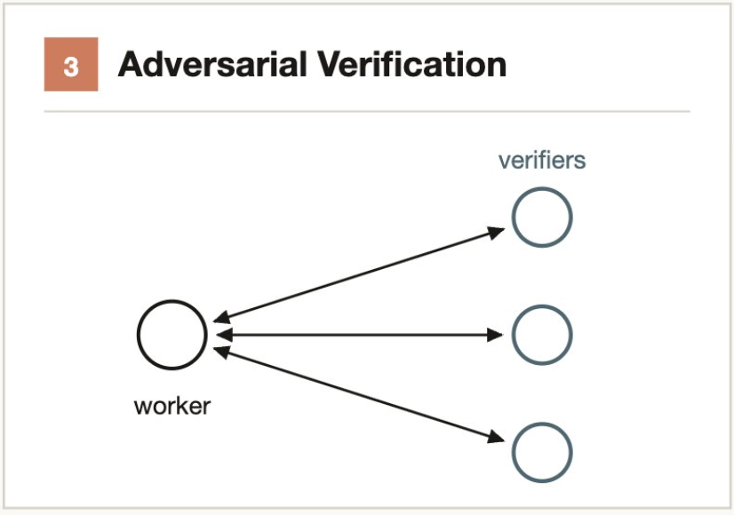

**解決する問題**：単一 Agent の自己選好バイアス — 自分で自分の結果を検証しても問題はほとんど発見されない。

```
典型的なシナリオ：
- Agent A がセキュリティ脆弱性を発見 → Agent B に「これが脆弱性でないことを証明せよ」とプロンプト → 3票中2票で本物と確認
- コードレビューで5つのバグを発見 → 各バグについて独立した Agent が反例の構築を試みる
```

### 3.4 生成してフィルタ（Generate-and-filter）

**中核的考え方**：多く生成し、厳格な基準でフィルタする。

多数の候補ソリューションを生成し、検証、重複排除、スコアリングを通じてフィルタリングし、高品質でテスト済みの結果のみを保持する。

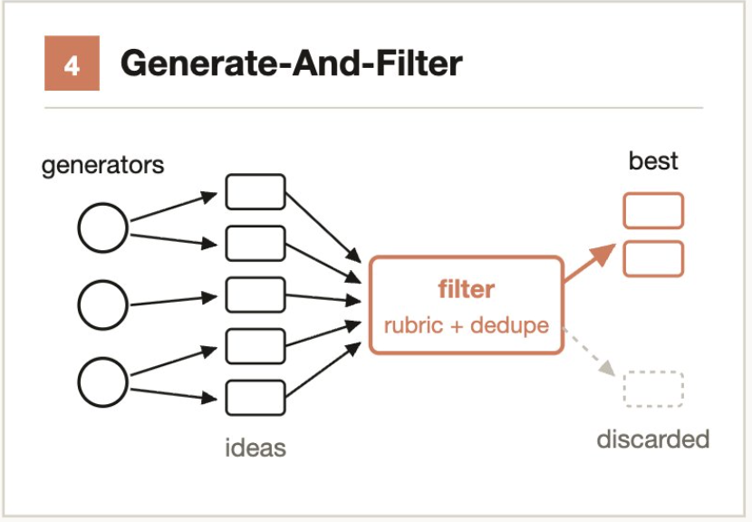

```
典型的なシナリオ：
- CLI ツールの名前を50個考案 → 重複排除 → 利用可能性/意味/発音でフィルタ → 上位5個を保持
- 20種類のアーキテクチャ案を生成 → パフォーマンス/保守性/コストでスコアリング → レビュー用に3個を選出
```

### 3.5 トーナメント（Tournament）

**中核的考え方**：分担ではなく競争。二者比較は絶対評価より信頼性が高い。

N 個の Agent を生成し、それぞれ異なる方法で同じタスクに取り組む。その後、判定 Agent がペアワイズ比較（pairwise comparison）でラウンドごとに判定し、勝者が決まるまで続ける。

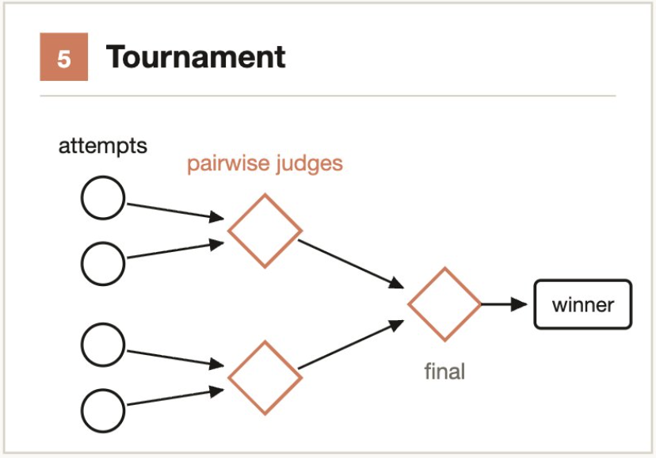

**スコアリングより優れている理由**：人間（および AI）は「A は B より良い」という相対判断において、「A に 8.2 点」という絶対評価よりもはるかに正確である。

```
典型的なシナリオ：
- 3 つの Agent が異なるアーキテクチャでキャッシュソリューションを実装 → 判定 Agent がペアワイズ比較 → 最適解を選出
- 1000+ 件のサポートチケットを深刻度順にソート → トーナメント式ペアワイズ比較 → 順序付きリストを出力
```

### 3.6 完了までループ（Loop until done）

**中核的考え方**：固定回数ではなく、停止条件を設定する。

作業量が未知のタスクに対して、停止条件が満たされるまで Agent をループ dispatch する（連続 K ラウンドで新発見なし、ログに新規エラーなし、全テスト合格）。固定の反復回数を使用しない。

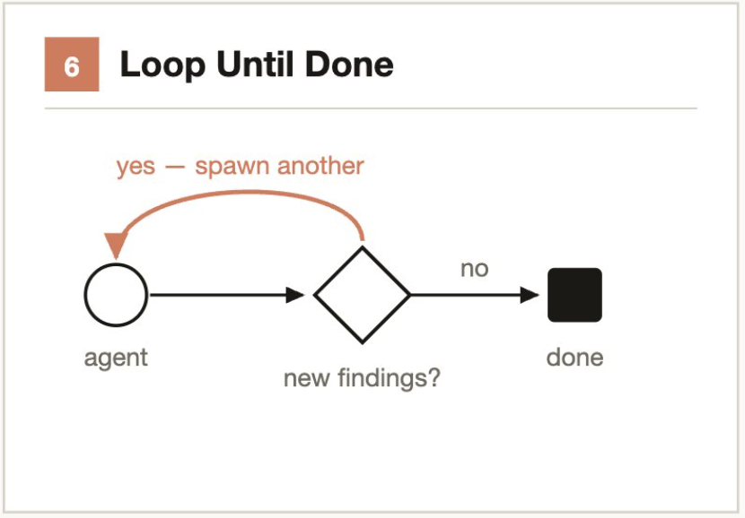

**解決する問題**：固定回数では早期停止（ロングテール問題の見落とし）や遅延停止（トークンの無駄）が発生する可能性がある。

```
典型的なシナリオ：
- コードベースのセキュリティ脆弱性を継続的に発掘 → 連続 2 ラウンドで新発見なし → 停止
- lint エラーを反復修正 → lint コマンドの出力が 0 errors になるまで → 停止
```
```alert
type: success
description: 実際のワークフローは通常**複数のモードを組み合わせる**。例えば大規模 Code Review = ファンアウトして統合（モジュール別分解）+ 敵対的検証（各発見を懐疑論者がレビュー）+ 完了までループ（新規問題がなくなるまで継続発見）+ 分類して実行（深刻度別に分類出力）。
```

## 四、ユースケース

### 4.1 移行とリファクタリング

**主要モード**：ファンアウトして統合 + 敵対的検証

タスクを個別に操作が必要なユニット（呼出箇所、失敗テスト、モジュール）に分解し、各修正に対して worktree 内で独立した Agent を起動し、別の Agent が敵対的レビューを行った後にマージする。
```alert
type: success
description: Agent にリソース集約的なコマンド（フルビルドなど）を使用しないよう指示し、マシンリソースを枯渇させずに並列性を最大化する。
```

**代表的事例**：Bun プロジェクトの Zig から Rust への書き換え — 75万行、11日間、テスト合格率 99.8%。

### 4.2 深層検証

**主要モード**：ファンアウトして統合 + 敵対的検証

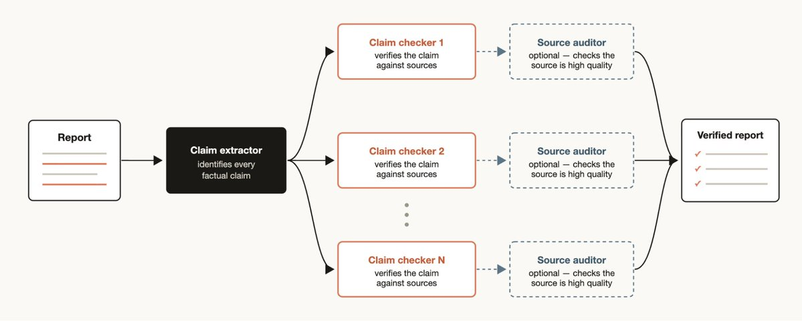

レポート内のすべての事実主張をチェックする必要がある場合：

```
ワークフロー構造：
1. 主張識別 Agent → レポート中のすべての事実主張を抽出
2. 各主張に対して情報源検索 Agent を起動 → 裏付け証拠を検索
3. 検証 Agent → 情報源 Agent が見つけた証拠が高品質かチェック
4. 統合 → 各主張の検証状態をラベル付け（検証済/未検証/疑問あり）
```

### 4.3 ソート

**主要モード**：トーナメント

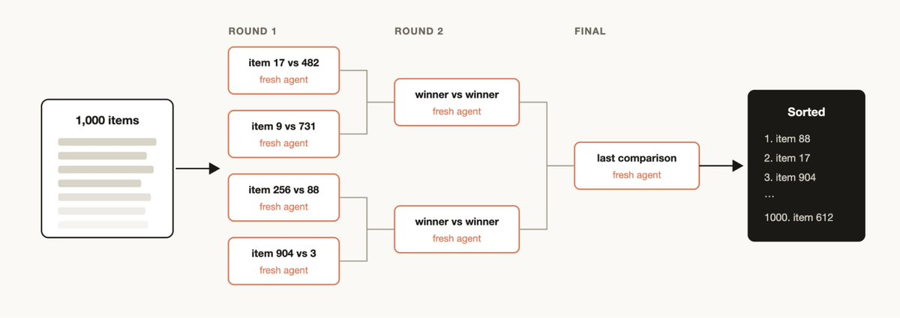

定性的指標で大量の項目をソートする（例：1000+ 件のサポートチケットをバグ深刻度順にソート）。単一プロンプトではこの規模に対応できず品質も低下する。

推奨手法：

- **トーナメント**：ペアワイズ比較（比較判断は絶対スコアリングより信頼性が高い）、各比較は独立した Agent
- **バケット + マージ**：最初に並列バケットソートし、その後バケットをマージ
- 決定論的ループがトーナメント表を保持し、実行順序のみがコンテキストに残る

### 4.4 記憶とルール遵守

**主要モード**：ファンアウトして統合 + 敵対的検証 + 生成してフィルタ

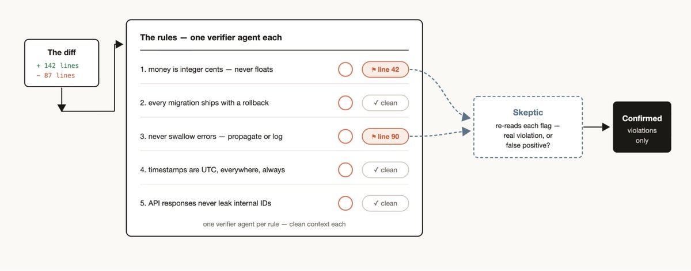

Claude が特定のルールを繰り返し違反していることに気づいた場合（CLAUDE.md に書いてあっても）：

**ポジティブ強制**：ワークフローを作成し、各ルールに検証 Agent を割り当てる。「懐疑論者」Agent と組み合わせてレビューし、過剰な誤検出を避ける。

**リバースマイニング**：

```
1. 直近50セッションとコードレビューから繰り返し行われた修正をマイニング
2. 並列 Agent が修正をクラスタリング
3. 各候補ルールを敵対的に検証（「このルールは実際にエラーを防げるか？」）
4. 生き残ったものを CLAUDE.md に抽出して記述
```

### 4.5 大規模トリアージ

**主要モード**：分類して実行 + 完了までループ

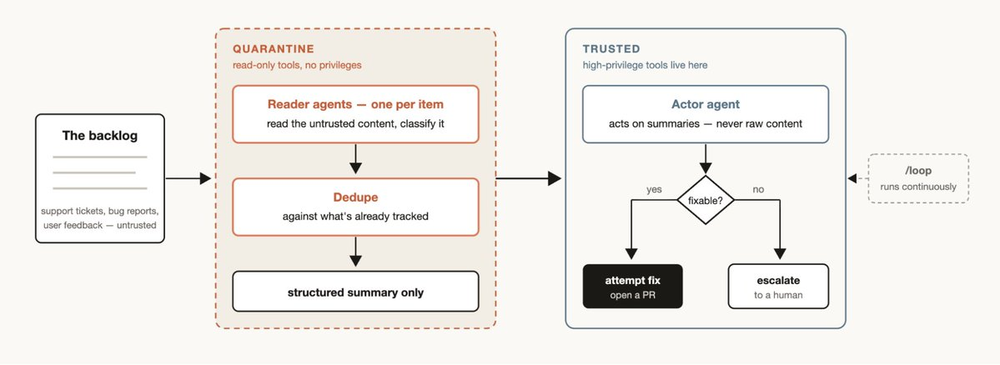

すべてのチームに、人間が完全に処理できないサポートキューの滞留やバグ報告が存在する。

**トリアージワークフローの3ステップ**：分類 → 追跡済み項目との重複排除 → アクション実行（自動修正または人手にエスカレーション）。
```alert
type: warning
description: **隔離モード（Quarantine）**：信頼できない公開コンテンツを読み取る Agent は、高権限操作（データベース書込、通知送信など）を実行してはならない。高権限操作は専用のアクション Agent が担当する。これはセキュリティ上の関心分離の原則である。
```

**継続化**：`/loop` と組み合わせて Claude に継続的な自動トリアージをさせ、「24時間稼働の当直 Agent」を実現する。

### 4.6 非推奨シナリオ

- **単一の単純なバグ修正** — ワークフロー起動のオーバーヘッドが利益をはるかに上回る
- **強い逐次依存や共有状態** — 分割統治思想が適用できなくなる
- **トークン予算が厳しい日常開発** — 公式ドキュメントは明示的に「a single run can use meaningfully more tokens than working through the same task in conversation」と注意している
```alert
type: warning
description: **判断原則**：タスクが単一のコンテキストウィンドウ内で 1 つの Claude によって高品質に完了できる場合、ワークフローを強制してはならない。ワークフローの価値は、Claude が**以前はできなかったこと**を可能にすることにあり、単純なタスクに不必要な複雑さを加えることではない。
```

## 五、研究開発への応用シナリオ

### 5.1 大規模コードレビュー

**ビジネス背景**：大規模コードベースは規模が大きくモジュールも多い。日常の MR は複数の事業ラインにまたがり、人手レビューは時間がかかりカバレッジ次元も限られる。

**適用方法**：各モジュールに独立した Agent を割り当て並列レビュー — デバイス制御/セキュリティ、ネットワーク通信/プロトコル準拠、UI コンポーネント/一貫性、データストレージ/プライバシー準拠、自動化シナリオ/ロジック完全性。Verifier Agent が発見された問題を敵対的に検証し、誤検出をフィルタする。

**期待される効果**：大規模 MR のレビューが数時間から数分に短縮され、カバレッジ次元もより包括的に。チーム標準ワークフロー（`.claude/workflows/`）として保存し、`/<name>` で再利用可能。
```alert
type: success
description: 現在の AI Reviewer は本質的に単一プロンプトレビューである。Dynamic Workflow にアップグレードすると、次元別（コーディングスタイル、アーキテクチャ妥当性、セキュリティ、パフォーマンス、並列安全性、UI 規範）に専門 Agent を dispatch し、最後に Aggregator が構造化レビューレポートに統合できる。
```

### 5.2 技術スタック移行

**ビジネス背景**：アプリは継続的に技術现代化を進めており、典型的な移行タスクには Objective-C → Swift、旧バージョン API → 新フレームワーク、旧分析基盤 → 新データ収集 SDK などが含まれる。

**適用方法**：各ファイル/モジュールに独立した Agent を割り当て並列移行し、Verifier Agent が移行後の機能的等価性を検証する。Bun 事例（75万行 / 11日 / 99.8%）がこのモデルの実現可能性を検証している。

### 5.3 セキュリティとプライバシーコンプライアンス監査

**ビジネス背景**：IoT デバイス制御は大量の機密データ（デバイストークン、ユーザープライバシー、家庭情報）を含み、コンプライアンス要件が厳格である。

**監査次元**（各次元に Agent グループ）：

- 権限チェックの完全性
- トークン/キーのハードコードまたは漏洩リスク
- ネットワーク通信の暗号化準拠
- ユーザーデータ保存の準拠性（GDPR/個人情報保護法）
- サードパーティ SDK 権限レビュー

**キーバリュー**：敵対的検証が誤検出率を大幅に低減し、多次元並列性が漏れのないことを保証する。

### 5.4 テストカバレッジ向上

**適用方法**：未カバーのコードパスを並列分析 → 各 Agent が 1 モジュールのユニットテストを生成 → Verifier Agent がテストの品質と有効性を検証。

---

## 六、使用方法

### 6.1 トリガー方法

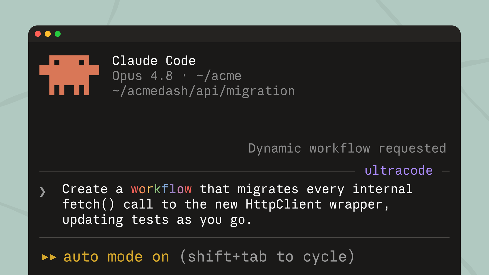

**キーワードトリガー**：プロンプトに `workflow` または `ultracode` キーワードを含める。`ultracode` は v2.1.160+ で追加され、xhigh 推論強度も同時に有効化される。「use a workflow」のような自然言語でも可。Claude は段階的実行ではなくワークフロースクリプトを作成する。誤トリガーは `Alt+W` でキャンセル。

**ultracode モード**：`/effort ultracode` と入力し、xhigh 推論強度 + 自動ワークフローオーケストレーションを組み合わせる。Claude は実質的なタスクごとにワークフローが必要か自動判断する。1 つのリクエストが複数の逐次ワークフローをトリガーする可能性がある（理解→修正→検証）。`/effort high` でいつでも戻れる。

**内蔵ワークフロー**：`/deep-research <質問>` — 多角的検索 → 情報源のクロス検証 → 項目ごとに投票 → 検証未通過の主張をフィルタ → 引用付きレポート。

**保存済みワークフロー**：`/workflows` → `s` を押してプロジェクト（`.claude/workflows/`、チーム共有）または個人（`~/.claude/workflows/`）に保存し、その後 `/<name>` で実行。`args` パラメータ入力に対応。

### 6.2 使用のコツ

**プロンプト**：上記のオーケストレーションモードの用語（「敵対的検証」「トーナメント」など）を使って具体的にプロンプトすると、曖昧な説明より効果的である。

**/goal および /loop との組み合わせ**：繰り返し可能なワークフロー（トリアージ、リサーチ、検証など）を使用する場合、`/loop` とペアにして定期的に実行し、`/goal` とペアにしてハードな完了要件を設定する。

**トークン使用予算**：動的ワークフローに明示的なトークン使用予算を設定して、タスクが消費するトークン数を制限できる。「10k トークンの予算で」のようにプロンプトすると上限が設定される。

**保存と共有**：ワークフローメニューで `s` を押して保存。`~/.claude/workflows` にチェックインするか、skill 経由で配布 — JavaScript ワークフローファイルをスキルフォルダに配置し、SKILL.md で参照する。より柔軟性を求める場合は、Claude にスキル内のワークフローを逐語的に実行するスクリプトではなくテンプレートとして扱うようヒントを与えられる。

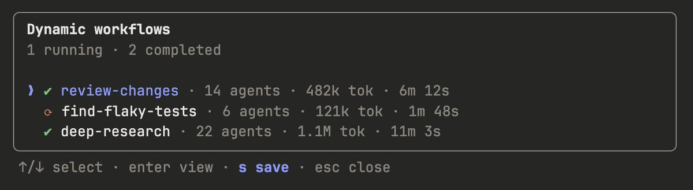

### 6.3 コスト管理

公式推奨：

- 最初に小さなスライスで実行し（リポジトリ全体ではなく 1 ディレクトリ）、トークン消費を評価する
- `/workflows` で進捗とトークン使用量をリアルタイム監視し、いつでも停止可能
- 重要でないフェーズでは、Claude により小さなモデルを使用するよう要求する（スクリプト内で `model` パラメータを指定可能）
- 完了した Agent の結果はキャッシュされ、停止後も失われない

## 七、結論

### 中核的判断

Dynamic Workflow の本質は「Claude がたくさんの Agent を起動する」ことではなく：

> Claude がオーケストレーションの意思決定を実行可能なスクリプトコードに外在化し、独立したランタイムが実行することで、単一 Agent ループのコンテキスト、並列性、検証のボトルネックを突破する。

これは AI コーディングツールが「補助的コーディング」から「自律的エンジニアリング」への重要な一歩を示している。現在の主要競合製品は依然として単一 Agent ループまたは固定オーケストレーション段階にとどまっている。今後の競争ポイントはモデル能力だけでなく、**誰がより強力なオーケストレーションランタイム（Runtime）を持つか**である。

### 参考文献

- [公式ブログ：Introducing Dynamic Workflows in Claude Code](https://claude.com/blog/introducing-dynamic-workflows-in-claude-code)
- [公式ブログ：A Harness for Every Task](https://claude.com/blog/a-harness-for-every-task-dynamic-workflows-in-claude-code)
- [公式ドキュメント：Workflows](https://code.claude.com/docs/en/workflows)
- [論文：Dive into Claude Code（アーキテクチャ）](https://arxiv.org/abs/2604.14228)
- [論文：Agentic Computation Graphs（動的ランタイムグラフ）](https://arxiv.org/abs/2603.22386)
