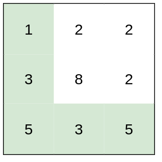

## 题目描述

> [LeetCode 1631. Path With Minimum Effort](https://leetcode.com/problems/path-with-minimum-effort/)

You are a hiker preparing for an upcoming hike. You are given heights, a 2D array of size rows x columns, where heights[row][col] represents the height of cell (row, col). You are situated in the top-left cell, (0, 0), and you hope to travel to the bottom-right cell, (rows-1, columns-1) (i.e., 0-indexed). You can move up, down, left, or right, and you wish to find a route that requires the minimum effort.

A route's effort is the maximum absolute difference in heights between two consecutive cells of the route.

Return the minimum effort required to travel from the top-left cell to the bottom-right cell.

- Example 1:



```
Input: heights = [[1,2,2],[3,8,2],[5,3,5]]
Output: 2
Explanation: The route of [1,3,5,3,5] has a maximum absolute difference of 2 in consecutive cells.
This is better than the route of [1,2,2,2,5], where the maximum absolute difference is 3.
```

## 思路分析

这道题之所以是一道优秀的综合题，在于它可以用**至少四种不同的算法范式**来解决，且每种解法都体现了不同的思维角度：

| 方法             | 核心思想                         | 时间复杂度             |
| ---------------- | -------------------------------- | ---------------------- |
| 二分 + BFS/DFS   | 将最优化问题转化为判定问题       | O(mn · log(maxHeight)) |
| 并查集 (Kruskal) | 将问题建模为最小瓶颈路           | O(mn · log(mn))        |
| Dijkstra         | 改造最短路算法，松弛条件变为 max | O(mn · log(mn))        |

**关键观察**：这道题求的不是路径上所有边权之和的最小值（经典最短路），而是路径上**单条边权的最大值**的最小值。这种 "minimax path" 问题在图论中称为**最小瓶颈路 (Minimum Bottleneck Path)**。

---

## 方法一：Binary Search + BFS/DFS

### 思路

将最优化问题转化为判定问题：

- **判定问题**：给定一个阈值 `threshold`，是否存在一条从左上角到右下角的路径，使得路径上相邻格子的高度差都不超过 `threshold`？
- **单调性**：如果 `threshold = k` 时可行，那么 `threshold = k+1` 时一定也可行。这个单调性保证了二分搜索的正确性。
- **搜索空间**：答案在 `[0, maxHeight - minHeight]` 之间，对这个区间做二分，每次用 BFS/DFS 验证可行性。

### BFS 实现

```c++
class Solution {
private:
    int m, n;
    int dir[4][2] = { {0, 1}, {0, -1}, {1, 0}, {-1, 0} };

public:
    int minimumEffortPath(vector<vector<int>>& heights) {
        m = heights.size();
        n = m > 0 ? heights[0].size() : 0;
        int left = 0, right = 10e6;
        int res = -1;
        while (left <= right) {
            int mid = left + (right - left) / 2;
            bool reachable = bfs(heights, mid);
            if (reachable) {
                res = mid;
                right = mid - 1;
            }else {
                left = mid + 1;
            }
        }
        return left;
    }

    bool bfs(vector<vector<int>> &heights, int limit) {
        queue<pair<int, int>> q;
        q.push({0, 0});
        vector<vector<bool>> vis(m, vector<bool>(n, false));
        vis[0][0] = true;
        while (!q.empty()) {
            int x = q.front().first, y = q.front().second;
            q.pop();
            if (x == m - 1 && y == n - 1) {
                return true;
            }
            for (int i = 0; i < 4; i++) {
                int new_x = x + dir[i][0];
                int new_y = y + dir[i][1];
                if (new_x >= 0 && new_y >= 0 && new_x < m && new_y < n && !vis[new_x][new_y] && abs(heights[new_x][new_y] - heights[x][y]) <= limit) {
                    q.push({new_x, new_y});
                    vis[new_x][new_y] = true;
                }
            }
        }
        return false;
    }
}

```

### DFS 实现

```c++
class Solution {
private:
    int m, n;
    int dir[4][2] = { {0, 1}, {0, -1}, {1, 0}, {-1, 0} };

public:
    int minimumEffortPath(vector<vector<int>>& heights) {
        m = heights.size();
        n = m > 0 ? heights[0].size() : 0;
        vector<vector<bool>> vis(m, vector<bool>(n, false));
        int left = 0, right = 10e6;
        while (left < right) {
            int mid = left + (right - left) / 2;
            for (int i = 0; i < m; i++) {
                std::fill(vis[i].begin(), vis[i].end(), false);
            }
            dfs(heights, 0, 0, mid, vis);
            if (vis[m - 1][n - 1]) {
                right = mid;
            }else {
                left = mid + 1;
            }
        }
        return left;
    }

    void dfs(vector<vector<int>> &heights, int x, int y, int threshold, vector<vector<bool>> &vis) {
        if (x < 0 || y < 0 || x >= m || y >= n || vis[x][y]) {
            return;
        }
        vis[x][y] = true;
        for (int i = 0; i < 4; i++) {
            int new_x = x + dir[i][0];
            int new_y = y + dir[i][1];
            if (new_x < 0 || new_y < 0 || new_x >= m || new_y >= n || vis[new_x][new_y]) {
                continue;
            }
            if (abs(heights[new_x][new_y] - heights[x][y]) > threshold) {
                continue;
            }
            dfs(heights, new_x, new_y, threshold, vis);
        }
    }
};
```

---

## 方法二：UnionFind (Kruskal 变体)

### 思路

换一个角度：把网格看成图，每对相邻格子之间有一条边，边权为高度差的绝对值。

问题转化为：在这张图上找一条从 `(0,0)` 到 `(m-1,n-1)` 的路径，使路径上最大边权最小。

**Kruskal 的思想**：将所有边按权值从小到大排序，依次加入并查集。当起点和终点第一次连通时，最后加入的那条边的权值就是答案。

为什么正确？因为我们只加入了权值 ≤ 当前边的所有边，此时起点终点恰好连通，说明存在一条路径其最大边权恰好等于当前边权，且不可能更小（否则早就连通了）。

```c++
class UnionFind {
private:
    vector<int> pa;
    int count;
public:
    UnionFind(int n):pa(n), count(n) {
        for (int i = 0; i < n; i++) {
            pa[i] = i;
        }
    }
    int root(int x) {
        return x == pa[x] ? x : pa[x] = root(pa[x]);
    }
    void uni(int x, int y) {
        int px = root(x);
        int py = root(y);
        if (px != py) {
            pa[px] = py;
            count--;
        }
    }
    bool connected(int x, int y) {
        return root(x) == root(y);
    }
};

struct Edge {
    int x, y;
    int d;
    Edge(int _x, int _y, int _d): x(_x), y(_y), d(_d) {};
    bool operator < (const Edge &other) const {
        return d > other.d;
    }
};

class Solution {
public:
    int minimumEffortPath(vector<vector<int>>& heights) {
        int m = heights.size();
        int n = heights[0].size();
        priority_queue<Edge> edges;
        for (int i = 0; i < m; i++) {
            for (int j = 0; j < n; j++) {
                int id = i * n + j;
                if (i > 0) {
                    edges.push(Edge(id - n, id, abs(heights[i][j] - heights[i - 1][j])));
                }
                if (j > 0) {
                    edges.push(Edge(id - 1, id, abs(heights[i][j] - heights[i][j - 1])));
                }
            }
        }
        UnionFind uf(m * n);
        int res = 0;
        while (!edges.empty()) {
            Edge e = edges.top();
            edges.pop();
            uf.uni(e.x, e.y);
            if (uf.connected(0, m * n - 1)) {
                res = e.d;
                break;
            }
        }
        return res;
    }
};
```

---

## 方法三：Dijkstra (改造松弛条件)

### 思路

经典 Dijkstra 求的是路径边权之和最小值，松弛条件是：

```
dist[v] = min(dist[v], dist[u] + w(u,v))
```

本题只需修改松弛条件为：

```
dist[v] = min(dist[v], max(dist[u], w(u,v)))
```

即到达 `v` 的"距离"定义为路径上的最大边权。这个变形仍满足 Dijkstra 的贪心性质：优先队列弹出的节点，其 `dist` 值一定是最优的，因为后续弹出的节点只可能经过更大的边。

```c++
struct Node {
    int x, y;
    int limit;
    Node(int _x, int _y, int _limit) : x(_x), y(_y), limit(_limit) {}
    bool operator < (const Node &other) const {
        return limit > other.limit;
    }
};

class Solution {
private:
    int dirs[4][2] = { {0, 1}, {0, -1}, {1, 0}, {-1, 0} };

public:
    int minimumEffortPath(vector<vector<int>>& heights) {
        int m = heights.size(), n = m > 0 ? heights[0].size() : 0;
        vector<vector<bool>> vis(m, vector<bool>(n, false));
        priority_queue<Node> pq;
        pq.emplace(Node(0, 0, 0));
        vector<int> dist(m * n, INT_MAX);
        dist[0] = 0;
        while (!pq.empty()) {
            Node node = pq.top();
            pq.pop();
            int x = node.x, y = node.y, limit = node.limit;
            if (vis[x][y]) {
                continue;
            }
            if (x == m - 1 && y == n - 1) {
                break;
            }
            vis[x][y] = true;
            for (int i = 0; i < 4; i++) {
                int nx = x + dirs[i][0];
                int ny = y + dirs[i][1];
                if (nx < 0 || ny < 0 || nx >= m || ny >= n) {
                    continue;
                }
                int new_limit = max(limit, abs(heights[nx][ny] - heights[x][y]));
                if (new_limit >= dist[nx * n + ny]) {
                    continue;
                }
                dist[nx * n + ny] = new_limit;
                pq.emplace(Node(nx, ny, new_limit));

            }
        }
        return dist.back();
    }
};
```

---

## 总结与发散

### 方法对比

三种方法本质上在回答同一个问题，但视角不同：

- **二分 + BFS/DFS**：猜答案，验证可行性。适用于答案具有单调性的场景。
- **并查集**：从小到大加边，观察何时连通。适用于瓶颈路问题。
- **Dijkstra**：贪心扩展，每次走当前代价最小的路。适用于改造后仍满足贪心性质的最短路变体。

### 类似的 "Minimax Path" 问题

这类"最小化路径上最大边权"的问题在 LeetCode 和竞赛中反复出现：

| 题目                                                                                                    | 核心差异                                                                 |
| ------------------------------------------------------------------------------------------------------- | ------------------------------------------------------------------------ |
| [778. Swim in Rising Water](https://leetcode.com/problems/swim-in-rising-water/)                        | 边权变为 max(grid[nx][ny], grid[x][y])，即需等待水位降到格子高度才能通过 |
| [1102. Path With Maximum Minimum Value](https://leetcode.com/problems/path-with-maximum-minimum-value/) | 反过来：最大化路径上的最小值 (maximin)，同样可用三种方法                 |
| [2812. Find the Safest Path in a Grid](https://leetcode.com/problems/find-the-safest-path-in-a-grid/)   | 先 BFS 预处理每个格子到最近威胁的距离，再求 maximin path                 |
| [1514. Path with Maximum Probability](https://leetcode.com/problems/path-with-maximum-probability/)     | 边权为概率，路径值为乘积的最大值，Dijkstra 取 max 变体                   |

### 更广泛的 "二分答案 + 判定" 模式

"二分搜索 + BFS/DFS 验证"是一种通用的算法设计范式，适用于：

- 答案在一个有序区间内
- 答案具有单调性（可行/不可行的分界点）
- 给定答案后，判定问题比原问题容易得多

常见应用场景：

- **二分 + 图搜索**：本题、Swim in Rising Water
- **二分 + 贪心**：分割数组的最大值 ([410](https://leetcode.com/problems/split-array-largest-sum/))
- **二分 + DP**：第 K 小的距离对 ([719](https://leetcode.com/problems/find-k-th-smallest-pair-distance/))
