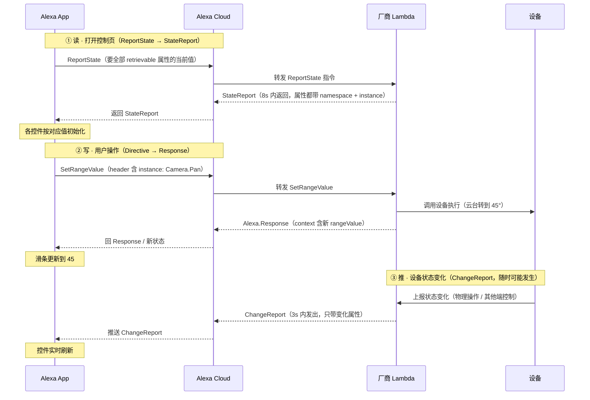

## 引言：Alexa 设备接入全景

Alexa 是 Amazon 的语音助手生态，自 2014 年随 Echo 设备发布以来，长期以「语音命令引擎」形态存在——用户说出固定唤醒词和意图，Alexa 通过预训练的 NLU（自然语言理解）模型识别意图并路由到对应 Skill。2025 年 2 月，Amazon 公告了新一代 **Alexa+** 平台，并在 2026 年 7 月的 Partner Summit 上发布 Preview。其核心转变可以概括为：

> 从「语音命令引擎」到「AI Agent 平台」

具体体现在三个层面：

1. **运行时升级**：传统 Alexa 的 NLU + 意图路由引擎被 LLM 增强或替代。原先使用训练好的语义理解模型（非 LLM）做预定义的意图识别；现在使用 LLM 做动态意图识别，不需要重新训练并部署模型即可扩展理解范围。
2. **能力暴露升级**：设备能力不再局限于预定义的 Capability Interfaces（如 PowerController / ModeController），设备独有的功能可以通过 AI 语义描述层自由声明。
3. **生态扩展**：通过 MCP（Model Context Protocol）协议，第三方服务商可以为 Alexa+ 提供工具，Alexa+ 也能调用外部 Agent 的能力。

从设备接入视角看，Alexa 平台提供了两个层面的接入方案：

- **硬件/固件层**：ACK（Alexa Connect Kit），Amazon 全托管的设备连接方案，厂商无需自建云。
- **软件/能力层**：Add-on，厂商通过声明设备能力让 Alexa 识别和控制设备。Alexa+ 在此层面新增了 Smart Home AI Toolkit，并引入了 Category SDK 和 MCP Toolkit 两条新路径。

本文按照「接入方案 → 声明能力 → 生成控制 UI → 交互同步 → 发布上架」的主线，梳理 Alexa 平台设备接入的完整流程，并标注其中哪些是 Alexa+ 新增的能力。

## 一、接入方案总览

### 1.1 硬件层：ACK（Alexa Connect Kit）

ACK 是 Amazon 的全托管式设备接入方案，厂商无需自建云、无需开发 Skill，即可让设备接入 Alexa。ACK 提供三种硬件形态：

| 形态                   | 架构                                                        | 适用场景                            |
| ---------------------- | ----------------------------------------------------------- | ----------------------------------- |
| **ACK Module**         | 两芯片：ACK Module（Amazon 固件，Wi-Fi + 证书，UART）+ HMCU | 已有 MCU 的厂商（咖啡机、微波炉等） |
| **ACK SDK**            | 单芯片：厂商 SoC 运行 ACK SDK 源码                          | 降 BoM 的灯/插座 OEM                |
| **ACK SDK for Matter** | 单芯片运行 Matter over Wi-Fi                                | 同时过 Matter 认证的厂商            |


在 ACK 方案中，Amazon 的角色是全方位的：

- 提供完整端侧 SDK，厂商只需实现设备级回调（如「开继电器 / 转电机」）
- 管理 Wi-Fi 协议栈、安全证书、OTA 客户端
- 托管云端（设备注册、OTA、指标、配网）
- 单台一次性收费，厂商无需自建云

ACK 属于 Alexa 传统的设备接入方案，不在 Alexa+ for Builders 的 Add-on 范畴内，但它是硬件层最省心的接入路径，常与软件层的 Smart Home Add-on 配合使用。

### 1.2 软件/能力层：三条 Add-on 路径

Alexa+ for Builders 目前提供三条 Add-on 集成路径，均处于 Preview 阶段：

| 路径                      | 定位                            | 面向对象   | 交付时长                     |
| ------------------------- | ------------------------------- | ---------- | ---------------------------- |
| **Smart Home AI Toolkit** | 设备独有能力 → AI 语义描述      | 设备制造商 | hours 级                     |
| **Category SDK**          | 六大生活服务品类 → SPI/MCP 契约 | 生活服务商 | weeks 级                     |
| **MCP Toolkit**           | 通用 MCP 服务接入 → 工具调用    | 任意服务商 | 已有 MCP Server 只需少量修改 |

> 注：官方博客将 Smart Home AI Toolkit 称为 _AI-powered smart home developer toolkit_，开发文档中两者混用，本文沿用 Smart Home AI Toolkit 这一简称。

三条路径的共同特征是 **AI-first 集成范式**——开发者通过**自然语言描述、上传规格文档**或暴露标准 **MCP Server** 来完成接入，而非传统的手写接口代码。

本文第二章以 Smart Home AI Toolkit 为主线讲解设备能力声明，Category SDK 与 MCP Toolkit 在第六章展开。

## 二、设备能力声明

无论走哪条软件层路径，设备接入的第一步都是向 Alexa 声明「我有什么能力」。这一步通过 `Discover.Response` 完成。

### 2.1 声明结构：Discover.Response

当 Alexa 查找设备时，会向厂商的技能端（如 AWS Lambda）发起 Discovery 请求，厂商返回一个 `Discover.Response`，用 `endpoints[].capabilities[]` 声明设备支持的能力及参数。以一台摄像机为例（节选）：

```json
{
  "endpointId": "camera-001",
  "friendlyName": "客厅摄像头",
  "displayCategories": ["CAMERA"],
  "capabilities": [
    {
      "type": "AlexaInterface",
      "interface": "Alexa.PowerController",
      "version": "3",
      "properties": {
        "supported": [{ "name": "powerState" }],
        "retrievable": true,
        "proactivelyReported": true
      }
    },
    {
      "type": "AlexaInterface",
      "interface": "Alexa.CameraStreamController",
      "version": "3",
      "cameraStreamConfigurations": [
        {
          "protocols": ["RTSP"],
          "resolutions": [{ "width": 1920, "height": 1080 }],
          "authorizationType": "BASIC",
          "videoCodec": "H264"
        }
      ]
    },
    {
      "type": "AlexaInterface",
      "interface": "Alexa.RangeController",
      "version": "3",
      "instance": "Camera.Pan",
      "capabilityResources": {
        "friendlyNames": [{ "@type": "text", "value": { "text": "Pan", "locale": "en-US" } }]
      },
      "properties": {
        "supported": [{ "name": "rangeValue" }],
        "retrievable": true,
        "proactivelyReported": true
      },
      "configuration": {
        "supportedRange": { "minimumValue": -200, "maximumValue": 200, "precision": 1 }
      }
    }
  ]
}
```

`capabilities[]` 中影响控制 UI 样式的核心配置项：

| 配置项                           | 厂商配置什么                                                         |
| -------------------------------- | -------------------------------------------------------------------- |
| `displayCategories`              | 设备品类（决定页面骨架布局）                                         |
| `interface`                      | 声明设备支持哪套能力协议（决定控件类型，见 2.2）                     |
| `instance`                       | 同一接口多实例的区分名（生成多个独立控件）                           |
| `properties.supported`           | 该接口上报哪些属性名（控件绑定的数据源）                             |
| `properties.retrievable`         | 是否允许 Alexa 发 ReportState 查询当前值（影响能否显示初值，见 4.1） |
| `properties.proactivelyReported` | 属性变化是否发 ChangeReport（影响能否实时刷新，见 4.1）              |
| `configuration`                  | 能力参数，如 `supportedRange`（min/max/precision）、`presets`        |
| `capabilityResources`            | 控件资源文件，包含 icon 名称、多语言等配置                           |
| `cameraStreamConfigurations`     | 视频流参数（协议/分辨率/编码/鉴权方式）                              |
| `nonControllable: true`          | 只读标记 → 该控件只展示、不可操作                                    |

### 2.2 标准能力：Capability Interfaces

`interface` 字段决定控件类型。Alexa Smart Home 预定义了一套 Capability Interfaces，每个接口对应一组协议指令和一个 UI 控件：

| interface                      | 协议指令集                       | 推断控件             |
| ------------------------------ | -------------------------------- | -------------------- |
| `Alexa.PowerController`        | TurnOn / TurnOff                 | 开关                 |
| `Alexa.BrightnessController`   | SetBrightness / AdjustBrightness | 亮度滑条             |
| `Alexa.RangeController`        | SetRangeValue / AdjustRangeValue | 数值滑条             |
| `Alexa.ModeController`         | SetMode / AdjustMode             | 模式选择器           |
| `Alexa.ToggleController`       | TurnOn / TurnOff                 | 开关（带实例名）     |
| `Alexa.LockController`         | Lock / Unlock                    | 锁控制（解锁需鉴权） |
| `Alexa.CameraStreamController` | InitializeCameraStreams          | 视频播放器           |
| `Alexa.MotionSensor`           | 仅上报 detectionState            | 侦测状态徽标         |
| `Alexa.EndpointHealth`         | 仅上报 connectivity              | 在线/离线指示        |

控件类型由 `interface` 决定（黑盒，映射算法未公开）；控件参数（范围/步长/名字/档位）由 `configuration` / `capabilityResources` 决定（厂商可配）。同一 `interface` 可声明多次，靠 `instance` 区分，每个 instance 生成一个**独立控件**。

标准接口的局限在于：设备独有的功能（如洗衣机的 30 种洗涤模式、摄像机的夜视/人形追踪）无法用预定义接口表达。传统做法下，厂商只能把这些功能塞进 `ModeController` 或 `RangeController` 兜底，语义信息丢失。

### 2.3 自定义能力（Alexa+ 新增）：Smart Home AI Toolkit

Smart Home AI Toolkit 是 Alexa+ 在智能家居领域最重要的新增能力，专门解决「标准接口覆盖不了的自定义功能」问题。它在标准能力上叠加一层 **AI 语义描述层**：

```plaintext
传统方式：设备 → Capability Interfaces（仅标准能力）→ Alexa NLU（预定义 Skill Interaction Model）
新方式：  设备 → Capability Interfaces + AI 语义描述层 → Alexa+ LLM（自然语言匹配 + 参数推理）
```

#### 两类新控制器

Smart Home AI Toolkit 引入两种新控制器类型，承载「以前无法暴露」的自定义能力：

| 控制器                                              | 功能                   | 适用场景                                               |
| --------------------------------------------------- | ---------------------- | ------------------------------------------------------ |
| **Action Controller**（`Alexa.ActionController`）   | 触发一个命名动作或场景 | 「启动睡前模式」「冲洗滤芯」「开始深度清洁」           |
| **Dynamic Controller**（`Alexa.DynamicController`） | 暴露设备的动态参数组合 | 洗衣机模式选择（洗涤 + 水温 + 转速组合）、空调送风角度 |

关键创新：这两类控制器的**语义空间不预定义**，由厂商在能力描述中自由声明语义、参数别名和自然语言标签，Alexa+ 的 LLM 负责自然语言匹配和参数推理。


以智能洗衣机为例，厂商用语义描述定义设备独有能力：

```json
{
  "type": "AlexaInterface",
  "interface": "Alexa.ActionController",
  "capabilityResources": {
    "friendlyNames": [{ "type": "asset", "value": { "assetId": "Alexa.Setting.WashCycle" } }]
  },
  "semantics": {
    "deviceActions": {
      "name": "cold_water_enzyme",
      "description": "A cold-water wash cycle that activates enzyme-based stain removal, suitable for delicate fabrics that require cold washing",
      "parameters": {
        "temperature": "cold",
        "enzyme_activation": true,
        "spin_speed": "medium"
      },
      "keywords": ["cold wash", "enzyme", "stain removal", "gentle clean", "delicate"]
    }
  },
  "version": "3"
}
```

注意 `semantics` 块——厂商用自然语言 `description` 和 `keywords` 描述这个动作的含义，Alexa+ 的 LLM 在运行时根据用户的话语（如「用冷水轻柔洗一下」）匹配到这个动作并推理出参数。这是 LLM 运行时替代传统 NLU 训练模型的核心体现。

#### 两种声明方式

Smart Home AI Toolkit 提供两种在 Alexa Developer Console 内生成语义能力描述的方式：

| 方式                     | 说明                                                                                         | 适用场景               |
| ------------------------ | -------------------------------------------------------------------------------------------- | ---------------------- |
| **Chat & Build**         | 用自然语言描述设备功能（如「宠物喂食器，能加粮、冲洗、看余量」），Agent 自动生成语义能力描述 | 初次接入 / 快速原型    |
| **Upload Specification** | 上传 PDF 设备规格文档，LLM 自动抽取能力并补全缺失项                                          | 已有成熟产品规格的厂商 |

两种方式的产出物相同：一个**语义能力描述文件**（结构化 JSON/YAML），定义设备独有能力的语义、参数、自然语言别名和 UI 提示。该文件直接挂载到已有 Smart Home Add-on 上被 Alexa+ 调用，与标准能力在 `capabilities` 数组里**平级**（自定义接口名形如 `Alexa.Custom.AnyCompany.SampleController`）。

#### 值得关注的细节

- **无需额外认证**：AI Toolkit 生成的能力直接复用已有的 WWA（Works with Alexa）认证范围，新增功能不触发重新认证
- **增量叠加**：不推倒重来——厂商保有对标准 Capability Interfaces 的完全控制，AI 语义描述只是额外挂载层
- **全在 Portal 内完成**：所有操作在 Alexa Developer Console 内进行，无需本地安装 CLI 或 SDK
- **首批合作品牌**：Bosch、Delta、Ecovacs、Eufy、Govee、iRobot、Moen Flo、PetSafe、Pila Energy、SONOFF、TP-Link Tapo、Twinkly、Whirlpool、Yale Home——覆盖白电、清洁、安防、照明全品类

## 三、设备控制 UI 的自动生成

声明完能力后，Alexa App 中的设备控制页会**自动生成**，厂商无需手写 UI 代码。这是 Alexa Smart Home 的 Catalog Service 能力，Smart Home AI Toolkit 新增的控制器同样会自动生成对应 UI。

### 核心原理

```plaintext
厂商声明能力（Discover.Response）
   → Alexa 维护「能力 → UI 控件」映射表
   → 自动生成设备控制页
```

三个要点：

1. 厂商声明能力，Alexa 维护「能力→UI」映射表并自动生成页面
2. 页面无业务逻辑：UI 只负责「显示状态 + 把操作翻译成指令」，真正执行在厂商定义的云端函数（如 Lambda）里
3. 状态靠 3 条通道保持一致：打开页面拉初始值 → 用户操作写新值 → 设备变化主动上报

### 组装规则

渲染器读取端点声明后：

```plaintext
capabilities 数组
   → 遍历每个 interface
   → 每个 interface（含 instance）生成一个控件
   → displayCategories 决定页面骨架（品类图标 / 控制页格式）
   → 全部控件拼到一个页面
```

以摄像机为例，组装结果：

```plaintext
Alexa（基础）             → 不生成可见控件
EndpointHealth           → 在线/离线指示
CameraStreamController   → 视频播放器
PowerController          → 开关
MotionSensor             → 侦测状态徽标
RangeController(Pan)     → 水平滑条（-200~200）
RangeController(Tilt)    → 垂直滑条（-50~50）
自定义: NightVision       → AI 生成的开关
自定义: HumanTracking     → AI 生成的按钮
```

组装后的 UI 结构示意：

```plaintext
┌─────────────────────────────────────────┐
│  ● 在线                客厅摄像头  ⚙️   │  ← EndpointHealth + friendlyName
├─────────────────────────────────────────┤
│         ┌─────────────────┐             │
│         │   视频流 (RTSP)  │             │  ← CameraStreamController
│         │   1080p / H.264  │             │
│         └─────────────────┘             │
├──────────────────┬──────────────────────┤
│  ◉ 开关          │  ⚠ 移动侦测: 正常    │  ← PowerController + MotionSensor
├──────────────────┴──────────────────────┤
│  Pan  ◄━━━━━━━━━●━━━━━━━━━► -200~200   │  ← RangeController(Camera.Pan)
│  Tilt ◄━━━━●━━━━━━━━━━━━━━► -50~50     │  ← RangeController(Camera.Tilt)
├─────────────────────────────────────────┤
│  🌙 夜视 [ON/OFF]    👤 人形追踪 [启动]  │  ← 自定义能力（AI Toolkit 生成）
└─────────────────────────────────────────┘
```

自定义能力的 UI 同样由 AI Toolkit 的 Generate UI 能力生成，厂商可通过对话增删改 UI 元素，产物与标准能力平级。

## 四、交互与状态同步

控件一旦生成，其交互行为由接口协议定义，**无需厂商编写 UI 逻辑**。处理函数全部在厂商 Lambda 中，UI 只做「渲染属性值 + 把操作翻译成协议指令」。交互逻辑分两块：**状态同步**和**事件交互**。

### 4.1 状态同步：3 种通道

插件 UI 和设备状态的同步机制：

1. **读**（打开页面拉初始值）：Alexa App 发 `ReportState` 指令 → 厂商 Lambda 返回 `StateReport`（8s 内，属性带 namespace + instance）→ 各控件按对应值初始化
2. **写**（用户操作 UI 设置新值）：App 发 `SetRangeValue` 等指令（header 含 instance）→ Lambda 调用设备执行 → 返回 `Alexa.Response`（context 含新值）→ 控件更新
3. **推**（设备变化主动上报）：设备状态变化（物理操作 / 其他端控制）→ Lambda 发 `ChangeReport`（3s 内，只带变化属性）→ App 推送 → 控件实时刷新

时序如下：



`properties.retrievable` 决定能否拉到初值（读通道），`properties.proactivelyReported` 决定能否实时刷新（推通道）——这两个 flag 在声明能力时就配好。

### 4.2 事件交互：3 种情况

控件上的事件按处理位置分三种：

| 事件域     | 处理位置                     | 例子                          |
| ---------- | ---------------------------- | ----------------------------- |
| **应用域** | App 本地                     | 页面跳转、Tab 切换、折叠/展开 |
| **设备域** | Lambda + 协议                | 侦测到移动、开关/云台状态变化 |
| **混合域** | App 本地确认 → 协议 → Lambda | 解锁鉴权、隐私遮蔽确认        |

- **应用域事件（纯本地）**：页面跳转（首页→设置页）、Tab 切换、折叠/展开、动画、缓存读取等 App 自身导航/UI 逻辑，不经过协议层，与设备能力无关。
- **设备域事件（走协议）**：设备状态变化（物理操作 / 其他端控制）→ 设备侧发 `ChangeReport` → UI 刷新。
- **混合域事件（先本地确认、再走协议）**：需要安全确认的操作。典型如智能锁解锁：

```plaintext
用户说 "unlock the front door"
    → App 层：要求输入 4 位语音码（本地鉴权，「给人看的确认」）
    → 通过 → 发 Alexa.LockController.Unlock 指令
    → Lambda 层：校验 token 权限（服务端鉴权，「真正的校验」）
        通过 → 执行 → Alexa.Response + 状态快照
        拒绝 → Alexa.ErrorResponse → UI 报错
```

鉴权分**两层**：App 层做交互确认，Lambda 层做服务端校验。摄像机场景同理：隐私遮蔽前二次确认；隐私模式下云台操作被拒。

## 五、发布上架

能力声明和控制 UI 生成完成后，设备进入发布流程：

1. **上架审核**：Amazon 对设备能力、语义描述、UI 进行审核，确保符合 Alexa 用户体验规范
2. **发布参数**：AI Toolkit 的 Chat & Build / Upload Specification 在生成能力描述的同时，会一并生成上架所需的发布参数、NLU 匹配语料、App 控制 UI 配置、国际化文案
3. **认证**：标准能力需通过 WWA（Works with Alexa）认证；AI Toolkit 新增的自定义能力复用已有 WWA 范围，不触发重新认证
4. **发布上线**：审核通过后在 Alexa App 上架，用户即可发现并控制设备

## 六、其他接入路径展开

### 6.1 Category SDK

Category SDK 是面向生活服务品类的标准化接入框架，支持六个品类：

| 品类                    | 说明     | 接入路径      |
| ----------------------- | -------- | ------------- |
| Food ordering           | 订餐     | Action（SPI） |
| Home services           | 家政服务 | Action（SPI） |
| Local booking           | 本地预约 | Action（SPI） |
| Restaurant reservations | 餐厅预订 | Action（SPI） |
| Ride booking            | 叫车     | **仅 MCP**    |
| Ticketing               | 票务     | Action（SPI） |

Category SDK 提供两条子路径：

- **Category Action Add-on**：通过 SPI（Service Provider Interface）契约连接厂商 API，低延迟、强韧性，适合已有成熟 API 的伙伴
- **Category MCP Add-on**：通过标准 MCP 协议连接厂商的 MCP server，适合已有 MCP server 或偏好该标准的伙伴

注意 Ride booking 只能走 MCP，不可走 SPI。开发者工作流为：实现/部署（Alexa AI CLI + AWS）→ 测试（Web 模拟器 + E2E 设备测试）→ 发布（认证 → 上架 → 监控）。

### 6.2 MCP Toolkit

MCP Toolkit 让任意服务商把自己已有的 MCP server 接入 Alexa+，客户即可通过语音和视觉交互使用这些能力。

**架构**：厂商部署一个 MCP server（暴露 tools/resources/prompts）+ 一个 Alexa+ MCP Add-on（作为 MCP server 与 Alexa+ 的桥梁，处理协议翻译和能力注册）+ Add-on 注册表（索引 tools，Alexa+ AI 推理决定何时调用）+ Orchestrator（协调体验）。

**传输**：Streamable HTTP（不支持 stdio / WebSocket）。遵循 2025-11-25 版 MCP 规范，并支持 MCP Apps 扩展（在对话视图内联渲染交互 UI，如地图、多步流程、仪表盘）。

**接入方式**：通过 add-on Agent Skill（agentic onboarding）或 Alexa AI CLI 自助接入，Alexa+ 会检查 MCP server、提议集成路径、交付模拟器就绪的包。Tool 变更需用 `alexa-ai deploy` 重新部署。

**鉴权：双层 OAuth 2.0**：

| 层级   | Grant Type                  | 用途                                                                                                         | 是否涉及用户 |
| ------ | --------------------------- | ------------------------------------------------------------------------------------------------------------ | ------------ |
| Tier 1 | `client_credentials`        | 服务级 M2M 鉴权，用于私有 MCP server 的注册/健康检查、工具发现（`initialize`、`tools/list`）、非用户数据查询 | 否           |
| Tier 2 | `authorization_code` + PKCE | 用户级鉴权与授权，用于执行用户相关 tool、访问用户资源                                                        | 是           |

- Tier 1 token 短时（建议 ≤ 3600s），**不颁发 refresh_token**，过期重新请求；scope 为 `mcp:service`
- Tier 2 scope 为 `mcp:tools` / `mcp:resources`
- 不支持 Dynamic Client Registration（DCR）、OpenID Connect（OIDC）、Step-Up Authorization
- 鉴权属性服务端变更后需重新部署 MCP Add-on（Alexa+ 会缓存值直到重新部署）

MCP Toolkit 目前仅在美国可用。

## 结语

Alexa 设备接入的核心链路是「声明能力 → 生成控制 UI → 交互状态同步 → 发布上架」。传统 Smart Home 机制（Discover.Response、Capability Interfaces、StateReport/ChangeReport）解决了标准能力的接入，而 Alexa+ 的 Smart Home AI Toolkit 通过 AI 语义描述层把能力暴露的范围从预定义接口扩展到任意自定义功能——这是 Alexa+ 最重要的增量。

在此基础上，Category SDK 把同一套 AI Agent 框架延伸到生活服务品类，MCP Toolkit 则借开放协议接入了整个 AI Agent 生态。三者的共同特征是 AI-first：开发者用自然语言和文档替代手写接口代码，LLM 在运行时完成意图理解和参数推理。

## 附录 A：术语对照

| 术语                           | 全称 / 说明                                                                                       |
| ------------------------------ | ------------------------------------------------------------------------------------------------- |
| **ASK**                        | Alexa Skills Kit，Alexa 技能开发工具集                                                            |
| **AVS**                        | Alexa Voice Service，将 Alexa 嵌入第三方硬件的服务                                                |
| **ACK**                        | Alexa Connect Kit，免 Skill 免云的托管式设备接入方案                                              |
| **Smart Home Add-on**          | 原 Smart Home Skill，基于 Capability Interfaces 的设备接入                                        |
| **Smart Home AI Toolkit**      | Alexa+ 新增，AI 语义化的设备能力暴露（Preview），官方称 _AI-powered smart home developer toolkit_ |
| **Action Controller**          | Smart Home AI Toolkit 的新控制器，触发命名动作                                                    |
| **Dynamic Controller**         | Smart Home AI Toolkit 的新控制器，暴露动态参数组合                                                |
| **Category SDK**               | 六大品类的标准化接入框架（Preview）                                                               |
| **MCP**                        | Model Context Protocol，AI 模型与外部工具交互的开放标准协议                                       |
| **MCP Toolkit**                | Alexa+ 中基于 MCP 的通用服务接入工具集                                                            |
| **Capability Interfaces**      | Alexa Smart Home 的标准能力接口体系                                                               |
| **WWA**                        | Works with Alexa，设备控制认证                                                                    |
| **SPI**                        | Service Provider Interface，Category SDK 的契约式接口                                             |
| **Discover.Response**          | 设备发现阶段返回的能力声明结构                                                                    |
| **StateReport / ChangeReport** | 状态上报的两种消息：全量查询 / 增量推送                                                           |

## 附录 B：官方文档索引

按正文主线整理本文引用到的 Amazon 官方文档入口，便于按章节深入查阅：

| 文档                                | 链接                                                                                               |
| ----------------------------------- | -------------------------------------------------------------------------------------------------- |
| Alexa 开发者门户                    | <https://developer.amazon.com/en-US/alexa>                                                         |
| ASK 入口                            | <https://developer.amazon.com/en-US/alexa/alexa-skills-kit>                                        |
| Smart Home 开发选项                 | <https://developer.amazon.com/en-US/docs/alexa/smarthome/development-options.html>                 |
| Capability Interfaces 完整索引      | <https://developer.amazon.com/en-US/docs/alexa/device-apis/alexa-interface.html>                   |
| ACK 概览                            | <https://developer.amazon.com/en-US/docs/alexa/ack/>                                               |
| Alexa+ for Builders 主页            | <https://developer.amazon.com/en-US/docs/alexaplus/add-ons/>                                       |
| Alexa+ MCP Toolkit 概览             | <https://developer.amazon.com/en-US/docs/alexaplus/add-ons/mcp-toolkit-overview.html>              |
| Alexa+ MCP 鉴权（OAuth 2.0 双层）   | <https://developer.amazon.com/en-US/docs/alexaplus/add-ons/mcp-toolkit-authentication.html>        |
| Category SDK 概览                   | <https://developer.amazon.com/en-US/docs/alexaplus/add-ons/overview-category-sdk.html>             |
| 2026 Partner Summit 博客            | <https://developer.amazon.com/zh/alexaplus/blogs/2026/07/alexa-plus-new-ways-to-build-experiences> |
| AI-native SDKs for Alexa+（2025.2） | <https://developer.amazon.com/en-US/blogs/alexa/alexa-skills-kit/2025/02/new-alexa-announce-blog>  |
| Alexa+ 官方介绍                     | <https://www.aboutamazon.com/news/devices/new-alexa-tech-generative-artificial-intelligence>       |
